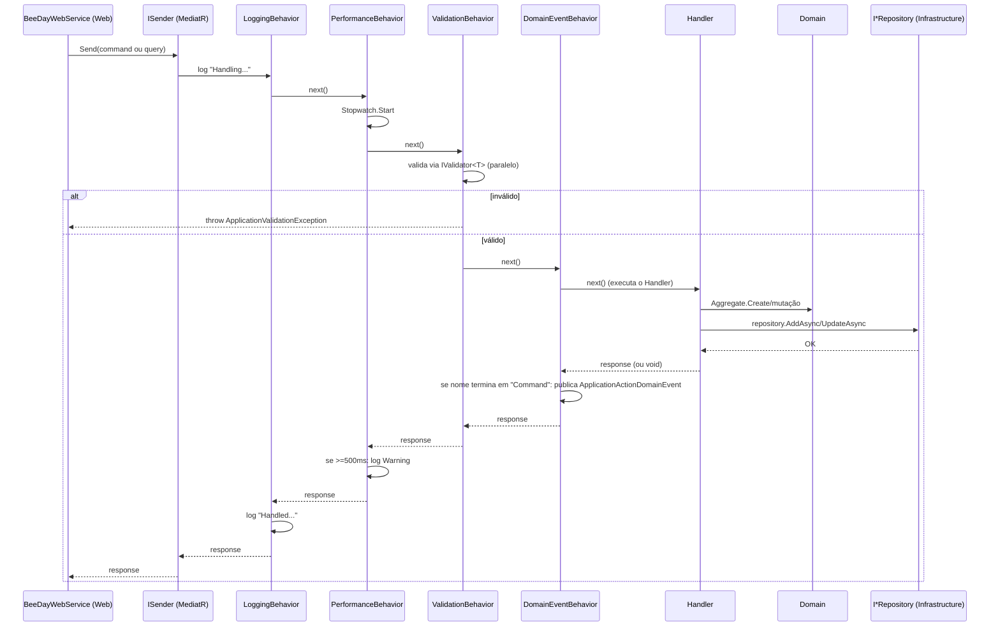

# CQRS

**Fonte da verdade:** verificado diretamente em `src/BeeDay.Application/Features/*/Commands/`,
`Queries/`, `Handlers/`, `src/BeeDay.Application/DependencyInjection/ApplicationServiceCollectionExtensions.cs`,
e `src/BeeDay.Web/Services/BeeDayWebService.cs`.

## O mecanismo: MediatR

Todo caso de uso é um objeto imutável (`sealed record`) despachado via `MediatR.ISender.Send(...)`.
Não existe nenhuma outra forma de invocar um caso de uso de Application — confirmado: o único
consumidor de `ISender` em todo o repositório é `BeeDay.Web/Services/BeeDayWebService.cs`, que atua
como fachada única entre os componentes Blazor e a Application.

`AddMediatR(configuration => configuration.RegisterServicesFromAssemblyContaining<ApplicationAssemblyMarker>())`
(`ApplicationServiceCollectionExtensions.cs`) escaneia o assembly `BeeDay.Application` inteiro em
busca de `IRequestHandler<,>`/`IRequestHandler<>`/`INotificationHandler<>` — não há registro manual
de handler individual em lugar nenhum.

## Commands vs. Queries

Este código não usa marcadores de interface separados `ICommand`/`IQuery` — a distinção é
puramente por convenção de nome (sufixo `Command` ou `Query`) e por assinatura MediatR:

| | `IRequest` (sem retorno) | `IRequest<T>` (com retorno) |
|---|---|---|
| **Command** | 31 comandos — ex. `CreateHabitCommand`, `ToggleTaskCommand`, `UpdateProjectCommand` | 6 comandos — ex. `AuthenticateUserCommand→AuthenticatedUserResponse`, `CreateUserCommand→Guid`, `EnsureCurrentWalletCommand→Guid` |
| **Query** | — (nenhuma Query sem retorno faria sentido) | 6 queries — `GetDashboardQuery`, `GetCurrentUserQuery`, `GetWalletSummaryQuery`, `GetWalletTagsQuery`, `GetTransactionByIdQuery`, `GetTransactionsQuery` |

**Padrão observado:** a maioria dos Commands de mutação pura (`Update*`, `Toggle*`, `Delete*`,
`Register*`) não retorna nada (`IRequest`) — o cliente recarrega o estado via uma Query separada
(`GetDashboardQuery` após qualquer mutação de Habit/Task/Project/Todo, confirmado no fluxo de
"criar um Hábito" em `docs/architecture/05-runtime-flows.md` §2). Só Commands que criam um recurso
novo e cujo identificador o chamador precisa imediatamente retornam algo — e o que retornam é
quase sempre só o `Guid` do recurso criado, nunca o objeto inteiro (exceção:
`AuthenticateUserCommand`, que retorna `AuthenticatedUserResponse` porque o chamador precisa dos
dados da sessão imediatamente para montar os claims do cookie).

## O envelope Command/Query — "Request" interno

Um padrão consistente em quase toda Feature: o Command não carrega os campos de dados diretamente
— ele envolve um `Request` separado. Ex.:

```csharp
public sealed record CreateHabitCommand(SaveHabitRequest Request) : IRequest;
public sealed record SaveHabitRequest(
    string Title, string Description, HabitDirection Direction,
    HabitDifficulty Difficulty, HabitResetCounter ResetCounter,
    ActivityAttribute? Attribute = null);
```

Isso permite que `Create*Command` e `Update*Command` reaproveitem o mesmo `Save*Request` e o mesmo
validator (`Save*RequestValidator`), já que os dados de entrada são idênticos — só o `Id` (presente
em `UpdateHabitCommand(Guid Id, SaveHabitRequest Request)`, ausente em `CreateHabitCommand`) muda.
Confirmado neste padrão em Habits, Projects, Tasks, Todos, Wallets (`SaveTransactionRequest`,
`SaveWalletTagRequest`). Exceções: `Authentication` e `Identity` não seguem esse padrão de
Create/Update pareado (cada Command ali é uma operação distinta sem contraparte de edição), então
seus `Request`s são específicos por Command, não compartilhados.

## Handlers

Um `IRequestHandler<TCommand>` ou `IRequestHandler<TQuery, TResponse>` por Command/Query,
localizado em `Features/*/Handlers/`. Todos seguem a mesma forma:

```csharp
public sealed class CreateHabitCommandHandler(IHabitRepository repository, ICurrentUserContext currentUser)
    : IRequestHandler<CreateHabitCommand>
{
    public async Task Handle(CreateHabitCommand request, CancellationToken cancellationToken)
    {
        var userId = CurrentUserGuard.RequireUserId(currentUser);
        var habit = Habit.Create(request.Request.Title, ...);
        habit.AssignOwner(userId);
        await repository.AddAsync(habit, cancellationToken);
    }
}
```

Injeta apenas interfaces (`I*Repository`, `I*ReadService`, `ICurrentUserContext`,
`IExperienceRewardService`, etc.) — nunca um tipo concreto de Infrastructure. Ver
[`02-use-cases.md`](02-use-cases.md) para o catálogo completo de Handlers por Feature.

## Fluxo completo: Request → Response



## Fontes de verdade

**Arquivos consultados:** todos os arquivos `Commands/*.cs`, `Queries/*.cs` das 10 Features,
`src/BeeDay.Application/DependencyInjection/ApplicationServiceCollectionExtensions.cs`,
`src/BeeDay.Web/Services/BeeDayWebService.cs` (para confirmar o único ponto de chamada de
`ISender.Send`), `Features/Habits/Handlers/HabitCommandHandlers.cs` (exemplo de Handler citado).
**Handlers consultados:** `CreateHabitCommandHandler` (exemplo detalhado); os ~35 Handlers das 9
Features (inventariados na Fase 1).
**Testes consultados:** `tests/BeeDay.Application.Tests/FeatureServicesTests.cs`,
`RequestValidatorTests.cs`.
**Features relacionadas:** todas — este documento é a base para
[`02-use-cases.md`](02-use-cases.md).
**Documentação relacionada:** [`03-pipeline.md`](03-pipeline.md) (detalhe dos 4 Behaviors),
`docs/architecture/05-runtime-flows.md` §2 (mesmo fluxo, do ponto de vista de arquitetura geral).
