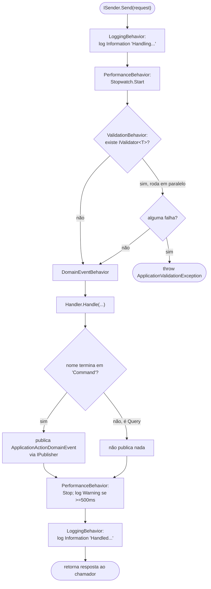

# Pipeline (MediatR Behaviors)

**Fonte da verdade:** verificado diretamente em `src/BeeDay.Application/Common/Behaviors/*.cs` e
`src/BeeDay.Application/DependencyInjection/ApplicationServiceCollectionExtensions.cs`.

## Inventário completo

Exatamente 4 arquivos existem em `Common/Behaviors/` — confirmado por listagem de diretório, sem
nenhum outro Behavior em lugar nenhum do repositório:

| Behavior | Arquivo |
|---|---|
| `LoggingBehavior<TRequest,TResponse>` | `LoggingBehavior.cs` |
| `PerformanceBehavior<TRequest,TResponse>` | `PerformanceBehavior.cs` |
| `ValidationBehavior<TRequest,TResponse>` | `ValidationBehavior.cs` |
| `DomainEventBehavior<TRequest,TResponse>` | `DomainEventBehavior.cs` |

**Não existem:** Retry, Authorization (autorização por policy nomeada), nem nenhum Behavior que
chame `IUnitOfWork.SaveChangesAsync` ou controle transação — confirmado por grep de
`SaveChangesAsync|IUnitOfWork` em todo o diretório `Behaviors/`, sem nenhum resultado. Commit de
mudanças acontece dentro de cada método de repositório (`Ef*Repository`), não no pipeline.

## Ordem de registro = ordem de execução (mais externo primeiro)

`ApplicationServiceCollectionExtensions.cs`, 4 chamadas a
`services.AddScoped(typeof(IPipelineBehavior<,>), typeof(XBehavior<,>))`, nesta ordem exata:

1. `LoggingBehavior<,>`
2. `PerformanceBehavior<,>`
3. `ValidationBehavior<,>`
4. `DomainEventBehavior<,>`

No MediatR, o primeiro registrado é o mais externo — a requisição passa por
Logging → Performance → Validation → DomainEvent → **Handler**, e a resposta desenrola na ordem
inversa.

## 1. `LoggingBehavior`

- Antes do Handler: log **Information** — `"Handling application request {RequestName}"`, onde
  `RequestName = typeof(TRequest).Name`. Nunca loga o payload da requisição, só o nome do tipo.
- Depois do Handler: log **Information** — `"Handled application request {RequestName}"`. Nunca
  loga o valor da resposta.
- `try/catch (Exception ex)`: log **Error** com a exceção completa —
  `"Application request {RequestName} failed"`, depois `throw;` (relança sem modificar).

## 2. `PerformanceBehavior`

- Mede com `Stopwatch.StartNew()`/`.Stop()` ao redor de `next(cancellationToken)`.
- Limiar: `SlowRequestMilliseconds = 500`. Só loga (**Warning**:
  `"Slow application request {RequestName} took {ElapsedMilliseconds} ms"`) se o tempo decorrido
  for `>= 500`ms — nenhum log é emitido para requisições rápidas (nem em nível Debug/Trace).
- Não tem `try/finally` — se `next` lançar, a medição/log deste Behavior é simplesmente pulada (a
  exceção se propaga direto, sem ser medida).

## 3. `ValidationBehavior`

- Injeta `IEnumerable<IValidator<TRequest>>` — resolução padrão de DI do FluentValidation, não
  reflexão manual.
- **Se nenhum validator estiver registrado para `TRequest`, a validação é pulada inteiramente** —
  chama `next(cancellationToken)` imediatamente.
- Se houver validators, roda todos **em paralelo** via
  `Task.WhenAll(validators.Select(v => v.ValidateAsync(context, cancellationToken)))` — não
  sequencial.
- Agrega todos os `ValidationFailure` de todos os validators; se algum existir, lança
  `new ApplicationValidationException(failures)` — o tipo exato definido em
  `src/BeeDay.Application/Exceptions/ApplicationValidationException.cs`, não a
  `FluentValidation.ValidationException` bruta.

## 4. `DomainEventBehavior`

- **Executa o Handler primeiro** (`next(cancellationToken)`) — só publica algo depois do sucesso;
  se o Handler lançar, nada abaixo executa.
- **Só age se o nome do tipo da requisição terminar em `"Command"`** — Queries nunca disparam este
  Behavior. `requestName.EndsWith("Command", StringComparison.Ordinal)`.
- `category` = nome do Command sem o sufixo `"Command"` (ex. `"CreateHabitCommand"` →
  `"CreateHabit"`).
- `entityId` extraído via reflexão, **exatamente**:
  ```csharp
  private static string? TryGetEntityId(TRequest request)
  {
      var property = typeof(TRequest).GetProperty("Id");
      return property?.GetValue(request)?.ToString();
  }
  ```
  Procura uma propriedade pública chamada literalmente `"Id"` no tipo do Command — não `EntityId`,
  não case-insensitive. Retorna `null` se a propriedade não existir ou seu valor for `null`. Isso
  significa que `UpdateHabitCommand(Guid Id, SaveHabitRequest Request)` produz um `EntityId`
  populado, mas `CreateHabitCommand(SaveHabitRequest Request)` (sem propriedade `Id` própria)
  sempre produz `EntityId = null` — o evento de criação nunca carrega o id do recurso recém-criado.
- Publica `new ApplicationActionDomainEvent(requestName, category, entityId)` envolto em
  `new DomainEventNotification(domainEvent)`, via `IPublisher.Publish(...)` do MediatR.
- Retorna a resposta original do Handler, sem modificação.

## Diagrama de execução



## Fontes de verdade

**Arquivos consultados:** `src/BeeDay.Application/Common/Behaviors/LoggingBehavior.cs`,
`PerformanceBehavior.cs`, `ValidationBehavior.cs`, `DomainEventBehavior.cs`,
`src/BeeDay.Application/DependencyInjection/ApplicationServiceCollectionExtensions.cs`,
`src/BeeDay.Application/Exceptions/ApplicationValidationException.cs`,
`src/BeeDay.Domain/Events/ApplicationActionDomainEvent.cs`,
`src/BeeDay.Application/Common/Events/DomainEventNotification.cs`.
**Testes consultados:** `tests/BeeDay.Application.Tests/RequestValidatorTests.cs`,
`DomainEventTests.cs`.
**Features relacionadas:** todas — o pipeline se aplica a todo Command/Query.
**Documentação relacionada:** [`01-cqrs.md`](01-cqrs.md), `docs/domain/domain-events.md` (para o
que acontece depois que `ApplicationActionDomainEvent` é publicado).
