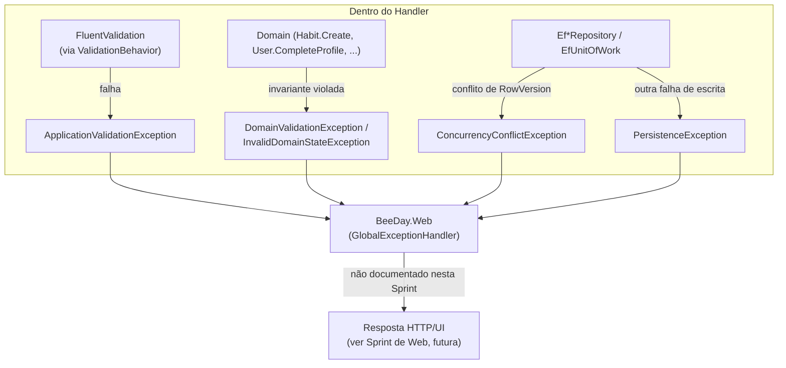

# Exceptions

**Fonte da verdade:** verificado diretamente em `src/BeeDay.Application/Exceptions/*.cs`,
`src/BeeDay.Domain/Exceptions/*.cs`, e `src/BeeDay.Infrastructure/Persistence/Exceptions/*.cs`
(estas últimas citadas apenas para mostrar o que cruza Application vindo de baixo — não
documentadas em profundidade, já que Infrastructure é fora do escopo desta Sprint).

## Achado estrutural

Application define **apenas 1 exceção própria**. Concorrência e persistência — que a Fase 7 desta
Sprint pediu para documentar — **não são exceções de Application**: vivem em
`BeeDay.Infrastructure.Persistence.Exceptions`. O que Application faz é deixá-las atravessar sem
capturar (nenhum `catch` de `ConcurrencyConflictException`/`PersistenceException` foi encontrado em
nenhum Handler durante a leitura desta Sprint).

## Exceções próprias de Application (1)

### `ApplicationValidationException`

`src/BeeDay.Application/Exceptions/ApplicationValidationException.cs` — `sealed class : Exception`.

- Lançada exclusivamente por `ValidationBehavior` (ver [`03-pipeline.md`](03-pipeline.md) §3),
  nunca diretamente por um Handler.
- Construtor recebe `IEnumerable<FluentValidation.Results.ValidationFailure>`; agrupa por nome de
  propriedade em `camelCase`, deduplica mensagens por propriedade
  (`Distinct(StringComparer.Ordinal)`), expõe `IDictionary<string, string[]> Errors`.
- Mensagem base fixa: `"One or more validation errors occurred."`.

## Exceções de Domain que cruzam Application sem tradução

Application não captura nem traduz estas — elas se propagam de dentro de um método de Domain
(chamado por um Handler) diretamente até quem invocou `ISender.Send(...)`:

| Exceção | Origem (Domain) | Quando |
|---|---|---|
| `DomainValidationException` | `src/BeeDay.Domain/Exceptions/DomainValidationException.cs` | Toda validação de campo dentro de um Value Object ou de um método `Create`/`Update` de entidade — ver `docs/domain/business-rules.md` para o catálogo completo |
| `InvalidDomainStateException` | `src/BeeDay.Domain/Exceptions/InvalidDomainStateException.cs` | Violação de invariante de estado (ex. `CompleteProfile` chamado duas vezes, `Project.ToggleCompletion()`, token expirado/usado/revogado) |

Ambas derivam de `DomainException` (`abstract class : Exception`). Nenhuma das duas é capturada
por nenhum Behavior do pipeline — confirmado por grep de `catch` em `Common/Behaviors/`, que só
encontra o `catch (Exception ex)` genérico de `LoggingBehavior` (que loga e relança, sem traduzir).

## Exceções de Infrastructure que cruzam Application sem tradução

Levantadas dentro de um método de repositório (`Ef*Repository`/`EfUnitOfWork`), nunca capturadas
por Application:

| Exceção | Origem (Infrastructure) | Quando |
|---|---|---|
| `PersistenceException` | `src/BeeDay.Infrastructure/Persistence/Exceptions/PersistenceException.cs` | `DbUpdateException` traduzida por `EfConcurrencySaveChanges` |
| `ConcurrencyConflictException` (deriva de `PersistenceException`) | mesmo arquivo/pasta | `DbUpdateConcurrencyException` traduzida — conflito de `RowVersion` |

Application depende dessas traduções acontecerem em Infrastructure precisamente para não precisar
conhecer `Microsoft.EntityFrameworkCore.DbUpdateException` — mas não faz nada especial com o
resultado traduzido além de deixá-lo subir.

`ActivityNotFoundException` existia como exceção própria de Application, mas uma busca exaustiva
(`grep -r "throw new ActivityNotFoundException" src/`) não encontrava nenhuma ocorrência em todo o
repositório — nunca era lançada por nenhum Handler. O helper que a lançava
(`RequestHandlerBase.Find`) já havia sido removido em Sprint anterior; hoje "não encontrado" é
sinalizado lançando `InvalidDomainStateException` diretamente (ver `HabitLookup.RequireExistsAsync`).
Removida, junto com o `case` morto correspondente em `GlobalExceptionHandler.cs`, na Sprint 18.3.

## Fluxo de propagação

Nenhum Behavior ou Handler de Application traduz essas exceções para um tipo de "erro de API" —
essa tradução, se existir, acontece em `BeeDay.Web` (`GlobalExceptionHandler`, mencionado em
`docs/architecture/08-deployment-architecture.md`, não detalhado ali nem aqui — documentação de Web
é trabalho de Sprint futura).

## Fontes de verdade

**Arquivos consultados:** `src/BeeDay.Application/Exceptions/ApplicationValidationException.cs`,
`src/BeeDay.Domain/Exceptions/DomainException.cs`,
`DomainValidationException.cs`, `InvalidDomainStateException.cs`,
`src/BeeDay.Infrastructure/Persistence/Exceptions/PersistenceException.cs`,
`ConcurrencyConflictException.cs` (estas duas últimas citadas por completude, não como fonte
principal — Infrastructure está fora do escopo de reconstrução desta Sprint).
**Testes consultados:** `tests/BeeDay.Application.Tests/RequestValidatorTests.cs` (cobre
`ApplicationValidationException` indiretamente, validando regras que a geram).
**Features relacionadas:** todas.
**Documentação relacionada:** [`03-pipeline.md`](03-pipeline.md) §3, `docs/domain/business-rules.md`,
`docs/architecture/06-persistence-architecture.md` (`EfConcurrencySaveChanges`).
