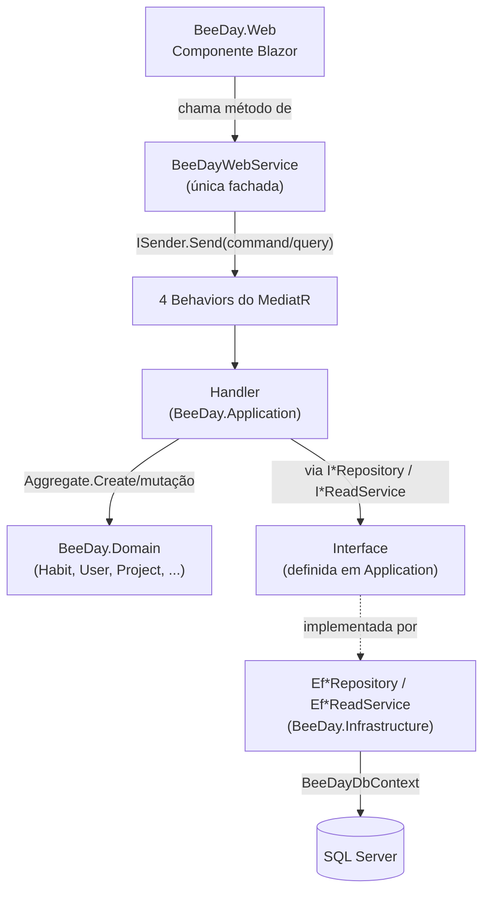
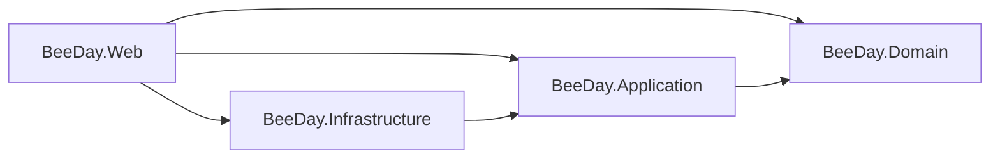

# Dependency Flow

**Fonte da verdade:** verificado diretamente em `src/BeeDay.Web/Services/BeeDayWebService.cs`,
`src/BeeDay.Web/Program.cs`, `src/BeeDay.Application/DependencyInjection/ApplicationServiceCollectionExtensions.cs`,
`src/BeeDay.Infrastructure/DependencyInjection/InfrastructureServiceCollectionExtensions.cs`, e os
`.csproj` de `src/*` (`ProjectReference`).

## Visão geral



## Quais interfaces cruzam cada fronteira

| Fronteira | O que cruza | Direção |
|---|---|---|
| Web → Application | `MediatR.ISender` (interface do pacote MediatR, não definida neste código) | Web depende de Application através de `ISender.Send(TRequest)`, nunca de um Handler concreto diretamente |
| Application → Domain | Tipos concretos (`Habit`, `User`, `Project`, etc.) e suas exceções (`DomainValidationException`, `InvalidDomainStateException`) | Application depende de Domain diretamente — é a única direção de dependência de tipo concreto neste fluxo (Domain não expõe interfaces para Application implementar) |
| Application → Infrastructure | **Nenhuma dependência de tipo** — apenas as 8 interfaces de repositório + 2 de read service + `IUnitOfWork`, todas *definidas* em Application | Infrastructure depende de Application (implementa as interfaces), não o contrário — confirmado por teste real (`PersistenceContractBoundaryTests.ApplicationAssembly_DoesNotReferenceInfrastructure`) |
| Infrastructure → SQL Server | `BeeDayDbContext` (EF Core) | Só Infrastructure conhece EF Core/SQL Server — ver `docs/architecture/06-persistence-architecture.md` |
| Web → Domain | Tipos de exceção apenas (`InvalidDomainStateException` em `Program.cs`) | `BeeDay.Web.csproj` referencia `BeeDay.Domain` diretamente (ver `docs/architecture/02-solution-structure.md` §3), mas o uso observado é limitado a tratamento de exceção, não a lógica de negócio |
| Web → Infrastructure | `AddBeeDayInfrastructure(configuration)` (registro de DI) | Único ponto de contato: `Program.cs` chama a extensão de DI; nenhum componente Blazor referencia um tipo concreto de Infrastructure |

## Quem implementa cada interface de Application, e em qual camada

| Interface (definida em Application) | Implementação | Camada da implementação |
|---|---|---|
| 8 `I*Repository` | `Ef*Repository` | Infrastructure |
| `IUnitOfWork` | `EfUnitOfWork` | Infrastructure |
| `IDashboardReadService`, `IWalletReadService` | `EfDashboardReadService`, `EfWalletReadService` | Infrastructure |
| `IPasswordService` | `Pbkdf2PasswordService` | Infrastructure |
| `IClock` | `SystemClock` | Infrastructure |
| `IEmailSender` | `ResendEmailSender` (produção) ou `DevelopmentEmailSender` (local), selecionado por `ResendOptions.Enabled` | Infrastructure |
| `IIdentityEmailComposer` | `IdentityEmailComposer` | Infrastructure |
| `IIdentityRequestThrottle` | `MemoryIdentityRequestThrottle` | Infrastructure |
| `IUserTokenService` | `SecureUserTokenService` | Infrastructure |
| `IEventJournal` | `JsonEventJournal` | Infrastructure |
| `IBackgroundTaskQueue` | `BackgroundTaskQueue` | Infrastructure |
| `IApplicationCache` | `MemoryApplicationCache` | Infrastructure |
| **`ICurrentUserContext`** | `HttpCurrentUserContext` | **Web** (única interface de Application implementada fora de Infrastructure — depende de `IHttpContextAccessor`, um conceito de hospedagem HTTP, não de dados) |
| `IExperienceRewardPolicy`, `IExperienceRewardService` | `ExperienceRewardPolicy`, `ExperienceRewardService` | **Application** (as únicas duas interfaces cuja implementação vive na própria Application, não injetada de fora) |

## Composition root

Toda a árvore de DI é montada em um único lugar: `src/BeeDay.Web/Program.cs`, via duas chamadas:

```csharp
builder.Services.AddBeeDayApplication();
builder.Services.AddBeeDayInfrastructure(builder.Configuration);
```

`AddBeeDayApplication()` (`ApplicationServiceCollectionExtensions.cs`) registra: os 4
`IPipelineBehavior<,>`, todo `IValidator<T>` do assembly (auto-scan), todo `IRequestHandler`/
`INotificationHandler` do assembly (auto-scan via MediatR), e os poucos serviços cuja
implementação vive na própria Application (`IEmailConfirmationIssuer`, `IExperienceRewardPolicy`,
`IExperienceRewardService`).

`AddBeeDayInfrastructure(configuration)` registra todo o restante — as 8 implementações de
repositório, `EfUnitOfWork`, os 2 read services, e os serviços técnicos (senha, e-mail, tokens,
cache, fila de background, journal de auditoria).

## Diagrama de dependência de projeto (revisão, ver `docs/architecture/04-dependency-rules.md` para o detalhe completo)



Este documento foca no fluxo de **interfaces e chamadas em runtime**; o diagrama de dependência de
projeto (`ProjectReference`) já está detalhado em `docs/architecture/02-solution-structure.md` e
`docs/architecture/04-dependency-rules.md` — reproduzido aqui só como referência rápida.

## Fontes de verdade

**Arquivos consultados:** `src/BeeDay.Web/Services/BeeDayWebService.cs`,
`src/BeeDay.Web/Program.cs`, `src/BeeDay.Web/Services/HttpCurrentUserContext.cs`,
`src/BeeDay.Web/Diagnostics/GlobalExceptionHandler.cs`,
`src/BeeDay.Application/DependencyInjection/ApplicationServiceCollectionExtensions.cs`,
`src/BeeDay.Infrastructure/DependencyInjection/InfrastructureServiceCollectionExtensions.cs`, os 4
`.csproj` de `src/*`.
**Testes consultados:** `tests/BeeDay.Application.Tests/PersistenceContractBoundaryTests.cs`
(`ApplicationAssembly_DoesNotReferenceInfrastructure`).
**Features relacionadas:** todas.
**Documentação relacionada:** `docs/architecture/02-solution-structure.md`,
`docs/architecture/04-dependency-rules.md`, `docs/architecture/06-persistence-architecture.md`,
`docs/architecture/07-security-architecture.md` (`ICurrentUserContext`/`HttpCurrentUserContext`),
[`04-contracts.md`](04-contracts.md).
