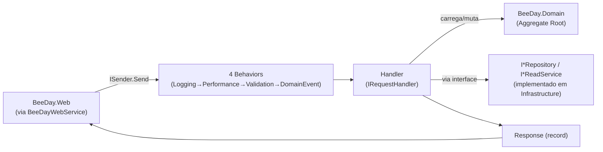

# Application

Documentação do `BeeDay.Application` — reconstruída por completo na Sprint 16.5 a partir
exclusivamente do código atual (`src/BeeDay.Application/`, `tests/BeeDay.Application.Tests/`,
`src/BeeDay.Domain/`). Nenhuma afirmação vem de `docs/history/` ou de sprints anteriores sem
reverificação direta no código.

**Fonte da verdade:** cada documento abaixo declara individualmente as fontes exatas usadas para
validá-lo, na seção final "Fontes de verdade".

**Última verificação:** 2026-08-09 (Sprint 18.6) — `Common/Caching/IApplicationCache.cs` e
`Common/Events/InvalidateDashboardCacheHandler.cs` removidos (código morto comprovado: o cache que
esse handler invalidava nunca era populado em produção).

## Responsabilidade da camada

`BeeDay.Application` orquestra casos de uso: recebe um Command ou Query (via MediatR), aplica
validação (FluentValidation), carrega/muta um Aggregate do Domain através de uma interface de
repositório, e devolve uma Response — sem nunca conhecer EF Core, SQL Server, ou HTTP diretamente.
É a camada onde vivem as 10 Features do produto (Authentication, Dashboard, Habits, Identity,
Ordering, Projects, Tasks, Todos, Users, Wallets).

## Organização

```text
src/BeeDay.Application/
├── Common/
│   ├── Auditing/       IEventJournal
│   ├── Background/      IBackgroundTaskQueue
│   ├── Behaviors/        4 IPipelineBehavior<,> do MediatR
│   ├── Contracts/        8 interfaces de repositório + IUnitOfWork
│   ├── Events/            DomainEventNotification + 1 INotificationHandler genérico
│   ├── Experience/         Motor de concessão de XP (Service + Policy)
│   ├── Identity/           IClock, IEmailSender, IIdentityEmailComposer, IIdentityRequestThrottle, IUserTokenService
│   └── Security/            ICurrentUserContext, IPasswordService, PasswordPolicy, CurrentUserGuard
├── DependencyInjection/    AddBeeDayApplication() — único ponto de registro DI desta camada
├── Exceptions/              ApplicationValidationException
└── Features/                 10 pastas, cada uma com Commands/, Queries/ (se houver),
                                Handlers/, Requests/, Responses/ (se houver), Validation/
```

## Fluxo



Ver [`01-cqrs.md`](01-cqrs.md) para o detalhamento completo deste fluxo.

## Dependências

Confirmado via `BeeDay.Application.csproj`: `ProjectReference` apenas para `BeeDay.Domain`.
Confirmado via teste real (`PersistenceContractBoundaryTests.ApplicationAssembly_DoesNotReferenceInfrastructure`,
`tests/BeeDay.Application.Tests/`): o assembly `BeeDay.Application` nunca referencia
`BeeDay.Infrastructure` — a asserção usa `Assembly.GetReferencedAssemblies()` diretamente sobre o
binário compilado, não apenas o `.csproj`.

## Integração com Domain

Application nunca reimplementa regra de negócio — cada Handler chama um método público de um
Aggregate Root (`Habit.Create`, `User.CompleteProfile`, etc.) e deixa o Domain decidir se a
operação é válida (lançando `DomainValidationException`/`InvalidDomainStateException` quando não
é). Ver `docs/domain/business-rules.md` para o catálogo de invariantes que o Domain impõe.

## Integração com Infrastructure

Application nunca referencia Infrastructure diretamente — toda persistência passa por uma
interface definida em `Common/Contracts/` ou em `Features/*/Contracts/`, implementada por uma
classe `internal` em `BeeDay.Infrastructure` e injetada via `AddBeeDayInfrastructure(configuration)`
(chamado em `BeeDay.Web/Program.cs`, não em Application). Ver [`04-contracts.md`](04-contracts.md).

## Documentos

| Documento | Conteúdo |
|---|---|
| [`01-cqrs.md`](01-cqrs.md) | Commands, Queries, Handlers, fluxo completo MediatR, Request→Response |
| [`02-use-cases.md`](02-use-cases.md) | Todo caso de uso real, agrupado por Feature |
| [`03-pipeline.md`](03-pipeline.md) | Os 4 Behaviors, ordem de execução, diagrama |
| [`04-contracts.md`](04-contracts.md) | `IUnitOfWork`, 8 repositórios, 2 read services, quem implementa/consome |
| [`05-exceptions.md`](05-exceptions.md) | Exceções de Application, Domain e Infrastructure que cruzam esta camada, fluxo de propagação |
| [`06-dependency-flow.md`](06-dependency-flow.md) | UI → Application → Domain → Infrastructure → SQL Server, com as interfaces exatas que cruzam cada fronteira |

## Ordem de leitura recomendada

1. `01-cqrs.md` — o mecanismo central (MediatR, Commands vs. Queries).
2. `03-pipeline.md` — o que acontece antes de qualquer Handler rodar.
3. `02-use-cases.md` — o catálogo completo, Feature por Feature.
4. `04-contracts.md` — como Application se comunica com Infrastructure sem conhecê-la.
5. `05-exceptions.md` — o que pode dar errado e como se propaga.
6. `06-dependency-flow.md` — visão consolidada de ponta a ponta.

## Achado relevante (reportado, não corrigido)

Vários comentários XML doc em `Common/Contracts/I*Repository.cs` citam caminhos de documentação
que não existem mais no local citado — por exemplo, `docs/architecture/05-domain-aggregate-map.md`
(movido para `docs/history/domain-aggregate-map.md` na Sprint 16.2),
`docs/architecture/07-persistence-contracts.md` (idem, para `docs/history/persistence-contracts.md`),
`docs/architecture/02-target-architecture.md` (idem, para `docs/history/target-architecture-sprint-log.md`),
e `docs/data/01-relational-model.md` (movido para `docs/persistence/01-relational-model.md`). Esses
comentários são código-fonte, não documentação — fora do escopo desta Sprint corrigir
(`código` está na lista de "não alterar"). `IWalletTagRepository.cs` também contém uma nota de
débito técnico própria, ainda válida: seu comentário afirma que `docs/data/01-relational-model.md`
"modela este agregado incorretamente" — não verificado nesta Sprint (fora do escopo, é conteúdo de
`docs/persistence/`, não `docs/application/`).
