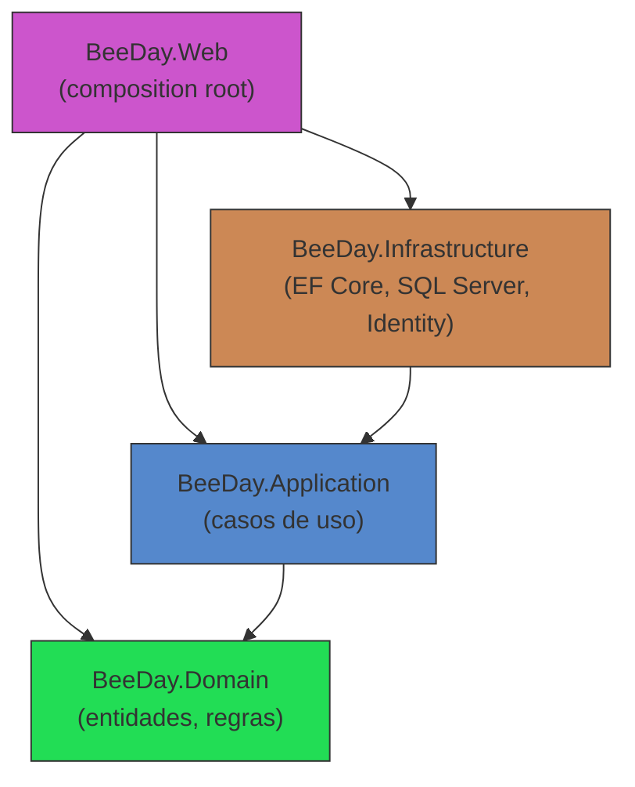
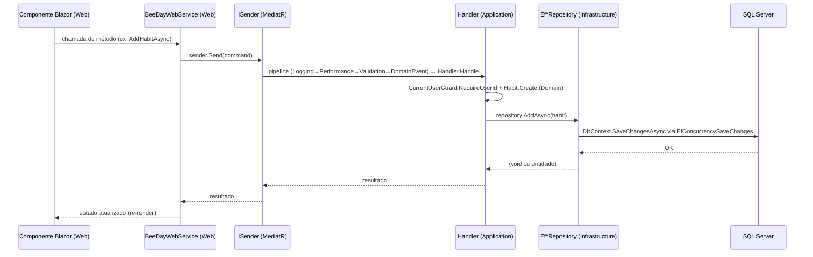

# Clean Architecture

**Fonte da verdade:** verificado diretamente em `src/BeeDay.Domain`, `src/BeeDay.Application`,
`src/BeeDay.Infrastructure`, `src/BeeDay.Web` (estrutura de pastas e um caso de uso completo
rastreado arquivo a arquivo — "criar um Hábito", detalhado em
[`05-runtime-flows.md`](05-runtime-flows.md)).

## 1. Camadas e responsabilidades

| Camada | Responsabilidade | Verificado por |
|---|---|---|
| `BeeDay.Domain` | Aggregate Roots (`User`, `Habit`, `RecurringTask`, `Project`, `Todo`, `Wallet`, `WalletTag`, `Transaction`, `UserToken`), Value Objects, Domain Events, regras de negócio e invariantes puras (ex. `User.InvalidateSessions()`, `Habit.Create(...)`) | Zero `using` para `Microsoft.EntityFrameworkCore` ou `Microsoft.AspNetCore` em todo o diretório (grep). |
| `BeeDay.Application` | Casos de uso via Commands/Queries MediatR, Requests/Responses, interfaces de repositório e serviços que `Infrastructure` implementa, validação (FluentValidation), pipeline de comportamentos | Zero `using Microsoft.EntityFrameworkCore`; referencia apenas `BeeDay.Domain` como `ProjectReference`. |
| `BeeDay.Infrastructure` | Implementação EF Core/SQL Server dos 8 repositórios e 2 read services, `IUnitOfWork`, segurança técnica (hash de senha, rate limiting é parcialmente aqui/parcialmente Web — ver [`07-security-architecture.md`](07-security-architecture.md)), health checks | `BeeDayDbContext` e todo tipo EF Core concreto são `internal` — nunca acessíveis fora do assembly exceto via `InternalsVisibleTo` para os 3 projetos de teste que precisam manipular o schema diretamente. |
| `BeeDay.Web` | Composition root único (`Program.cs`), páginas/componentes Blazor Server, tradução de eventos de UI em `ISender.Send(...)` via a fachada `BeeDayWebService`, e única camada responsável pela representação localizada (en-US/pt-BR) de toda mensagem apresentada ao usuário — ver [`docs/web/07-localization.md`](../web/07-localization.md) | Grep por `"BeeDayDbContext"` em todo `src/BeeDay.Web` → 0 ocorrências — nenhum tipo EF Core concreto é referenciado fora de Infrastructure. Grep por `IStringLocalizer`/`ResourceManager` fora de `BeeDay.Web` → 0 ocorrências. |

## 2. Dependency Rule

A regra clássica de Clean Architecture — dependências apontam sempre para dentro, em direção ao
Domain — é respeitada estruturalmente pelos `ProjectReference` (ver
[`02-solution-structure.md`](02-solution-structure.md) §3) e reforçada por dois mecanismos
concretos, não apenas por convenção:

1. **Tipos concretos de Infrastructure são `internal`.** Toda classe `Ef*Repository`,
   `BeeDayDbContext`, `EfUnitOfWork`, etc. é `internal sealed`. Mesmo que `BeeDay.Web` referencie
   o assembly `BeeDay.Infrastructure`, o compilador impede o acesso a esses tipos — `BeeDay.Web`
   só pode consumir as interfaces expostas por `BeeDay.Application`
   (`src/BeeDay.Application/Common/Contracts/*.cs`).
2. **Interfaces são definidas onde são consumidas, implementadas onde a tecnologia mora**
   (Dependency Inversion) — ex.: `IHabitRepository` vive em `BeeDay.Application`, é implementada
   por `EfHabitRepository` em `BeeDay.Infrastructure`; `ICurrentUserContext` vive em
   `BeeDay.Application`, é implementada por `HttpCurrentUserContext` em `BeeDay.Web` (a única
   camada que conhece `HttpContext`).

## 3. Fluxo através das camadas

Rastreamento completo, arquivo por arquivo, deste fluxo exato para "criar um Hábito" está em
[`05-runtime-flows.md`](05-runtime-flows.md) §2.

## 4. O que esta arquitetura explicitamente não tem (verificado, não presumido)

- **Nenhum projeto `BeeDay.Contracts` separado.** Requests/Responses vivem diretamente sob
  `BeeDay.Application/Features/*/Requests` e `.../Responses` — confirmado por
  `find src/ -iname "*Contracts*"` não retornar nenhum diretório de projeto, apenas a pasta
  `Common/Contracts/` dentro de `BeeDay.Application` (que contém interfaces de repositório, não
  DTOs públicos).
- **Nenhuma política de autorização nomeada.** `AddAuthorization()` é chamado sem nenhuma
  configuração de policy — todo `[Authorize]` usa a policy padrão (autenticado ou não). Ver
  [`07-security-architecture.md`](07-security-architecture.md) §10.
