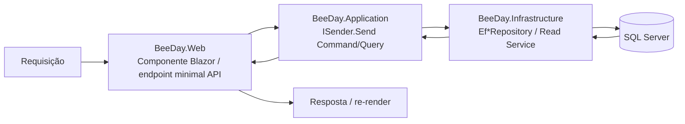
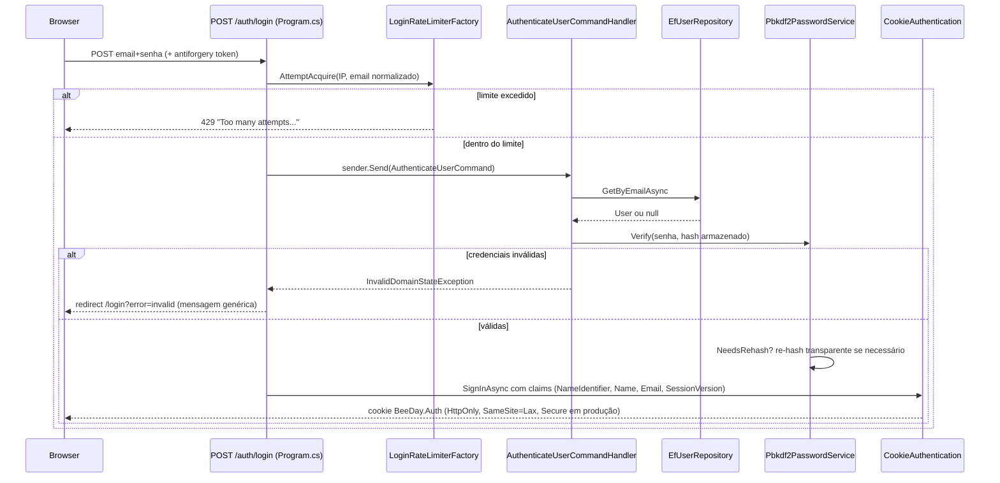
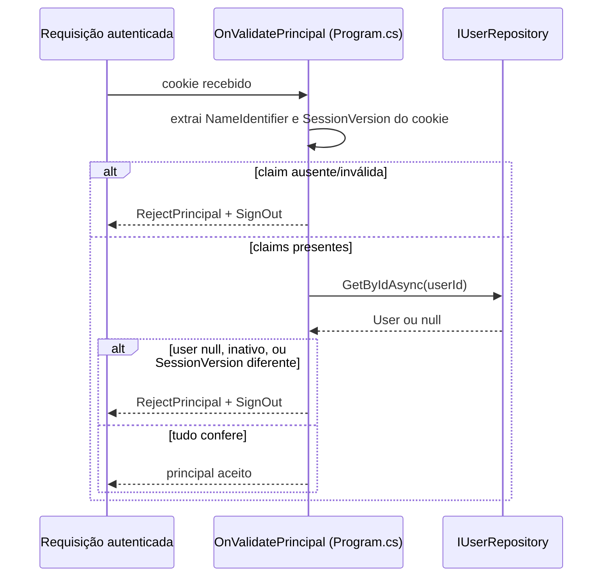
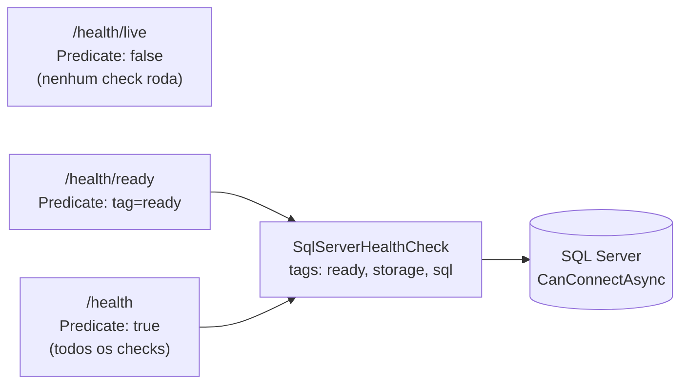

# Runtime Flows

**Fonte da verdade:** cada fluxo abaixo foi rastreado arquivo por arquivo, método por método,
diretamente no código atual. Nenhum fluxo foi descrito a partir de `docs/history/`.

## 1. Visão geral: Request → Response



## 2. Fluxo completo verificado: criar um Hábito

Rastreado em `src/BeeDay.Web/Components/Features/Dashboard/Pages/Home.razor`,
`ActivityFilterBar.razor.cs`, `DashboardState.cs`, `DashboardModalState.cs`,
`HabitEditorModal.razor.cs`, `BeeDayWebService.cs`, e a cadeia MediatR/Domain/Infrastructure.

```mermaid
sequenceDiagram
    participant User
    participant Bar as ActivityFilterBar.razor.cs
    participant State as DashboardState.cs
    participant Modal as HabitEditorModal.razor.cs
    participant Svc as BeeDayWebService.cs
    participant Sender as ISender (MediatR)
    participant Handler as CreateHabitCommandHandler
    participant Domain as Habit.Create (Domain)
    participant Repo as EfHabitRepository
    participant Ctx as BeeDayDbContext
    participant DB as SQL Server

    User->>Bar: clica "Create Habit"
    Bar->>State: OnCreate.InvokeAsync(ActivityType.Habit)
    State->>State: DashboardModalState.OpenCreate(Habit)
    State-->>Modal: renderiza HabitEditorModal
    User->>Modal: preenche e clica Save
    Modal->>State: OnSave.InvokeAsync(model)
    State->>State: SaveHabitAsync -> SaveEditorAsync
    State->>Svc: store.AddHabitAsync(model)
    Svc->>Sender: sender.Send(new CreateHabitCommand(...))
    Sender->>Sender: Logging -> Performance -> Validation -> DomainEvent behaviors
    Sender->>Handler: Handle(command)
    Handler->>Handler: CurrentUserGuard.RequireUserId(currentUser)
    Handler->>Domain: Habit.Create(title, description, direction, difficulty, resetCounter, attribute)
    Domain-->>Handler: Habit (novo agregado)
    Handler->>Handler: habit.AssignOwner(userId)
    Handler->>Repo: repository.AddAsync(habit)
    Repo->>Ctx: AcquireContextAsync (IDbContextFactory)
    Repo->>Ctx: context.Habits.Add(habit); Position = ...
    Repo->>Ctx: EfConcurrencySaveChanges.ExecuteAsync
    Ctx->>DB: SaveChangesAsync (INSERT)
    DB-->>Ctx: OK
    Ctx-->>Repo: OK
    Repo-->>Handler: OK
    Handler-->>Sender: concluído
    Sender-->>Svc: concluído
    Svc-->>State: concluído
    State->>State: Modals.CloseEditor(); ReloadAsync()
    State->>Svc: store.LoadDashboardAsync()
    Svc->>Sender: sender.Send(new GetDashboardQuery())
    Sender->>Handler: GetDashboardQueryHandler.Handle
    Handler->>Repo: IDashboardReadService.GetAsync(userId)
    Repo->>DB: queries AsNoTracking (Users/Habits/RecurringTasks/Projects/Wallets)
    DB-->>Repo: dados
    Repo-->>Handler: DashboardResponse (inclui o novo hábito)
    Handler-->>State: DashboardResponse
    State-->>User: UI re-renderizada com o hábito criado
```

**Ponto de acoplamento destes fluxos de Dashboard:** `BeeDayWebService`
(`src/BeeDay.Web/Services/BeeDayWebService.cs`) concentra as chamadas `ISender.Send(...)` descritas
nesta seção. Isso não é uma regra universal da Web: `Wallet.razor` e as páginas de Identity injetam
`ISender` diretamente, conforme o mapa atual em `docs/web/04-feature-components.md`.

## 3. Login

Rastreado em `src/BeeDay.Web/Program.cs` (endpoint `/auth/login`, linhas 247-316) e
`LoginRateLimiterFactory.cs`.



**Requisitos verificados:** rate limiting duplo (IP + e-mail normalizado, ambos sliding-window),
resposta idêntica para "conta inexistente" e "senha errada" (`InvalidDomainStateException`
genérica), cookie `HttpOnly`/`Secure` (fora de Development)/`SameSite=Lax`, claim
`SessionVersion` emitida no login e revalidada a cada request (`OnValidatePrincipal`). Ver
[`07-security-architecture.md`](07-security-architecture.md) para o detalhamento completo.

## 4. Validação de sessão a cada requisição autenticada



Isso é o que torna troca de senha, reset de senha e desativação de conta efetivas
imediatamente — cada uma incrementa `User.SessionVersion`, invalidando qualquer cookie emitido
antes da mudança.

## 5. Health checks



Único health check registrado no repositório inteiro:
`services.AddHealthChecks().AddCheck<SqlServerHealthCheck>("sql-server", tags: ["ready","storage","sql"])`
(`src/BeeDay.Infrastructure/DependencyInjection/InfrastructureServiceCollectionExtensions.cs`).
`/health/live` sempre responde sem checar nada (é um ping de "processo vivo"); `/health/ready` e
`/health` hoje reportam exatamente o mesmo único check.
