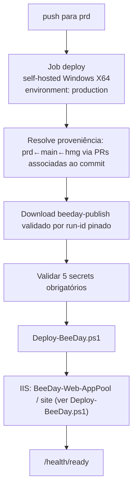

# Deployment Architecture

**Fonte da verdade:** verificado diretamente em `.github/workflows/*.yml`,
`scripts/Deploy-BeeDay.ps1`, `src/BeeDay.Web/web.config`, `src/BeeDay.Web/appsettings*.json`, e as
classes `*Options.cs` em `src/BeeDay.Infrastructure/Configuration/`.

**Reconciliado na Sprint 19.9** (EPIC 19) — §1/§2 estavam materialmente desatualizados (job
`validate` que não existe mais, triggers obsoletos, estrutura de dois jobs em `deploy-prd.yml` já
substituída desde a Sprint 18.4). §3-§9 permanecem precisos (`Deploy-BeeDay.ps1`, IIS, health
checks, configuração — não mudaram nesta EPIC) e não foram reescritos.

## 1. Pipeline CI/CD atual (visão resumida — ver `docs/deployment/` para o detalhamento completo)

A arquitetura completa de CI/CD (6 workflows, artifact provenance, Rulesets, Release Quality
Gate) é mantida em `docs/deployment/`, não duplicada aqui. Resumo apenas dos pontos que afetam
diretamente o deployment:

- **`BeeDay — Pull Request Validation`** (`.github/workflows/ci.yml`) — valida PRs `sprint/*→hmg`
  (Fast Gate: Restore, Build, `Domain.Tests`, `Application.Tests`, Publish, EF bundle). Produz os
  artifacts `beeday-publish`/`beeday-migrations` que `BeeDay — HMG Deployment` consome por
  proveniência (`run-id` pinado, nunca "latest"). Ver
  [`docs/deployment/08-fast-pr-validation-decision.md`](../deployment/08-fast-pr-validation-decision.md).
- **`BeeDay — HMG Deployment`** (`deploy-hmg.yml`) — dispara em `push` para `hmg`, roda no runner
  self-hosted (label `hmg`), implanta em SERV3WEB. Ver
  [`docs/deployment/10-hmg-deployment-verification.md`](../deployment/10-hmg-deployment-verification.md),
  [`docs/deployment/12-artifact-provenance.md`](../deployment/12-artifact-provenance.md).
- **`BeeDay — HMG Verification`** (`verify-hmg.yml`) — readiness + smoke pós-deploy contra HMG real.
- **`BeeDay — Release Quality Gate`** (`release-quality-gate.yml`) + **`BeeDay — Promotion Policy`**
  (`validate-promotion.yml`) — fronteira `hmg → main`. Ver
  [`docs/deployment/11-release-quality-gate.md`](../deployment/11-release-quality-gate.md).

## 2. Pipeline de deploy de produção (`.github/workflows/deploy-prd.yml`)

Nome: `BeeDay — Production Deployment`. Dispara em `push` para `prd` e `workflow_dispatch`.
Concurrency group `beeday-production`, `cancel-in-progress: false` (deploys nunca são cancelados
no meio). **Um único job** (`deploy`, self-hosted) — a estrutura antiga de dois jobs
(`validate`+`deploy`) não existe desde a Sprint 18.4: o job atual nunca builda/testa, apenas
resolve e baixa o artifact `beeday-publish` já validado em `hmg` via cadeia de proveniência de
Pull Requests (Build Once, Deploy Many — `CLAUDE.md` §5.7.2).



- Job `deploy` (único), roda no runner self-hosted (`runs-on: [self-hosted, Windows, X64]`),
  `environment: production`. Nenhum job `validate` separado.
- Secrets consumidos: `BEEDAY_PUBLIC_BASE_URL`, `BEEDAY_RESEND_API_KEY`,
  `BEEDAY_RESEND_FROM_ADDRESS`, `BEEDAY_RESEND_FROM_NAME`, `BEEDAY_ALLOWED_HOSTS` — todos os 5
  checados hoje pelo step "Validate deployment secrets" (achado anterior sobre
  `BEEDAY_RESEND_FROM_NAME` ausente da checagem já não se aplica ao arquivo atual — reconfirmado
  por leitura direta nesta Sprint).
- **Nunca executado com sucesso:** todos os runs históricos de `deploy-prd.yml` têm `conclusion:
  failure` — consistente com PRD não estar provisionado (ver §9 e
  [`docs/deployment/README.md`](../deployment/README.md) "Estado real de HMG e PRD").

## 3. `scripts/Deploy-BeeDay.ps1`

Site IIS `BeeDay`, app pool `BeeDayPool`. Caminhos: `C:\Apps\BeeDay` (aplicação),
`C:\Apps\BeeDay-Backups` (backups de app e dados), `C:\Apps\BeeDay-Data` (dados persistentes:
`Data`, `Data\Backups`, `DataProtection-Keys`, `Emails`, `Logs`).

Fluxo (`try`/`catch`/`finally`):

1. Backup da aplicação atual e dos dados persistentes **antes** de parar o IIS.
2. `Stop-BeeDayIis` → `Set-BeeDayEnvironmentVariables` → limpa e copia o novo publish para
   `C:\Apps\BeeDay` → `Start-BeeDayIis` → `Invoke-BeeDayHealthCheck` (até 6 tentativas, `GET
   http://127.0.0.1/health/ready` com header `Host: beeday`, 5s entre tentativas).
3. Em caso de falha em qualquer etapa: rollback automático — restaura o backup da aplicação e
   reinicia o IIS, e roda o health check novamente. Dados persistentes (`C:\Apps\BeeDay-Data`)
   **nunca** são revertidos automaticamente, só a aplicação.

**Variáveis de ambiente definidas no App Pool IIS** (`Set-BeeDayEnvironmentVariables`, via
`Add-WebConfigurationProperty` em `MACHINE/WEBROOT/APPHOST`):

```text
ASPNETCORE_ENVIRONMENT = Production
DOTNET_ENVIRONMENT = Production
AllowedHosts = <parâmetro>
BeeDay__IdentityEmail__PublicBaseUrl = <parâmetro>
BeeDay__Email__Resend__ApiKey = <parâmetro>
BeeDay__Email__Resend__FromAddress = <parâmetro>
BeeDay__Email__Resend__FromName = <parâmetro, default "BeeDay">
```

## 4. Hospedagem IIS (`src/BeeDay.Web/web.config`)

`AspNetCoreModuleV2`, `hostingModel="inprocess"`, `processPath="dotnet"`,
`arguments=".\BeeDay.Web.dll"`. Define `ASPNETCORE_ENVIRONMENT`/`DOTNET_ENVIRONMENT=Homologation`
diretamente no XML — **não `Production`** (afirmação anterior deste documento estava desatualizada;
corrigida na Sprint 18.4 após verificação direta do arquivo). Esse valor é o mesmo usado tanto para
HMG (`deploy-hmg.yml` também passa `-Environment "Homologation"` explicitamente) quanto para PRD
(`deploy-prd.yml` nunca sobrescreve, herdando o default `"Homologation"` de `Deploy-BeeDay.ps1`) —
ver `docs/deployment/02-runtime-configuration.md` §5 para a análise completa, incluindo por que PRD
não está provisionado hoje.

`stdoutLogFile` apontava para `C:\Apps\LevelUp-Data\Logs\stdout` — confirmado ativo em HMG (Runtime
State real, Sprint 18.4) enquanto `Deploy-BeeDay.ps1` só protege ACL em `C:\Apps\BeeDay-Data\Logs`.
Corrigido no repositório na Sprint 18.4; migração operacional (promoção + validação pós-deploy)
ainda pendente.

## 5. Configuração e opções validadas no startup

Todas em `src/BeeDay.Infrastructure/Configuration/*.cs`, registradas via
`AddOptions<T>().Bind(...).Validate(...).ValidateOnStart()`
(`InfrastructureServiceCollectionExtensions.cs`):

| Options | `SectionName` | Validação |
|---|---|---|
| `SqlServerOptions` | `BeeDay:Persistence:SqlServer` | `ConnectionString` obrigatória |
| `IdentityEmailOptions` | `BeeDay:IdentityEmail` | `PublicBaseUrl` absoluta; paths de confirmação/reset enraizados |
| `ResendOptions` | `BeeDay:Email:Resend` | `ApiKey`/`FromAddress` obrigatórios (contendo `@`) se `Enabled` |
| `DevelopmentEmailOptions` | `BeeDay:Email:Development` | `Directory` obrigatório se `Enabled` |
| `EventJournalOptions` | `BeeDay:Auditing:EventJournal` | `Directory` obrigatório; `FileName` deve ser nome simples |

Duas outras opções são vinculadas manualmente em `Program.cs`, **sem** `ValidateOnStart`:

| Options | `SectionName` | Onde é validada |
|---|---|---|
| `ProductionHostingOptions` (`src/BeeDay.Web/Configuration/`) | `BeeDay:Hosting` | Checks manuais (`if`/`throw InvalidOperationException`) em `Program.cs`, só fora de Development |
| `LoginRateLimiterOptions` (`src/BeeDay.Web/Services/Authentication/`) | `BeeDay:RateLimiting:Login` | Nenhuma validação formal — vinculada após `app.Build()` |

## 6. `appsettings*.json`

- `appsettings.json`: `Logging`, `AllowedHosts`, `BeeDay` (`Persistence`, `Auditing`,
  `IdentityEmail`, `Email`).
- `appsettings.Development.json`: apenas `Logging`.
- `appsettings.Homologation.json`: `AllowedHosts`, `BeeDay` (`Persistence`, `Hosting`, `Auditing`,
  `IdentityEmail`, `Email`) — **é o arquivo que HMG realmente carrega** (`ASPNETCORE_ENVIRONMENT`
  efetivo é `Homologation`, não `Production` — ver §4).
- `appsettings.Production.json`: `AllowedHosts`, `Logging`, `BeeDay` (`Persistence`, `Hosting`,
  `Auditing`, `IdentityEmail`, `Email`) — não corresponde a nenhum ambiente provisionado hoje (PRD
  não existe por decisão arquitetural, ver `docs/deployment/02-runtime-configuration.md` §5.1).

`appsettings.Production.json` hardcodava `BeeDay:Hosting:DataProtectionKeysDirectory` e
`BeeDay:Auditing:EventJournal:Directory` apontando para `C:\Apps\LevelUp-Data\...` — corrigido para
`BeeDay-Data` na Sprint 18.4 por consistência de nomenclatura (não por uso real, já que o arquivo
está inerte hoje).

## 7. Cadeia de configuração em runtime

Ordem padrão do `WebApplication.CreateBuilder` (framework, não customizada): `appsettings.json` →
`appsettings.{Environment}.json` → User Secrets (`BeeDay-Web-Identity`, só em Development) →
variáveis de ambiente (`:` vira `__`) → argumentos de linha de comando. As variáveis de ambiente
definidas pelo `Deploy-BeeDay.ps1` no App Pool IIS entram nessa cadeia na camada de variáveis de
ambiente, sobrepondo qualquer valor de `appsettings.Production.json` — este é o mecanismo real
pelo qual o caminho antigo hardcoded no `appsettings.Production.json` (§6) não afeta produção hoje:
o deploy script não sobrescreve `DataProtectionKeysDirectory`/`EventJournal:Directory` via
variável de ambiente, então esses dois valores específicos **ainda dependem** do arquivo — os
demais (`PublicBaseUrl`, `Resend:*`, `AllowedHosts`) são sobrepostos pelo script.

## 8. Health checks

Único check registrado: `SqlServerHealthCheck`
(`src/BeeDay.Infrastructure/HealthChecks/SqlServerHealthCheck.cs`), tags `ready`/`storage`/`sql`,
verifica `DbContext.Database.CanConnectAsync()`. Três endpoints mapeados em `Program.cs`:
`/health/live` (nenhum check, ping puro), `/health/ready` (checks com tag `ready`), `/health`
(todos os checks, com `Unhealthy` → HTTP 503). `HealthCheckResponseWriter`
(`src/BeeDay.Web/HealthChecks/`) formata a resposta JSON com `status`, `durationMs`,
`correlationId`, e o array `checks`.

## 9. Ambientes e branches

`hmg` (homologação — CI roda em push) e `prd` (produção — CI roda em pull_request para prd, e o
deploy roda em push para prd). Runner self-hosted `SERV3-WEB1` só executa o job de deploy, nunca o
job de validação (que roda em `windows-latest` hospedado pela GitHub).
