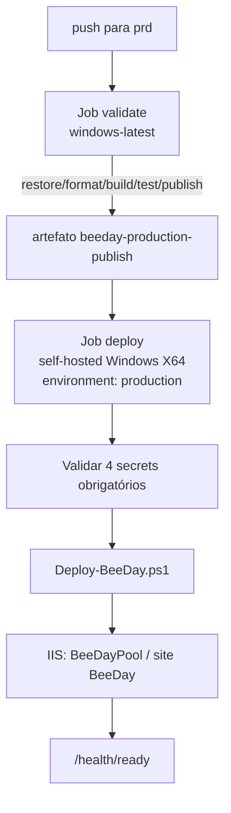

# Deployment Architecture

**Fonte da verdade:** verificado diretamente em `.github/workflows/ci.yml`,
`.github/workflows/deploy-prd.yml`, `scripts/Deploy-BeeDay.ps1`, `src/BeeDay.Web/web.config`,
`src/BeeDay.Web/appsettings*.json`, e as classes `*Options.cs` em
`src/BeeDay.Infrastructure/Configuration/`.

## 1. Pipeline de CI (`.github/workflows/ci.yml`)

Nome: `BeeDay CI`. Dispara em `push` para `hmg`, `pull_request` para `hmg`/`prd`, e
`workflow_dispatch`. Um job (`validate`, `windows-latest`): checkout → `setup-dotnet` 10.0.x →
`dotnet restore BeeDay.slnx` → `dotnet format --verify-no-changes` → `dotnet build --warnaserror`
→ instala Playwright Chromium → `dotnet test` (logger trx) → `dotnet publish
src/BeeDay.Web/BeeDay.Web.csproj` → valida presença de `BeeDay.Web.dll`/`web.config` no output →
publica artefatos (`beeday-test-results`, `beeday-e2e-artifacts`, `beeday-publish`).

## 2. Pipeline de deploy de produção (`.github/workflows/deploy-prd.yml`)

Nome: `BeeDay Production Deploy`. Dispara em `push` para `prd` e `workflow_dispatch`. Concurrency
group `beeday-production`, `cancel-in-progress: false` (deploys nunca são cancelados no meio).



- Job `deploy`: `needs: validate`, roda no runner self-hosted `SERV3-WEB1`
  (`runs-on: [self-hosted, Windows, X64]`), `environment: production`.
- Secrets consumidos: `BEEDAY_PUBLIC_BASE_URL`, `BEEDAY_RESEND_API_KEY`,
  `BEEDAY_RESEND_FROM_ADDRESS`, `BEEDAY_RESEND_FROM_NAME`, `BEEDAY_ALLOWED_HOSTS`.
- **Achado verificado:** o step "Validate deployment secrets" checa apenas 4 dos 5 secrets usados
  pelo step de deploy seguinte — `BEEDAY_RESEND_FROM_NAME` não está na lista pré-validada, embora
  seja passado ao script (`-ResendFromName $env:BEEDAY_RESEND_FROM_NAME`). Não é necessariamente
  um bug (o script tem um valor default `"BeeDay"` para esse parâmetro), mas é uma inconsistência
  na validação — reportado, não corrigido (fora do escopo desta Sprint).

## 3. `scripts/Deploy-BeeDay.ps1`

Site IIS `BeeDay`, app pool `BeeDayPool`. Caminhos: `C:\Apps\BeeDay` (aplicação),
`C:\Apps\BeeDay-Backups` (backups de app e dados), `C:\Apps\BeeDay-Data` (dados persistentes:
`Data`, `Data\Backups`, `DataProtection-Keys`, `Emails`, `Logs`).

Fluxo (`try`/`catch`/`finally`):

1. Backup da aplicação atual e dos dados persistentes **antes** de parar o IIS.
2. `Stop-BeeDayIis` → `Set-BeeDayEnvironmentVariables` → limpa e copia o novo publish para
   `C:\Apps\BeeDay` → `Start-BeeDayIis` → `Invoke-BeeDayHealthCheck` (até 6 tentativas, `GET
   http://127.0.0.1/health/ready` com header `Host: beeday`, 5s entre tentativas).
3. Em caso de falha em qualquer etapa: rollback automático — restaura o backup da aplicação e
   reinicia o IIS, e roda o health check novamente. Dados persistentes (`C:\Apps\BeeDay-Data`)
   **nunca** são revertidos automaticamente, só a aplicação.

**Variáveis de ambiente definidas no App Pool IIS** (`Set-BeeDayEnvironmentVariables`, via
`Add-WebConfigurationProperty` em `MACHINE/WEBROOT/APPHOST`):

```text
ASPNETCORE_ENVIRONMENT = Production
DOTNET_ENVIRONMENT = Production
AllowedHosts = <parâmetro>
BeeDay__IdentityEmail__PublicBaseUrl = <parâmetro>
BeeDay__Email__Resend__ApiKey = <parâmetro>
BeeDay__Email__Resend__FromAddress = <parâmetro>
BeeDay__Email__Resend__FromName = <parâmetro, default "BeeDay">
```

## 4. Hospedagem IIS (`src/BeeDay.Web/web.config`)

`AspNetCoreModuleV2`, `hostingModel="inprocess"`, `processPath="dotnet"`,
`arguments=".\BeeDay.Web.dll"`. Define `ASPNETCORE_ENVIRONMENT`/`DOTNET_ENVIRONMENT=Production`
diretamente no XML.

**Achado verificado:** `stdoutLogFile` aponta para `C:\Apps\LevelUp-Data\Logs\stdout` — caminho
antigo, não atualizado para `C:\Apps\BeeDay-Data\Logs\stdout` na migração de nome. Reportado,
não corrigido (fora do escopo desta Sprint — arquivo de hosting, não documentação).

## 5. Configuração e opções validadas no startup

Todas em `src/BeeDay.Infrastructure/Configuration/*.cs`, registradas via
`AddOptions<T>().Bind(...).Validate(...).ValidateOnStart()`
(`InfrastructureServiceCollectionExtensions.cs`):

| Options | `SectionName` | Validação |
|---|---|---|
| `SqlServerOptions` | `BeeDay:Persistence:SqlServer` | `ConnectionString` obrigatória |
| `IdentityEmailOptions` | `BeeDay:IdentityEmail` | `PublicBaseUrl` absoluta; paths de confirmação/reset enraizados |
| `ResendOptions` | `BeeDay:Email:Resend` | `ApiKey`/`FromAddress` obrigatórios (contendo `@`) se `Enabled` |
| `DevelopmentEmailOptions` | `BeeDay:Email:Development` | `Directory` obrigatório se `Enabled` |
| `EventJournalOptions` | `BeeDay:Auditing:EventJournal` | `Directory` obrigatório; `FileName` deve ser nome simples |

Duas outras opções são vinculadas manualmente em `Program.cs`, **sem** `ValidateOnStart`:

| Options | `SectionName` | Onde é validada |
|---|---|---|
| `ProductionHostingOptions` (`src/BeeDay.Web/Configuration/`) | `BeeDay:Hosting` | Checks manuais (`if`/`throw InvalidOperationException`) em `Program.cs`, só fora de Development |
| `LoginRateLimiterOptions` (`src/BeeDay.Web/Services/Authentication/`) | `BeeDay:RateLimiting:Login` | Nenhuma validação formal — vinculada após `app.Build()` |

## 6. `appsettings*.json`

- `appsettings.json`: `Logging`, `AllowedHosts`, `BeeDay` (`Persistence`, `Auditing`,
  `IdentityEmail`, `Email`).
- `appsettings.Development.json`: apenas `Logging`.
- `appsettings.Production.json`: `AllowedHosts`, `Logging`, `BeeDay` (`Persistence`, `Hosting`,
  `Auditing`, `IdentityEmail`, `Email`).
- Não existe `appsettings.Staging.json` nem outros ambientes.

**Achado verificado:** `appsettings.Production.json` ainda hardcoda
`BeeDay:Hosting:DataProtectionKeysDirectory` e `BeeDay:Auditing:EventJournal:Directory` apontando
para `C:\Apps\LevelUp-Data\...` (caminho antigo). Reportado, não corrigido (fora do escopo desta
Sprint — mesma natureza do achado do `web.config`, §4).

## 7. Cadeia de configuração em runtime

Ordem padrão do `WebApplication.CreateBuilder` (framework, não customizada): `appsettings.json` →
`appsettings.{Environment}.json` → User Secrets (`BeeDay-Web-Identity`, só em Development) →
variáveis de ambiente (`:` vira `__`) → argumentos de linha de comando. As variáveis de ambiente
definidas pelo `Deploy-BeeDay.ps1` no App Pool IIS entram nessa cadeia na camada de variáveis de
ambiente, sobrepondo qualquer valor de `appsettings.Production.json` — este é o mecanismo real
pelo qual o caminho antigo hardcoded no `appsettings.Production.json` (§6) não afeta produção hoje:
o deploy script não sobrescreve `DataProtectionKeysDirectory`/`EventJournal:Directory` via
variável de ambiente, então esses dois valores específicos **ainda dependem** do arquivo — os
demais (`PublicBaseUrl`, `Resend:*`, `AllowedHosts`) são sobrepostos pelo script.

## 8. Health checks

Único check registrado: `SqlServerHealthCheck`
(`src/BeeDay.Infrastructure/HealthChecks/SqlServerHealthCheck.cs`), tags `ready`/`storage`/`sql`,
verifica `DbContext.Database.CanConnectAsync()`. Três endpoints mapeados em `Program.cs`:
`/health/live` (nenhum check, ping puro), `/health/ready` (checks com tag `ready`), `/health`
(todos os checks, com `Unhealthy` → HTTP 503). `HealthCheckResponseWriter`
(`src/BeeDay.Web/HealthChecks/`) formata a resposta JSON com `status`, `durationMs`,
`correlationId`, e o array `checks`.

## 9. Ambientes e branches

`hmg` (homologação — CI roda em push) e `prd` (produção — CI roda em pull_request para prd, e o
deploy roda em push para prd). Runner self-hosted `SERV3-WEB1` só executa o job de deploy, nunca o
job de validação (que roda em `windows-latest` hospedado pela GitHub).
