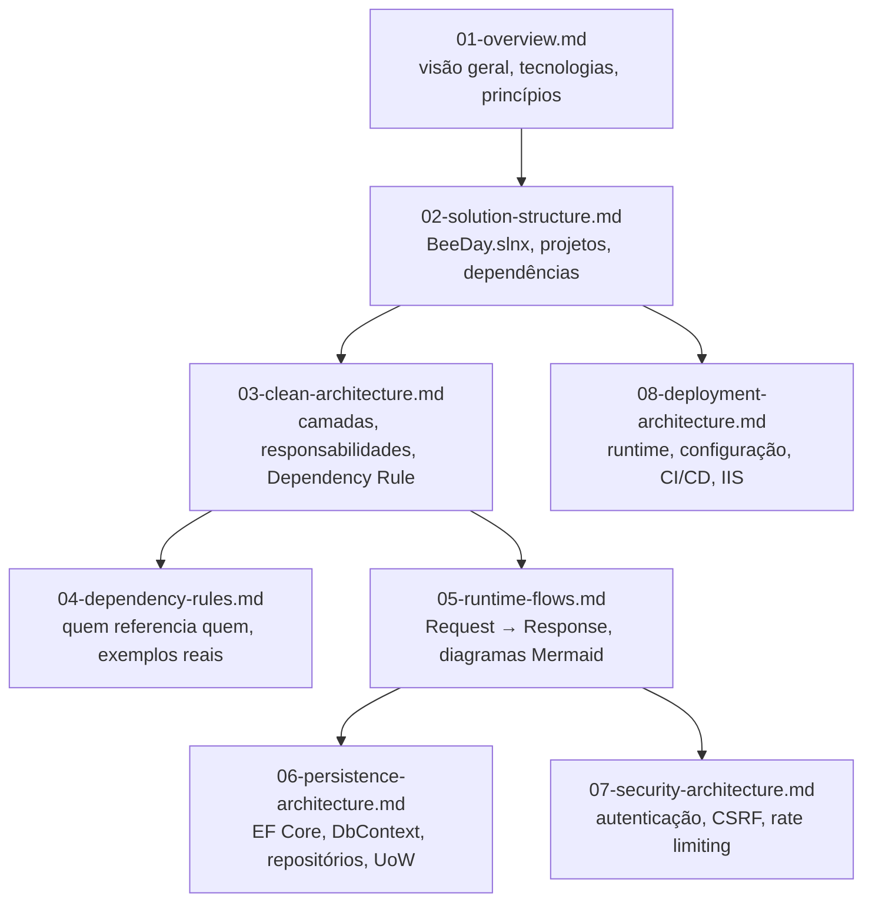

# Architecture

Documentação de arquitetura do BeeDay — reconstruída por completo na Sprint 16.3 a partir
exclusivamente do código atual (`src/`, `tests/`, `BeeDay.slnx`, `Directory.Build.props`,
`Directory.Packages.props`). Nenhuma afirmação vem de `docs/history/` ou de sprints anteriores sem
reverificação direta no código.

**Fonte da verdade:** cada documento abaixo declara individualmente as fontes exatas usadas para
validá-lo. Este índice em si é derivado do conjunto desses 8 documentos.

## Visão arquitetural

O BeeDay é uma aplicação Blazor Server (.NET 10) em Clean Architecture com 4 projetos em `src/`,
dependência estritamente unidirecional (`Domain ← Application ← Infrastructure ← Web`), SQL
Server como único provider de persistência via EF Core, e MediatR como mecanismo de despacho de
casos de uso (Commands/Queries).

## Princípios

- Domain não depende de nenhuma tecnologia externa (nem EF Core, nem ASP.NET Core) — verificado
  por ausência total desses `using` em `src/BeeDay.Domain`.
- Toda interface técnica (repositório, current user, e-mail, etc.) é definida em `Application` e
  implementada pela camada que possui a tecnologia concreta — Infrastructure para dados,
  Web para HTTP/cookies.
- SQL Server é o único caminho de persistência em execução; a aplicação recusa iniciar sem uma
  connection string válida (`ValidateOnStart()`).
- Tipos concretos de Infrastructure (`BeeDayDbContext`, `Ef*Repository`, `EfUnitOfWork`) são
  `internal` — inacessíveis fora do assembly, exceto para os 3 projetos de teste que precisam
  manipular o schema diretamente.

## Objetivos desta reconstrução (Sprint 16.3)

Substituir os dois documentos anteriores (`01-dependency-rules.md`, `02-runtime-flows.md`), que
descreviam regras e fluxos de forma prescritiva/aspiracional sem citar arquivo ou linha de código
real, por uma documentação onde toda afirmação é rastreável até `src/`, `tests/`, ou um arquivo de
configuração real do repositório.

## Organização e relação entre os documentos

| Documento | Conteúdo |
|---|---|
| [`01-overview.md`](01-overview.md) | Arquitetura geral, objetivos, princípios, tecnologias, organização de `src/` |
| [`02-solution-structure.md`](02-solution-structure.md) | `BeeDay.slnx`, os 9 projetos, dependências entre eles, Central Package Management |
| [`03-clean-architecture.md`](03-clean-architecture.md) | Camadas, responsabilidades, Dependency Rule, fluxo entre camadas |
| [`04-dependency-rules.md`](04-dependency-rules.md) | Quem referencia quem, quem nunca referencia quem, exemplos reais de código |
| [`05-runtime-flows.md`](05-runtime-flows.md) | Fluxos completos (criar Hábito, login, validação de sessão, health checks) com Mermaid |
| [`06-persistence-architecture.md`](06-persistence-architecture.md) | `BeeDayDbContext`, TPC, Owned/Complex Type, os 8 repositórios, `IUnitOfWork`, migrations |
| [`07-security-architecture.md`](07-security-architecture.md) | Autenticação por cookie, `SessionVersion`, rate limiting, CSRF, hashing de senha |
| [`08-deployment-architecture.md`](08-deployment-architecture.md) | CI/CD, `Deploy-BeeDay.ps1`, IIS, configuração validada no startup |

## Ordem de leitura recomendada

1. `01-overview.md`
2. `02-solution-structure.md`
3. `03-clean-architecture.md`
4. `04-dependency-rules.md`
5. `05-runtime-flows.md`
6. `06-persistence-architecture.md`
7. `07-security-architecture.md`
8. `08-deployment-architecture.md`

## Achados reportados durante esta reconstrução (não corrigidos — fora do escopo desta Sprint)

- `BeeDay.Application.csproj` declara `FrameworkReference Microsoft.AspNetCore.App` sem nenhum uso
  aparente de namespace ASP.NET Core no código da camada.
- A claim `BeeDayClaimTypes.SessionVersion` tem valor literal `"levelup:session_version"`.
- `src/BeeDay.Web/web.config` e `appsettings.Production.json` ainda referenciam o caminho antigo
  `C:\Apps\LevelUp-Data\...` em vez de `C:\Apps\BeeDay-Data\...`.
- O step de validação de secrets em `deploy-prd.yml` não inclui `BEEDAY_RESEND_FROM_NAME` na lista
  de 4 secrets pré-validados, embora o step de deploy seguinte o consuma.

Ver o relatório final da Sprint 16.3 para detalhes e impacto de cada achado.
