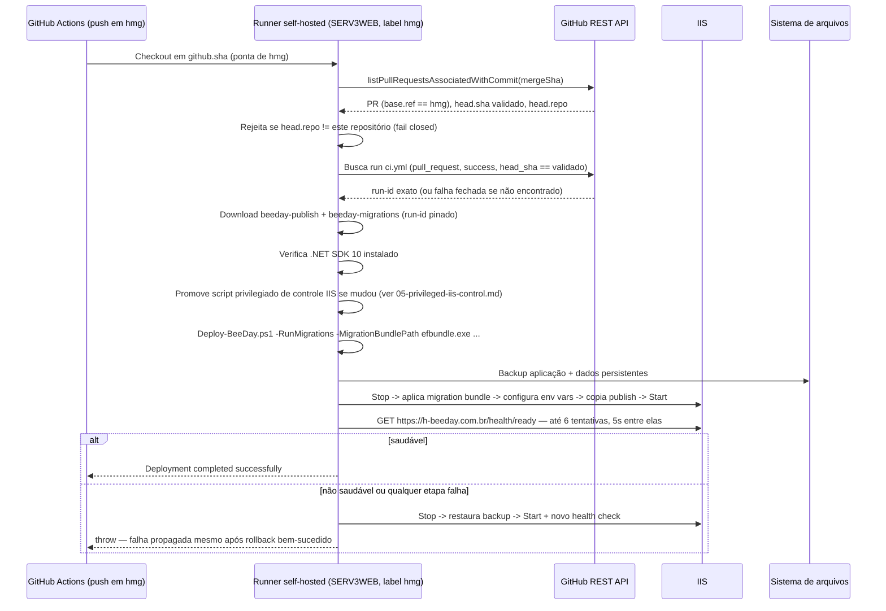
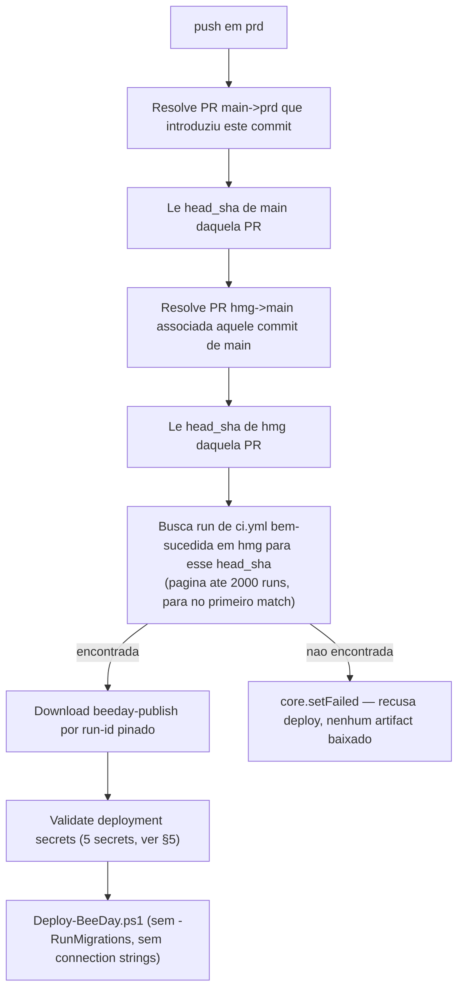

# Deployment Pipeline

**Fonte da verdade:** verificado diretamente em `.github/workflows/ci.yml`,
`.github/workflows/deploy-hmg.yml`, `.github/workflows/deploy-prd.yml`,
`scripts/Deploy-BeeDay.ps1`, `src/BeeDay.Web/web.config`.

**Última verificação:** 2026-08-11 (Sprint 19.8 — §2/§4.1 atualizados para o trigger direto
`push: hmg` de `deploy-hmg.yml` e resolução de proveniência via API de Pull Requests, ver
[`12-artifact-provenance.md`](12-artifact-provenance.md); Sprint 19.2 original corrigiu
divergências materiais encontradas pelo Discovery da Sprint 19.1, ver
[`06-cicd-pipeline-discovery-baseline.md`](06-cicd-pipeline-discovery-baseline.md) §19 para o
registro completo do que estava desatualizado e por quê).

## 1. Objetivo

Descrever exatamente como um commit vira um binário publicado e como esse binário chega aos
servidores IIS de homologação e produção — dos workflows do GitHub Actions (`ci.yml`,
`deploy-hmg.yml`, `verify-hmg.yml`, `deploy-prd.yml`) ao script de deploy com rollback.

## 2. Branches e ambientes

| Branch/Evento | Workflow acionado | Ambiente |
|---|---|---|
| `hmg` (push) | `deploy-hmg.yml` diretamente (`push: branches: [hmg]`, Sprint 19.8) — resolve o artefato já validado pela PR via cadeia de proveniência de Pull Requests (§4.1), nunca dispara `ci.yml` novamente | Deploy automático em SERV3WEB (job `deploy`, "Deploy HMG") |
| `prd` (push) | `deploy-prd.yml` | Deploy direto — **sem validação própria**: resolve e reutiliza o artefato já validado por `ci.yml` em `hmg` via cadeia de proveniência de Pull Requests (§4.2), nunca reconstrói (Build Once, Deploy Many — ver `CLAUDE.md` §5.7.2) |
| PR para `hmg` | `ci.yml` (pull_request) | Validação apenas, sem deploy direto — `deploy-hmg.yml` não escuta mais `ci.yml` (Sprint 19.8); é o **merge** subsequente em `hmg` (evento `push`) que dispara o deploy, resolvendo o artefato desta mesma execução de `ci.yml` por proveniência. `main` removido deste trigger na Sprint 19.8.4 (o required check de `main` passou de `BeeDay CI` para `BeeDay — Release Quality Gate`, ver `11-release-quality-gate.md` §25) e `prd` removido na Sprint 19.4 — nenhum Ruleset em `prd` exige `BeeDay CI`, e `deploy-prd.yml` já prova proveniência de forma independente (§4.2); rodar a suíte inteira de novo numa PR `main→prd`/`hmg→main` não tinha (ou deixou de ter) consumidor (ver `08-fast-pr-validation-decision.md`) |
| PR para `main` (`hmg→main`) | `release-quality-gate.yml` (pull_request) + `validate-promotion.yml` | Fronteira de promoção — validação completa e independente, não reaproveita artifacts de `hmg`; `ci.yml` **não dispara mais** para esta PR desde a Sprint 19.8.4 |
| qualquer | `workflow_dispatch` nos 3 | Execução manual sob demanda |

`ci.yml` tem `concurrency: cancel-in-progress: true` (uma nova execução cancela a anterior do mesmo
branch); `deploy-hmg.yml` (`beeday-homologation`) e `deploy-prd.yml` (`beeday-production`) têm
`concurrency: cancel-in-progress: false` (deploys nunca são cancelados por um novo evento —
enfileiram, o que serializa mas **não deduplica** execuções concorrentes do mesmo estado — ver §6).

## 3. Pipeline de validação (`ci.yml`, job `ci` — `BeeDay — Pull Request Validation`)

`ci.yml` é o workflow que valida toda PR `sprint/*→hmg` e produz os artifacts que `deploy-hmg.yml`
consome — `deploy-hmg.yml` e `deploy-prd.yml` nunca rebuildam nem re-testam, ambos apenas baixam,
por `run-id` pinado, os artifacts já validados (Build Once, Deploy Many — `CLAUDE.md` §5.7.2).

**Renomeado na Sprint 19.8.6** de `BeeDay CI` para `BeeDay — Pull Request Validation` (job:
`Pull Request Validation`) — nome anterior ficou semanticamente incorreto após o redesenho da
19.8.5 (§ abaixo). `deploy-hmg.yml`/`deploy-prd.yml` resolvem este workflow por `workflow_id:
'ci.yml'` (caminho do arquivo, confirmado por leitura direta) — o rename não exigiu nenhuma
mudança nesses consumidores. Ver
[`08-fast-pr-validation-decision.md`](08-fast-pr-validation-decision.md) §14 para a descoberta
empírica do check context e a transição do Ruleset de `hmg`.

**Redesenhado na Sprint 19.8.5** para responder exclusivamente "esta alteração tem qualidade
mínima para ser integrada e testada em homologação?" — não mais a suíte completa de release.
Format, `Infrastructure.Tests`, `Web.Tests`, `E2E.Tests` (+ setup do Playwright) foram movidos
para `BeeDay — Release Quality Gate` (ver [`11-release-quality-gate.md`](11-release-quality-gate.md)), que já os executa
obrigatoriamente antes de `main` — nenhuma cobertura foi removida, apenas realocada para a
fronteira onde a EPIC 19 decidiu que cada validação agora tem mais valor. Decisão completa,
evidência remota e justificativa por item:
[`08-fast-pr-validation-decision.md`](08-fast-pr-validation-decision.md) §12.

```mermaid
flowchart TD
    A[actions/checkout@v7] --> B[setup-dotnet .NET 10]
    B --> C[dotnet restore BeeDay.slnx]
    C --> D["dotnet build -c Release --warnaserror"]
    D --> E["dotnet test -c Release --logger trx<br/>(Domain.Tests + Application.Tests apenas)"]
    E --> F["dotnet publish BeeDay.Web.csproj -c Release"]
    F --> G[Validar BeeDay.Web.dll + web.config existem no publish]
    G --> H["dotnet ef migrations bundle (win-x64)"]
    H --> I[Upload artifacts: test-results,<br/>publish validado, migration bundle]
```

`ci.yml` roda em `windows-latest` (hospedado pela GitHub). Format, cache/instalação do Playwright,
`Infrastructure.Tests`, `Web.Tests`, `E2E.Tests`, e o upload de `beeday-e2e-artifacts` (sem
consumidor downstream) não fazem mais parte deste workflow — todos continuam rodando
integralmente em `release-quality-gate.yml` (ver [`docs/testing/`](../testing/README.md)).

`dotnet publish` produz um diretório de arquivos (framework-dependent, implícito por não haver
`-r`/`--self-contained` no comando), consumido diretamente pelo IIS via `AspNetCoreModuleV2`. Não
há artefato NuGet nem imagem de container em nenhum workflow.

## 4. Jobs de deploy

Nem `deploy-hmg.yml` nem `deploy-prd.yml` têm `needs:` — cada um tem um único job (`deploy`) que
não builda/testa nada; ambos apenas resolvem qual execução de `ci.yml` validou o estado a implantar
e baixam os artifacts já prontos por `run-id` pinado (nunca "latest" implícito).

### 4.1 Job `deploy` (`deploy-hmg.yml`, job display name "Deploy HMG")

**Redesenhado na Sprint 19.8.** Disparado diretamente por `push: branches: [hmg]` (não mais via
`workflow_run` de `ci.yml`) ou `workflow_dispatch`. Nunca dispara uma segunda execução de
`ci.yml` — em vez disso resolve, via API de Pull Requests do GitHub, qual execução `pull_request`
de `ci.yml` já validou o commit que está sendo mergeado, e baixa o artifact dessa execução por
`run-id` pinado. Ver [`12-artifact-provenance.md`](12-artifact-provenance.md) para a investigação
completa (evidência real de duplicação, análise de estratégia de merge, matriz de decisão, race
conditions).



`environment: homologation` (GitHub Environment existente, mas sem `protection_rules` configuradas
hoje — ver [`06-cicd-pipeline-discovery-baseline.md`](06-cicd-pipeline-discovery-baseline.md) §15).

**Histórico:** a Sprint 19.6 eliminou o deployment duplicado (mesmo commit disparando dois
deployments — evidência em `06-cicd-pipeline-discovery-baseline.md` §12) restringindo o guard do
antigo trigger `workflow_run` a `event == 'push'`. A Sprint 19.8 elimina a causa raiz que exigia
esse guard: ao trocar `workflow_run` por `push: hmg` direto, não existe mais um trigger
compartilhado com a PR de promoção `hmg→main` para desambiguar — cada `push` em `hmg` dispara
exatamente uma resolução, isolada por commit.

Após um deploy bem-sucedido, o job expõe o SHA implantado (`outputs.deployed-sha`) e publica um
artifact `beeday-hmg-deployment-info` (agora com `sourceSha`/`mergeSha`/`pullRequest`/
`validationRunId`, Sprint 19.8), consumido por
[`BeeDay — HMG Verification`](10-hmg-deployment-verification.md) (`verify-hmg.yml`, Sprint 19.6) —
`workflow_run` encadeado, que roda `Verify Readiness` (re-checagem explícita de `/health/ready`) e
`Run Smoke Tests` (`GET /login` contra o ambiente real implantado) após todo deploy bem-sucedido.

### 4.2 Job `deploy` (`deploy-prd.yml`, job display name "Deploy Production")

Disparado por `push` em `prd` ou `workflow_dispatch`. **Nunca reconstrói** — resolve a cadeia de
Pull Requests que promoveu o commit até `prd` para encontrar a execução de `ci.yml` original em
`hmg`:



Diferenças relevantes em relação a `deploy-hmg.yml`: **não baixa `beeday-migrations`** e chama
`Deploy-BeeDay.ps1` sem `-RunMigrations`/connection strings — consistente com PRD não ter banco de
dados próprio hoje (Not Provisioned by Design, ver §6). `environment: production` é declarado no
workflow mas **não existe como GitHub Environment configurado** — `gh api
repos/.../environments` só lista `copilot` e `homologation` (ver
[`06-cicd-pipeline-discovery-baseline.md`](06-cicd-pipeline-discovery-baseline.md) §15) — logo não
há hoje nenhum portão de aprovação manual real associado a este `environment:`, apesar do nome.

**Nunca executado:** a versão atual deste job (cadeia de proveniência por PR) nunca rodou de fato —
as execuções históricas de `deploy-prd.yml` visíveis em `gh run list` pertencem a uma versão
anterior e materialmente diferente do arquivo (com um job `validate` que reconstruía/retestava
tudo), substituída em `9439bd8` (Sprint 18.4). Ver
[`06-cicd-pipeline-discovery-baseline.md`](06-cicd-pipeline-discovery-baseline.md) §19.2 para a
evidência completa dessa distinção.

## 5. Secrets

Tabela abaixo é do ponto de vista de `deploy-prd.yml` (5 secrets, todos checados em "Validate
deployment secrets"). `deploy-hmg.yml` usa os mesmos 5 **mais** `BEEDAY_APP_CONNECTION` e
`BEEDAY_MIGRATOR_CONNECTION` (necessários porque só HMG roda `-RunMigrations`, ver §4.1) — esses 2
não passam por nenhuma checagem explícita de secret ausente antes de `Deploy-BeeDay.ps1` ser
chamado.

| Secret GitHub | Variável de ambiente do App Pool (IIS) | Validado no step "Validate deployment secrets"? |
|---|---|---|
| `BEEDAY_PUBLIC_BASE_URL` | `BeeDay__IdentityEmail__PublicBaseUrl` | Sim — também checa prefixo `https://` |
| `BEEDAY_RESEND_API_KEY` | `BeeDay__Email__Resend__ApiKey` | Sim |
| `BEEDAY_RESEND_FROM_ADDRESS` | `BeeDay__Email__Resend__FromAddress` | Sim |
| `BEEDAY_RESEND_FROM_NAME` | `BeeDay__Email__Resend__FromName` | **Não** — usado no step seguinte sem checagem prévia |
| `BEEDAY_ALLOWED_HOSTS` | `AllowedHosts` | Sim |
| `BEEDAY_APP_CONNECTION` (só `deploy-hmg.yml`) | connection string da aplicação | Não — sem step de validação de secrets em `deploy-hmg.yml` |
| `BEEDAY_MIGRATOR_CONNECTION` (só `deploy-hmg.yml`) | connection string do migration bundle | Não — idem |

`Deploy-BeeDay.ps1` declara `[string]$ResendFromName = "BeeDay"` como valor padrão do parâmetro —
então, mesmo sem o secret `BEEDAY_RESEND_FROM_NAME` configurado no GitHub (que faria a variável de
ambiente do workflow resolver para string vazia), o script recebe `""` como argumento explícito, o
que **sobrescreve o padrão do parâmetro** (PowerShell só aplica o valor padrão quando o parâmetro
não é passado, não quando é passado vazio) — resultado prático: `BeeDay__Email__Resend__FromName`
seria configurado como string vazia no IIS, não `"BeeDay"`, se o secret realmente não existir. Não
confirmado nesta auditoria se o secret existe de fato no ambiente `production` do GitHub (não é
visível a partir do código-fonte) — apenas que, se não existir, a lacuna de validação deixaria isso
passar silenciosamente até o e-mail de fato ser enviado com remetente em branco.

## 6. Achados

- **HMG recebe deploy automatizado** por `deploy-hmg.yml` — a versão anterior deste documento
  afirmava o contrário; corrigido na Sprint 19.2 a partir da evidência da Sprint 19.1 (ver §4.1).
- **Deployment duplicado em HMG para o mesmo estado** — comprovado pela Sprint 19.1
  (`06-cicd-pipeline-discovery-baseline.md` §6/§12), **estruturalmente corrigido na Sprint 19.6**
  (ver [`10-hmg-deployment-verification.md`](10-hmg-deployment-verification.md)) e a causa raiz
  que exigia aquele guard **eliminada na Sprint 19.8** (`push: hmg` direto substitui o
  `workflow_run` compartilhado com a PR `hmg→main` — ver §4.1 e
  [`12-artifact-provenance.md`](12-artifact-provenance.md)); validação remota (observar exatamente
  1 execução de `BeeDay CI` por merge) ainda pendente.
- **Segunda execução completa de `BeeDay CI` após todo merge em `hmg`** — comprovado com evidência
  real (PR #60, ~6.6 min duplicados) e **eliminado na Sprint 19.8** via resolução de proveniência;
  ver [`12-artifact-provenance.md`](12-artifact-provenance.md) §3/§32. Validação remota pendente.
- **`environment: production` não tem GitHub Environment correspondente configurado** — ver §4.2.
- PRD não roda migrations nem tem connection string própria (`deploy-prd.yml` não baixa
  `beeday-migrations`) — consistente com PRD ser Not Provisioned by Design (ver
  [`README.md`](README.md) "Estado real de HMG e PRD").
- `web.config` (`stdoutLogFile`) corrigido para `C:\Apps\BeeDay-Data\Logs\stdout` na Sprint 18.4
  (era `LevelUp-Data`, path confirmado ativo em HMG antes da correção — ver
  [`02-runtime-configuration.md`](02-runtime-configuration.md) §5). Migração operacional (promoção
  + validação pós-deploy de que o novo stdout é escrito com sucesso) ainda pendente.
- Rollback (`Deploy-BeeDay.ps1`) restaura apenas os **arquivos da aplicação** a partir do backup —
  nunca restaura schema/dados do SQL Server. Uma migration aplicada por uma versão com bug, seguida
  de rollback do binário, deixa o schema na versão nova enquanto o código volta à versão antiga —
  risco reconhecido pela própria estrutura do script (comentário equivalente já existia nos
  documentos anteriores, ver [`04-operations.md`](04-operations.md) §2).

## 7. Fontes consultadas

- `.github/workflows/ci.yml`, `.github/workflows/deploy-hmg.yml`, `.github/workflows/verify-hmg.yml`,
  `.github/workflows/deploy-prd.yml`.
- `scripts/Deploy-BeeDay.ps1`.
- `src/BeeDay.Web/web.config`.
- [`12-artifact-provenance.md`](12-artifact-provenance.md) (Sprint 19.8 — redesenho do trigger e
  resolução de proveniência de `deploy-hmg.yml`, evidência real de duplicação).
- [`06-cicd-pipeline-discovery-baseline.md`](06-cicd-pipeline-discovery-baseline.md) (Sprint 19.1 —
  baseline empírico que identificou as divergências corrigidas nesta revisão).
- [`docs/architecture/README.md`](../architecture/README.md) (achado de `BEEDAY_RESEND_FROM_NAME`
  já reportado na Sprint 16.3, verificado novamente nesta Sprint com o valor padrão do parâmetro).
