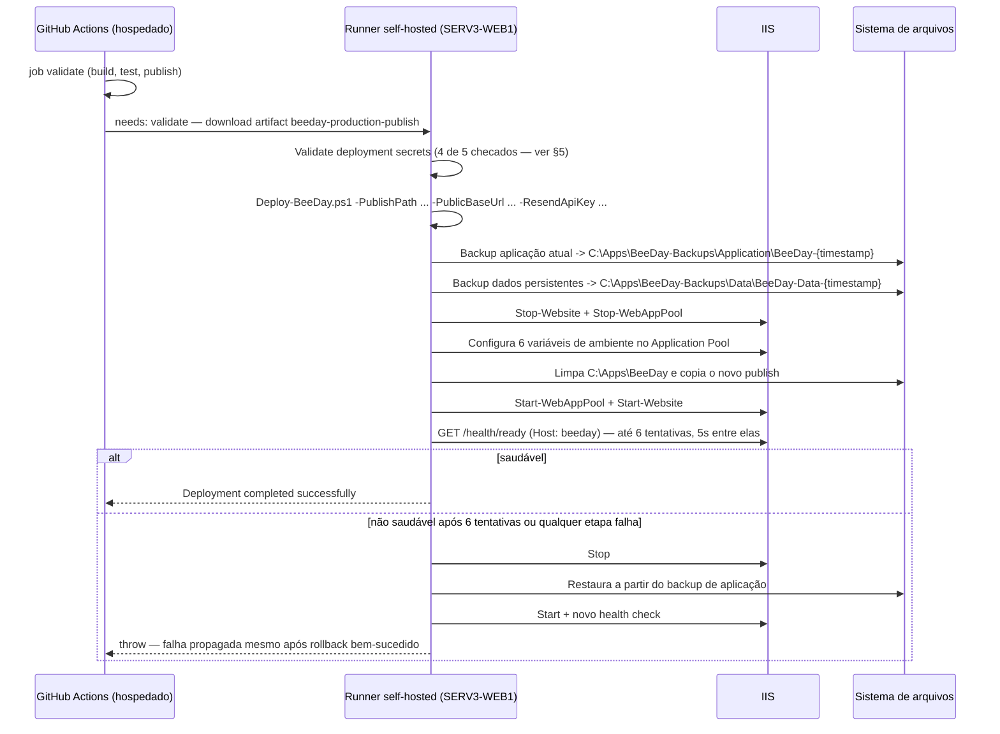

# Deployment Pipeline

**Fonte da verdade:** verificado diretamente em `.github/workflows/ci.yml`,
`.github/workflows/deploy-prd.yml`, `scripts/Deploy-BeeDay.ps1`, `src/BeeDay.Web/web.config`.

**Última verificação:** 2026-08-07.

## 1. Objetivo

Descrever exatamente como um commit vira um binário publicado e como esse binário chega ao
servidor IIS de produção — dos 2 workflows do GitHub Actions ao script de deploy com rollback.

## 2. Branches e ambientes

| Branch | Workflow acionado | Ambiente |
|---|---|---|
| `hmg` | `ci.yml` (push) | Validação apenas — **nenhum workflow neste repositório implanta em HMG**. `docs/README.md`/documentos anteriores mencionavam "deploy automático a partir de hmg"; não confirmado no código atual (achado, ver §6). |
| `prd` | `deploy-prd.yml` (push) | `validate` (mesma validação do CI) → `deploy` (implanta em produção via runner self-hosted) |
| PR para `hmg`/`prd` | `ci.yml` (pull_request) | Validação apenas, sem publicação de artefato de implantação |
| qualquer | `workflow_dispatch` em ambos | Execução manual sob demanda |

`ci.yml` tem `concurrency: cancel-in-progress: true` (uma nova execução cancela a anterior do mesmo
branch); `deploy-prd.yml` tem `concurrency: cancel-in-progress: false` (deploys de produção nunca
são cancelados por um novo push — enfileiram).

## 3. Pipeline de validação (idêntico nos dois workflows, job `validate`)

```mermaid
flowchart TD
    A[actions/checkout@v4] --> B[setup-dotnet .NET 10]
    B --> C[dotnet restore BeeDay.slnx]
    C --> D["dotnet format --verify-no-changes"]
    D --> E["dotnet build -c Release --warnaserror"]
    E --> F{ci.yml apenas}
    F -->|sim| G[Playwright install chromium]
    F -->|deploy-prd.yml pula| H
    G --> H["dotnet test -c Release --logger trx"]
    H --> I["dotnet publish BeeDay.Web.csproj -c Release"]
    I --> J[Validar BeeDay.Web.dll + web.config existem no publish]
    J --> K[Upload artifact: resultados de teste]
    K --> L[Upload artifact: publish validado]
```

`ci.yml` roda em `windows-latest` (hospedado pela GitHub) e tem um passo extra específico
(`Upload E2E failure artifacts`, `if: always()`, `if-no-files-found: ignore`) que publica
`tests/BeeDay.E2E.Tests/bin/Release/net10.0/e2e-artifacts` — a pasta de screenshot/trace do
Playwright, que só tem conteúdo quando um teste E2E falha (ver
[`docs/testing/`](../testing/README.md)). `deploy-prd.yml`'s `validate` roda no mesmo runner
hospedado, mas sem o passo de instalar Playwright — os testes de `BeeDay.E2E.Tests` ainda rodam
(fazem parte de `dotnet test BeeDay.slnx`), então, sem o Chromium instalado, essa etapa dependeria
de um Chromium já presente no runner ou falharia — não confirmado nesta auditoria se
`deploy-prd.yml` já executou com sucesso um E2E real ou se isso é uma lacuna latente do workflow.

Nenhum dos dois publica artefato NuGet nem imagem de container — `dotnet publish` produz um
diretório de arquivos (framework-dependent, implícito por não haver `-r`/`--self-contained` no
comando), consumido diretamente pelo IIS via `AspNetCoreModuleV2`.

## 4. Job `deploy` (`deploy-prd.yml` apenas)



`needs: validate` garante que o deploy só roda depois do job `validate` (mesmo runner hospedado)
terminar com sucesso — build, `dotnet test` completo (incluindo `BeeDay.E2E.Tests`) e a validação
de que `BeeDay.Web.dll`/`web.config` existem no publish. `environment: production` (configuração do
GitHub, não deste repositório) tipicamente adiciona um portão de aprovação manual — não verificável
a partir do código-fonte deste repositório.

## 5. Secrets

| Secret GitHub | Variável de ambiente do App Pool (IIS) | Validado no step "Validate deployment secrets"? |
|---|---|---|
| `BEEDAY_PUBLIC_BASE_URL` | `BeeDay__IdentityEmail__PublicBaseUrl` | Sim — também checa prefixo `https://` |
| `BEEDAY_RESEND_API_KEY` | `BeeDay__Email__Resend__ApiKey` | Sim |
| `BEEDAY_RESEND_FROM_ADDRESS` | `BeeDay__Email__Resend__FromAddress` | Sim |
| `BEEDAY_RESEND_FROM_NAME` | `BeeDay__Email__Resend__FromName` | **Não** — usado no step seguinte sem checagem prévia |
| `BEEDAY_ALLOWED_HOSTS` | `AllowedHosts` | Sim |

`Deploy-BeeDay.ps1` declara `[string]$ResendFromName = "BeeDay"` como valor padrão do parâmetro —
então, mesmo sem o secret `BEEDAY_RESEND_FROM_NAME` configurado no GitHub (que faria a variável de
ambiente do workflow resolver para string vazia), o script recebe `""` como argumento explícito, o
que **sobrescreve o padrão do parâmetro** (PowerShell só aplica o valor padrão quando o parâmetro
não é passado, não quando é passado vazio) — resultado prático: `BeeDay__Email__Resend__FromName`
seria configurado como string vazia no IIS, não `"BeeDay"`, se o secret realmente não existir. Não
confirmado nesta auditoria se o secret existe de fato no ambiente `production` do GitHub (não é
visível a partir do código-fonte) — apenas que, se não existir, a lacuna de validação deixaria isso
passar silenciosamente até o e-mail de fato ser enviado com remetente em branco.

## 6. Achados

- Nenhum workflow implanta em HMG — apenas `ci.yml` valida pushes/PRs para `hmg`. Se existe um
  processo de deploy HMG, ele está fora deste repositório (manual, ou outra automação não
  versionada aqui) — não confirmado.
- `web.config` (`stdoutLogFile="C:\Apps\LevelUp-Data\Logs\stdout"`) — ver achado consolidado em
  [`README.md`](README.md#achados-relevantes-reportados-não-corrigidos).
- Rollback (`Deploy-BeeDay.ps1`) restaura apenas os **arquivos da aplicação** a partir do backup —
  nunca restaura schema/dados do SQL Server. Uma migration aplicada por uma versão com bug, seguida
  de rollback do binário, deixa o schema na versão nova enquanto o código volta à versão antiga —
  risco reconhecido pela própria estrutura do script (comentário equivalente já existia nos
  documentos anteriores, ver [`04-operations.md`](04-operations.md) §2).

## 7. Fontes consultadas

- `.github/workflows/ci.yml`, `.github/workflows/deploy-prd.yml`.
- `scripts/Deploy-BeeDay.ps1`.
- `src/BeeDay.Web/web.config`.
- [`docs/architecture/README.md`](../architecture/README.md) (achado de `BEEDAY_RESEND_FROM_NAME`
  já reportado na Sprint 16.3, verificado novamente nesta Sprint com o valor padrão do parâmetro).
