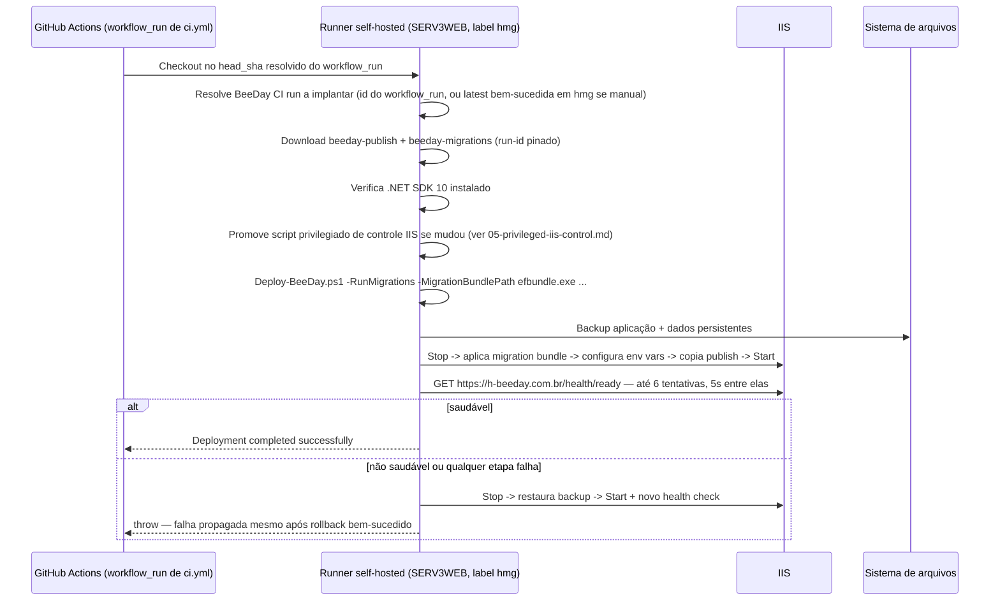
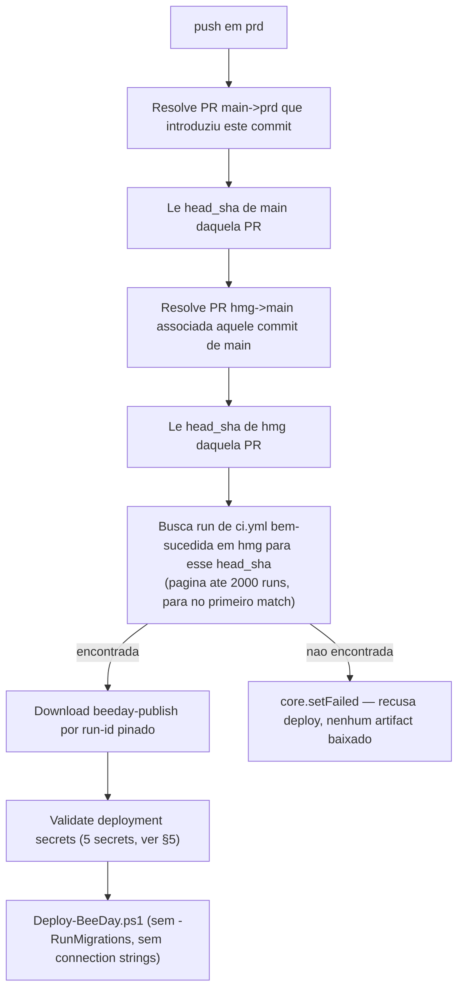

# Deployment Pipeline

**Fonte da verdade:** verificado diretamente em `.github/workflows/ci.yml`,
`.github/workflows/deploy-hmg.yml`, `.github/workflows/deploy-prd.yml`,
`scripts/Deploy-BeeDay.ps1`, `src/BeeDay.Web/web.config`.

**Última verificação:** 2026-08-10 (Sprint 19.2 — corrige divergências materiais encontradas pelo
Discovery da Sprint 19.1, ver [`06-cicd-pipeline-discovery-baseline.md`](06-cicd-pipeline-discovery-baseline.md)
§19 para o registro completo do que estava desatualizado e por quê).

## 1. Objetivo

Descrever exatamente como um commit vira um binário publicado e como esse binário chega aos
servidores IIS de homologação e produção — dos 3 workflows do GitHub Actions (`ci.yml`,
`deploy-hmg.yml`, `deploy-prd.yml`) ao script de deploy com rollback.

## 2. Branches e ambientes

| Branch/Evento | Workflow acionado | Ambiente |
|---|---|---|
| `hmg` (push) | `ci.yml` → dispara `deploy-hmg.yml` (via `workflow_run`, se `ci.yml` concluir com sucesso e `head_branch == hmg`) | Validação, depois deploy automático em SERV3WEB (job `deploy`, "Deploy HMG") |
| `prd` (push) | `deploy-prd.yml` | Deploy direto — **sem validação própria**: resolve e reutiliza o artefato já validado por `ci.yml` em `hmg` via cadeia de proveniência de Pull Requests (§4.2), nunca reconstrói (Build Once, Deploy Many — ver `CLAUDE.md` §5.7.2) |
| PR para `hmg`/`main`/`prd` | `ci.yml` (pull_request) | Validação apenas, sem deploy — mas **pode** disparar `deploy-hmg.yml` indiretamente se a PR tiver `hmg` como branch de origem (ver achado sobre deployment duplicado, §6) |
| qualquer | `workflow_dispatch` nos 3 | Execução manual sob demanda |

`ci.yml` tem `concurrency: cancel-in-progress: true` (uma nova execução cancela a anterior do mesmo
branch); `deploy-hmg.yml` (`beeday-homologation`) e `deploy-prd.yml` (`beeday-production`) têm
`concurrency: cancel-in-progress: false` (deploys nunca são cancelados por um novo evento —
enfileiram, o que serializa mas **não deduplica** execuções concorrentes do mesmo estado — ver §6).

## 3. Pipeline de validação (`ci.yml`, job `ci` — único workflow que builda/testa)

`ci.yml` é hoje o **único** workflow que builda e testa a aplicação. `deploy-hmg.yml` e
`deploy-prd.yml` nunca rebuildam nem re-testam — ambos apenas baixam, por `run-id` pinado, os
artifacts que uma execução de `ci.yml` já validou em `hmg` (Build Once, Deploy Many — `CLAUDE.md`
§5.7.2). Isso substitui a descrição anterior deste documento, que descrevia um job `validate`
equivalente dentro de `deploy-prd.yml` — esse job não existe mais na versão atual do arquivo
(reescrito em `9439bd8`, Sprint 18.4; ver
[`06-cicd-pipeline-discovery-baseline.md`](06-cicd-pipeline-discovery-baseline.md) §19.2).

```mermaid
flowchart TD
    A[actions/checkout@v7] --> B[setup-dotnet .NET 10]
    B --> C[dotnet restore BeeDay.slnx]
    C --> D["dotnet format --verify-no-changes"]
    D --> E["dotnet build -c Release --warnaserror"]
    E --> F[Playwright install chromium]
    F --> G["dotnet test -c Release --logger trx<br/>(por projeto, ver Sprint 19.1)"]
    G --> H["dotnet publish BeeDay.Web.csproj -c Release"]
    H --> I[Validar BeeDay.Web.dll + web.config existem no publish]
    I --> J["dotnet ef migrations bundle (win-x64)"]
    J --> K[Upload artifacts: test-results, e2e-artifacts,<br/>publish validado, migration bundle]
```

`ci.yml` roda em `windows-latest` (hospedado pela GitHub) e tem um passo extra específico
(`Upload E2E failure artifacts`, `if: always()`, `if-no-files-found: ignore`) que publica
`tests/BeeDay.E2E.Tests/bin/Release/net10.0/e2e-artifacts` — a pasta de screenshot/trace do
Playwright, que só tem conteúdo quando um teste E2E falha (ver
[`docs/testing/`](../testing/README.md)).

`dotnet publish` produz um diretório de arquivos (framework-dependent, implícito por não haver
`-r`/`--self-contained` no comando), consumido diretamente pelo IIS via `AspNetCoreModuleV2`. Não
há artefato NuGet nem imagem de container em nenhum workflow.

## 4. Jobs de deploy

Nem `deploy-hmg.yml` nem `deploy-prd.yml` têm `needs:` — cada um tem um único job (`deploy`) que
não builda/testa nada; ambos apenas resolvem qual execução de `ci.yml` validou o estado a implantar
e baixam os artifacts já prontos por `run-id` pinado (nunca "latest" implícito).

### 4.1 Job `deploy` (`deploy-hmg.yml`, job display name "Deploy HMG")

Disparado por `workflow_run` (workflow `ci.yml`, tipo `completed`) ou `workflow_dispatch`. Roda
apenas se `github.event.workflow_run.head_branch == 'hmg'` (ou se foi disparo manual).



`environment: homologation` (GitHub Environment existente, mas sem `protection_rules` configuradas
hoje — ver [`06-cicd-pipeline-discovery-baseline.md`](06-cicd-pipeline-discovery-baseline.md) §15).

**Achado ativo (não corrigido nesta Sprint):** como qualquer conclusão bem-sucedida de `ci.yml`
cujo `head_branch` seja `hmg` dispara este job — e `ci.yml` roda tanto em `push` para `hmg` quanto
em `pull_request` com `hmg` como origem (ex.: a PR de promoção `hmg → main`) — o mesmo commit pode
disparar **dois** deployments completos e independentes em sequência. Comprovado com evidência de
log direta pela Sprint 19.1 (`06-cicd-pipeline-discovery-baseline.md` §12); correção é escopo da
Sprint 19.6, não deste documento.

### 4.2 Job `deploy` (`deploy-prd.yml`, job display name "Deploy Production")

Disparado por `push` em `prd` ou `workflow_dispatch`. **Nunca reconstrói** — resolve a cadeia de
Pull Requests que promoveu o commit até `prd` para encontrar a execução de `ci.yml` original em
`hmg`:



Diferenças relevantes em relação a `deploy-hmg.yml`: **não baixa `beeday-migrations`** e chama
`Deploy-BeeDay.ps1` sem `-RunMigrations`/connection strings — consistente com PRD não ter banco de
dados próprio hoje (Not Provisioned by Design, ver §6). `environment: production` é declarado no
workflow mas **não existe como GitHub Environment configurado** — `gh api
repos/.../environments` só lista `copilot` e `homologation` (ver
[`06-cicd-pipeline-discovery-baseline.md`](06-cicd-pipeline-discovery-baseline.md) §15) — logo não
há hoje nenhum portão de aprovação manual real associado a este `environment:`, apesar do nome.

**Nunca executado:** a versão atual deste job (cadeia de proveniência por PR) nunca rodou de fato —
as execuções históricas de `deploy-prd.yml` visíveis em `gh run list` pertencem a uma versão
anterior e materialmente diferente do arquivo (com um job `validate` que reconstruía/retestava
tudo), substituída em `9439bd8` (Sprint 18.4). Ver
[`06-cicd-pipeline-discovery-baseline.md`](06-cicd-pipeline-discovery-baseline.md) §19.2 para a
evidência completa dessa distinção.

## 5. Secrets

Tabela abaixo é do ponto de vista de `deploy-prd.yml` (5 secrets, todos checados em "Validate
deployment secrets"). `deploy-hmg.yml` usa os mesmos 5 **mais** `BEEDAY_APP_CONNECTION` e
`BEEDAY_MIGRATOR_CONNECTION` (necessários porque só HMG roda `-RunMigrations`, ver §4.1) — esses 2
não passam por nenhuma checagem explícita de secret ausente antes de `Deploy-BeeDay.ps1` ser
chamado.

| Secret GitHub | Variável de ambiente do App Pool (IIS) | Validado no step "Validate deployment secrets"? |
|---|---|---|
| `BEEDAY_PUBLIC_BASE_URL` | `BeeDay__IdentityEmail__PublicBaseUrl` | Sim — também checa prefixo `https://` |
| `BEEDAY_RESEND_API_KEY` | `BeeDay__Email__Resend__ApiKey` | Sim |
| `BEEDAY_RESEND_FROM_ADDRESS` | `BeeDay__Email__Resend__FromAddress` | Sim |
| `BEEDAY_RESEND_FROM_NAME` | `BeeDay__Email__Resend__FromName` | **Não** — usado no step seguinte sem checagem prévia |
| `BEEDAY_ALLOWED_HOSTS` | `AllowedHosts` | Sim |
| `BEEDAY_APP_CONNECTION` (só `deploy-hmg.yml`) | connection string da aplicação | Não — sem step de validação de secrets em `deploy-hmg.yml` |
| `BEEDAY_MIGRATOR_CONNECTION` (só `deploy-hmg.yml`) | connection string do migration bundle | Não — idem |

`Deploy-BeeDay.ps1` declara `[string]$ResendFromName = "BeeDay"` como valor padrão do parâmetro —
então, mesmo sem o secret `BEEDAY_RESEND_FROM_NAME` configurado no GitHub (que faria a variável de
ambiente do workflow resolver para string vazia), o script recebe `""` como argumento explícito, o
que **sobrescreve o padrão do parâmetro** (PowerShell só aplica o valor padrão quando o parâmetro
não é passado, não quando é passado vazio) — resultado prático: `BeeDay__Email__Resend__FromName`
seria configurado como string vazia no IIS, não `"BeeDay"`, se o secret realmente não existir. Não
confirmado nesta auditoria se o secret existe de fato no ambiente `production` do GitHub (não é
visível a partir do código-fonte) — apenas que, se não existir, a lacuna de validação deixaria isso
passar silenciosamente até o e-mail de fato ser enviado com remetente em branco.

## 6. Achados

- **HMG recebe deploy automatizado** por `deploy-hmg.yml` — a versão anterior deste documento
  afirmava o contrário; corrigido na Sprint 19.2 a partir da evidência da Sprint 19.1 (ver §4.1).
- **Deployment duplicado em HMG para o mesmo estado** é um problema ativo e comprovado (não
  hipotético) — ver §4.1 e
  [`06-cicd-pipeline-discovery-baseline.md`](06-cicd-pipeline-discovery-baseline.md) §6/§12.
  Correção é escopo da Sprint 19.6.
- **`environment: production` não tem GitHub Environment correspondente configurado** — ver §4.2.
- PRD não roda migrations nem tem connection string própria (`deploy-prd.yml` não baixa
  `beeday-migrations`) — consistente com PRD ser Not Provisioned by Design (ver
  [`README.md`](README.md) "Estado real de HMG e PRD").
- `web.config` (`stdoutLogFile`) corrigido para `C:\Apps\BeeDay-Data\Logs\stdout` na Sprint 18.4
  (era `LevelUp-Data`, path confirmado ativo em HMG antes da correção — ver
  [`02-runtime-configuration.md`](02-runtime-configuration.md) §5). Migração operacional (promoção
  + validação pós-deploy de que o novo stdout é escrito com sucesso) ainda pendente.
- Rollback (`Deploy-BeeDay.ps1`) restaura apenas os **arquivos da aplicação** a partir do backup —
  nunca restaura schema/dados do SQL Server. Uma migration aplicada por uma versão com bug, seguida
  de rollback do binário, deixa o schema na versão nova enquanto o código volta à versão antiga —
  risco reconhecido pela própria estrutura do script (comentário equivalente já existia nos
  documentos anteriores, ver [`04-operations.md`](04-operations.md) §2).

## 7. Fontes consultadas

- `.github/workflows/ci.yml`, `.github/workflows/deploy-hmg.yml`, `.github/workflows/deploy-prd.yml`.
- `scripts/Deploy-BeeDay.ps1`.
- `src/BeeDay.Web/web.config`.
- [`06-cicd-pipeline-discovery-baseline.md`](06-cicd-pipeline-discovery-baseline.md) (Sprint 19.1 —
  baseline empírico que identificou as divergências corrigidas nesta revisão).
- [`docs/architecture/README.md`](../architecture/README.md) (achado de `BEEDAY_RESEND_FROM_NAME`
  já reportado na Sprint 16.3, verificado novamente nesta Sprint com o valor padrão do parâmetro).
