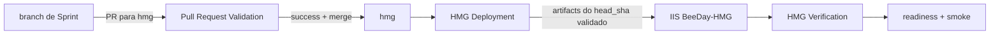

# Operations

**Fonte da verdade:** `.github/workflows/ci.yml`, `.github/workflows/deploy-hmg.yml`,
`.github/workflows/verify-hmg.yml`, `scripts/Deploy-BeeDay.ps1`, scripts sob
`scripts/iis-control/`, migrations versionadas e evidência não sensível dos GitHub Actions.

**Última verificação:** 2026-08-20, Sprint 30.3.

## 1. Objetivo

Documentar o fluxo operacional real de HMG: proveniência do artefato, configuração obrigatória,
migrations, IIS, health checks, backup e rollback. Valores de secrets não fazem parte deste
documento e não devem ser extraídos para comprovação operacional.

## 2. Proveniência reproduzível do artefato em HMG

Um push em `hmg` dispara `deploy-hmg.yml`. O workflow não recompila o merge e não aceita um
artefato escolhido apenas pelo nome da branch. Ele:

1. resolve o PR associado ao commit de merge em `hmg` e exige que o PR tenha como origem este
   mesmo repositório;
2. obtém o `head_sha` validado desse PR;
3. localiza uma execução bem-sucedida de `ci.yml`, evento `pull_request`, com o mesmo `head_sha`;
4. baixa dessa execução os artifacts `beeday-publish` e `beeday-migrations`, com verificação de
   digest pelo GitHub Actions;
5. implanta o publish e executa o EF bundle correspondente;
6. publica `beeday-hmg-deployment-info`, contendo `mergeSha`, `sourceSha`, `pullRequest`,
   `validationRunId`, `workflowRun`, ambiente, resultado e timestamp;
7. `verify-hmg.yml` consome esse registro, lê o `sourceSha` implantado e só então executa readiness
   e smoke test.

O contrato completo e o procedimento de auditoria estão em
[`12-artifact-provenance.md`](12-artifact-provenance.md).

### Evidência operacional de 2026-08-20

| Elo | Evidência |
|---|---|
| PR validado | PR #266, `head_sha` `069ad8465a684c5e5c5e6641cd97928a598ce437` |
| CI de origem | run `32385656296`, conclusão `success` |
| Publish | artifact `beeday-publish`, digest `sha256:45fd08cbe22792421eb8aa12a42dfd3cee0bae859775520ff41c78fa65a9b616` |
| Migrations | artifact `beeday-migrations`, digest `sha256:79e1af27d8f0dc7870a58bb82ddee5f8fe9152e59a73b8781e905714d7316d7c` |
| Merge em HMG | `9b87ff2c05d9715dc7026879b59c866bccc2c372` |
| Deploy | run `32390796350`, conclusão `success` |
| Registro | artifact `beeday-hmg-deployment-info`; `sourceSha` confirmado pela verificação |
| Pós-deploy | run `32391001814`, conclusão `success` |

Essa cadeia prova qual código validado originou o artefato implantado, mesmo quando o SHA do merge
em `hmg` é diferente do SHA da branch do PR.

## 3. Banco e migrations

O repositório possui uma migration EF Core, `20260803111144_InitialCreate`, e seu model snapshot.
O CI gera `efbundle.exe` a partir do mesmo SHA que gera o publish. Em HMG, o workflow passa uma
credencial exclusiva de migração ao bundle e uma credencial de aplicação separada ao App Pool;
nenhuma delas é gravada no artifact ou exibida em logs.

Na evidência operacional acima, o bundle retornou:

```text
No migrations were applied. The database is already up to date.
```

O quality gate local também retornou
`No changes have been made to the model since the last migration.`. Em conjunto com readiness SQL
HTTP 200 após o deploy, isso confirma que o modelo versionado, o histórico EF de HMG e o runtime
implantado estavam compatíveis nessa execução. A auditoria não fez consulta ad hoc às tabelas de
negócio nem leu dados de HMG.

O comando local canônico é:

```powershell
dotnet ef migrations has-pending-model-changes `
  --project src/BeeDay.Infrastructure `
  --startup-project src/BeeDay.Infrastructure
```

## 4. Configuração obrigatória sem exposição de secrets

O GitHub Environment `homologation` possui os oito nomes exigidos pelo workflow:

- `BEEDAY_ALLOWED_HOSTS`;
- `BEEDAY_APP_CONNECTION`;
- `BEEDAY_HMG_ALLOWED_RECIPIENTS`;
- `BEEDAY_MIGRATOR_CONNECTION`;
- `BEEDAY_PUBLIC_BASE_URL`;
- `BEEDAY_RESEND_API_KEY`;
- `BEEDAY_RESEND_FROM_ADDRESS`;
- `BEEDAY_RESEND_FROM_NAME`.

A API do GitHub expõe somente nomes e timestamps, nunca os valores. O deploy observado configurou
dez variáveis permitidas no App Pool e iniciou a aplicação com sucesso. Isso comprova presença,
aceitação pelo allowlist do controle privilegiado e suficiência para o startup; não comprova nem
deve revelar os valores.

O estado versionado de provider de e-mail e comentários históricos ainda divergentes pertence ao
finding `BD30-F006`, atribuído à Sprint 30.25.

## 5. Contrato IIS de HMG

| Item | Contrato atual |
|---|---|
| Site | `BeeDay-HMG` |
| App Pool | `BeeDay-Web-AppPool` |
| Destino | `C:\Apps\BeeDay.Web` |
| Ambiente | `Homologation` |
| Readiness | `https://h-beeday.com.br/health/ready` |
| Dados externos | `C:\Apps\BeeDay-Data` |
| Backups | `C:\Apps\BeeDay-Backups` |

O runner de baixo privilégio não manipula diretamente `applicationHost.config`. Operações
`STOP`, `CONFIGURE`, `START` e `RESTORE` usam o protocolo de requests e Scheduled Tasks descrito em
[`05-privileged-iis-control.md`](05-privileged-iis-control.md).

No deploy `32390796350`, as três operações executadas retornaram `exitCode=0`; `STOP` convergiu site
e pool para `Stopped`, `CONFIGURE` preservou esse estado, e `START` convergiu ambos para `Started`.

## 6. Health checks

Há duas camadas complementares:

- `Deploy-BeeDay.ps1` chama `/health/ready` depois de iniciar o IIS. Falha após seis tentativas
  aciona rollback;
- `verify-hmg.yml`, disparado somente após deploy bem-sucedido, repete `/health/ready` e faz smoke
  em `/login`, exigindo HTTP 200 e o marcador esperado da aplicação.

Na evidência de 2026-08-20, readiness passou na primeira tentativa com HTTP 200 e `/login` retornou
HTTP 200 com conteúdo esperado. `/health/ready` inclui o `SqlServerHealthCheck`, portanto testa
conectividade do runtime com SQL Server, não apenas disponibilidade do processo web.

## 7. Backup e rollback

Antes de migrations ou substituição do publish, o script cria:

```text
C:\Apps\BeeDay-Backups\
|-- Application\BeeDay-{yyyyMMdd-HHmmss}\
`-- Data\BeeDay-Data-{yyyyMMdd-HHmmss}\
```

O deploy observado criou ambos os backups. O diretório `Application` contém a versão anterior de
`C:\Apps\BeeDay.Web`; `Data` protege especificamente `C:\Apps\BeeDay-Data\Data`. Event Journal,
chaves de Data Protection, e-mails e logs ficam em diretórios externos irmãos e não fazem parte
desse backup `Data`. Nenhuma rotina versionada expurga esses diretórios antigos.

Se uma etapa falhar, o rollback automático:

1. para site e App Pool;
2. restaura a configuração anterior do App Pool correlacionada à tentativa atual;
3. restaura os arquivos da aplicação;
4. reinicia IIS;
5. exige readiness saudável da versão restaurada;
6. mantém a execução como falha e preserva o erro original.

As suites de regressão do deploy exercitam esse caminho antes de tocar IIS ou SQL reais.

### Limites conhecidos

- o rollback automático não restaura o diretório `Data`; ele apenas preserva e reporta o backup;
- o rollback automático não desfaz migrations;
- `Deploy-BeeDay.ps1` oferece `-BackupDatabase`, mas `deploy-hmg.yml` não habilita essa opção e não
  existe evidência versionada de um backup SQL externo associado ao deploy;
- não existe restore automatizado de um backup histórico.

A lacuna de proteção SQL/migration está registrada no Audit Ledger como `BD30-F016`, ainda `OPEN`
após a Sprint 30.25 — habilitar `BACKUP DATABASE` exige antes verificar permissão de escrita da
conta de serviço do SQL Server no diretório de destino, espaço em disco disponível, e depende da
política de retenção abaixo já existir para não acumular backups SQL sem limite; mudar o
comportamento do próximo deploy real de HMG (`deploy-hmg.yml`) é mutação de ambiente fora da
autoridade de uma auditoria de engenharia — decisão do proprietário.

**Corrigido na Sprint 30.25 (`BD30-F017`)**: novo `scripts/Clear-BeeDayBackups.ps1` — mesmo padrão
autônomo/idempotente de `Clear-BeeDayStdoutLogs.ps1`, com um piso de segurança adicional
(`-MinimumToKeep`, default 3) que nunca expurga os N pares de backup mais recentes mesmo que todos
estejam além de `-RetentionDays` — importante porque, até `BD30-F016` ser resolvido, o backup de
aplicação/dados é o único material de rollback que este processo de deploy possui. Não vinculado a
nenhum agendamento automático (mesmo modelo operacional do script de logs — rodar manualmente ou via
uma Tarefa Agendada do Windows, não provisionada por este repositório).

## 8. Fluxo atual de HMG



Promotion para `main`/`prd` e deploy de produção são fluxos separados e não foram executados nesta
auditoria.

## 9. Manutenção e evidência operacional

- backups de aplicação/dados têm expurgo disponível via `Clear-BeeDayBackups.ps1` (Sprint 30.25,
  `BD30-F017`) — ferramenta autônoma, não agendada automaticamente por este repositório;
- `Clear-BeeDayStdoutLogs.ps1`/`Clear-BeeDayBackups.ps1` possuem testes de parsing, retenção,
  idempotência e `-WhatIf`, executados no mesmo preflight de `deploy-hmg.yml` que valida o restante
  da suíte de regressão do deploy;
- Event Journal, índices/estatísticas SQL e renovação de certificado dependem de contratos próprios
  ou operação externa, conforme os runbooks específicos;
- logs e artifacts de GitHub Actions têm retenção finita; os IDs acima são evidência histórica,
  enquanto o método de proveniência é o contrato durável.

## 10. Fontes consultadas

- `.github/workflows/ci.yml`, `deploy-hmg.yml`, `verify-hmg.yml`;
- `scripts/Deploy-BeeDay.ps1` e `scripts/iis-control/`;
- `scripts/tests/`;
- `src/BeeDay.Infrastructure/Persistence/SqlServer/Migrations/`;
- `src/BeeDay.Infrastructure/HealthChecks/SqlServerHealthCheck.cs`;
- [`05-privileged-iis-control.md`](05-privileged-iis-control.md);
- [`10-hmg-deployment-verification.md`](10-hmg-deployment-verification.md);
- [`12-artifact-provenance.md`](12-artifact-provenance.md);
- GitHub Actions runs `32385656296`, `32390796350` e `32391001814`.
