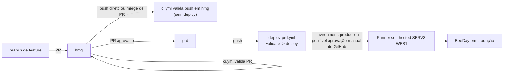

# Operations

**Fonte da verdade:** verificado diretamente em `scripts/Deploy-BeeDay.ps1`,
`src/BeeDay.Infrastructure/Persistence/SqlServer/Migrations/`,
`src/BeeDay.Infrastructure/Persistence/SqlServer/BeeDayDbContextFactory.cs`, `BeeDay.slnx`,
histórico de commits (`git log`).

**Última verificação:** 2026-08-07.

## 1. Objetivo

Documentar os procedimentos operacionais reais deste repositório: o que `Deploy-BeeDay.ps1`
realmente faz como backup/restore, como migrations são aplicadas, e como uma release é versionada e
publicada — sem inventar um procedimento que o código não implementa.

## 2. Backup

**Único mecanismo de backup do repositório**: `Deploy-BeeDay.ps1`, executado automaticamente antes
de cada deploy (não como uma rotina agendada separada — não foi encontrada nenhuma Scheduled
Task/cron/workflow de backup independente do deploy):

```text
C:\Apps\BeeDay-Backups\
├── Application\BeeDay-{yyyyMMdd-HHmmss}\   cópia completa de C:\Apps\BeeDay antes de substituir
└── Data\BeeDay-Data-{yyyyMMdd-HHmmss}\      cópia completa de C:\Apps\BeeDay-Data\Data antes do deploy
```

Ambos os backups são cópias de arquivo simples (`Copy-Item -Recurse`), não um mecanismo de backup de
banco de dados — **o backup de dados do script cobre apenas o diretório `Data` (Event Journal e
afins), nunca o banco SQL Server em si**. Não há `BACKUP DATABASE`/backup nativo do SQL Server
acionado por nenhum script deste repositório — se existe uma rotina de backup do banco (Manutenção
de Plano do SQL Server Agent, Azure Backup, etc.), ela vive fora deste repositório e não é
verificável a partir do código-fonte.

**Retenção**: nenhuma. Cada deploy cria um novo diretório com timestamp; nada no script remove
backups antigos — o diretório `C:\Apps\BeeDay-Backups\` cresce indefinidamente a cada deploy, sem
rotação/expurgo automatizado.

## 3. Restore

Dois caminhos distintos, ambos dentro do próprio `Deploy-BeeDay.ps1`:

### 3.1 Rollback automático (durante um deploy que falha)

Se qualquer etapa entre parar o IIS e o health check pós-deploy lançar uma exceção, o script:
1. Para o IIS novamente.
2. Restaura os arquivos de aplicação a partir do backup feito no início desta mesma execução
   (`$applicationBackupPath`).
3. Reinicia o IIS e roda o health check de novo.
4. Propaga o erro original mesmo se o rollback foi bem-sucedido (`throw` no `catch` externo) —
   quem invoca o script (o job `deploy` do workflow) sempre vê a execução como falha, mesmo que o
   site tenha voltado a ficar saudável.

**O que o rollback automático não faz**: reverter uma migration de banco aplicada, restaurar
`Data` a partir do backup (o backup de dados é feito mas nunca copiado de volta automaticamente —
só reportado como disponível: `"Persistent data was not replaced. Backup available at: ..."`).

### 3.2 Restore manual (não automatizado)

Não há script neste repositório para restaurar um backup de aplicação ou de dados fora do fluxo de
rollback automático de um deploy em andamento — restaurar um backup de uma execução anterior (ex.:
"voltar para o deploy de 3 dias atrás") exigiria copiar manualmente
`C:\Apps\BeeDay-Backups\Application\BeeDay-{timestamp}` de volta para `C:\Apps\BeeDay` e reiniciar o
IIS à mão; nenhum script automatiza esse cenário.

## 4. Recovery — o que falha se os caminhos de dados estiverem errados

Combinado com o achado de [`02-runtime-configuration.md`](02-runtime-configuration.md) §5
(`appsettings.Production.json` aponta para `C:\Apps\LevelUp-Data\...`, não
`C:\Apps\BeeDay-Data\...`): num cenário real de disaster recovery onde o servidor precisa ser
reconstruído do zero, seguir literalmente o `appsettings.Production.json` versionado faria a
aplicação tentar escrever Data Protection Keys/Event Journal num caminho que
`Deploy-BeeDay.ps1` nunca prepara — o deploy em si teria sucesso (o script não valida que os
caminhos internos da configuração da aplicação batem com os caminhos externos que ele mesmo
prepara), mas funcionalidades dependentes (persistência de cookie entre reciclagens do pool,
auditoria de domain events) falhariam silenciosamente até alguém notar.

## 5. Migrations

**Uma única migration existe**: `20260803111144_InitialCreate.cs` — consistente com a decisão de
banco greenfield (ADR-002: sem migração de dados legados, banco começa vazio). Aplicada:

- **Em produção/deploy**: não há um step explícito de `dotnet ef database update` em nenhum dos 2
  workflows nem em `Deploy-BeeDay.ps1` — não confirmado nesta auditoria como/quando a migration é
  aplicada ao banco de produção real (`SqlServerOptions.ConnectionString` de produção). Pode ser
  aplicada manualmente, por um mecanismo fora deste repositório, ou (menos provável, não confirmado)
  automaticamente pelo próprio `BeeDayDbContext`.
- **Em testes** (`EfLocalDbTestBase`, ver [`docs/testing/01-testing-strategy.md`](../testing/01-testing-strategy.md)
  §4): `Database.MigrateAsync()` explícito, contra um banco LocalDB descartável por teste.
- **Verificação de deriva** (executada nesta Sprint como parte do quality gate): `BeeDay.Web` **não**
  referencia `Microsoft.EntityFrameworkCore.Design` (confirmado — `dotnet ef` recusa usá-lo como
  `--startup-project`); o comando correto usa `BeeDay.Infrastructure` como projeto e startup-project
  ao mesmo tempo:

  ```powershell
  dotnet ef migrations has-pending-model-changes `
    --project src/BeeDay.Infrastructure/BeeDay.Infrastructure.csproj `
    --startup-project src/BeeDay.Infrastructure/BeeDay.Infrastructure.csproj
  ```

  Resultado desta Sprint: **"No changes have been made to the model since the last migration."** —
  `InitialCreate` reflete exatamente o modelo atual, sem deriva.
- **Em design-time** (`dotnet ef migrations add`/`dotnet ef database update` executados por um
  desenvolvedor): `BeeDayDbContextFactory` (`IDesignTimeDbContextFactory<BeeDayDbContext>`)
  constrói o `DbContext` sem subir o host completo do `BeeDay.Web` (evita as guardas de produção,
  rate limiter, etc.), usando a variável de ambiente `BEEDAY_DESIGNTIME_CONNECTION` ou, na
  ausência dela, o fallback hardcoded `Server=(localdb)\mssqllocaldb;Database=BeeDayDev;...`.

## 6. Versionamento e branches

`git log` confirma o padrão: commits marcados por EPIC/Sprint (ex. "EPIC 16 — ...", "Sprint 16.7"),
sem tags de versão semântica (`git tag` não inspecionado nesta auditoria como parte do escopo, mas
nenhum `CHANGELOG.md` com números de versão formais foi encontrado além de
`docs/CHANGELOG.md`, cujo conteúdo não foi lido nesta Sprint). Branches: `prd` (produção, protegida
— `deploy-prd.yml` só implanta a partir dela), `hmg` (integração/homologação, alvo de PR e do
`ci.yml`), branches de feature temporárias (convenção, não impor por nenhum workflow deste
repositório).

## 7. Processo de release



Não há evidência de um workflow de deploy para `hmg` — merges/pushes em `hmg` só passam pela
validação de `ci.yml` (build+test+publish+validação de artefato), nunca implantados automaticamente
em nenhum ambiente por este repositório. Se HMG é implantado, é por um processo fora deste
repositório — ver achado em [`01-deployment.md`](01-deployment.md) §6.

## 8. Manutenção

Nenhuma rotina de manutenção agendada (índice, estatísticas do SQL Server, limpeza do Event
Journal, expurgo de backups) foi encontrada em nenhum script ou workflow deste repositório —
tudo listado abaixo é uma tarefa manual, não automatizada:

- Expurgo de `C:\Apps\BeeDay-Backups\` (sem retenção — ver §2).
- Rotação/arquivamento de `BeeDayEvents.ndjson` (cresce indefinidamente — ver
  [`03-observability.md`](03-observability.md) §4).
- Rotação do log de stdout do IIS (`stdoutLogFile`, ver
  [`02-runtime-configuration.md`](02-runtime-configuration.md) §5) — o módulo `AspNetCoreModuleV2`
  tem sua própria política de rotação por tamanho, não configurada explicitamente em `web.config`
  deste repositório (usa o padrão do módulo).
- Renovação de certificado TLS/HTTPS do IIS — fora do escopo deste repositório (gerenciado no
  próprio IIS/Windows Server).

## 9. Fontes consultadas

- `scripts/Deploy-BeeDay.ps1` (backup, rollback, health check).
- `src/BeeDay.Infrastructure/Persistence/SqlServer/Migrations/20260803111144_InitialCreate.cs`,
  `BeeDayDbContextFactory.cs`.
- `dotnet ef migrations has-pending-model-changes --project src/BeeDay.Infrastructure/... --startup-project src/BeeDay.Infrastructure/...`,
  executado nesta sessão (confirma ausência de deriva de modelo).
- `.github/workflows/ci.yml`, `deploy-prd.yml`.
- `git log --oneline` (padrão de commit/branch).
- [`docs/adr/ADR-002-greenfield-database.md`](../adr/ADR-002-greenfield-database.md) (decisão de
  banco greenfield, referenciada não re-explicada).
- [`02-runtime-configuration.md`](02-runtime-configuration.md), [`03-observability.md`](03-observability.md),
  [`docs/infrastructure/README.md`](../infrastructure/README.md).
