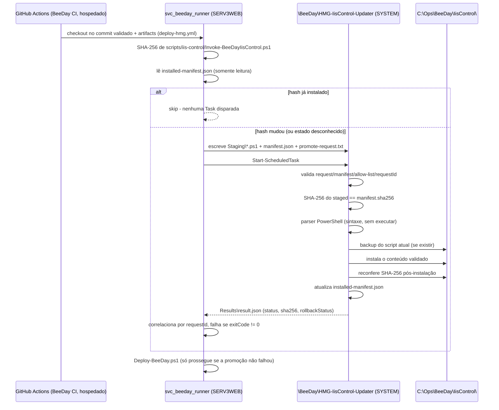

# Privileged IIS Control (HMG)

**Fonte da verdade:** verificado diretamente em `scripts/Deploy-BeeDay.ps1`,
`scripts/iis-control/Invoke-BeeDayIisControl.ps1`,
`scripts/iis-control/Provision-BeeDayHmgIisControl.ps1`,
`scripts/iis-control/Invoke-BeeDayIisControlUpdater.ps1`,
`scripts/iis-control/Provision-BeeDayHmgIisControlUpdater.ps1`,
`scripts/iis-control/Request-BeeDayIisControlPromotion.ps1`, `.github/workflows/deploy-hmg.yml`.

**Última verificação:** 2026-08-09 (Sprint 17.17).

## 1. Objetivo

Documentar por que o site IIS `BeeDay-HMG` / pool `BeeDay-Web-AppPool` não são controlados
diretamente pelo runner de deploy, como esse controle é delegado a duas Scheduled Tasks separadas
rodando como SYSTEM, e como a segunda delas (a partir da Sprint 17.17) automatiza a promoção de uma
nova versão do script de controle operacional sem conceder privilégio administrativo ao runner.

Este documento não existia antes da Sprint 17.17 — o mecanismo operacional (STOP/START/CONFIGURE/
RESTORE) já existia no código, mas não estava documentado em `docs/`. Este documento cobre as duas
boundaries juntas, como um único dono do assunto (ver `docs/CONVENTIONS.md` §12).

## 2. Por que existe

`LAB\svc_beeday_runner` (a conta que executa o job `deploy` de `deploy-hmg.yml` em SERV3WEB) é
deliberadamente de baixo privilégio e não pode ser adicionada a `Administrators`. SERV3WEB restringe
`applicationHost.config`/`redirection.config` a `TrustedInstaller`/`SYSTEM`/`Administrators` —
`Stop-Website`/`Start-WebAppPool`/`Add-WebConfigurationProperty` chamados diretamente por essa conta
falham com "insufficient permissions". A solução não é elevar o runner; é delegar as operações
privilegiadas a Scheduled Tasks rodando como SYSTEM, que o runner só pode **disparar e consultar**,
nunca modificar.

## 3. Boundary operacional — `\BeeDay\HMG-IisControl`

Controla STOP/START/CONFIGURE/RESTORE do site `BeeDay-HMG` / pool `BeeDay-Web-AppPool`. Provisionada
uma única vez, manualmente, por `Provision-BeeDayHmgIisControl.ps1` (administrador, nunca CI/CD).

```text
C:\Ops\BeeDay\IisControl\
    Invoke-BeeDayIisControl.ps1        admin-only, zero ACE para o runner
    env-config-snapshot.secret         admin-only, zero ACE para o runner
    Requests\
        request.txt                    runner: escrita apenas (W,RC,RA)
        env-config.secret              runner: escrita apenas (W,RC,RA)
    Results\
        result.json                    runner: leitura apenas (S,RC,RD,RA,REA)
```

Protocolo: `Deploy-BeeDay.ps1` (`Invoke-BeeDayPrivilegedIisControl`) escreve `request.txt` (2 linhas:
operação + GUID de correlação) e, para CONFIGURE, `env-config.secret` (payload JSON com as
variáveis de ambiente do App Pool — pode incluir a connection string), via `FileStream` bruto (a
conta não tem `Read Data`, só `Write Data`). Dispara `Start-ScheduledTask`, espera o estado voltar a
`Ready`, e correlaciona `result.json` pelo GUID antes de confiar no resultado — com retry limitado
(2 tentativas) para o caso do trigger ser engolido por `MultipleInstances=IgnoreNew`.

`Invoke-BeeDayIisControl.ps1` (SYSTEM) valida o request contra allow-list estrita
(`STOP`/`START`/`CONFIGURE`/`RESTORE`), invalida o request imediatamente após ler (`NONE`), e nunca
loga o conteúdo de `env-config.secret`. CONFIGURE grava `env-config-snapshot.secret` (admin-only,
zero acesso do runner) antes de mutar qualquer variável, para que RESTORE possa desfazer
exatamente a CONFIGURE de um `requestId` específico — nunca "o snapshot que estiver em disco".

**Este documento não repete a implementação linha a linha** — os cabeçalhos de
`Invoke-BeeDayIisControl.ps1` e `Provision-BeeDayHmgIisControl.ps1` são a referência normativa mais
detalhada; este documento é o mapa, não o território.

## 4. Boundary de updater — `\BeeDay\HMG-IisControl-Updater` (Sprint 17.17)

Automatiza a promoção de uma nova versão de `Invoke-BeeDayIisControl.ps1` do repositório para
`C:\Ops\BeeDay\IisControl\Invoke-BeeDayIisControl.ps1`, sem que o runner escreva diretamente nessa
boundary. **Task separada, script separado, ACL separada** do boundary operacional acima — um bug
na lógica de promoção nunca pode afetar a disponibilidade de STOP/START/CONFIGURE/RESTORE durante um
incidente real, e vice-versa. Por essa mesma razão, `Invoke-BeeDayIisControl.ps1` nunca se
auto-atualiza, e o próprio updater (`Invoke-BeeDayIisControlUpdater.ps1`) também não — só é instalado
pelo bootstrap administrativo (§7).

```text
C:\Ops\BeeDay\IisControlUpdater\
    Invoke-BeeDayIisControlUpdater.ps1     admin-only, zero ACE para o runner
    installed-manifest.json                runner: leitura apenas (S,RC,RD,RA,REA)
    Staging\
        Invoke-BeeDayIisControl.ps1        runner: escrita apenas (W,RC,RA)
        manifest.json                      runner: escrita apenas (W,RC,RA)
    Requests\
        promote-request.txt                runner: escrita apenas (W,RC,RA)
    Results\
        result.json                        runner: leitura apenas (S,RC,RD,RA,REA)
    Backups\
        Invoke-BeeDayIisControl-{ts}.ps1.bak   zero ACE para o runner
```

### 4.1 Fluxo GitHub → runner → updater → SYSTEM



### 4.2 Validações do updater, em ordem

1. `promote-request.txt`: exatamente 2 linhas, operação em allow-list (só `PROMOTE`), GUID válido.
2. `Staging\manifest.json`: JSON válido, `requestId` bate com o de `promote-request.txt`.
3. `manifest.fileName` == literal fixo `"Invoke-BeeDayIisControl.ps1"` por igualdade estrita — nunca
   usado para montar caminho de arquivo (o caminho lido é sempre a constante fixa
   `Staging\Invoke-BeeDayIisControl.ps1`). Isso elimina path traversal por construção.
4. SHA-256 do arquivo em `Staging\` == `manifest.sha256`.
5. `[System.Management.Automation.Language.Parser]::ParseFile()` sobre o conteúdo staged — rejeita
   qualquer erro de sintaxe. O conteúdo staged nunca é executado, `dot-source`d ou passado a
   `Invoke-Expression` em nenhum momento deste pipeline.
6. Curto-circuito de idempotência: se `manifest.sha256` já é o instalado (`installed-manifest.json`)
   → `status=UNCHANGED`, nada é tocado.
7. Backup do script atualmente instalado (se existir) → instala → reconfere SHA-256 do arquivo
   instalado contra `manifest.sha256` imediatamente após a escrita.

**Limite reconhecido:** a validação de sintaxe pega corrupção/truncamento, não bugs semânticos — um
script sintaticamente válido mas logicamente quebrado só falharia no primeiro STOP/START/CONFIGURE
real subsequente.

### 4.3 Rollback

Autocontido dentro de `Invoke-BeeDayIisControlUpdater.ps1`: se qualquer etapa falhar **depois** do
backup ter sido feito, o script restaura o backup e reconfere o SHA-256 restaurado contra o hash do
próprio backup, registrando o resultado em `result.json.rollbackStatus`:

| `rollbackStatus` | Significado |
|---|---|
| `NOT_APPLICABLE` | Falhou antes do backup — nada foi tocado, nada a reverter (a maioria das falhas, já que 6 das 7 etapas são validação pura). |
| `ROLLED_BACK` | Backup restaurado e reverificado por hash — boundary de volta ao estado anterior conhecido. |
| `RESTORE_VERIFICATION_FAILED` | Restore rodou, mas o hash pós-restore não bateu com o hash do próprio backup. |
| `RESTORE_FAILED` | A escrita do restore em si lançou exceção. |

Os últimos dois são o único cenário realmente ruim deste pipeline — a boundary pode ficar sem um
script válido conhecido. Ver §9 (riscos residuais).

Rollback para uma versão **antiga** (não a última que falhou): sem script dedicado, por design — o
caminho oficial é rodar `deploy-hmg.yml` (`workflow_dispatch`) a partir de um commit antigo,
promovendo essa versão de volta pelo mesmo canal validado. Mesma lacuna já documentada para restore
de aplicação em [`04-operations.md`](04-operations.md) §3.2.

### 4.4 `installed-manifest.json` e `Staging\manifest.json`

Nenhum dos dois contém segredo — o conteúdo promovido é código de operação versionado, não uma
credencial. O propósito é integridade (SHA-256) e auditoria (`commitSha`), nunca confidencialidade.

```json
{ "requestId": "<guid>", "fileName": "Invoke-BeeDayIisControl.ps1", "sha256": "<hex>", "commitSha": "<sha|null>" }
```

`commitSha` é **auditoria apenas**, nunca um substituto da verificação criptográfica por SHA-256 —
quem pode mergear em `hmg` já poderia editar este arquivo hoje; a autorização real de "quem pode
mudar o que roda como SYSTEM" é branch protection/code review em `hmg`, não este pipeline.

## 5. Integração com `deploy-hmg.yml`

Novo step "Promote privileged IIS control script if changed", entre "Verify .NET SDK 10 is
available" e "Deploy to IIS with rollback", sem `continue-on-error`. Chama
`Request-BeeDayIisControlPromotion.ps1` (nenhum secret necessário). Se a promoção falhar, o step
falha e o job para — `Deploy-BeeDay.ps1` nunca roda contra uma boundary privilegiada possivelmente
desatualizada ou inconsistente.

## 6. ACLs — resumo comparativo

| Boundary | Pastas (runner) | Arquivos de escrita (runner) | Arquivos de leitura (runner) | Admin-only (zero ACE) |
|---|---|---|---|---|
| Operacional (`IisControl`) | `(RC,RA,X,S)` traverse-only | `request.txt`, `env-config.secret` `(W,RC,RA)` | `result.json` `(S,RC,RD,RA,REA)` | `Invoke-BeeDayIisControl.ps1`, `env-config-snapshot.secret` |
| Updater (`IisControlUpdater`) | `(RC,RA,X,S)` traverse-only | `Staging\*.ps1`, `Staging\manifest.json`, `promote-request.txt` `(W,RC,RA)` | `result.json`, `installed-manifest.json` `(S,RC,RD,RA,REA)` | `Invoke-BeeDayIisControlUpdater.ps1`, `Backups\*` |

Em nenhuma das duas boundaries o runner recebe `FILE_LIST_DIRECTORY`, `Create`/`Delete`/`Rename`,
`WRITE_DAC` ou `WRITE_OWNER`. Todo arquivo gravável pelo runner é pré-criado pelo script de
provisionamento — o runner nunca cria ou apaga um arquivo.

## 7. Bootstrap (SERV3WEB, manual, uma única vez)

Ordem obrigatória — a segunda etapa depende do resultado real da primeira:

1. `Provision-BeeDayHmgIisControl.ps1` (se ainda não tiver sido rodado) — cria a boundary
   operacional e instala `Invoke-BeeDayIisControl.ps1`.
2. `Provision-BeeDayHmgIisControlUpdater.ps1` — cria a boundary de updater. Lê o SHA-256 do
   `Invoke-BeeDayIisControl.ps1` **já instalado** em `C:\Ops\BeeDay\IisControl\` (nunca um valor
   vazio ou assumido) e semeia `installed-manifest.json` com o estado real, mais o commit SHA do
   checkout local usado para rodar o script (best-effort, via `git rev-parse HEAD` — `null` se git
   não estiver disponível).

Depois deste bootstrap, a máquina de desenvolvimento não participa mais do processo — toda
atualização futura de `Invoke-BeeDayIisControl.ps1` flui por `deploy-hmg.yml` → runner → staging →
`HMG-IisControl-Updater` → SYSTEM.

**Teste da promoção**: nunca provocado por um `installed-manifest.json` deliberadamente
inconsistente. O teste real é uma alteração de fato em `Invoke-BeeDayIisControl.ps1` (ex.: um
comentário), seguida de um deploy real — o hash diferente aciona a promoção organicamente.

## 8. Recuperação manual

Se a boundary operacional ficar sem um script válido (o cenário `RESTORE_FAILED`/
`RESTORE_VERIFICATION_FAILED` de §4.3, ou qualquer corrupção fora do pipeline de promoção): reexecutar
`Provision-BeeDayHmgIisControl.ps1` manualmente em SERV3WEB reinstala um `Invoke-BeeDayIisControl.ps1`
válido a partir de um checkout local — o mesmo procedimento que já existia antes desta Sprint,
inalterado. Depois disso, `Provision-BeeDayHmgIisControlUpdater.ps1` pode ser reexecutado para
resincronizar `installed-manifest.json` com o estado real (nota: hoje o script não sobrescreve um
`installed-manifest.json` já existente — reconciliar manualmente ou remover o arquivo antes de
reexecutar, se o conteúdo realmente precisar ser ressincronizado à força).

Se a boundary de updater ficar inoperante (Task deletada, script corrompido) sem afetar a boundary
operacional: reexecutar `Provision-BeeDayHmgIisControlUpdater.ps1` — idempotente, recria tudo sem
tocar na boundary operacional.

## 9. Riscos residuais

- `Backups\` (ambas as boundaries) sem rotação/retenção — mesmo achado já registrado para
  `C:\Apps\BeeDay-Backups` em [`04-operations.md`](04-operations.md) §2.
- Validação de sintaxe não pega bugs semânticos (§4.2).
- `RESTORE_FAILED`/`RESTORE_VERIFICATION_FAILED` (§4.3) é o único cenário deste pipeline em que a
  boundary operacional pode ficar sem um script válido — mitigado por ser precedido por 6 de 7
  etapas de validação pura antes de qualquer mutação, mas não eliminado; recuperação é manual (§8).
- `deploy-hmg.yml` já usa `concurrency: cancel-in-progress: false` (serializa deploys), o que evita
  na prática uma corrida entre dois `Request-BeeDayIisControlPromotion.ps1` concorrentes — não
  reforçado independentemente por este mecanismo.
- Esta Sprint não alterou `docs/deployment/01-deployment.md`/`04-operations.md`, que continuam
  descrevendo um estado anterior a `deploy-hmg.yml` existir (achado pré-existente, não introduzido
  por esta Sprint — ver `docs/deployment/README.md` "Achados relevantes").

## 10. Fontes consultadas

- `scripts/Deploy-BeeDay.ps1` (`Invoke-BeeDayPrivilegedIisControl` e funções relacionadas).
- `scripts/iis-control/Invoke-BeeDayIisControl.ps1`,
  `scripts/iis-control/Provision-BeeDayHmgIisControl.ps1` (boundary operacional, pré-existente).
- `scripts/iis-control/Invoke-BeeDayIisControlUpdater.ps1`,
  `scripts/iis-control/Provision-BeeDayHmgIisControlUpdater.ps1`,
  `scripts/iis-control/Request-BeeDayIisControlPromotion.ps1` (boundary de updater, Sprint 17.17).
- `.github/workflows/deploy-hmg.yml`.
