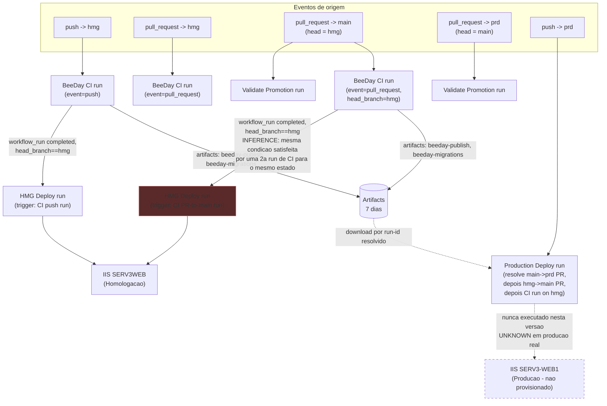
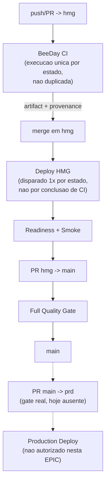

# CI/CD Pipeline Discovery Baseline (EPIC 19 — Sprint 19.1)

**Fonte da verdade:** verificado diretamente em `.github/workflows/ci.yml`,
`.github/workflows/deploy-hmg.yml`, `.github/workflows/deploy-prd.yml`,
`.github/workflows/validate-promotion.yml`, histórico de execuções via `gh run`/`gh api`
(GitHub Actions REST API, consultado em 2026-08-10), Rulesets via `gh api
repos/.../rules/branches/*`, Environments via `gh api repos/.../environments`, e `git log`.
Nenhuma afirmação de comportamento atual vem de `docs/deployment/01-deployment.md` sem
reverificação — esse documento está desatualizado em pontos relevantes, reportado na seção 19.

**Última verificação:** 2026-08-10.

**Escopo:** este documento é o baseline empírico exigido pela Sprint 19.1 da EPIC 19. É
**apenas descritivo (AS-IS)** — nenhuma mudança estrutural de CI/CD foi feita para produzi-lo.
Recomendações estão isoladas na seção 22 e não são autorização de implementação.

**Classificação de evidência usada neste documento:** `FACT` (comprovado diretamente),
`MEASUREMENT` (medido de execução real), `INFERENCE` (derivado de múltiplas evidências),
`RECOMMENDATION` (candidato para Sprint futura, não implementado), `UNKNOWN` (evidência
insuficiente).

---

## 1. Estado do repositório no início da Sprint 19.1

`FACT`

| Item | Valor |
|---|---|
| Branch inicial | `hmg` |
| HEAD inicial | `ab6a6d0782822b0550df7641c03513dc2ae13e0d` |
| `git status` inicial | working tree limpo; branch local 2 commits à frente de `origin/hmg` reportado antes do fetch |
| Após `git fetch --prune` | `origin/hmg` havia avançado para `d5b9390` (PR #48, merge de `fix/reconcile-main-into-hmg-v2`) — local estava na verdade **atrás** por 1 commit, não à frente |
| Ação tomada | `git pull --ff-only origin hmg` (fast-forward puro, sem merge/rebase) seguido de `git checkout -b sprint/19.1-pipeline-discovery` a partir de `d5b9390` |
| Branch da Sprint | `sprint/19.1-pipeline-discovery` |
| Alterações pré-existentes preservadas | nenhuma alteração local pré-existente foi descartada — working tree já estava limpo |

---

## 2. Inventário estático dos workflows

`FACT` — 4 workflows versionados em `.github/workflows/`, mais 1 workflow gerenciado pela
plataforma GitHub (não versionado neste repositório, ver nota ao final desta seção).

### 2.1 `ci.yml` — "BeeDay CI"

| Campo | Valor |
|---|---|
| Eventos | `push` (branches: `hmg`), `pull_request` (branches: `hmg`, `main`, `prd`), `workflow_dispatch` |
| Concurrency | `beeday-ci-${{ github.workflow }}-${{ github.ref }}`, `cancel-in-progress: true` |
| Permissions | `contents: read` |
| Runner | `windows-latest` (hospedado GitHub) |
| Timeout | 20 min |
| Jobs | 1 (`ci`, nomeado "BeeDay CI") — sem dependências internas, sequencial |
| Ambiente GitHub | nenhum (`environment:` não declarado) |
| Scripts invocados | nenhum script externo — comandos `dotnet`/`pwsh` inline |
| Artifacts produzidos | `beeday-test-results` (14d), `beeday-e2e-artifacts` (14d, só com conteúdo em falha E2E), `beeday-publish` (7d), `beeday-migrations` (7d) |
| Artifacts consumidos | nenhum |
| Secrets referenciados | nenhum |
| Downstream | `deploy-hmg.yml` (via `workflow_run`), indiretamente `deploy-prd.yml` (via resolução de PR chain, não via `workflow_run` direto) |
| Check público | `"BeeDay CI"` (nome do job, é o que aparece como required status check) |

### 2.2 `deploy-hmg.yml` — "BeeDay Homologation Deploy"

| Campo | Valor |
|---|---|
| Eventos | `workflow_run` (workflow: `BeeDay CI`, tipo `completed`), `workflow_dispatch` |
| Concurrency | `beeday-homologation`, `cancel-in-progress: false` (deploys nunca cancelados, apenas enfileirados) |
| Permissions | `contents: read`, `actions: read` |
| Runner | self-hosted `[Windows, X64, hmg]` (SERV3WEB) |
| Timeout | 25 min |
| Ambiente GitHub | `homologation` |
| Jobs | 1 (`deploy`, nomeado "Deploy to SERV3WEB") |
| Condição de execução | `github.event_name == 'workflow_dispatch' || (workflow_run.conclusion == 'success' && workflow_run.head_branch == 'hmg')` |
| Scripts invocados | `scripts/iis-control/Request-BeeDayIisControlPromotion.ps1`, `scripts/Deploy-BeeDay.ps1` |
| Artifacts consumidos | `beeday-publish`, `beeday-migrations`, ambos por `run-id` pinado à execução de `ci.yml` resolvida (nunca "latest" implícito) |
| Secrets referenciados | `BEEDAY_PUBLIC_BASE_URL`, `BEEDAY_RESEND_API_KEY`, `BEEDAY_RESEND_FROM_ADDRESS`, `BEEDAY_RESEND_FROM_NAME`, `BEEDAY_ALLOWED_HOSTS`, `BEEDAY_APP_CONNECTION`, `BEEDAY_MIGRATOR_CONNECTION` |
| Upstream | disparado por toda conclusão de `BeeDay CI`, filtrado pela condição acima |
| Check público | não é required status check em nenhum Ruleset (branch `hmg`/`main` não o exigem — ver seção 14) |

### 2.3 `deploy-prd.yml` — "BeeDay Production Deploy"

| Campo | Valor |
|---|---|
| Eventos | `push` (branches: `prd`), `workflow_dispatch` |
| Concurrency | `beeday-production`, `cancel-in-progress: false` |
| Permissions | `contents: read`, `actions: read`, `pull-requests: read` |
| Runner | self-hosted `[Windows, X64]` (sem label `hmg`/`prd` distinta — mesma pool genérica) |
| Timeout | 25 min |
| Ambiente GitHub | `production` — **não existe como GitHub Environment configurado** (ver seção 15) |
| Jobs | 1 (`deploy`, nomeado "Deploy to SERV3-WEB1") — **não existe job `validate`** nesta versão atual |
| Scripts invocados | `scripts/Deploy-BeeDay.ps1` (sem `-RunMigrations`, sem parâmetros de connection string) |
| Artifacts consumidos | apenas `beeday-publish`, resolvido pela cadeia de provenance (seção 16) — **não baixa `beeday-migrations`** |
| Secrets referenciados | `BEEDAY_PUBLIC_BASE_URL`, `BEEDAY_RESEND_API_KEY`, `BEEDAY_RESEND_FROM_ADDRESS`, `BEEDAY_RESEND_FROM_NAME`, `BEEDAY_ALLOWED_HOSTS` (5 — sem as 2 de connection string) |
| Upstream | nenhum `workflow_run` — depende de `push` real na branch `prd`, que só deveria ocorrer via PR `main → prd` |
| Check público | required apenas por `Validate Promotion`, não por si mesmo (`prd` não tem Ruleset — seção 14) |

Esta versão do workflow (cadeia de provenance PR-a-PR, Build Once/Deploy Many) foi introduzida em
`9439bd8` (2026-08-09T22:41:38-03:00, Sprint 18.4). Ver seção 13 para o histórico de execuções
de uma versão anterior e materialmente diferente deste mesmo arquivo.

### 2.4 `validate-promotion.yml` — "Validate Promotion"

| Campo | Valor |
|---|---|
| Eventos | `pull_request` (branches: `main`, `prd`) |
| Concurrency | `beeday-validate-promotion-${{ github.event.pull_request.number }}`, `cancel-in-progress: true` |
| Permissions | `contents: read` |
| Runner | `ubuntu-latest` |
| Timeout | 5 min |
| Jobs | 1 (`validate-promotion`) |
| Scripts invocados | nenhum — bash inline |
| Propósito | portão de política pura: valida que a origem de uma PR para `main` é `hmg` e para `prd` é `main`, e que a PR vem deste mesmo repositório (não fork) |
| Check público | `"Validate Promotion"`, required apenas no Ruleset de `main` (seção 14) |

### 2.5 Workflow não versionado neste repositório

`FACT` — `gh workflow list --all` retorna um 5º workflow, **"Copilot" (`copilot-pull-request-reviewer`,
id 320577945)**, sem arquivo correspondente em `.github/workflows/`. É a integração GitHub Copilot
Code Review, gerenciada pela plataforma (GitHub App), não pelo conteúdo deste repositório. Fora do
escopo de alterações estruturais da EPIC 19, mas registrado aqui porque o prompt da Sprint pede para
não assumir que só os triggers/workflows citados existem.

---

## 3. Inventário de triggers

`FACT`

| Trigger | Workflows que o usam |
|---|---|
| `push` | `ci.yml` (branch `hmg`), `deploy-prd.yml` (branch `prd`) |
| `pull_request` | `ci.yml` (`hmg`/`main`/`prd`), `validate-promotion.yml` (`main`/`prd`) |
| `workflow_dispatch` | `ci.yml`, `deploy-hmg.yml`, `deploy-prd.yml` |
| `workflow_run` | `deploy-hmg.yml` (escuta `BeeDay CI`) |
| `schedule` | nenhum workflow usa |
| `repository_dispatch` | nenhum workflow usa |

Não existe nenhum workflow disparado por `push` em `main` — consistente com `main` só receber
merges de PR (squash/merge/rebase, todos gerados via `pull_request`, não `push` direto — embora
nada no repositório *proíba* um `push` direto em `main`, apenas a ausência de qualquer regra
`push:` para essa branch em qualquer workflow).

---

## 4. Job / Dependency Map

`FACT` — todos os 4 workflows têm exatamente **1 job cada**. Não há `needs:` entre jobs dentro
de nenhum workflow individual (a versão atual de `deploy-prd.yml` não tem mais o job `validate`
separado que a documentação antiga descrevia — ver seção 19). A única dependência entre jobs
acontece **entre workflows**, via `workflow_run` (`ci.yml` → `deploy-hmg.yml`) e via resolução de
artifact por `run-id` (mesmo padrão, mas sem `workflow_run` explícito, no caso de `deploy-prd.yml`,
que resolve a run de origem via GitHub REST API dentro do próprio job).

---

## 5. AS-IS Execution Graph

`FACT` + `INFERENCE` (a inferência está isolada e marcada abaixo)



Nó em destaque (`Deploy2`): é exatamente o mecanismo comprovado na seção 13 como causa dos
deployments duplicados #77/#78 e #57/#58.

---

## 6. Historical Run Reconstruction

### 6.1 Runs solicitadas explicitamente pelo prompt da Sprint

`FACT` / `MEASUREMENT`

| Run | ID | Evento | Branch/ref | SHA | Criada | Concluída | Duração (job) | Conclusão |
|---|---|---|---|---|---|---|---|---|
| BeeDay CI #164 | 31377545172 | `pull_request` | `fix/reconcile-main-into-hmg-v2` → `hmg` | `ab6a6d0` | 10:04:54 | 10:12:40 | ~7m46s | success |
| BeeDay CI #165 | 31378253170 | `push` | `hmg` | `d5b9390` | 10:14:17 | 10:20:46 | ~6m26s (job) | success |
| BeeDay CI #166 | 31378295921 | `pull_request` | `hmg` → (promoção) | `d5b9390` | 10:14:54 | 10:20:46 | — | success |
| HMG Deploy #77 | 31378726891 | `workflow_run` | disparado por CI run 31378253170 (#165, push) | `d5b9390` (real) | 10:20:48 | 10:24:28 | job: 10:22:43→10:24:27 (~1m44s), fila: ~1m55s | success |
| HMG Deploy #78 | 31378726907 | `workflow_run` | disparado por CI run 31378295921 (#166, PR) | `d5b9390` (real) | 10:20:48 | 10:22:40 | job: 10:20:51→10:22:40 (~1m49s), fila: ~3s | success |

Nota sobre `headSha`/`headBranch` de #77/#78: a API do GitHub reporta, para runs disparadas por
`workflow_run`, o `head_sha`/`head_branch` do estado da branch padrão (`main`) no momento da
criação da run — **não** o SHA/branch real que efetivamente disparou o evento. O SHA real
implantado (`d5b9390`) só foi confirmado inspecionando o log do passo "Resolve BeeDay CI run to
deploy", que imprime `Using triggering workflow_run id <id>` e `Resolved version
tiagoarrigoni-BeeDay-d5b9390`. Isso é registrado aqui como `FACT` sobre uma peculiaridade da API,
não como suposição.

### 6.2 Por que cada execução aconteceu (cadeia causal)

`FACT`, reconstruída a partir dos logs de step, não apenas do evento superficial:

```text
push do merge da PR #48 em hmg (d5b9390)
   |
   +--> BeeDay CI run #165 (event=push, head_branch=hmg) -----> concluida 10:20:46 (sucesso)
   |        |
   |        +--> workflow_run "completed" (id 31378253170) --> HMG Deploy #77 (deploy real)
   |
   +--> PR de promocao hmg->main aberta/atualizada no mesmo commit d5b9390
            |
            +--> BeeDay CI run #166 (event=pull_request, head_branch=hmg) --> concluida 10:20:46 (sucesso)
                     |
                     +--> workflow_run "completed" (id 31378295921) --> HMG Deploy #78 (deploy real, MESMO commit)
```

Nenhum elo desta cadeia é `UNKNOWN` — todos foram confirmados via `gh run view --log`.

### 6.3 Segunda ocorrência confirmada do mesmo padrão (evidência de recorrência)

`FACT` — o mesmo mecanismo foi reproduzido em 2026-08-09, commit `9b860f7` (Sprint 18.1):

| Run | ID | Evento | Log confirma |
|---|---|---|---|
| HMG Deploy #57 | 31327946499 | `workflow_run` | `Using triggering workflow_run id 31327649612` (= CI run, `push`, `hmg`, `9b860f7`) |
| HMG Deploy #58 | 31328474243 | `workflow_run` | `Using triggering workflow_run id 31328241087` (= CI run, `pull_request`, `hmg`, `9b860f7`) |

Ambas concluídas com sucesso, mesmo commit `9b860f7`, 12 minutos de diferença. Isso eleva a
classificação de "incidente isolado" para **padrão estrutural recorrente** (`INFERENCE`, apoiada
por 2 instâncias documentadas com evidência de log direta, dentro de uma janela de observação de
apenas ~2 dias de histórico do workflow `deploy-hmg.yml`).

---

## 7. Timing Baseline

`MEASUREMENT`, extraído dos steps da run #165 (BeeDay CI, representativa — job único, sequencial,
sem paralelismo interno):

| Step | Duração |
|---|---|
| Set up job | ~1s |
| Checkout repository | ~6s |
| Configure .NET 10 | ~3s |
| Show .NET information | ~7s |
| Restore dependencies | ~43s |
| Verify formatting | ~42s |
| Build solution | ~30s |
| Install Playwright Chromium | ~19s |
| **Run tests** | **~2m59s (maior etapa isolada — ~46% do wall-clock total)** |
| Publish BeeDay | ~11s |
| Validate published files | <1s |
| Restore EF Core tool | ~3s |
| Generate EF Core migration bundle | ~26s |
| Validate migration bundle | <1s |
| Upload test results | ~2s |
| Upload E2E failure artifacts | <1s |
| Upload validated publish artifact | ~4s |
| Upload migration bundle artifact | ~3s |
| Post-steps (cleanup) | ~5s |
| **Total (job)** | **~6m26s** |

Deploy `#78` (execução mais rápida, sem espera de fila): "Checkout deployment scripts" ~37s
(segunda maior etapa isolada), "Deploy to IIS with rollback" ~36s, demais steps de resolução/
download somam ~30s. Total job: ~1m49s.

Diferenciação **wall-clock vs runner time** (Fase 4, obrigatória): como cada workflow tem
apenas 1 job, wall-clock percebido pelo desenvolvedor e tempo de runner consumido **coincidem**
neste pipeline — não há soma indevida de jobs paralelos a fazer aqui, porque não existe
paralelismo de job algum em nenhum dos 4 workflows atualmente.

---

## 8. Queue Time Analysis

`FACT`, comprovado pelo par #77/#78: a run #78 iniciou o job imediatamente (fila ~3s) porque
obteve o slot do grupo de concorrência `beeday-homologation` (`cancel-in-progress: false`)
primeiro. A run #77, criada no mesmo segundo, ficou em fila por **~1m55s** — não por
indisponibilidade de runner, mas porque o grupo de concorrência serializa (nunca cancela)
execuções do mesmo grupo. Isso é uma consequência direta e mensurável do mecanismo de duplicação
documentado na seção 6, não um problema de infraestrutura de runner.

Para os demais workflows, não há evidência de fila relevante nas amostras coletadas (jobs
iniciam poucos segundos após a criação da run quando não há colisão de concorrência).

---

## 9. Critical Path

`FACT`

- **`ci.yml`**: caminho crítico = o job inteiro (job único, sem paralelismo). Dentro dele, "Run
  tests" domina (~46% do tempo). "Restore dependencies" e "Verify formatting" juntos somam outros
  ~24%. Nenhum step hoje executa em paralelo com outro — todos são sequenciais por construção
  (`steps:` de um único job).
- **`deploy-hmg.yml`**: caminho crítico = o job inteiro. "Checkout deployment scripts" e "Deploy
  to IIS with rollback" dominam.
- Não existe hoje nenhum job dividido em paralelo em nenhum workflow — logo "quais jobs já
  executam em paralelo" = nenhum; "quais poderiam teoricamente" é uma pergunta de Sprint 19.5
  (Performance), não respondida aqui por estar fora do escopo de Discovery.

---

## 10. Duplicate Work Matrix

`FACT` para os itens 1–2, `RECOMMENDATION` implícita isolada nas demais Sprints.

| Trabalho | Run A | Run B | Mesmo SHA? | Mesma saída? | Classificação | Evidência |
|---|---|---|---|---|---|---|
| Build + test completo (`dotnet build`/`dotnet test` da suíte inteira) | CI #165 (push) | CI #166 (pull_request) | Sim (`d5b9390`) | Sim (mesmos artifacts, `beeday-publish`/`beeday-migrations` gerados de forma independente e redundante duas vezes) | `CONFIRMED DUPLICATION` | seção 6.1/6.2 |
| Mesmo par, ocorrência anterior | CI run 31327649612 | CI run 31328241087 | Sim (`9b860f7`) | Sim | `CONFIRMED DUPLICATION` | seção 6.3 |
| Deploy completo em HMG (stop/backup/copy/start/health-check) | HMG Deploy #77 | HMG Deploy #78 | Sim | Sim (mesmo estado publicado em IIS duas vezes seguidas) | `CONFIRMED DUPLICATION` | seção 6.1 |
| Mesmo par, ocorrência anterior | HMG Deploy #57 | HMG Deploy #58 | Sim | Sim | `CONFIRMED DUPLICATION` | seção 6.3 |
| `dotnet restore` repetido entre `ci.yml` e uma eventual `validate` de `deploy-prd.yml` | — | — | N/A | N/A | `NÃO SE APLICA` — `deploy-prd.yml` atual não tem job `validate`/`restore` próprio (seção 2.3) | leitura direta do arquivo |
| Checkout repetido | cada workflow faz seu próprio `actions/checkout` | — | — | — | `INTENTIONAL REPETITION` — necessário, cada run é isolada por design do GitHub Actions | leitura direta dos 4 arquivos |
| SDK setup repetido | `ci.yml` usa `setup-dotnet`; `deploy-hmg.yml`/`deploy-prd.yml` não usam (runner self-hosted já tem SDK) | — | — | — | `INTENTIONAL REPETITION` (não é repetição real — só `ci.yml` instala SDK) | leitura direta + comentário no próprio `deploy-hmg.yml` linhas 109-117 |

O achado central desta Fase é que **o único trabalho genuinamente duplicado e caro comprovado é
a run completa de `BeeDay CI`** (build + suíte de 752 testes + publish + geração de bundle de
migração), executada 2 vezes para o mesmo commit sempre que uma promoção `hmg → main` é aberta
logo após (ou junto com) um push em `hmg`. Isso, por sua vez, causa a duplicação de deployment
(consequência, não causa independente).

---

## 11. Deployment Analysis (HMG)

`FACT`

| Campo | #77 | #78 |
|---|---|---|
| SOURCE SHA | `d5b9390` | `d5b9390` |
| Workflow responsável | `deploy-hmg.yml` | `deploy-hmg.yml` |
| Artifact | `beeday-publish` + `beeday-migrations` de CI run 31378253170 | mesmos artifacts, de CI run 31378295921 (build separado, conteúdo funcionalmente idêntico) |
| Início/fim | 10:20:48 → 10:24:28 | 10:20:48 → 10:22:40 |
| Ambiente | `homologation` (SERV3WEB) | `homologation` (SERV3WEB) |
| Readiness/health check | dentro de `Deploy-BeeDay.ps1` (`/health/ready`, até 6 tentativas) — passou em ambas | idem |
| Resultado | success | success |
| Deployment subsequente do mesmo estado | sim (#78 é o próprio subsequente) | — |

Não há evidência de "smoke test" separado do health-check embutido em `Deploy-BeeDay.ps1` — não
existe um step de smoke distinto no workflow.

---

## 12. Duplicate Deployment Root Cause

`FACT` (não `UNKNOWN`, não `INFERENCE` — causa mecanicamente comprovada e reproduzida 2 vezes):

`deploy-hmg.yml` dispara em **toda** conclusão bem-sucedida de `BeeDay CI` cujo `head_branch`
reportado no payload do evento seja `hmg`. `ci.yml` roda em `push` para `hmg` **e também** em
`pull_request` para `hmg`/`main`/`prd`. Quando uma PR de promoção `hmg → main` é aberta ou
atualizada logo depois de um push em `hmg` (fluxo normal descrito no `CLAUDE.md`, seção 5.7 —
"Sprint → hmg, depois hmg → main"), a PR gera uma **segunda** execução de `BeeDay CI` cujo
`head_branch` também é `hmg` (porque `hmg` é a branch de origem da PR). As duas execuções passam
de forma independente pela condição de `deploy-hmg.yml`, resultando em dois deployments completos
e reais do mesmo estado, serializados apenas pelo grupo de concorrência (não deduplicados).

Mecanismo, não incidente: `push` trigger + `pull_request` trigger, ambos satisfazendo a mesma
condição de branch. Não é retry manual, não é `workflow_dispatch`, não é comportamento de
concorrência (a concorrência apenas enfileira, não é a causa), não é branch behavior anômalo — é
uma sobreposição estrutural entre os dois eventos que fazem `ci.yml` rodar para o mesmo estado.

---

## 13. Checks / Rulesets Matrix

`FACT`, via `gh api repos/tiagoarrigoni/BeeDay/rules/branches/<branch>`

| Branch/Fronteira | Required Check | Producer Workflow | Producer Job | Trigger | Ainda existe? | Pode ser pulado? | Risco de bloqueio |
|---|---|---|---|---|---|---|---|
| `hmg` (Ruleset id 20580759) | `BeeDay CI` | `ci.yml` | `ci` | `pull_request` para `hmg` | Sim | Não (é o único required check) | Baixo — nome do job bate exatamente com o nome exigido |
| `main` (Ruleset id 20608232) | `BeeDay CI` | `ci.yml` | `ci` | `pull_request` para `main` | Sim | Não | Baixo |
| `main` (Ruleset id 20608232) | `Validate Promotion` | `validate-promotion.yml` | `validate-promotion` | `pull_request` para `main` | Sim | Não | Baixo |
| `prd` | **nenhum** | — | — | — | — | — | **Alto — ver achado abaixo** |

Achado (`FACT`): `gh api repos/tiagoarrigoni/BeeDay/rules/branches/prd` retorna `[]` — **a branch
`prd` não tem nenhum Ruleset/proteção configurada**, nem mesmo `Validate Promotion` como required
check. O próprio `CLAUDE.md` (seção 5.7.1) já antecipa isso: *"Validate Promotion's check should
be added to Protect Main (and to an equivalent ruleset for prd, once one exists)"* — confirmando
que esta é uma lacuna conhecida e não ainda corrigida, não uma descoberta nova desta Sprint.
Também confirma que `required_approving_review_count: 0` em ambos os Rulesets existentes (`hmg` e
`main`) — não há exigência de aprovação humana de PR nem em `hmg` nem em `main` hoje, apenas os
checks automatizados listados acima.

Não há permissão negada para nenhuma consulta de Ruleset — todas as 3 branches foram consultadas
com sucesso (a lista vazia de `prd` é a resposta real da API, não uma falha de permissão).

---

## 14. Artifact Baseline

`FACT`

| Artifact | Produtor | Estágio | Consumidor | Retenção | Reconstruído depois? |
|---|---|---|---|---|---|
| `beeday-test-results` | `ci.yml` | pós-testes | nenhum (apenas inspeção humana) | 14 dias | — |
| `beeday-e2e-artifacts` | `ci.yml` | pós-testes (`if: always()`) | nenhum, só populado em falha E2E | 14 dias | — |
| `beeday-publish` | `ci.yml` | pós-`dotnet publish` | `deploy-hmg.yml` (por `run-id`), `deploy-prd.yml` (por `run-id`, via cadeia de provenance) | 7 dias | **Não** — mesmo binário reutilizado em HMG e (quando executar) PRD |
| `beeday-migrations` | `ci.yml` | pós `dotnet ef migrations bundle` | apenas `deploy-hmg.yml` — **`deploy-prd.yml` não baixa este artifact** | 7 dias | — |

---

## 15. Provenance Current State

`FACT` para HMG, `UNKNOWN`/nunca exercido para PRD.

- **É possível provar hoje qual binário está rodando em HMG?** `PARTIALLY`. `deploy-hmg.yml`
  fixa (`run-id`) o artifact exato da run de `BeeDay CI` que o originou, e o log do passo
  "Resolve BeeDay CI run to deploy" registra o SHA. Não há, porém, nenhum mecanismo *no próprio
  servidor* (ex.: arquivo de versão publicado, endpoint de metadata) que permita confirmar depois
  do fato qual SHA está de fato em execução sem consultar os logs da Action — não verificado se
  `/health/ready` ou outro endpoint expõe isso (fora do escopo desta Sprint confirmar em runtime).
- **É possível provar que o artefato implantado corresponde ao SHA validado?** `YES`, para HMG —
  a cadeia `run-id` pinado é uma prova direta, e o mecanismo é o mesmo Build Once/Deploy Many
  descrito no `CLAUDE.md` §5.7.2.
- **O artefato é reutilizado ou reconstruído?** `Reutilizado` para HMG (comprovado). Para PRD, a
  lógica no arquivo também reutiliza (nunca reconstrói) — mas isso é `UNKNOWN` em termos de
  comportamento real observado, porque **a versão atual de `deploy-prd.yml` nunca executou** (ver
  seção 19.3).

---

## 16. Baseline Metrics

`MEASUREMENT` onde medido, `NOT CURRENTLY MEASURABLE` onde não há dado suficiente.

| Métrica | Valor | Fonte |
|---|---|---|
| PR feedback time (`BeeDay CI` completo) | ~6-8 min por run (amostra: #164 ~7m46s, #165 ~6m26s) | seção 6.1/7 |
| Total runner time por promoção `hmg→main` (cenário atual) | 2× ~6-8 min de `BeeDay CI` (duplicado) + 2× ~2 min de `deploy-hmg.yml` (duplicado) = **~16-20 min de runner time para uma única promoção**, quando o padrão da seção 12 ocorre | seções 6, 10 |
| Total workflow duration, `ci.yml` | ~6-8 min (job único) | seção 7 |
| Full-suite executions por commit promovido | até 2 (ver seção 10) | seção 6 |
| Duplicate work (runner-minutes desperdiçados) | ~6-8 min de CI + ~2 min de deploy por ocorrência confirmada (2 ocorrências documentadas em ~2 dias de histórico) | seções 6.1, 6.3 |
| HMG deployment latency (fila+job) | #78: ~1m52s; #77: ~3m40s (incluindo fila de ~1m55s) | seção 6.1 |
| Duplicate deployments | 2 pares confirmados (#57/#58, #77/#78) em 78 runs totais de `deploy-hmg.yml` | seções 6.1, 6.3 |
| Skipped deployment noise | ver seção 17 | seção 17 |
| Queue time | mensurável apenas no par #77/#78 (~1m55s de espera para #77) | seção 8 |
| Artifact count por run de CI | 4 (`beeday-test-results`, `beeday-e2e-artifacts`, `beeday-publish`, `beeday-migrations`) | seção 14 |
| Ambiguous checks | 1 (`prd` sem nenhum required check — seção 13) | seção 13 |
| Total de runs históricas (`gh api .../runs total_count`) | `ci.yml`: 163; `deploy-hmg.yml`: 78; `deploy-prd.yml`: 35; `validate-promotion.yml`: 3 | `gh api repos/.../actions/workflows/<id>/runs` |
| PRD deployment latency real | `NOT CURRENTLY MEASURABLE` — versão atual do workflow nunca executou | seção 19.3 |
| Cache effectiveness | `NOT CURRENTLY MEASURABLE` — nenhum workflow usa `actions/cache` hoje (confirmado por grep em `.github/workflows/`), logo não há hit/miss a medir | grep direto |
| Failure localization | `NOT CURRENTLY MEASURABLE` de forma agregada nesta Sprint — dado disponível por run individual via `gh run view --log-failed`, não consolidado aqui por estar fora do escopo de Discovery (feriria a regra de não fazer trabalho de Sprint futura) | — |

---

## 17. Skipped Job / Noise Analysis

`FACT` — analisando os 30 runs mais recentes de `deploy-hmg.yml` coletados (seção 6.1 e amostra
adicional #49-#78): a maioria das runs de `deploy-hmg.yml` alterna entre `success` e `skipped`.
`skipped` ocorre quando a condição `if:` do job avalia falsa — tipicamente quando o `BeeDay CI`
que concluiu foi uma run de `pull_request` cujo `head_branch` **não** é `hmg` (ex.: uma PR de
`sprint/*` para `hmg`, cujo `head_branch` é o nome da branch de sprint, não `hmg`). Isso **não é
erro** — é o comportamento pretendido do guard, ver comentário no próprio `deploy-hmg.yml` linhas
27-32. O padrão anômalo real não é o "skipped" em si, mas os pares `success`+`success` para o
mesmo estado (seção 6), que o guard **não** foi desenhado para prevenir (ele previne deploy de
branches erradas, não duplicação para a branch certa).

---

## 18. Confirmed Problems

Lista apenas de problemas comprovados por evidência direta (não hipóteses):

1. **Deployments duplicados em HMG para o mesmo estado** — 2 ocorrências confirmadas
   (seções 6.1, 6.3, 12). Causa mecânica comprovada, não hipotética.
2. **Trabalho de CI duplicado** (build+teste completo rodando 2× para o mesmo commit) —
   consequência direta do mesmo mecanismo (seção 10).
3. **`prd` sem nenhum Ruleset/required check**, incluindo a ausência do próprio `Validate
   Promotion` que deveria gating-la — já autodocumentado como pendência no `CLAUDE.md` §5.7.1,
   confirmado ainda não corrigido (seção 13).
4. **`docs/deployment/01-deployment.md` está desatualizado** em pontos materiais — não descreve
   `deploy-hmg.yml` (afirma "nenhum workflow implanta em HMG") e descreve uma versão obsoleta de
   `deploy-prd.yml` com job `validate` que não existe mais na versão atual do arquivo (seção 19).
5. **`environment: production` em `deploy-prd.yml` não corresponde a nenhum GitHub Environment
   configurado** — `gh api repos/.../environments` só lista `copilot` e `homologation` (seção 15,
   19.2). Consistente com "PRD não provisionado por decisão arquitetural", mas registrado aqui
   como fato técnico observável, não apenas como decisão de produto.
6. **Nenhum cache (`actions/cache`) é usado em nenhum workflow** — todo `dotnet restore` parte do
   zero em cada run (seção 16).

---

## 19. Divergências entre documentação e implementação atual

Seção adicional exigida pela regra permanente do `CLAUDE.md` (seção 1: "quando documentação e
implementação divergem... identificar o descompasso explicitamente").

### 19.1 `docs/deployment/01-deployment.md` afirma que HMG não recebe deploy automatizado

Texto atual (linha 17): *"nenhum workflow neste repositório implanta em HMG"*. Isso está
**incorreto** em relação ao estado atual do repositório — `deploy-hmg.yml` existe, está ativo (id
329778782, 78 runs), e implanta continuamente em SERV3WEB via `workflow_run`. O próprio documento
já registrava a data de verificação como 2026-08-07; `deploy-hmg.yml` foi criado depois disso (ver
memória de projeto `project_cicd_pipeline_split`).

### 19.2 `docs/deployment/01-deployment.md` descreve um `deploy-prd.yml` que não existe mais

O documento descreve (seções 3-4) um job `validate` **idêntico ao de `ci.yml`** rodando dentro de
`deploy-prd.yml`, com `deploy` dependendo de `needs: validate`. A versão atual do arquivo (lida
integralmente nesta Sprint, seção 2.3) **não tem job `validate`** — tem apenas `deploy`, que
resolve o artefato já validado por `ci.yml` via cadeia de PRs (Build Once/Deploy Many). As 10
runs mais recentes de `deploy-prd.yml` observadas via `gh run list` (todas com job "Validate
Production Artifact", todas `failure` na etapa "Run tests", entre 2026-07-28 e 2026-08-08)
pertencem a essa versão **antiga e substituída** do workflow — confirmado comparando a data da
última run (`2026-08-08T04:45:58Z`) com a data do commit que reescreveu o arquivo (`9439bd8`,
`2026-08-09T22:41:38-03:00`). **A versão atual do workflow nunca foi executada.** Reportar essas
10 falhas como "deploy-prd.yml está quebrado" seria uma inferência incorreta — elas testemunham um
comportamento que já não existe no arquivo.

### 19.3 Recomendação de correção (não executada nesta Sprint)

Ambos os achados acima (19.1, 19.2) tornam `docs/deployment/01-deployment.md` uma fonte não
confiável sobre o estado atual do pipeline. Corrigi-lo está fora do escopo de "Discovery" da
Sprint 19.1 (que só autoriza documentação **nova**, registrando o Discovery, não edição do
documento pré-existente) — fica registrado como pendência explícita para autorização separada
(`RECOMMENDATION`, não classificada em uma Sprint numerada da EPIC 19 porque é uma correção de
documentação, não de pipeline).

---

## 20. Unknowns / Missing Evidence

- Se `BEEDAY_RESEND_FROM_NAME` existe de fato como secret no ambiente `homologation`/`production`
  do GitHub — não visível via API com o escopo de token atual (`gh auth status` mostra escopos
  `gist, read:org, repo, workflow`, sem `admin:org`/acesso a valores de secrets, que nunca são
  expostos pela API de qualquer forma).
- Comportamento real de `deploy-prd.yml` (versão atual) em execução — nunca ocorreu (seção 19.2).
- Se `/health/ready` ou outro endpoint expõe o SHA/versão do binário em execução em HMG — não
  verificado nesta Sprint (exigiria acesso runtime ao ambiente, fora do escopo read-only de CI/CD
  desta Sprint).
- Cache hit/miss — não aplicável (seção 16), não existe cache configurado para medir.
- Se existem execuções de `deploy-hmg.yml`/`ci.yml` fora da janela consultada (últimas ~166/78
  runs) que mostrem o mesmo padrão de duplicação com frequência diferente — apenas 2 ocorrências
  foram verificadas em detalhe (seções 6.1, 6.3); não foi feita uma varredura exaustiva das 78
  runs de `deploy-hmg.yml` por restrição de tempo/escopo de Discovery. Uma auditoria completa das
  78 runs é candidata explícita à Sprint 19.3 (classificação) ou 19.9 (observabilidade), não
  executada aqui.

---

## 21. Initial TO-BE (proposta inicial — não implementação)

`RECOMMENDATION` — nenhum item desta seção foi implementado nesta Sprint.



O TO-BE completo e a estratégia de deduplicação de trigger são objeto da Sprint 19.6 (HMG
Continuous Deployment & Verification), não desta Sprint.

---

## 22. Recommendations by Sprint

`RECOMMENDATION` — nenhuma implementada aqui.

| # | Recomendação | Sprint |
|---|---|---|
| 1 | Deduplicar o disparo de `deploy-hmg.yml` para o mesmo `head_sha`/estado (ex.: condicionar ao evento `push`, ignorar `workflow_run` originado de `pull_request`, ou usar um `concurrency.group` por SHA em vez de fixo) | 19.6 |
| 2 | Evitar rodar `BeeDay CI` duas vezes para o mesmo commit (ex.: não re-rodar em `pull_request` quando já validado por `push`, ou vice-versa) | 19.4 e/ou 19.6 (a decidir com base na matriz de 19.3) |
| 3 | Adicionar `Validate Promotion` (e um equivalente de `BeeDay CI`/Full Quality Gate) como required checks no Ruleset de `prd`, hoje inexistente | 19.7 / 19.8 |
| 4 | Introduzir `actions/cache` para NuGet/restore | 19.5 |
| 5 | Corrigir `docs/deployment/01-deployment.md` (seções 19.1/19.2) | fora da numeração da EPIC — pendência de documentação separada, requer autorização própria |
| 6 | Criar (ou decidir deliberadamente não criar) o GitHub Environment `production` antes de `deploy-prd.yml` rodar pela primeira vez, para que `environment: production` tenha efeito real de gate | 19.8 |
| 7 | Definir explicitamente o "smoke test" de HMG como step distinto do health-check embutido em `Deploy-BeeDay.ps1`, se a EPIC quiser essa distinção observável | 19.6 |
| 8 | Auditoria completa das 78 runs de `deploy-hmg.yml` para quantificar a frequência real do padrão de duplicação (hoje apenas 2 instâncias verificadas em detalhe) | 19.3 ou 19.9 |

---

## 23. Fontes consultadas

- `.github/workflows/ci.yml`, `deploy-hmg.yml`, `deploy-prd.yml`, `validate-promotion.yml`
  (lidos integralmente).
- `gh workflow list --all`; `gh run list --workflow=<X> --json ...`; `gh run view <id> --json
  jobs`; `gh run view <id> --log` / `--log-failed`.
- `gh api repos/tiagoarrigoni/BeeDay/rules/branches/{hmg,main,prd}`.
- `gh api repos/tiagoarrigoni/BeeDay/environments`.
- `gh api repos/tiagoarrigoni/BeeDay/actions/workflows/<id>/runs` (`total_count`).
- `git log --follow -- .github/workflows/deploy-prd.yml`; `git log -1 --format=%cI -- <arquivo>`.
- `git fetch --prune`, `git status`, `git branch -a`, `git remote -v`.
- `docs/deployment/README.md`, `docs/deployment/01-deployment.md` (para identificar divergência,
  seção 19 — não usados como fonte de comportamento atual).
- `docs/README.md`, `docs/CONVENTIONS.md`, `docs/history/README.md`, `README.md` (raiz).
- `CLAUDE.md` (seções 1, 5.7, 5.7.1, 5.7.2, 8).
