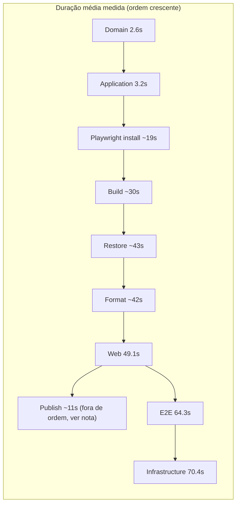

# CI/CD Validation Matrix & Test Classification (EPIC 19 — Sprint 19.3)

**Fonte da verdade:** verificado diretamente em `tests/*.csproj` e seus arquivos `.cs`,
`.github/workflows/ci.yml`, `deploy-hmg.yml`, `deploy-prd.yml`, `validate-promotion.yml`,
`scripts/Deploy-BeeDay.ps1`, `docs/testing/01-testing-strategy.md`, `docs/web/06-testing.md`,
`docs/architecture/04-dependency-rules.md`, `README.md` ("Quality gate"), e execuções reais de
`BeeDay CI` via `gh run view --log` (runs #164 e #165, 2026-08-10).

**Última verificação:** 2026-08-10.

**Escopo:** Discovery + classificação. Nenhum teste foi criado, removido, movido ou alterado.
Nenhum workflow, trigger, Ruleset ou comando foi alterado. `ci.yml` **não foi renomeado** — o
rename para `BeeDay — Pull Request Validation` permanece reservado para a Sprint 19.4, cuja
responsabilidade real poderá então corresponder ao nome (ver
[`06-cicd-pipeline-discovery-baseline.md`](06-cicd-pipeline-discovery-baseline.md) e o relatório da
Sprint 19.2.1).

**Classificação de evidência:** `FACT`, `MEASUREMENT`, `INFERENCE`, `RECOMMENDATION`, `UNKNOWN` —
mesma disciplina de `06-cicd-pipeline-discovery-baseline.md`.

---

## 1. Estado do repositório no início da Sprint

`FACT`

| Item | Valor |
|---|---|
| Branch | `sprint/19.3-validation-matrix-test-classification`, criada a partir de `sprint/19.2-cicd-naming-taxonomy` (`c6a174a`) |
| Motivo da base | PR #51 (19.2 → `hmg`) ainda aberta; PR #50 (19.1 → `hmg`) já mesclada (`hmg` em `cec98c1` no início desta Sprint) |
| Working tree | limpo, nada pré-existente descartado |

---

## 2. Test Project Inventory

`FACT`, cruzado com `docs/testing/01-testing-strategy.md` e `docs/web/06-testing.md` (ambos já
verificados contra o código nas Sprints 16.7/16.9/18.8) e reconfirmado nesta Sprint.

| Projeto | Framework | Target | Testes | Arquivos `.cs` | Infraestrutura real | DB | Rede | Browser | Env vars/secrets |
|---|---|---|---|---|---|---|---|---|---|
| `BeeDay.Domain.Tests` | xunit.v3 | net10.0 | 93 | 12 | Nenhuma — só `BeeDay.Domain` | Não | Não | Não | Não |
| `BeeDay.Application.Tests` | xunit.v3 | net10.0 | 73 | 18 | `FakeUnitOfWork` + 8 fakes de repositório, `FakeCurrentUserContext` | Não | Não | Não | Não |
| `BeeDay.Infrastructure.Tests` | xunit.v3 | net10.0 | 129 | 19 | `EfLocalDbTestBase`/`EfLocalDbCollection` — LocalDB real, migration real (`Database.MigrateAsync`) | **Sim — SQL Server LocalDB** | Não (local) | Não | Não |
| `BeeDay.Web.Tests` | xunit.v3, `Microsoft.NET.Sdk.Razor` | net10.0 | 450 | 61 | `bunit` (componentes), `WebApplicationFactory<Program>`/`TestServer` (integração HTTP) | Indireto, via factories que podem usar LocalDB para cenários de Infra-dependentes (não confirmado se todos usam) | `TestServer` — sem socket TCP real | Não | Não |
| `BeeDay.E2E.Tests` | xunit.v3 | net10.0 | 7 | 7 (+3 infra: `PlaywrightAppFixture`, `E2ETestBase`, `E2EWebApplicationFactory`) | Chromium real (Playwright), Kestrel real (TCP), LocalDB real | **Sim** | **Sim — TCP real** | **Sim — Chromium** | Não |

**Total: 752 testes** (93+73+129+450+7), confirmado por execução real documentada na Sprint 18.7 e
reconfirmado pela contagem impressa nos logs de CI desta própria Sprint (`Total tests: 73/93/7/129/450`
— ver §5).

**Setup/teardown especial:** `EfLocalDbTestBase` cria um banco `BeeDay_EfTests_{Guid}` único por
teste no `InitializeAsync`, aplica migration real, derruba no `DisposeAsync`
(`EfLocalDbCollection` desabilita paralelismo só para as classes `Ef*RepositoryTests`, para evitar
contenção de `CREATE`/`DROP DATABASE` concorrentes contra a mesma instância `mssqllocaldb`).
`PlaywrightAppFixture` instala/gerencia o Chromium e sobe um `Kestrel` real por execução.

**Comando de execução (idêntico local/CI, um projeto por vez):**
```
dotnet test <projeto>.csproj --configuration Release --no-build --verbosity normal \
  --logger "trx;LogFileName=<projeto>.trx" --results-directory <dir>
```

---

## 3. Non-Test Validation Inventory

`FACT`

| Validação | Comando | Local | Propósito | Significado de falha |
|---|---|---|---|---|
| Format | `dotnet format BeeDay.slnx --verify-no-changes --no-restore` | `ci.yml` | Consistência de estilo de código | Estilo divergente do `.editorconfig` |
| Build (Release, warnaserror) | `dotnet build BeeDay.slnx -c Release --no-restore --warnaserror` | `ci.yml` | Compila e trata warnings como erro | Erro de compilação ou warning não suprimido |
| Architecture boundary — Domain | `DomainAssemblyBoundaryTests.cs` (dentro de `Domain.Tests`) | `ci.yml` (embutido no `dotnet test`) | Garante que `BeeDay.Domain` nunca referencia `System.Text.Json`/EF Core/`BeeDay.Infrastructure` | Violação da Dependency Rule (Clean Architecture) |
| Architecture boundary — Application | `PersistenceContractBoundaryTests.cs` (dentro de `Application.Tests`) | `ci.yml` (embutido) | Garante que contratos de `Common.Contracts` não vazam `System.Text.Json`/genéricos de repositório, e que `Application` nunca referencia `Infrastructure` | Idem |
| Validar publish | inline PowerShell, checa `BeeDay.Web.dll`/`web.config` no diretório de publish | `ci.yml` | Confirma que `dotnet publish` produziu artefato utilizável | Publish incompleto/corrompido |
| Gerar bundle de migração EF | `dotnet ef migrations bundle --target-runtime win-x64` | `ci.yml` | Produz executável self-contained de migrations | Bundle não gerado |
| Validar bundle de migração | executa `efbundle.exe --help`, checa exit code | `ci.yml` | Confirma que o bundle roda no runner (arquitetura correta, não corrompido) — **não** conecta a nenhum banco | Bundle corrompido/incompatível |
| Validate Promotion | bash inline em `validate-promotion.yml` | `validate-promotion.yml` | Garante que PR para `main` vem de `hmg`, para `prd` vem de `main`, e do mesmo repositório (não fork) | Tentativa de promoção fora do caminho aprovado |
| Verify .NET SDK 10 disponível | PowerShell inline em `deploy-hmg.yml` | `deploy-hmg.yml` | Confirma SDK correto no runner self-hosted antes de tentar publicar/rodar | Runner mal provisionado |
| Promote privileged IIS control script | `Request-BeeDayIisControlPromotion.ps1` | `deploy-hmg.yml` | Garante que o script privilegiado instalado bate com o commit sendo implantado (SHA-256) | Script privilegiado desatualizado/inconsistente |
| Validate deployment secrets | PowerShell inline em `deploy-prd.yml` | `deploy-prd.yml` | Confirma presença de 5 secrets antes de tentar deploy (4/5 checados em HMG por não ter step equivalente — ver `06-...` §14) | Secret ausente, deploy prosseguiria com valor vazio |
| Readiness/health check | `GET /health/ready`, até 6 tentativas, dentro de `Deploy-BeeDay.ps1` | `deploy-hmg.yml`/`deploy-prd.yml` (quando executar) | Confirma que a aplicação subiu e responde após o deploy | Aplicação não saudável → rollback automático |
| Artifact provenance (HMG) | `run-id` pinado + log de `Resolved version` | `deploy-hmg.yml` | Prova que o artefato implantado é exatamente o que `BeeDay CI` validou | Artefato errado/reconstruído |
| Artifact provenance (PRD) | resolução de cadeia de PRs `prd←main←hmg` + busca da run de `ci.yml` correspondente | `deploy-prd.yml` | Prova a linhagem completa de promoção antes de implantar | Cadeia quebrada → `core.setFailed`, nada implantado |

**Validação documentada mas NÃO automatizada (GAP — ver §19):**

| Validação | Onde está documentada | Estado atual |
|---|---|---|
| `dotnet ef migrations has-pending-model-changes` | `README.md` "Quality gate" (passo manual pré-PR) | **Não roda em nenhum workflow** — confirmado por busca em `ci.yml`/`deploy-hmg.yml`/`deploy-prd.yml`; depende de execução manual do desenvolvedor |

**Nenhuma ferramenta de scanning de segurança automatizado existe** (`FACT` — `.github/` só contém
`pull_request_template.md` e `workflows/`; nenhum CodeQL, nenhum Dependabot, nenhuma outra
integração de segurança versionada). Não invente uma nesta Sprint — apenas registrado como GAP.

---

## 4. Current CI Execution Map

`FACT` — `ci.yml` tem 1 job só (`ci`), sequencial, sem paralelismo interno (confirmado na Sprint
19.1). Ordem real de execução:

```
checkout → setup-dotnet → dotnet --info → restore → format → build (warnaserror)
  → install Playwright Chromium → [loop: Application → Domain → E2E → Infrastructure → Web]
  → publish → validar publish → restore dotnet-ef (tool local) → gerar bundle EF
  → validar bundle → upload test-results → upload e2e-artifacts → upload publish → upload migrations
```

A ordem do loop de testes (`Application, Domain, E2E, Infrastructure, Web`) é a ordem alfabética de
`Get-ChildItem -Path tests -Filter *.csproj -Recurse` — **não** é ordenada por
velocidade/criticidade (confirmado nos logs, ver §5).

**A solução inteira ou projetos específicos?** Cada um dos 5 projetos é invocado individualmente
(`dotnet test <projeto>.csproj`), não `dotnet test BeeDay.slnx` — decisão documentada no próprio
`ci.yml` (comentário): evita que todos os projetos compartilhem o mesmo nome de arquivo `.trx`.

**Build implícito dentro de test?** Não — todos os 5 comandos usam `--no-build`, reaproveitando o
build já feito (Build Once dentro do próprio job).

**Restore implícito?** `FACT`: nenhum dos 5 comandos `dotnet test` passa `--no-restore`, só
`--no-build`. Isso significa que cada uma das 5 invocações reavalia o grafo de restore do projeto
(MSBuild), mesmo que nada precise ser baixado de fato — ver §17 (Build/Test Coupling).

**Compilação repetida?** Não observada — `--no-build` é respeitado em todas as 5 chamadas.

**Suítes que rodam juntas sem necessidade técnica?** Nenhuma "suíte combinada" — já são 5 execuções
separadas. A necessidade técnica de separá-las (nomes de `.trx` únicos) já está documentada no
próprio arquivo.

---

## 5. Duration Baseline

`MEASUREMENT` — extraído de 2 execuções reais de `BeeDay CI` via `gh run view --log`
(run 31378253170 = CI #165, run 31377545172 = CI #164, ambas 2026-08-10, commit
`d5b9390`/`ab6a6d0` respectivamente).

| Validação | Amostra 1 (#165) | Amostra 2 (#164) | Média | Min | Max | Amostra |
|---|---|---|---|---|---|---|
| Restore dependencies | ~43s | não remedido | ~43s | — | — | n=1 (Sprint 19.1) |
| Format | ~42s | não remedido | ~42s | — | — | n=1 (Sprint 19.1) |
| Build (warnaserror) | ~30s | não remedido | ~30s | — | — | n=1 (Sprint 19.1) |
| Install Playwright Chromium | ~19s | não remedido | ~19s | — | — | n=1 (Sprint 19.1) |
| **Application.Tests** (73 testes) | 3.33s | 3.09s | **3.2s** | 3.09s | 3.33s | n=2 |
| **Domain.Tests** (93 testes) | 2.63s | 2.57s | **2.6s** | 2.57s | 2.63s | n=2 |
| **E2E.Tests** (7 testes) | 65.3s | 63.2s | **64.3s** | 63.2s | 65.3s | n=2 |
| **Infrastructure.Tests** (129 testes) | 60.2s | 80.6s | **70.4s** | 60.2s | 80.6s | n=2 |
| **Web.Tests** (450 testes) | 44.4s | 53.8s | **49.1s** | 44.4s | 53.8s | n=2 |
| Publish | ~11s | não remedido | ~11s | — | — | n=1 |
| Gerar bundle EF | ~26s | não remedido | ~26s | — | — | n=1 |
| **Total do job `ci`** | ~6m26s | ~7m46s | ~7m6s | 6m26s | 7m46s | n=2 |
| **Job `deploy` (`deploy-hmg.yml`)** | ~1m49s–3m40s (fila incluída) | — | — | 1m49s | 3m40s | n=2 (runs #77/#78, Sprint 19.1) |

**Observação sobre variância:** `Infrastructure.Tests` teve a maior variação relativa entre as duas
amostras (60.2s vs 80.6s, +34%) — consistente com a contenção de `CREATE`/`DROP DATABASE` já
documentada em `docs/testing/01-testing-strategy.md` §4, mesmo com `EfLocalDbCollection`
desabilitando paralelismo *dentro* do projeto (a variação pode vir de contenção contra o runner
`windows-latest` compartilhado entre execuções, não necessariamente entre testes do mesmo run —
`INFERENCE`, amostra pequena demais para conclusão definitiva).

**Fonte de todas as médias:** amostra de conveniência de 2 execuções reais consecutivas
(2026-08-10). `UNKNOWN`: não foi feita uma amostragem estatisticamente maior por restrição de
escopo/tempo desta Sprint — candidato a métrica contínua na Sprint 19.9 (observabilidade).

---

## 6. Duration Ranking (visual)



Nota: `Publish` (~11s) é rápido, mas roda depois da suíte de testes na ordem real do pipeline — a
posição neste diagrama é só por duração, não por ordem de execução (essa está em §4).

---

## 7. Test Project Relationship Map

`FACT`, verificado via `ProjectReference` de cada `.csproj` (mesma fonte de
`docs/architecture/04-dependency-rules.md`):

```
BeeDay.Domain
    ↑ referencia
BeeDay.Domain.Tests            → valida invariantes puras + fronteira de dependência

BeeDay.Application (→ Domain)
    ↑ referencia
BeeDay.Application.Tests       → valida handlers via portas fakes + fronteira de contratos

BeeDay.Infrastructure (→ Application → Domain)
    ↑ referencia
BeeDay.Infrastructure.Tests    → valida persistência EF Core real contra LocalDB

BeeDay.Web (→ Application, Domain, Infrastructure)
    ↑ referencia
BeeDay.Web.Tests                → valida componentes Blazor (bunit) + integração HTTP (TestServer)

Sistema completo (via Kestrel real)
    ↑ exercitado por
BeeDay.E2E.Tests                → valida fluxos de usuário via browser real (Chromium)
```

Cada projeto de teste referencia exatamente a camada de produção que audita — nenhuma referência
cruzada inesperada encontrada.

---

## 8. Purpose Matrix

`FACT`/`INFERENCE` (propósito inferido da implementação real, não de nomes de arquivo)

| Suite/Validação | O que prova | Risco que protege |
|---|---|---|
| Domain.Tests (não-boundary) | Regras de negócio puras de Aggregates/Entities/Value Objects executam corretamente sem qualquer dependência externa | Regra de domínio incorreta chegando a produção |
| `DomainAssemblyBoundaryTests` | `BeeDay.Domain` nunca referencia serialização/EF/Infrastructure | Erosão da Clean Architecture — Domain acoplado a detalhe técnico |
| Application.Tests (não-boundary) | Handlers de Command/Query orquestram corretamente usando portas (`IUnitOfWork`, repositórios) sem depender de implementação real | Orquestração de caso de uso incorreta |
| `PersistenceContractBoundaryTests` | Contratos de Application não vazam tipos de serialização nem genéricos de repositório; Application nunca referencia Infrastructure | Contratos vazando detalhe de persistência, violando inversão de dependência |
| Infrastructure.Tests | Repositórios EF Core, Identity, hashing, Event Journal e health check funcionam contra um SQL Server real (via migration real) | Persistência quebrada só visível contra banco real (não capturada por fakes) |
| Web.Tests (componentes) | Componentes Blazor renderizam e reagem a interação como esperado | Regressão visual/comportamental de UI |
| Web.Tests (integração) | Autenticação por cookie, rate limiting, antiforgery, autorização, isolamento multiusuário funcionam via pipeline HTTP real (`TestServer`) | Falha de segurança/autenticação/autorização |
| E2E.Tests | Fluxos completos (criar conta, login→onboarding→dashboard, logout, hábito, wallet) funcionam via browser real, ponta a ponta | Regressão que só aparece na integração real entre Blazor Server (SignalR), banco e IIS/Kestrel |
| Format | Código segue `.editorconfig` | Inconsistência de estilo (não é risco funcional) |
| Build (warnaserror) | Código compila sem warnings | Erro de compilação ou warning ignorado silenciosamente |
| Validar publish | `dotnet publish` produziu artefato utilizável | Deploy de artefato incompleto |
| Bundle/Validar bundle EF | Bundle de migração existe e executa no runner-alvo | Deploy sem conseguir aplicar migrations |
| Validate Promotion | PR segue o caminho de promoção aprovado, de uma branch deste repositório | Promoção fora de ordem ou de um fork |
| Readiness (health check) | Aplicação respondeu com sucesso após deploy | Deploy de uma versão que não sobe |
| Provenance (HMG/PRD) | O artefato implantado é o mesmo que passou por `BeeDay CI` | Deploy de artefato não validado ou divergente |

---

## 9. Criticality Matrix

`FACT`/`INFERENCE` — escala definida para esta Sprint:

```
CRITICAL — falha indica risco de promoção inválida, corrupção, quebra estrutural ou indisponibilidade.
HIGH      — falha pode introduzir regressão funcional ou de segurança relevante.
MEDIUM    — falha detecta problema importante, mas geralmente localizado/cosmético.
LOW       — falha tem baixo impacto operacional ou é principalmente informativa.
```

| Validação | Criticidade | Razão |
|---|---|---|
| Build (warnaserror) | CRITICAL | Sem build funcionando, nada mais é válido |
| Architecture boundary tests (2) | CRITICAL | Única barreira automatizada contra erosão da Clean Architecture |
| Validate Promotion | CRITICAL | Única barreira automatizada contra promoção fora do caminho aprovado |
| Artifact provenance (PRD) | CRITICAL | Única barreira contra implantar em produção um artefato não rastreável |
| Readiness/health check | CRITICAL | Único gate que impede deploy quebrado de ficar no ar (aciona rollback) |
| Infrastructure.Tests | HIGH | Persistência incorreta afeta todo o sistema, mas é detectável antes de produção |
| Web.Tests (integração de auth/segurança) | HIGH | Falha de autenticação/autorização é grave, mas coberta antes do deploy |
| E2E.Tests | HIGH | Cobre o caminho mais realista, mas só 7 fluxos — cobertura estreita |
| Domain.Tests / Application.Tests (não-boundary) | HIGH | Base de toda a lógica de negócio |
| Validar publish / bundle EF | MEDIUM | Detecta problema cedo, mas redundante com falha subsequente óbvia no deploy |
| Format | MEDIUM | Bloqueia merge, mas não é risco de produto |
| Verify .NET SDK 10 disponível | LOW | Ambiente do runner, raramente muda |
| Validate deployment secrets | HIGH | Secret ausente pode silenciosamente quebrar e-mail/config em produção (ver achado de `BEEDAY_RESEND_FROM_NAME` em `01-deployment.md`) |

Criticidade **não** foi usada para recomendar remoção de nenhuma validação (conforme mandado).

---

## 10. Dependency & Environment Matrix

`FACT`

| Validação | DB | Rede | Browser | Servidor (IIS/SERV3WEB) | Secrets | Classificação |
|---|---|---|---|---|---|---|
| Domain.Tests | Não | Não | Não | Não | Não | **SELF-CONTAINED** |
| Application.Tests | Não | Não | Não | Não | Não | **SELF-CONTAINED** |
| Infrastructure.Tests | Sim (LocalDB) | Não | Não | Não | Não | **CI DEPENDENCY** (LocalDB precisa estar disponível no runner) |
| Web.Tests | Indireto (via factories) | `TestServer` (sem TCP real) | Não | Não | Não | **CI DEPENDENCY** (leve) |
| E2E.Tests | Sim (LocalDB) | **Sim — TCP real** | **Sim — Chromium** | Não (Kestrel local, não HMG) | Não | **CI DEPENDENCY** (pesada — browser + porta) |
| Format/Build | Não | Não | Não | Não | Não | **SELF-CONTAINED** |
| Bundle EF / validar bundle | Não (só reflete migrations compiladas) | Não | Não | Não | Não | **SELF-CONTAINED** |
| Validate Promotion | Não | Sim (GitHub API, via Actions context) | Não | Não | Não | **CI DEPENDENCY** |
| Verify .NET SDK 10 | Não | Não | Não | Sim (runner self-hosted) | Não | **ENVIRONMENT DEPENDENT** |
| Promote IIS control script | Não | Não | Não | Sim (SERV3WEB, Scheduled Task SYSTEM) | Não | **DEPLOYED ENVIRONMENT REQUIRED** |
| Validate deployment secrets | Não | Não | Não | Não | Sim | **ENVIRONMENT DEPENDENT** (GitHub Environment secrets) |
| Readiness/health check | Indireto (app precisa de DB) | Sim (`GET /health/ready`) | Não | **Sim — SERV3WEB real** | Não | **DEPLOYED ENVIRONMENT REQUIRED** |
| Artifact provenance (HMG/PRD) | Não | Sim (GitHub API) | Não | Não | Não | **CI DEPENDENCY** |

**Distinção importante (`INFERENCE`):** `E2E.Tests` precisa de browser real e uma porta TCP real,
mas roda **dentro do job `ci`**, contra um Kestrel local subido pela própria suíte — **não** contra
SERV3WEB. Por isso é `CI DEPENDENCY`, não `DEPLOYED ENVIRONMENT REQUIRED`. Só o health check
(dentro de `Deploy-BeeDay.ps1`) e a promoção do script IIS realmente dependem do ambiente
implantado.

---

## 11. Flakiness Assessment

`FACT` + `INFERENCE`, distinguindo explicitamente execução **local em paralelo** vs execução em
**CI sequencial**:

| Contexto | Classificação | Evidência |
|---|---|---|
| `dotnet test BeeDay.slnx` local (solução inteira, projetos em paralelo) | **CONFIRMED FLAKY** (`Infrastructure.Tests`/`Web.Tests`/`E2E.Tests`) | `docs/testing/01-testing-strategy.md` §7, Sprint 16.7: contenção de LocalDB/porta Kestrel entre projetos rodando ao mesmo tempo, documentada diretamente pelo repositório — ver também memória de projeto `project_test_flakiness_localdb_playwright` |
| `ci.yml` (5 projetos sequenciais, um de cada vez) | **NO CONFIRMED FLAKINESS OBSERVED** na amostra desta Sprint (n=2 runs, ambas 752/752 sem falha) | `gh run view --log`, runs #164/#165 — mas amostra pequena; não é uma auditoria exaustiva das 163 execuções históricas de `ci.yml` |
| `Infrastructure.Tests` isoladamente (mesmo em CI) | **POTENTIAL FLAKINESS** — variância de duração 60-81s entre 2 amostras (+34%) | §5 — variância de tempo não é o mesmo que falha, mas é um sinal de contenção de recurso consistente com a causa raiz já documentada |

Não foi feita uma varredura das 163 execuções históricas de `ci.yml` em busca de falhas
intermitentes — fora do escopo/tempo desta Sprint. `UNKNOWN`: taxa real de flakiness em CI ao longo
do tempo. Candidato a métrica contínua para a Sprint 19.9.

---

## 12. Feedback Value Matrix

`INFERENCE`, baseada em custo + criticidade + dependência de ambiente:

| Validação | Momento de maior valor |
|---|---|
| Format, Build, Domain.Tests, Application.Tests, boundary tests | **IMMEDIATE PR FEEDBACK** — extremamente baratos (< 1min somados), críticos, self-contained |
| Infrastructure.Tests, Web.Tests | **IMMEDIATE PR FEEDBACK** — mais caros, mas ainda < 1min20s cada, HIGH risco, e são exatamente o tipo de regressão que o desenvolvedor precisa saber *antes* de abrir/mesclar a PR |
| E2E.Tests | **IMMEDIATE PR FEEDBACK ou BEFORE HMG DEPLOY** (ambíguo — ver §16/§18) — caro relativo (64s + 19s de instalação do Chromium), mas cobre o caminho mais realista |
| Bundle EF / validar bundle | **IMMEDIATE PR FEEDBACK** — barato, evita descobrir bundle quebrado só no deploy |
| Validate Promotion | **BEFORE MAIN PROMOTION / BEFORE PRODUCTION PROMOTION** — só faz sentido nesses 2 pontos, já é onde roda hoje |
| Readiness/health check | **AFTER HMG DEPLOY / BEFORE PRODUCTION PROMOTION** — só pode rodar depois que existe algo implantado |
| Validate deployment secrets | **BEFORE PRODUCTION PROMOTION** (hoje só em `deploy-prd.yml`) |

---

## 13. Current Stage Matrix

`FACT` — onde cada validação **efetivamente roda hoje**:

| Validação | PR→HMG | HMG Merge/Deploy | HMG Verification | HMG→Main | Main→PRD |
|---|---|---|---|---|---|
| Format | YES (via `ci.yml` em push+PR) | NOT APPLICABLE (não há job de build/test no deploy) | NOT APPLICABLE | YES (mesmo `ci.yml` roda de novo — ver §16) | NOT APPLICABLE (`deploy-prd.yml` não builda) |
| Build | YES | NOT APPLICABLE | NOT APPLICABLE | YES | NOT APPLICABLE |
| Domain/Application/Infrastructure/Web/E2E Tests | YES | NOT APPLICABLE | NOT APPLICABLE | YES | NOT APPLICABLE |
| Architecture boundary tests | YES (embutido) | NOT APPLICABLE | NOT APPLICABLE | YES (embutido) | NOT APPLICABLE |
| Bundle EF / validar bundle | YES | NOT APPLICABLE | NOT APPLICABLE | YES | NOT APPLICABLE |
| Validate Promotion | NOT APPLICABLE | NOT APPLICABLE | NOT APPLICABLE | YES | YES |
| Deploy (HMG) | NOT APPLICABLE | YES | NOT APPLICABLE (sem job dedicado — ver §18) | NOT APPLICABLE | NOT APPLICABLE |
| Readiness/health check | NOT APPLICABLE | YES (dentro do deploy) | NOT APPLICABLE (não é um estágio/job próprio hoje) | NOT APPLICABLE | YES (quando `deploy-prd.yml` executar) |
| Smoke | NOT APPLICABLE | NOT CURRENTLY IMPLEMENTED | NOT CURRENTLY IMPLEMENTED | NOT APPLICABLE | NOT CURRENTLY IMPLEMENTED |
| Artifact provenance | PRODUCE (upload) | VERIFY (implícito, via `run-id`) | NOT APPLICABLE | NOT APPLICABLE (Validate Promotion não toca artifact) | VERIFY (explícito, cadeia de PRs) |

**Achado central (`FACT`, já registrado na Sprint 19.1, reconfirmado aqui):** como `ci.yml` roda
tanto em `push` para `hmg` quanto em `pull_request` para `hmg`/`main`/`prd`, a coluna "PR→HMG" e a
coluna "HMG→Main" frequentemente executam a **mesma validação duas vezes para o mesmo commit** —
não é uma redundância planejada por estágio, é a mesma causa-raiz documentada em
`06-cicd-pipeline-discovery-baseline.md` §12.

---

## 14. Recommended Stage Matrix

`RECOMMENDATION` — candidatos, não implementação. Critério de `SELECTIVE` sempre explicado.

| Validação | PR→HMG recomendado | HMG Deploy | HMG Verification | HMG→Main | Main→PRD |
|---|---|---|---|---|---|
| Format, Build, Domain, Application, boundary tests | REQUIRED (Fast) | NOT REQUIRED | NOT APPLICABLE | REQUIRED (Release Gate) | NOT APPLICABLE |
| Infrastructure.Tests | REQUIRED (Fast) — 70s não é proibitivo e o risco é HIGH; alternativa SELECTIVE só se 19.4 decidir que o custo agregado do Fast PR ficou alto demais, e nesse caso o critério seria "mudanças em `src/BeeDay.Infrastructure/**` ou `tests/BeeDay.Infrastructure.Tests/**`" | NOT REQUIRED | NOT APPLICABLE | REQUIRED | NOT APPLICABLE |
| Web.Tests | REQUIRED (Fast) — 49s, HIGH risco de segurança | NOT REQUIRED | NOT APPLICABLE | REQUIRED | NOT APPLICABLE |
| E2E.Tests | SELECTIVE — critério: mudanças em `src/BeeDay.Web/**` (páginas/fluxos) ou `tests/BeeDay.E2E.Tests/**`; caso contrário mover para Release Gate | NOT REQUIRED | TBD — depende de existir suite de smoke pós-deploy real (GAP, §19) | REQUIRED | NOT APPLICABLE |
| Bundle EF / validar bundle | REQUIRED (Fast) — barato | NOT REQUIRED (reaproveita artifact) | NOT APPLICABLE | REQUIRED | NOT APPLICABLE |
| `dotnet ef migrations has-pending-model-changes` | TBD — hoje não roda em lugar nenhum (GAP) | NOT APPLICABLE | NOT APPLICABLE | RECOMMENDED (Release Gate) | NOT APPLICABLE |
| Validate Promotion | NOT APPLICABLE | NOT APPLICABLE | NOT APPLICABLE | REQUIRED (já é hoje) | REQUIRED (já é hoje) |
| Deploy HMG | NOT APPLICABLE | REQUIRED (já é hoje, mas duplicado — correção é 19.6) | NOT APPLICABLE | NOT APPLICABLE | NOT APPLICABLE |
| Readiness | NOT APPLICABLE | REQUIRED (já é hoje, embutido) | RECOMMENDED como step/check distinto (hoje é implícito dentro do script — decisão de implementação é da 19.6) | NOT APPLICABLE | REQUIRED (quando prd existir de verdade) |
| Smoke | NOT APPLICABLE | NOT APPLICABLE | GAP — recomendado criar (19.6) | NOT APPLICABLE | GAP — recomendado criar (19.6/19.8) |
| Provenance | PRODUCE (já é hoje) | VERIFY explícito (RECOMMENDATION — hoje é implícito) | NOT APPLICABLE | NOT APPLICABLE | VERIFY (já é hoje, explícito) |

---

## 15. Validation × Stage Matrix (oficial, consolidada)

`FACT` + `RECOMMENDATION` combinadas — esta é a matriz de entrada oficial para a Sprint 19.4.

| Validação | Categoria | Duração | Criticidade | Ambiente | Flakiness | Estágio atual | Estágio recomendado |
|---|---|---|---|---|---|---|---|
| Format | STATIC | ~42s | MEDIUM | SELF-CONTAINED | NO KNOWN FLAKINESS | PR→HMG, HMG→Main (duplicado) | FAST/EVERY PR + RELEASE GATE |
| Build (warnaserror) | STATIC | ~30s | CRITICAL | SELF-CONTAINED | NO KNOWN FLAKINESS | PR→HMG, HMG→Main (duplicado) | FAST/EVERY PR + RELEASE GATE |
| Domain.Tests | FAST/EVERY PR | 2.6s | HIGH | SELF-CONTAINED | NO KNOWN FLAKINESS | PR→HMG, HMG→Main (duplicado) | FAST/EVERY PR + RELEASE GATE |
| `DomainAssemblyBoundaryTests` | ARCHITECTURE | incluído acima | CRITICAL | SELF-CONTAINED | NO KNOWN FLAKINESS | idem | FAST/EVERY PR + RELEASE GATE |
| Application.Tests | FAST/EVERY PR | 3.2s | HIGH | SELF-CONTAINED | NO KNOWN FLAKINESS | idem | FAST/EVERY PR + RELEASE GATE |
| `PersistenceContractBoundaryTests` | ARCHITECTURE | incluído acima | CRITICAL | SELF-CONTAINED | NO KNOWN FLAKINESS | idem | FAST/EVERY PR + RELEASE GATE |
| Infrastructure.Tests | INTEGRATION | 70.4s | HIGH | CI DEPENDENCY (LocalDB) | POTENTIAL (variância) | idem | FAST/EVERY PR (ou SELECTIVE, ver §14) + RELEASE GATE |
| Web.Tests | INTEGRATION | 49.1s | HIGH | CI DEPENDENCY | NO CONFIRMED (CI) / CONFIRMED (local paralelo) | idem | FAST/EVERY PR + RELEASE GATE |
| E2E.Tests | E2E / ENVIRONMENT-SENSITIVE | 64.3s | HIGH | CI DEPENDENCY (browser+TCP) | NO CONFIRMED (CI) / CONFIRMED (local paralelo) | idem | SELECTIVE (PR) + RELEASE GATE |
| Validar publish | DEPLOYMENT VERIFICATION | ~poucos s | MEDIUM | SELF-CONTAINED | NO KNOWN FLAKINESS | idem | FAST/EVERY PR + RELEASE GATE |
| Bundle EF + validar | STATIC/ARTIFACT | ~26s | MEDIUM | SELF-CONTAINED | NO KNOWN FLAKINESS | idem | FAST/EVERY PR + RELEASE GATE |
| `has-pending-model-changes` | STATIC (GAP) | UNKNOWN | HIGH (potencial) | SELF-CONTAINED | UNKNOWN | NÃO EXECUTADO | RELEASE GATE (novo) |
| Validate Promotion | RELEASE GATE | segundos | CRITICAL | CI DEPENDENCY | NO KNOWN FLAKINESS | HMG→Main, Main→PRD | mantém |
| Deploy HMG | DEPLOYMENT VERIFICATION | ~1m49s-3m40s | CRITICAL | DEPLOYED ENVIRONMENT REQUIRED | CONFIRMED — duplicação (não é "flaky", é determinístico e duplicado, ver 19.1) | HMG Merge/Deploy (2x) | HMG Merge/Deploy (1x, correção 19.6) |
| Readiness | SMOKE (embrionário) | incluído no deploy | CRITICAL | DEPLOYED ENVIRONMENT REQUIRED | NO KNOWN FLAKINESS | dentro do deploy | HMG Verification (step distinto, 19.6) |
| Smoke (suite dedicada) | SMOKE (GAP) | — | — | — | — | NOT CURRENTLY IMPLEMENTED | HMG Verification (19.6) |
| Artifact provenance | ARCHITECTURE/PROCESS | — | CRITICAL | CI DEPENDENCY | NO KNOWN FLAKINESS | produce (CI), verify implícito (HMG), verify explícito (PRD) | manter + tornar HMG explícito (19.8) |

---

## 16. Duplicate Validation Analysis

`FACT`, reaproveitando diretamente a evidência já produzida na Sprint 19.1 (não remedida do zero
aqui, já que a causa raiz é idêntica e já está comprovada por log):

| Validação | Run A | Run B | Mesmo SHA | Mesmo propósito | Classificação |
|---|---|---|---|---|---|
| Toda a suíte (752 testes) + format + build + bundle | CI run push (`hmg`) | CI run pull_request (PR `hmg→main`) | Sim | Sim | **REDUNDANT REPETITION** — mesmo código, mesmas dependências, mesmo ambiente (`windows-latest` efêmero), nenhuma informação nova produzida (ver `06-...` §10, §12) |
| Deploy HMG | HMG Deploy disparado pela run de push | HMG Deploy disparado pela run de PR | Sim | Sim | **REDUNDANT REPETITION** — consequência direta da duplicação acima |
| Readiness/health check dentro de cada deploy duplicado | idem | idem | Sim | Sim | **REDUNDANT REPETITION** — mesmo estado, verificado 2x |

**Não-exemplo (evita confundir "mesmo código" com "mesmo propósito"):** Smoke pós-deploy (se
existisse) **não** seria redundante com Domain/Application/Infrastructure/Web/E2E.Tests mesmo
rodando sobre o mesmo commit — verificam coisas diferentes (código correto vs. ambiente implantado
corretamente). Nenhuma validação atual se encaixa nesse padrão hoje porque não existe suite de
smoke (GAP, §19).

---

## 17. Build/Test Coupling Findings

`FACT`

- **Restore implícito repetido:** os 5 comandos `dotnet test` não usam `--no-restore`, só
  `--no-build`. Cada invocação reavalia o grafo de restore via MSBuild (não implica download de
  pacotes se nada mudou, mas implica overhead de avaliação repetida 5x). Candidato de otimização
  para a Sprint 19.5 — **não implementado aqui**.
- **Build implícito:** nenhum — `--no-build` presente em todas as 5 chamadas, reaproveitando
  corretamente o build único do job.
- **Compilação repetida:** não observada.
- **Carregamento de projeto repetido:** `INFERENCE` — 5 processos `dotnet test` separados
  implicam 5 inicializações de runtime/MSBuild independentes, ao invés de 1 processo compartilhado
  (que `dotnet test BeeDay.slnx` teria, ao custo do problema de nome de `.trx` já documentado).
  Trade-off já documentado no próprio `ci.yml`, não uma descoberta nova.

---

## 18. Fast PR Candidates (entrada para Sprint 19.4)

`RECOMMENDATION`

| Validação | Por que rápida | Por que valiosa em toda PR | Duração | Dependências | Risco se pulada |
|---|---|---|---|---|---|
| Format | Determinística, sem I/O externo | Consistência é barata de manter cedo | ~42s | Nenhuma | Baixo, mas acumula dívida de estilo |
| Build (warnaserror) | Só compila | Sem isso nada mais é válido | ~30s | Nenhuma | Code review de código que não compila |
| Domain.Tests + boundary | Sub-3s, sem I/O | Base de toda regra de negócio + único guard de arquitetura do Domain | 2.6s | Nenhuma | Regra de domínio quebrada chega ao review |
| Application.Tests + boundary | Sub-4s, sem I/O | Base de orquestração + único guard de arquitetura da Application | 3.2s | Nenhuma | Handler quebrado chega ao review |
| Infrastructure.Tests | ~70s ainda é "minutos", não "dezenas de minutos" | Persistência é HIGH risco, LocalDB é rápido de provisionar | 70.4s | LocalDB no runner (já disponível) | Regressão de persistência só detectada depois |
| Web.Tests | ~49s para 450 testes | Cobre autenticação/segurança, HIGH risco | 49.1s | `TestServer` (sem infra externa) | Regressão de auth/segurança chega ao review |
| Bundle EF + validar | ~26s, sem I/O externo além do compilado | Evita descobrir bundle quebrado só no deploy | 26s | Nenhuma | Deploy falha por bundle, não por código |

## 19. Fast PR Exclusions

`RECOMMENDATION`

| Validação | Por que não deveria ser Fast/toda PR (ou por que é ambígua) |
|---|---|
| E2E.Tests | Mais cara relativamente (64s + 19s de instalação do Chromium = ~83s só de overhead de browser), ambiente mais pesado (`CI DEPENDENCY` browser+TCP), cobertura estreita (7 fluxos) — melhor candidata a `SELECTIVE` por path (`src/BeeDay.Web/**`, `tests/BeeDay.E2E.Tests/**`) ou a rodar só no Release Gate. Decisão final é da Sprint 19.4. |
| `has-pending-model-changes` | Não está implementada em nenhum workflow hoje — antes de decidir o estágio, precisa ser adicionada em algum lugar (Release Gate é o candidato natural, não Fast PR, já que mudanças de schema costumam vir acopladas a Infrastructure.Tests, que já cobre o comportamento) |
| Validate Promotion | Não se aplica a PRs `sprint/*→hmg` — só existe (e deve continuar existindo) nas fronteiras `hmg→main`/`main→prd` |
| Deploy/Readiness/Smoke | Não fazem sentido em PR — exigem artefato implantado, que só existe depois do merge |

---

## 20. Performance Candidates (entrada para Sprint 19.5)

`RECOMMENDATION`, sem implementação:

- Adicionar `--no-restore` às 5 chamadas de `dotnet test` (§17) — restore único já ocorreu antes do build.
- Avaliar cache de pacotes NuGet (`actions/cache` ou `setup-dotnet`'s cache nativo) — hoje ausente (`06-...` §16).
- Reduzir contenção de `Infrastructure.Tests` (§5/§11) — investigar se a variância observada é do runner compartilhado ou de fato de contenção local de `mssqllocaldb`.
- Investigar se os 5 processos `dotnet test` separados podem compartilhar processo/host sem reintroduzir o problema de nome de `.trx` (ex.: `--logger` com padrão de nome único por assembly já suportado por `dotnet test BeeDay.slnx`, se essa opção existir na versão atual do SDK — não verificado nesta Sprint).

## 21. HMG Verification Candidates (entrada para Sprint 19.6)

`RECOMMENDATION` + `FACT` sobre o que já existe:

- **Já existe (FACT):** readiness/health check via `GET /health/ready`, embutido dentro de
  `Deploy-BeeDay.ps1` — não é um step/job do GitHub Actions distinto hoje.
- **GAP:** não existe suite de smoke pós-deploy contra HMG real. `E2E.Tests` não conta — roda
  pré-deploy contra Kestrel local, não contra SERV3WEB.
- **Recomendação:** extrair o readiness check para um step/job explícito (`Verify Readiness`),
  e avaliar se um subconjunto do `E2E.Tests` (ou uma suite nova, mínima) pode rodar apontando para
  a URL real de HMG pós-deploy como smoke — decisão de implementação pertence à Sprint 19.6.

## 22. Release Quality Gate Candidates (entrada para Sprint 19.7)

`RECOMMENDATION`:

- Toda a suíte atual (752 testes) + Format + Build (já rodam nessa fronteira hoje, via `ci.yml` na PR `hmg→main` — mas duplicados, ver §16).
- `dotnet ef migrations has-pending-model-changes` — GAP, candidato natural para esta fronteira (mudança de schema não detectada deveria bloquear a promoção para `main`, não só o deploy em HMG).
- Nenhuma ferramenta de segurança adicional recomendada por não existir nenhuma disponível/instalada hoje (não inventar).

---

## 23. Gaps

`FACT` (ausência confirmada) + classificação:

| Gap | Evidência | Sprint |
|---|---|---|
| `dotnet ef migrations has-pending-model-changes` não roda em CI | Ausente em `ci.yml`/`deploy-hmg.yml`/`deploy-prd.yml`, só documentado como passo manual em `README.md` | 19.7 |
| Nenhuma suite de smoke pós-deploy real | Nenhum step aponta para URL de HMG além do health check embutido no deploy | 19.6 |
| Readiness não é um step/check distinto e observável | Embutido dentro de `Deploy-BeeDay.ps1`, sem check próprio no GitHub | 19.6 |
| Nenhuma ferramenta de scanning de segurança (SAST/dependência) | `.github/` sem CodeQL/Dependabot | 19.7 (avaliar se cabe) |
| Artifact provenance em HMG é implícito (só log), não um step de verificação distinto | `deploy-hmg.yml` não tem step equivalente ao de `deploy-prd.yml` que resolve/prova a cadeia | 19.8 |
| Nenhuma medição contínua de duração/flakiness (só amostras pontuais desta Sprint) | Sem dashboard/histórico agregado | 19.9 |
| Nenhum teste de integração dedicado a `/health*` (achado já registrado em `docs/web/06-testing.md`) | Confirmado por essa mesma fonte | fora da EPIC 19 — é lacuna de teste de produto, não de pipeline |

---

## 24. Recommendations by Sprint (consolidado)

| Recomendação | Sprint |
|---|---|
| Definir quais validações entram no Fast PR (base: §18/§19) | 19.4 |
| `--no-restore` nas 5 chamadas de teste; investigar cache NuGet; investigar contenção de Infrastructure.Tests | 19.5 |
| Extrair readiness para step distinto; criar smoke pós-deploy real contra HMG | 19.6 |
| Adicionar `has-pending-model-changes` ao pipeline; avaliar ferramenta de segurança (se vier a existir) | 19.7 |
| Tornar provenance de HMG explícito (hoje só em PRD) | 19.8 |
| Medição contínua de duração/flakiness; auditoria histórica completa das 163 execuções de `ci.yml` | 19.9 |
| Corrigir duplicação de execução (já registrado desde 19.1) | 19.6 |

---

## 25. Fontes consultadas

- `tests/*/*.csproj` e inspeção direta dos arquivos `.cs` citados.
- `docs/testing/01-testing-strategy.md`, `docs/web/06-testing.md`,
  `docs/architecture/04-dependency-rules.md`.
- `.github/workflows/ci.yml`, `deploy-hmg.yml`, `deploy-prd.yml`, `validate-promotion.yml`.
- `gh run view --log` para os jobs das runs 31378253170 (#165) e 31377545172 (#164).
- `README.md` ("Quality gate"), `CLAUDE.md`.
- [`06-cicd-pipeline-discovery-baseline.md`](06-cicd-pipeline-discovery-baseline.md) (Sprint 19.1 — reaproveitado, não remedido, onde a evidência já existia).
- Busca por `CodeQL`/`dependabot` em `.github/` (ausência confirmada).
