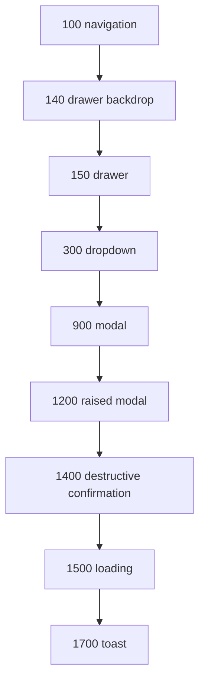

# Foundations

**Fonte da verdade:** verificado diretamente em `src/BeeDay.Web/wwwroot/css/variables.css`,
`theme.css`, `typography.css`, `typography-policy.css`, `utilities.css`, `polish.css`,
`src/BeeDay.Web/wwwroot/app.css`, e um
e levantamento completo de `@media` em `src/BeeDay.Web/wwwroot/css/*.css` e
`src/BeeDay.Web/Components/**/*.razor.css`; ver também `docs/ux/03-responsive.md`.

**Última verificação:** 2026-08-16 (Sprint 25.16, EPIC 25). `#5247F9` permanece a única Brand Color
aprovada; `#FFD326` é Product/Reward, mantendo `brand-yellow*` apenas como aliases de
compatibilidade. Surface, Content, Semantic, Product, Illustration e Component possuem ownership
explícito, assim como a hardcode policy e os itens `DEFER`.

Verificação anterior: 2026-08-15 (Sprint 22.2, EPIC 22 — Hero Image, CTA & Brand Alignment) —
família primary remigrada para `#5247F9`/`#3F33F1`/`#1C0EF2` e CTA público consolidado no token
compartilhado. Afirmações tipográficas dessa revisão não foram reavaliadas pela Sprint 25.3.

Verificação anterior: 2026-08-15 (Sprint 22.1, EPIC 22 — Public Home Header, Brand & Language
Switcher, correção de Brand Color).
Verificação anterior: 2026-08-14 (Sprint 21.16, EPIC 21 — Brand Blue Refinement) — família azul
`#3A4ED9`/`#3043C7`/`#2637AD`, remigrada integralmente na Sprint 22.1 para a paleta oficial da EPIC 22.
Verificação anterior: 2026-08-12 (Sprint 21.3, EPIC 21 — BeeDay Navigation) — contagem de CSS
isolado corrigida de 33 para 36 (+4 novos, -1 removido); §10 atualizado (5 arquivos agora
coordenam o breakpoint `min-width: 1024px`, `TopNavigation` substituída por `MobileHeader`/
`MobileSidebar`). Verificação anterior: 2026-08-12 (Sprint 21.2, EPIC 21 — BeeDay Shell
Foundation) — §10: novos
tokens de shell `--beeday-sidebar-width`/`--beeday-right-rail-width`/`--beeday-content-max-width`
(escopados em `.beeday-app`, `MainLayout.razor.css`, seguindo o mesmo padrão já usado por
`--beeday-top-navigation-height`/`--beeday-left-panel-width`/`--beeday-right-panel-width` — nenhuma
infraestrutura de tokens nova); novo breakpoint estrutural `min-width: 1024px`; contagem de CSS
isolado corrigida de 29 para 33 (31 já existentes antes desta Sprint — drift pré-existente não
causado por ela, ver `docs/ux/03-responsive.md` — mais os 2 arquivos novos). Verificação anterior:
2026-08-12 (Sprint 20.8, EPIC 20, Sprint final da EPIC) — `--beeday-color-accent`/
`-hover` (`#f29b24`, sem consumidor real confirmado repo-wide) removida; `.beeday-button`/`.beeday-card`
tiveram seu default canônico decidido — a geometria antes opt-in em `--soft` (Sprint 20.6) tornou-se o
default de ambos, e o modificador `--soft` foi removido (ver `02-components.md` §2/§3); background de
imagem do `OnboardingLayout` (Login/Identity/Onboarding/ProfileCreation/Tutorial) removido —
`--beeday-color-background` agora usado. Verificação anterior: 2026-08-12 (Sprint 20.7) — §2:
`--beeday-color-primary` (roxo legado) **removida** — a Sprint 20.7 auditou repo-wide todo consumidor
real e confirmou zero restantes após migrá-los para `--beeday-color-brand-primary`, então o token de
compatibilidade temporário introduzido na Sprint 20.6 foi removido em vez de mantido indefinidamente;
nova foundation `--beeday-color-brand-primary-soft` adicionada; `--beeday-focus-color`/
`--beeday-focus-ring` também migrados (papel único — cor do anel de foco — então migrados diretamente,
sem alias). Verificação anterior: 2026-08-12 (Sprint 20.6) — §2/§3/§5: novo degrau
`--beeday-radius-2xl`, novo token de escala `--beeday-font-size-hero`, novo peso
`--beeday-font-weight-black`, nova família `--beeday-color-brand-primary` (introduzida como canônica
ao lado da legada) e evolução de `--beeday-font-body` (Inter → Nunito) — ver
`docs/epics/20-home-visual-experience/README.md`, seções "Sprint 20.6"/"20.7"/"20.8".

## 1. Objetivo

Documentar todo token de design (`--beeday-*`) que existe no repositório: cores, tipografia,
espaçamento, raio, elevação, movimento, z-index — e os valores de breakpoint realmente usados,
já que não existem como token.

## 2. Cores

O owner de declarations compartilhadas continua sendo o único `:root` de `variables.css`. A Sprint
25.3 revalidou **121 custom properties com `color` no nome**: 117 já existiam no baseline e quatro
tokens de Product/Reward foram adicionados sem introduzir nenhuma cor física nova. Focus e shadows
possuem nomes próprios e continuam na mesma foundation.

### 2.1 Taxonomia e ownership

| Categoria | Responsabilidade | Exemplos atuais |
|---|---|---|
| Brand | identidade oficial e seus estados diretamente derivados | `brand-primary`, `-hover`, `-active`, `-light`, `-soft` |
| Surface | fundos e camadas neutras compartilhadas | `background`, `surface`, `surface-muted`, `surface-subtle`, `overlay` |
| Content | texto, borda e conteúdo interativo | `text-primary`, `text-secondary`, `text-muted`, `text-inverse`, `border*` |
| Semantic | feedback independente de Feature | `success`, `warning`, `danger`, `info` e somente os states existentes |
| Product | significados do produto | `reward`, Task, To-Do, Project, Attributes, Habits e Wallet tag default |
| Illustration | valores de composição artística | permanecem locais; não são promovidos automaticamente a UI tokens |
| Component | aliases que estabilizam a implementação de uma primitive | famílias `button-*`, `card-*` e chrome do Dashboard |

Mesmo valor físico não implica mesmo ownership. `#335F71`, por exemplo, continua representando
separadamente Information e Task; `#FFFFFF` continua sendo Background, Surface e Text Inverse por
responsabilidades legítimas distintas.

### 2.2 Brand

`#5247F9` é a única cor de marca aprovada antes da EPIC 27. `--beeday-color-brand-primary` é o token
canônico; hover `#3F33F1`, active `#1C0EF2`, light `#827AFC` e soft `#F8F7FF` são states derivados,
não novas cores de marca. O nome visual `beeday`, inclusive quando `BeeDayBrand.OnDarkSurface` está
ativo, usa Brand Primary. O parâmetro e a classe inverse permanecem por backward compatibility, mas
não mudam a cor; não existe consumer real de produto desse modo no snapshot da Sprint 25.3.

A EPIC 27 Sprint 27.1 introduziu, em código, uma segunda camada: dez cores físicas `COR0`-`COR9`
(`--beeday-palette-cor0`-`-cor9` em `variables.css`, `BeeDayPaletteToken` em C#), usadas por
superfícies de Hero/page-header e cores de Tag da Wallet. `COR0` é o mesmo físico que Brand Primary
(alias, não um segundo valor). Essa paleta nunca havia sido documentada como decisão de Brand até a
Sprint 29.2 corrigir a omissão — ver [`brand/03-color-palette.md`](../brand/03-color-palette.md) para
os dez HEX exatos, a arquitetura base→semantic→component e a regra de elegibilidade de page header
(restrita a `COR0`/`COR8`, os únicos dois tokens cujo contraste com texto branco passa WCAG AA). Este
documento continua sendo o owner da camada de tokens *semânticos* derivados da paleta (foreground
pairing, hero-surface tokens); o `brand/` é o owner da paleta física em si, por ser decisão de marca.

### 2.3 Reward e aliases legados de Brand Yellow

`#FFD326` não é uma segunda brand color aprovada. Seus consumers reais são recompensa/XP:
`ExperienceBar` e o tone `Reward` de `BeeDayProgressBar`. A classificação pedida é `SEMANTIC /
COMPONENT`, com ownership de Product/Reward nos tokens `--beeday-color-reward`, `-hover`, `-active`
e `-foreground`.

Os nomes públicos `--beeday-color-brand-yellow*` foram preservados como aliases dos tokens Reward
para backward compatibility; não devem receber novos consumers. `--beeday-focus-color-inverse`
mantém o mesmo valor físico amarelo com responsabilidade independente de foco. O token não possui
consumer runtime confirmado e foi preservado como `RESERVED`, sem remoção baseada apenas em grep.

### 2.4 Surface e Content

Background e Surface compartilham branco intencionalmente: o primeiro representa canvas de página;
o segundo, superfícies de componentes. Muted/Subtle permanecem degraus neutros distintos. Overlay é
uma reserva compartilhada ainda sem consumer direto; overlays locais de modals/drawers não foram
remapeados porque possuem alphas e contextos diferentes.

Content mantém Primary, Secondary, Muted e Inverse, além de Border, Border Strong e Border
Interactive. Aliases de componente numericamente equivalentes agora apontam para esses conceitos:
foregrounds Success/Danger/Reference Blue de `BeeDayButton` usam Text Inverse, e Confirmation
Cancel usa Surface. Não houve alteração de cor computada.

### 2.5 Semantic feedback

Success, Warning, Danger e Information são as quatro famílias compartilhadas. Apenas states já
existentes permanecem: soft para as quatro e hover somente para Danger. Não foi criada uma matriz
artificial de hover/active/border/focus. Os feedbacks paralelos de Login/Identity são semanticamente
Success/Danger, mas seus valores físicos diferem da foundation; foram classificados `LEGACY /
DEFER 25.9` para evitar mudança visual e convergência prematura de Forms/Auth.

### 2.6 Product colors

- Task, To-Do e Project são identidades compartilhadas das Activities; Information e Task mantêm
  tokens separados mesmo compartilhando `#335F71`.
- Habit preserva sua escala escolhida pelo usuário, inclusive amarelos/vermelhos que não significam
  Warning/Danger.
- Attributes permanecem tokens especializados `RESERVED`: a UI foi retirada, mas Domain e contratos
  continuam existindo.
- Wallet preserva `tag-default` e cores arbitrárias persistidas; constantes de contraste e defaults
  em C#/Razor não podem depender de CSS custom properties.
- Reward/XP usa a família `reward*` descrita acima.

### 2.7 Illustration boundary

Valores de ilustração podem ter linguagem própria e não precisam virar semantic UI tokens. Na Home,
`#464AFA`/`#4048F9` pertencem à composição de fechamento com personagens/wave, não ao wordmark nem a
uma action foundation. O fundo `#D5EEFD` e seus keyframes seguem a mesma fronteira. O owner e as
regras de uso estão no
[`Character & Illustration System`](../brand/01-character-illustration.md); nenhum valor artístico
foi promovido a foundation e nenhum redesign da Home foi feito.

ProjectWorkspace mantém seus neutrals locais e é `DEFER 25.12`; somente brancos exatamente
equivalentes a Surface/Text Inverse foram normalizados. Wallet é `DEFER 25.11` e não sofreu
migração estrutural. Daily/chrome preserva Product/Component ownership e também aguarda 25.12 para
convergência mais ampla.

### 2.8 Component aliases e Buttons

O fluxo preferido é `foundation/semantic → component alias → implementation` quando o alias torna
states reais compreensíveis. As oito variants públicas de `BeeDayButton` permanecem inalteradas:
Primary, Secondary, Success, Warning, Back, Danger, ConfirmationDanger e ConfirmationCancel.
Danger e ConfirmationDanger compartilham deliberadamente a mesma família; Reference Blue é um
modifier legado fora do enum e foi preservado. Nenhum valor, API, behavior, sizing ou typography de
botão mudou.

### 2.9 Focus

O focus ring default deriva dos canais de Brand Primary (`rgb(82 71 249 / 32%)`). O focus inverse
mantém `#FFD326`/45% como responsabilidade de interação independente de Reward e não tem consumer
runtime confirmado. A auditoria de acessibilidade completa e eventual revisão de contraste ficam em
`DEFER 25.15`; nenhum conflito óbvio foi introduzido nesta Sprint.

### 2.10 Hardcode policy e inventário atual

Todo literal deve ser classificado antes de migrar:

| Classificação | Ação |
|---|---|
| `TOKEN EQUIVALENT EXISTS` | substituir somente com mesma semântica e cor computada |
| `NEW SHARED CONCEPT` | criar token apenas com ownership e reutilização comprovados |
| `LEGITIMATE LOCAL VALUE` | manter local |
| `ILLUSTRATION VALUE` | manter na composição; não promover a UI semantic |
| `PRODUCT-SPECIFIC VALUE` | manter no namespace/Feature de produto apropriado |
| `LEGACY / CANDIDATE` | documentar e migrar na Sprint owner |
| `REQUIRES REVIEW` | preservar até existir evidência suficiente |

No HEAD anterior à implementação parcial da Sprint 25.3 havia **123 ocorrências** de literals em CSS
runtime fora de `variables.css` e do excerpt vendor, com **75 valores normalizados únicos**. As 18
substituições de alta confiança encontradas no handoff reduziram o estado atual para **105
ocorrências / 73 valores únicos**, sem mudança visual. Permaneceram, entre outros: ProjectWorkspace
(15), Home (12), Identity/Login (11), `app.css` (17), cards (13), feedback (6), overlays, shadows e
valores algorítmicos. Redução de hardcodes não é métrica isolada de sucesso; esses valores foram
preservados porque são locais, artísticos, product-specific, diferentes da foundation ou pertencem
a uma Sprint futura.

Tokens sem consumer estático não são removidos automaticamente. Overlay, semantic soft states,
Attributes, focus inverse e aliases legados foram classificados como `RESERVED`, `INDIRECT`,
`COMPATIBILITY` ou `DEFER`; a remoção ampla pertence à Sprint 25.16.

## 3. Tipografia

`typography.css` define famílias, escala e papéis semânticos; `typography-policy.css` documenta por
comentário e seletor **quando** cada família deve ser usada. Os dois arquivos formam a política de
tipografia executável, não apenas uma referência de tokens.

| Papel | Fonte | Uso documentado em `typography-policy.css` |
|---|---|---|
| Product/UI: `--beeday-font-body` (= `--beeday-font-family`) | `"Nunito", "Segoe UI", sans-serif` | Corpo, navegação, botões, labels, forms, captions, conteúdo longo, títulos de produto, dialogs, cards e métricas |
| Brand/Display: `--beeday-font-display` | `"Coiny", "Nunito", "Segoe UI", sans-serif` | Momentos grandes e expressivos de marca, `BeeDayBrand` e exemplos públicos explicitamente classificados como Brand/Display |

**Decisão Brand/Display (Sprint 25.4, EPIC 25):** Coiny foi qualificada e promovida para
Brand/Display. O catálogo oficial do Google Fonts registra categoria `DISPLAY`, peso 400, licença
SIL Open Font License 1.1 e subsets `latin`/`latin-ext`. A licença permite uso e embedding; o
repositório continua sem redistribuir binários da fonte porque reutiliza a entrega Google Fonts já
adotada para Nunito. Em resposta Chrome auditada em 2026-08-16, o CSS usa `font-display: swap` e o
subset latino WOFF2 tinha 15.576 bytes. Testes Chromium verificam carregamento real, acentos pt-BR,
métricas sem clipping, wrapping e ausência de overflow em 390 px e 1.280 px. Fontes primárias:
[`METADATA.pb`](https://github.com/google/fonts/blob/main/ofl/coiny/METADATA.pb) e
[`OFL.txt`](https://github.com/google/fonts/blob/main/ofl/coiny/OFL.txt).

Coiny não é fonte de produto. Navegação, botões, labels, formulários, captions, conteúdo longo e
títulos de produto continuam em Nunito. A ordem de fallback de Brand/Display é Coiny → Nunito →
Segoe UI → sans-serif, preservando legibilidade durante carregamento ou indisponibilidade remota.

**Consolidação canônica (Sprints 21.4/21.9, EPIC 21):** Jersey 25 foi retirada integralmente da UI
e do carregamento de fontes. Títulos de produto usam Nunito 700/800 e botões Nunito 700; o antigo
`--beeday-font-ui` foi removido. Brand typography e Product/UI typography são responsabilidades
distintas.

**Histórico (Sprint 20.6, EPIC 20):** `--beeday-font-body` evoluiu de Inter para Nunito —
troca de valor imediata e project-wide: toda a UI regular do produto renderiza Nunito. O
carregamento em `App.razor` inclui os pesos 400/500/600/700/800/900 usados pelo produto.

Escala de tamanho (8 degraus, `xs` .75rem → `3xl` 2.2rem, mais o degrau fluido
`--beeday-font-size-hero: clamp(2.75rem, 7vw, 5.5rem)` acrescentado na Sprint 20.6/EPIC 20 para
headlines de hero/marketing em escala full-bleed — usado por `Home.razor.css`), peso (6: regular 400
→ black 900, incluindo bold 700 e extrabold 800;
`--beeday-font-weight-black: 900` acrescentado na Sprint 20.6/EPIC 20 para o peso de display da
headline/eyebrow do hero, igualando o peso 900 consistentemente usado pela página-modelo), altura de
linha (3: tight 1.2, normal 1.5, relaxed 1.65) e `letter-spacing-label` (.04em). Os sete tokens
compostos existentes (`display`, `title`, `subtitle`, `label`, `body`, `small`, `button`) foram
preservados para backward compatibility. A Sprint 25.4 formalizou os papéis reais `brand-display`,
`hero`, `page-title`, `section-title`, `card-title`, `eyebrow` e `caption`; aliases apontam para o
papel legado equivalente quando a semântica e a expressão são iguais.

O inventário pré-alteração da Sprint 25.4 contou **400 declarations** das seis propriedades
auditadas em 54 arquivos CSS: `font-family` 52, `font-size` 139, `font-weight` 95, `line-height` 74,
`letter-spacing` 27 e `text-transform` 13; 122 pares propriedade/valor distintos. Havia ainda 31
declarações `font` shorthand, das quais 28 consumiam papéis semânticos e 3 eram `inherit`. Os
maiores clusters locais pertenciam a `cards.css` (85), `wallet.css` (32), Home (28),
ProjectWorkspace (22) e DashboardColumn (21). Eles foram preservados porque as convergências de
componentes/Wallet/Daily/Project pertencem às Sprints 25.8/25.11/25.12; esta Sprint não usou
redução bruta de declarations como métrica de sucesso.

### Matriz de uso e responsividade

- **Brand Display:** Coiny 400, somente para marca/display grande; nunca para controles ou texto
  longo. O nome de marca visível permanece `beeday`, lowercase e `#5247F9`.
- **Hero e Display de produto:** Nunito 800/900 em escalas fluidas quando a composição exige forte
  hierarquia; o `display` legado continua sendo um papel de produto.
- **Page/Section/Card Title e Subtitle:** Nunito 700/800, escolhidos pela função do heading e não
  por um tamanho específico de página.
- **Body:** Nunito 400, line-height normal/relaxed conforme extensão do conteúdo.
- **Label/Button:** Nunito 700; casing e tracking são decisões do componente, não da família.
- **Caption/Small/Eyebrow:** Nunito 500/700; eyebrow pode usar tracking e uppercase para contexto,
  mas nunca transforma o nome `beeday`.

Tamanhos de display usam `clamp()` e devem poder quebrar naturalmente; containers precisam de
`min-width: 0`/`overflow-wrap` quando necessário. Em zoom, mobile ou fallback, preservar leitura,
hierarquia e ausência de clipping tem prioridade sobre manter uma headline em uma linha.

A responsabilidade pública desta política vive em `/brand/typography`: página anônima, localizada
em `en-US`/`pt-BR`, composta pelo `PublicLayout`, com exemplos tipográficos vivos e orientação de
uso/mau uso. Ela é Brand Guidelines pública, separada dos catálogos técnicos `/design-system/*`.

`typography-policy.css` mantém Nunito nos controles e aplica Coiny apenas a `.beeday-brand` e ao
opt-in `.brand-display`. CSS isolado do `BeeDayBrand` repete a decisão para vencer por especificidade
sem `!important`.

## 4. Espaçamento

Escala canônica linear de 9 degraus em `variables.css`, todos em `rem`:

```text
2xs .125rem  xs .25rem  sm .5rem  smd .75rem  md 1rem  lg 1.5rem  xl 2rem  2xl 3rem  3xl 4rem
```

`polish.css` mantém o nome de contrato `--beeday-grid`, usado para ritmo de página, mas desde a
Sprint 25.5 ele aliasa `--beeday-spacing-sm` em vez de declarar uma segunda origem física.
`--beeday-control-height-{sm,md,lg}` (2.5/3/3.5rem),
`--beeday-page-gutter` (`clamp(1rem, 2.5vw, 2rem)`), `--beeday-section-gap` (`clamp(1.5rem, 3vw,
2.5rem)`), `--beeday-reading-width` (72rem, mas sobrescrita para `100%` abaixo de 60rem — ver §9).

`activity-design-system.css` preserva os nomes feature-scoped
`--activity-space-{xs,sm,md,lg}` por compatibilidade, mas eles agora aliasam respectivamente
`spacing-{xs,sm,smd,md}`. A feature mantém a API; a escala física tem uma única origem.

### Ownership de spacing

- **SHARED SCALE:** layout e componentes compartilhados usam os nove tokens quando o valor e a
  intenção coincidem; valores exatos em Button, EditorModal, Feedback, layouts e skeletons foram
  consolidados sem mudança computada.
- **LEGITIMATE MICRO-SPACING:** ajustes como `.1rem`, `.18rem`, `.35rem` e assimetrias ópticas de
  controles permanecem locais; arredondá-los para a escala alteraria densidade/alinhamento.
- **FEATURE-SPECIFIC:** métricas compactas de Daily, Wallet e Project permanecem sob ownership da
  feature, inclusive quando não coincidem com a escala.
- **ILLUSTRATION / COMPOSITION:** offsets, sobreposições e ritmo artístico da Home/marketing não
  viram tokens de Product UI.
- **LEGACY / CANDIDATE:** literais exatamente equivalentes em shared UI podem migrar quando o
  arquivo for tocado; a Sprint 25.5 não fez rewrite global por busca/substituição.

Inventário pré-alteração: **628** declarations de margin/padding/gap em 55 CSS, 167 com token e 461
literais, 223 valores distintos. Depois da consolidação, o total visual permaneceu 628, com 188
tokenizadas, 440 literais e 222 valores distintos. Redução bruta não foi critério de sucesso.

## 5. Shape / border radius

Sete degraus em `variables.css`: `xs` .2rem, `sm` .375rem, `md` .625rem, `lg` .75rem, `xl` 1rem,
`2xl` 1.5rem e `pill` 999px. A linguagem beeday é arredondada, mas a forma comunica papel:

- **controles e inputs:** `lg` (12px), alinhado a Button, icon toggle e fields;
- **cards:** `lg` no default; `2xl` somente em prominent/showcase;
- **panels:** `md` ou `lg` conforme densidade e hierarquia, sem se disfarçar de Card;
- **dialogs/modals:** `lg`, combinada com overlay e elevação própria;
- **pills/chips/progress tracks:** `pill` somente quando a silhueta deve permanecer cápsula;
- **círculos:** `50%` em avatars, markers e ícones realmente quadrados — não substituir por pill;
- **marketing:** `2xl` é a referência compartilhada; recortes/curvas artísticas permanecem locais.

`activity-radius-sm` (.25rem) e `activity-radius-md` (.4rem) não coincidem com a escala global e
continuam `FEATURE-SPECIFIC`; forçar alias mudaria a compactação real de Daily. Micro-radii de 2px
em links/focus targets também permanecem locais. O inventário ficou em **99** declarations: 71
tokenizadas e 28 locais (25 valores), sem alteração visual ou criação de aliases sem consumer.

## 6. Borders, depth e elevation

### Borders

- `--beeday-border-width-subtle` (1px): divisores e boundaries estruturais de panels, dialogs,
  menus, Footer, progress track e surfaces auxiliares;
- `--beeday-border-width` (2px): contrato existente de controles interativos, fields e content
  cards; nome preservado por backward compatibility;
- Border Strong é responsabilidade de **cor** (`--beeday-color-border-strong`), não um convite a
  engrossar arbitrariamente a borda;
- validation/status muda a cor do mesmo boundary quando o estado exige; focus-visible usa outline
  + focus ring e não depende apenas da border color;
- bordas decorativas/feature-local podem permanecer literais quando representam composição, rail,
  dado do usuário ou affordance específica.

O baseline tinha 159 declarations de border e 51 ocorrências idênticas de
`1px solid var(--beeday-color-border)`. A Sprint 25.5 criou o token subtle por contrato comprovado e
migrou 20 consumers compartilhados; nenhum border computado mudou. Wallet, Project, Tutorial e
outros consumers feature-local não sofreram migração ampla.

### Physical depth e elevation

4 degraus em `variables.css` (`--beeday-shadow-xs/sm/md/lg`), todos `box-shadow` compostos (2
camadas para `sm`/`md`). `activity-design-system.css` acrescenta `--activity-shadow-rest`/
`-hover`, valores próprios não derivados dos 4 degraus principais. A antiga família cromática e de
sombras `--beeday-game-*` já não existe na implementação atual; referências históricas a ela não
constituem tokens reservados.

A Sprint 21.4 reduziu os quatro níveis globais para elevação sutil/controlada e acrescentou
`--beeday-depth-sm/md/lg` (2/4/8px). O Button usa depth físico inferior `md`: repouso com bottom
border de 4px; pressed colapsa a borda e desloca o controle pelos mesmos 4px. `sm`/`lg` permanecem
reservados, não devem receber consumers apenas por simetria.

Regras de uso:

- **physical bottom depth:** ações pressionáveis que realmente colapsam/deslocam; não aplicar a
  cards ou panels estáticos;
- **shadow-xs/sm:** separação discreta de surface/menu/prominent card;
- **shadow-md/lg:** feedback elevado, dialog/modal e overlay que precisa se separar do conteúdo;
- **no shadow:** default para Button, Card e estruturas planas; border/surface já comunicam limite;
- **local:** sombras inset de controles, drag preview, ilustração e feature feedback permanecem
  locais quando não representam elevação global.

O inventário permaneceu em **92** declarations de shadow/filter: 56 tokenizadas e 36 locais. Os
literais restantes são `none`, blur/backdrop, shadows inset, animações ou composições específicas;
nenhum foi promovido por igualdade aproximada.

## 7. Movimento

### Foundation compartilhada

| Token | Valor | Ownership |
|---|---|---|
| `--beeday-duration-fast` | 120ms | hover/pressed e resposta visual imediata |
| `--beeday-duration-normal` | 180ms | mudança de estado e entrada curta |
| `--beeday-duration-slow` | 260ms | panel/drawer com deslocamento perceptível |
| `--beeday-easing-standard` | `cubic-bezier(.2,0,0,1)` | transições de estado sem overshoot |
| `--beeday-easing-emphasized` | `cubic-bezier(.2,.8,.2,1)` | entrada/saída espacial deliberada |
| `--beeday-transition-fast/normal/emphasized` | duração + easing | shorthand somente para `transition` |
| `--beeday-transition-visibility` | visibility + delay slow | fechamento acessível do drawer |

Tokens `transition-*` não devem ser concatenados nem combinados com outro easing em `animation`.
Keyframes usam `duration-*` + `easing-*` explicitamente. A escala histórica Pixel
`duration-{instant,interaction,panel}`/`easing-pixel` permanece confinada ao adapter Pixel; não é
uma segunda foundation para novos componentes.

### Taxonomia e propósito

- **MICRO-INTERACTION:** hover/pressed/selected curto; nunca é a única pista de estado.
- **STATE TRANSITION:** mudança de cor, border, opacity ou dimensão que explica atualização real.
- **ENTRANCE / EXIT:** drawer, menu, modal e toast; deve respeitar ordem de foco/visibilidade.
- **LOADING / PROGRESS:** spinner, shimmer e progress; a alternativa reduzida mantém texto/surface
  visíveis e elimina deslocamento/repetição.
- **FEEDBACK / CELEBRATION:** confirmação e ganho de experiência, com conteúdo semântico preservado
  quando a animação é removida.
- **BRAND / DECORATIVE:** composição expressiva opcional; nunca bloqueia leitura ou navegação.

Hover não substitui `focus-visible`; pressed/active confirma ação sem mover layout ao redor;
disabled interrompe interação e motion; loading/busy preserva label/semântica; selected/expanded
permanece exposto por atributo/estado visual estático. A matriz completa de APIs pertence à 25.8.

### Reduced motion

Todo motion compartilhado alterado precisa de fallback local em
`@media (prefers-reduced-motion: reduce)`. O fallback remove translação, pulso e repetição, mas não
esconde feedback: loading mantém a cápsula visível, reconnect mantém o dialog e indicador estático,
menus/modais aparecem sem entrada e a Home mantém a cor intermediária estática. O bloco universal
de `animations.css` continua como safety net, não como substituto do fallback do componente.

O inventário da Sprint 25.6 encontrou **31** arquivos CSS com animation/transition/keyframes; 18 já
tinham bloco local de reduced motion e 13 não. Cobertura foi adicionada a cinco shared/public/menu
stylesheets, elevando a proteção local para 23/31. Os oito restantes são motion feature-local e
devem ser tratados quando seus owners convergirem, sem rewrite transversal.

## 8. Z-index

Layers compartilhadas usam valores nomeados somente quando precisam competir fora de um stacking
context local:



| Token | Papel |
|---|---|
| `--beeday-z-navigation` | headers fixos/sticky compartilhados |
| `--beeday-z-drawer-backdrop` / `--beeday-z-drawer` | shell mobile e seu backdrop |
| `--beeday-z-dropdown` | menu/popover que escapa do fluxo local |
| `--beeday-z-modal` | overlay modal padrão e drag overlay de tela inteira |
| `--beeday-z-modal-raised` | editor que pode coexistir com overlays padrão |
| `--beeday-z-confirmation` | confirmação destrutiva acima do editor |
| `--beeday-z-loading` | progresso global não interativo |
| `--beeday-z-toast` | mensagem transitória sempre legível |

Valores pequenos (`1`, `2`, `3`, `30`, `40`) continuam locais para ordenar filhos dentro de Card,
Home, Dashboard ou drag preview. Os literais 850/900 dos menus de Dashboard e 950 do
ProjectWorkspace vivem em stacking contexts/arquiteturas de feature e não foram migrados por
semelhança numérica. Token global não deve ser usado para corrigir um stacking context local.

## 9. Duas camadas de CSS: global e isolado por componente

Além das 18 folhas em `wwwroot/css/` (inclui `institutional.css`) e de `wwwroot/app.css` (19 folhas
globais carregadas por `<link>` em `App.razor`
— ver [`docs/web/05-design-system-integration.md`](../web/05-design-system-integration.md) §3),
o repositório também usa CSS isolado por componente (`*.razor.css`), compilado pelo SDK Blazor em
`BeeDay.Web.styles.css` — o bundle que `App.razor` carrega por último (ver
[`docs/web/05-design-system-integration.md`](../web/05-design-system-integration.md) §3). A Sprint
16.7 registrou a existência desse bundle. Cada arquivo estiliza o componente do mesmo nome —
CSS isolation do Blazor gera seletores com escopo automático (`b-xxxxxxxxxx`), então essas regras
nunca vazam para outros componentes nem são sobrescritas por eles, ao contrário do padrão de
"múltiplas declarações do mesmo seletor" observado nas folhas globais (`cards.css`/`wallet.css`,
ver [`README.md`](README.md#achados-relevantes-reportados-não-corrigidos)).

**Consequência para tokens:** nem todo componente com CSS isolado usa exclusivamente tokens
`--beeday-*`. **Resolvido (Sprint 20.7):** `Layout/TopNavigation.razor.css`, `Layout/MainLayout.razor.css`,
`Layout/AccountSidePanel.razor.css` e `Layout/ProfileSidePanel.razor.css` declaravam `background: #5b1095`
como cor literal (repetida em 4 arquivos) em vez de um token — migrado para
`var(--beeday-color-brand-primary-active)`, um único token canônico para a superfície "authenticated
shell" compartilhada pelos quatro.

## 10. Breakpoints e grid

O inventário final cobre todas as folhas de produção e não encontrou `@container`. A lista
normalizada de cortes físicos vive em
[`docs/ux/03-responsive.md`](../ux/03-responsive.md).

**Não existe token de breakpoint:** CSS custom properties não são válidas como valor de media
feature. Contratos compartilhados repetem deliberadamente o mesmo literal e são protegidos por
testes. O shell usa **1200px** em `MainLayout`, `DesktopSidebar`, `MobileHeader` e `MobileSidebar`;
Daily alinha o board com o par 1199/1200. 1024px pertence ao shell tablet/intermediário atual.

Containers não formam uma única largura universal:

- público: gutter fluido + reading width 72rem em `polish.css`;
- Header/Footer: `.beeday-container`, até 1440px;
- autenticado: `.beeday-main--authenticated` remove width/gutter global; cada feature é owner;
- Home: inner 72rem e full-bleed controlado pelo gutter público;
- Onboarding/Brand Guidelines: envelope 72rem, com conteúdo interno focado;
- Daily, Wallet e ProjectWorkspace: larguras/grids feature-local, preservados para 25.11/25.12.

Os antigos `--beeday-content-width` e overrides scoped `reading-width: 48rem`/
`workspace-width: 100rem` não tinham consumer efetivo e foram removidos na Sprint 25.16. Não há
12-column grid compartilhado: igualdade de `grid-template-columns` só autoriza consolidação quando
owner e transição estrutural também coincidem.

## 11. Fontes consultadas

- `src/BeeDay.Web/wwwroot/css/variables.css`, `theme.css`, `typography.css`,
  `typography-policy.css`, `utilities.css`, `polish.css`, `activity-design-system.css`.
- Todas as ocorrências de `@media` em `src/BeeDay.Web/wwwroot/css/*.css` e em todo
  `src/BeeDay.Web/Components/**/*.razor.css` — levantamento completo de ambas as
  camadas de CSS.
- `src/BeeDay.Web/Components/Layout/MainLayout.razor.css` e os demais owners do shell (§9).
- Documentação relacionada: [`docs/ux/03-responsive.md`](../ux/03-responsive.md),
  [`docs/ux/02-accessibility.md`](../ux/02-accessibility.md),
  [`docs/web/05-design-system-integration.md`](../web/05-design-system-integration.md).
