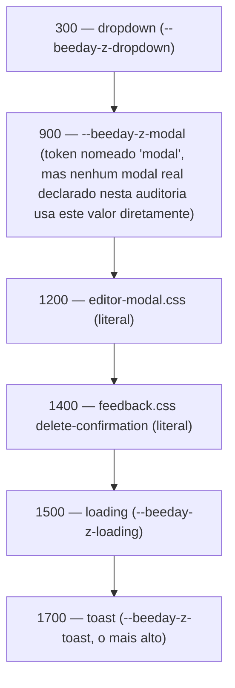

# Foundations

**Fonte da verdade:** verificado diretamente em `src/BeeDay.Web/wwwroot/css/variables.css`,
`theme.css`, `typography.css`, `typography-policy.css`, `utilities.css`, `polish.css`, e um
levantamento completo de todas as ocorrências de `@media` em `src/BeeDay.Web/wwwroot/css/*.css`
(19 arquivos) e `src/BeeDay.Web/Components/**/*.razor.css` (36 arquivos de CSS isolado por
componente — quatro novos na Sprint 21.3 (`Layout/{NavigationItem,NavigationItems,MobileHeader,
MobileSidebar}.razor.css`), um removido (`Layout/TopNavigation.razor.css`, componente deletado —
ver `docs/web/03-layouts.md`), ver abaixo e `docs/ux/03-responsive.md`).

**Última verificação:** 2026-08-15 (Sprint 22.2, EPIC 22 — Hero Image, CTA & Brand Alignment). A
família azul oficial é `#5247F9`/`#3F33F1`/`#1C0EF2`; a família amarela de marca/recompensa usa
`#FFD326`/`#E8BD00`. Nenhum namespace paralelo foi criado — o token contextual
`--beeday-color-public-home-cta`, introduzido na Sprint 21.16 especificamente para o CTA do Hero, foi
removido nesta Sprint em favor do token de marca compartilhado. Nunito continua sendo a única
tipografia de produto; a tipografia própria da marca existe apenas dentro do asset oficial
`beeday-wordmark.png`.

Verificação anterior: 2026-08-15 (Sprint 22.1, EPIC 22 — Public Home Header, Brand & Language
Switcher, correção de Brand Color).
Verificação anterior: 2026-08-14 (Sprint 21.16, EPIC 21 — Brand Blue Refinement) — família azul
`#3A4ED9`/`#3043C7`/`#2637AD`, remigrada integralmente na Sprint 22.1 para a paleta oficial da EPIC 22.
Verificação anterior: 2026-08-12 (Sprint 21.3, EPIC 21 — BeeDay Navigation) — contagem de CSS
isolado corrigida de 33 para 36 (+4 novos, -1 removido); §10 atualizado (5 arquivos agora
coordenam o breakpoint `min-width: 1024px`, `TopNavigation` substituída por `MobileHeader`/
`MobileSidebar`). Verificação anterior: 2026-08-12 (Sprint 21.2, EPIC 21 — BeeDay Shell
Foundation) — §10: novos
tokens de shell `--beeday-sidebar-width`/`--beeday-right-rail-width`/`--beeday-content-max-width`
(escopados em `.beeday-app`, `MainLayout.razor.css`, seguindo o mesmo padrão já usado por
`--beeday-top-navigation-height`/`--beeday-left-panel-width`/`--beeday-right-panel-width` — nenhuma
infraestrutura de tokens nova); novo breakpoint estrutural `min-width: 1024px`; contagem de CSS
isolado corrigida de 29 para 33 (31 já existentes antes desta Sprint — drift pré-existente não
causado por ela, ver `docs/ux/03-responsive.md` — mais os 2 arquivos novos). Verificação anterior:
2026-08-12 (Sprint 20.8, EPIC 20, Sprint final da EPIC) — `--beeday-color-accent`/
`-hover` (`#f29b24`, sem consumidor real confirmado repo-wide) removida; `.beeday-button`/`.beeday-card`
tiveram seu default canônico decidido — a geometria antes opt-in em `--soft` (Sprint 20.6) tornou-se o
default de ambos, e o modificador `--soft` foi removido (ver `02-components.md` §2/§3); background de
imagem do `OnboardingLayout` (Login/Identity/Onboarding/ProfileCreation/Tutorial) removido —
`--beeday-color-background` agora usado. Verificação anterior: 2026-08-12 (Sprint 20.7) — §2:
`--beeday-color-primary` (roxo legado) **removida** — a Sprint 20.7 auditou repo-wide todo consumidor
real e confirmou zero restantes após migrá-los para `--beeday-color-brand-primary`, então o token de
compatibilidade temporário introduzido na Sprint 20.6 foi removido em vez de mantido indefinidamente;
nova foundation `--beeday-color-brand-primary-soft` adicionada; `--beeday-focus-color`/
`--beeday-focus-ring` também migrados (papel único — cor do anel de foco — então migrados diretamente,
sem alias). Verificação anterior: 2026-08-12 (Sprint 20.6) — §2/§3/§5: novo degrau
`--beeday-radius-2xl`, novo token de escala `--beeday-font-size-hero`, novo peso
`--beeday-font-weight-black`, nova família `--beeday-color-brand-primary` (introduzida como canônica
ao lado da legada) e evolução de `--beeday-font-body` (Inter → Nunito) — ver
`docs/epics/20-home-visual-experience/README.md`, seções "Sprint 20.6"/"20.7"/"20.8".

## 1. Objetivo

Documentar todo token de design (`--beeday-*`) que existe no repositório: cores, tipografia,
espaçamento, raio, elevação, movimento, z-index — e os valores de breakpoint realmente usados,
já que não existem como token.

## 2. Cores

Todos os tokens de cor vivem em `:root` de `variables.css`, em 3 blocos (linha 1: paleta de
produto; linha 253: paleta "game"/pixel-console; linha 271: tokens de motion pixel-UI).

### 2.1 Paleta de produto

```mermaid
graph TD
    Brand["Marca (legada)<br/>primary #673ab7, primary-hover, primary-active,<br/>primary-light, primary-soft, accent #f29b24"]
    BrandNew["Marca (canônica, Sprint 20.6)<br/>brand-primary #2538d2, -hover, -active, -light"]
    Surface["Superfícies<br/>background, surface, surface-muted,<br/>surface-subtle, overlay"]
    Content["Conteúdo<br/>text-primary, text-secondary, text-muted,<br/>text-inverse, border, border-strong"]
    Status["Status<br/>success, warning, danger, info<br/>(cada um com variante -soft)"]
    Activity["Acentos de atividade<br/>task, todo, project (+ -dark)"]
    Attribute["Atributos de atividade<br/>strength, dexterity, intelligence, vitality"]
    Habit["Cores de Hábito (7)<br/>white, yellow, green, sky,<br/>red-light, red-medium, red-strong (+ -dark)"]
    Button["Paletas de botão (8 variantes)<br/>bg, bg-hover, fg, outline, depth, shadow[, focus]"]
    Comic["Paletas 'comic' (7)<br/>blue, yellow, back, danger, neutral, success, orange, magenta"]
    Card["Cores de card<br/>title, description, star, meta-text, meta-bg"]
    Chrome["Chrome do dashboard<br/>icon, icon-surface, filter-surface-tint, board-surface"]
```



Nenhuma cor é definida duas vezes com valores diferentes sob o mesmo nome — cada família (Brand,
Status, Activity, Attribute, Habit, Button, Comic, Card, Chrome) tem seu próprio namespace de
token, então uma alteração em uma família nunca risca colidir com outra.

**Migração de marca atual (Sprint 22.1, EPIC 22):** `--beeday-color-brand-primary` é `#5247F9`,
com hover `#3F33F1`, active/depth `#1C0EF2`, light `#827AFC` e soft `#F8F7FF` — remigração completa
da família Sprint 21.16 (`#3A4ED9`), aprovada como cor oficial da marca para a EPIC 22. Hover/active/
light/soft preservam a mesma matiz e os mesmos deslocamentos de saturação/luminosidade relativos à
base que a família anterior usava, então a escada permanece coerente sob a nova matiz. `--beeday-focus-color`
e as sombras `--beeday-shadow-xs/-sm/-md/-lg` (literais `rgb()`, pois CSS não extrai canais de uma
custom property em hex) foram atualizados para os mesmos canais RGB da nova base (`82 71 249`). Azul
é estrutura e ação: primary buttons, links importantes, navegação/foco/seleção e progresso funcional.
A segunda metade da identidade é canônica em `--beeday-color-brand-yellow` (`#FFD326`) e `-hover`
(`#E8BD00`): reward, XP, milestones e highlights de alta relevância, sempre com foreground escuro. O
antigo namespace `--beeday-game-yellow*` foi removido. Cores de status (`success`, `warning`,
`danger`, `info`), atividades e Wallet permanecem semanticamente independentes; brand yellow nunca
significa warning automaticamente e brand blue não substitui info. O token contextual
`--beeday-color-public-home-cta` (`#0079B9` e variantes, Sprint 21.16, ajustado por contraste AA
sobre um fundo cyan que não existe mais no Hero) foi removido na Sprint 22.2 — o CTA `Get started`
da Public Home agora usa `--beeday-color-brand-primary` diretamente, como qualquer outro botão
primário do produto, sem paleta paralela.

Surfaces permanecem neutras. Azul e amarelo devem ganhar importância por contraste e hierarquia,
não por preencher indiscriminadamente cards ou páginas. É proibido criar famílias `new`/`v2`, usar
texto branco sobre amarelo, ou codificar os HEX de marca diretamente em componentes/assets.

**Histórico (Sprint 21.16, EPIC 21):** `--beeday-color-brand-primary` era `#3A4ED9`, com hover
`#3043C7`, active/depth `#2637AD`, light `#6675E3` e soft `#EFF1FF` — família remigrada integralmente
na Sprint 22.1 (ver acima); nenhum consumidor manteve o valor antigo.

**Histórico (Sprint 20.7, EPIC 20):** `--beeday-color-brand-primary` (`#2538d2`,
extraído diretamente da página-modelo) é a cor primária **canônica** de todo o produto. Introduzida na
Sprint 20.6 ao lado de `--beeday-color-primary` (`#673ab7`, roxo) mantida como compatibilidade
temporária; a Sprint 20.7 auditou repo-wide todo consumidor real de `--beeday-color-primary`
(classificando cada um por semântica — brand vs. status vs. activity, nunca um search/replace cego),
migrou todos os que eram genuinamente de marca/chrome genérico, e confirmou **zero consumidores
restantes** — por isso `--beeday-color-primary` foi **removida** de `variables.css`, em vez de mantida
indefinidamente. Cores de status (`success`/`warning`/`danger`/`info`) e de atividade
(`task`/`todo`/`project`/atributos/hábitos) nunca usaram este token para sua própria semântica — não
foram tocadas. O amarelo de acento da referência (`#ffd326`/`#ffb72e`) não ganhou token novo —
`--beeday-game-yellow` (`#ffc928`) já é próximo o suficiente e foi reutilizado como está.

### 2.2 Paleta "game" (pixel-console)

Bloco `:root` separado: `--beeday-game-ink`, `-ink-soft`, `-paper`, `-panel`, `-blue`,
`-blue-dark`, `-red`, `-green`, mais 3 tokens de borda/sombra
pixel-style (`-border`, `-shadow-sm/md/lg`). Consumida pelos botões "comic"/"skew-press"/
"comic-press" (`design-system.css`) e pelo adapter NES (`pixel-nes.css`).

### 2.3 Cores hardcoded fora do sistema de tokens

Vários arquivos declaram cores literais em vez de referenciar um token — não é um erro (muitas são
estados pontuais como `#dff5df`/`#761919` em `identity.css` para feedback de sucesso/erro), mas
significa que uma paleta única e auditável não cobre 100% das cores do repositório. Exemplos:
`identity.css` (feedback success/error, cores literais distintas de `--beeday-color-success`/
`-danger`), `feedback.css` (`#e2f5e9`/`#fde8e8` para ícones de toast), `cards.css`
(`#b9b1c2`, `#756c7d`).

## 3. Tipografia

`typography.css` define os tokens; `typography-policy.css` (132 linhas) é o único arquivo do
repositório inteiro que documenta, por comentário e por seletor, **quando** cada fonte deve ser
usada — funciona como uma política de tipografia executável, não apenas uma referência de tokens.

| Papel | Fonte | Uso documentado em `typography-policy.css` |
|---|---|---|
| `--beeday-font-body` (= `--beeday-font-family`) | `"Nunito", "Segoe UI", sans-serif` | Toda a UI: corpo, títulos, marca, navegação, botões, dialogs, cards e métricas |

**Consolidação canônica (Sprints 21.4/21.9, EPIC 21):** Jersey 25 foi retirada integralmente da UI
e do carregamento de fontes. Títulos usam Nunito 700/800 e botões Nunito 700; o antigo
`--beeday-font-ui` foi removido. `BeeDayBrand` não compõe mais a marca com uma fonte de produto:
encapsula a wordmark oficial, cuja tipografia própria está desenhada no PNG. Brand typography e
product typography são responsabilidades distintas.

**Histórico (Sprint 20.6, EPIC 20):** `--beeday-font-body` evoluiu de Inter para Nunito —
troca de valor imediata e project-wide (toda a UI regular do produto já renderiza Nunito), extraída
diretamente da página-modelo (fonte dominante de toda a referência) e aplicada de uma vez porque é
uma substituição puramente tipográfica, sem contrato de layout/comportamento em risco. `Google
Fonts` em `App.razor` foi atualizado (`family=Nunito:wght@400;600;700;800;900`). `--beeday-font-ui`
(Jersey 25) **não foi migrada** — permanece a identidade exclusiva do chrome pixel-console/retro-game
(`BeeDayButton`, reforçado com `!important` em `typography-policy.css`; `BeeDayBrand`; títulos de
página/card; `pixel-ui.css`), uma responsabilidade de marca real e formalmente documentada
anteriormente a esta Sprint, não apenas compatibilidade visual histórica.

Escala de tamanho (8 degraus, `xs` .75rem → `3xl` 2.2rem, mais o degrau fluido
`--beeday-font-size-hero: clamp(2.75rem, 7vw, 5.5rem)` acrescentado na Sprint 20.6/EPIC 20 para
headlines de hero/marketing em escala full-bleed — usado por `Home.razor.css`), peso (6: regular 400
→ black 900 — `extrabold` e `bold` compartilham o mesmo valor 700, não há um peso 800 real;
`--beeday-font-weight-black: 900` acrescentado na Sprint 20.6/EPIC 20 para o peso de display da
headline/eyebrow do hero, igualando o peso 900 consistentemente usado pela página-modelo), altura de
linha (3: tight 1.2, normal 1.5, relaxed 1.65), `letter-spacing-label` (.04em) e 7 tokens compostos
`--beeday-type-*` (`display`, `title`, `subtitle`, `label`, `body`, `small`, `button`) que combinam
peso/tamanho/altura de linha/família num único valor `font` shorthand.

`typography-policy.css` reforça a política com `!important` em dois pontos deliberados: a família
de `.beeday-button` (linha 19) e seu `font-weight` (linha 52) — comentário no próprio arquivo
explica que isso existe para que nenhuma variante/modificador/classe legada consiga renderizar o
botão em negrito por acidente.

## 4. Espaçamento

Escala linear de 9 degraus em `variables.css`, todos em `rem`:

```text
2xs .125rem  xs .25rem  sm .5rem  smd .75rem  md 1rem  lg 1.5rem  xl 2rem  2xl 3rem  3xl 4rem
```

`polish.css` acrescenta uma segunda escala paralela e mais grossa, com nome próprio, usada para
ritmo de página em vez de espaçamento interno de componente: `--beeday-grid` (.5rem — mesmo valor
de `--beeday-spacing-sm`, mas token separado), `--beeday-control-height-{sm,md,lg}` (2.5/3/3.5rem),
`--beeday-page-gutter` (`clamp(1rem, 2.5vw, 2rem)`), `--beeday-section-gap` (`clamp(1.5rem, 3vw,
2.5rem)`), `--beeday-reading-width` (72rem, mas sobrescrita para `100%` abaixo de 60rem — ver §9).

`activity-design-system.css` define uma **terceira** escala de espaçamento, com seu próprio prefixo
(`--activity-space-{xs,sm,md,lg}` = .25/.5/.75/1rem), escopada aos cards de atividade — os valores
coincidem numericamente com o início da escala principal, mas são tokens distintos, não aliases.

## 5. Border radius

7 degraus em `variables.css`: `xs` .2rem, `sm` .375rem, `md` .625rem, `lg` .75rem, `xl` 1rem,
`2xl` 1.5rem (consolidados na Sprint 21.4 para controles, navegação, cards e dialogs;
desde a Sprint 20.8 é o radius default do `BeeDayCard` em si, não mais um modificador opt-in), `pill`
999px (desde a Sprint 20.8, também o radius default do `BeeDayButton`). `activity-design-system.css`
define mais dois, próprios (`--activity-radius-sm` .25rem, `--activity-radius-md` .4rem) — mesmo
padrão de escala paralela do §4; não afetados pela mudança de default de `BeeDayCard` porque
`.activity-card`/`.habit-card` (`cards.css`) já redeclaram sua própria borda/radius/sombra por
completo, mesmo renderizando `<BeeDayCard>` como raiz (ver `02-components.md` §3).

## 6. Elevação (sombra)

4 degraus em `variables.css` (`--beeday-shadow-xs/sm/md/lg`), todos `box-shadow` compostos (2
camadas para `sm`/`md`). `activity-design-system.css` acrescenta `--activity-shadow-rest`/
`-hover`, valores próprios não derivados dos 4 degraus principais. A paleta "game" acrescenta 3
sombras "pixel" (`--beeday-game-shadow-sm/md/lg`) — offset sólido sem blur (`0 3px 0 var(--beeday-game-ink)`),
usadas pelos botões "comic"/"comic-press" em vez das sombras com blur do sistema principal.

A Sprint 21.4 reduziu os quatro níveis globais para elevação sutil/controlada e acrescentou
`--beeday-depth-sm/md/lg` (2/4/8px) como foundation física de borda para componentes futuros, sem
aplicá-la antecipadamente ao `BeeDayButton`. `--beeday-border-width` (2px) e
`--beeday-color-border-interactive` completam o contrato de bordas reutilizável.

## 7. Movimento

| Token | Valor | Uso |
|---|---|---|
| `--beeday-duration-fast/normal/slow` | 120/180/260ms | Transições padrão |
| `--beeday-easing-standard` | `cubic-bezier(.2,0,0,1)` | Padrão |
| `--beeday-easing-emphasized` | `cubic-bezier(.2,.8,.2,1)` | Entradas/hovers com mais destaque |
| `--beeday-transition-fast/normal/emphasized` | duração + easing compostos | Atalho de `transition` |
| `--beeday-duration-instant/interaction/panel` | 70/140/220ms | Segunda escala, "Sprint 3.5 Pixel UI" — usada por `pixel-ui.css` |
| `--beeday-easing-pixel` | `steps(2, end)` | Easing "passo a passo", estética pixel, usado só por `pixel-ui.css` |

Todo `@keyframes`/transição do repositório respeita `prefers-reduced-motion: reduce` — confirmado
por 12+ blocos `@media (prefers-reduced-motion: reduce)` distintos, um por arquivo de CSS que
declara animação (ver [`docs/ux/02-accessibility.md`](../ux/02-accessibility.md) §5).

## 8. Z-index

4 tokens em `variables.css`: `--beeday-z-dropdown` 300, `--beeday-z-modal` 900, `--beeday-z-loading`
1500, `--beeday-z-toast` 1700. **Nem todo elemento sobreposto usa esses tokens** — `feedback.css`
declara `z-index: 1400` (backdrop de `delete-confirmation`) e `editor-modal.css` declara
`z-index: 1200` (backdrop do editor) como números literais, não `var(--beeday-z-modal)`, apesar de
estarem na mesma faixa conceitual de "modal". A ordem relativa resultante (dropdown 300 < editor
1200 < confirmação de exclusão 1400 < modal genérico 900 [sic — abaixo dos dois anteriores] <
loading 1500 < toast 1700) tem uma inversão: `--beeday-z-modal` (900) é *menor* que os dois
z-index literais de modal real (1200, 1400) usados na prática — o token nomeado "modal" não é o
maior valor da pilha de modais.



## 9. Duas camadas de CSS: global e isolado por componente

Além das 19 folhas globais em `wwwroot/css/` (carregadas por `<link>` em `App.razor`
— ver [`docs/web/05-design-system-integration.md`](../web/05-design-system-integration.md) §3),
o repositório tem **30 arquivos de CSS isolado por componente** (`*.razor.css`, 3.886 linhas —
quase o mesmo volume que as folhas globais), compilados pelo SDK Blazor em
`BeeDay.Web.styles.css` — o bundle que `App.razor` carrega por último (ver
[`docs/web/05-design-system-integration.md`](../web/05-design-system-integration.md) §3). A Sprint
16.7 registrou a existência desse bundle mas não enumerou os 30 arquivos-fonte que o compõem — essa
lacuna é preenchida aqui. Distribuição por área: 8 em `Components/DesignSystem/` (inclui as 2
páginas de catálogo), 5 em `Components/Layout/`, 17 em `Components/Features/*`. Cada arquivo
estiliza exclusivamente o componente do mesmo nome —
CSS isolation do Blazor gera seletores com escopo automático (`b-xxxxxxxxxx`), então essas regras
nunca vazam para outros componentes nem são sobrescritas por eles, ao contrário do padrão de
"múltiplas declarações do mesmo seletor" observado nas folhas globais (`cards.css`/`wallet.css`,
ver [`README.md`](README.md#achados-relevantes-reportados-não-corrigidos)).

**Consequência para tokens:** nem todo componente com CSS isolado usa exclusivamente tokens
`--beeday-*`. **Resolvido (Sprint 20.7):** `Layout/TopNavigation.razor.css`, `Layout/MainLayout.razor.css`,
`Layout/AccountSidePanel.razor.css` e `Layout/ProfileSidePanel.razor.css` declaravam `background: #5b1095`
como cor literal (repetida em 4 arquivos) em vez de um token — migrado para
`var(--beeday-color-brand-primary-active)`, um único token canônico para a superfície "authenticated
shell" compartilhada pelos quatro.

## 10. Breakpoints e grid

**Não existe um token de breakpoint** para os valores em pixel/rem — toda `@media (max-width:
...)`/`(min-width: ...)` do repositório usa um valor literal, por arquivo, sem referência a uma
variável compartilhada, verdade tanto para as 19 folhas globais quanto para os 36 arquivos de CSS
isolado do §9. **Exceção parcial desde a Sprint 21.2 (EPIC 21):** o breakpoint estrutural do shell
(`min-width: 1024px`) não usa uma variável de breakpoint (CSS não permite `var()` dentro de uma
media feature), mas *é* aplicado como o mesmo valor literal coordenado em 5 arquivos de
`Components/Layout/` (`MainLayout`, `DesktopSidebar`, `RightRail`, `MobileHeader`, `MobileSidebar`
— `TopNavigation` usava esse mesmo corte até ser removida na Sprint 21.3, absorvida por
`MobileHeader`/`MobileSidebar`) — o primeiro caso do repositório de um corte reutilizado
deliberadamente em vez de reinventado por arquivo; ver
[`docs/ux/03-responsive.md`](../ux/03-responsive.md) §3. A lista completa (30 breakpoints
distintos: 26 em `max-width`, 3 em `min-width`, 1 em `max-height`) está em
[`docs/ux/03-responsive.md`](../ux/03-responsive.md) §2, junto com os casos em que o mesmo
propósito visual usa cortes diferentes (ex.: `650px` em `cards.css` vs. `640px` em `wallet.css`;
`760px` em 4 arquivos de Layout distintos vs. `720px`/`700px` em Features próximas ao mesmo
propósito).

Grid/largura de conteúdo: `--beeday-content-width: 100%` (`variables.css`, sem uso aparente além da
própria declaração), `.beeday-container` (`utilities.css`, `width: min(100% - 2rem, 1440px)`),
`--beeday-reading-width: 72rem` (`polish.css`, aplicado a `.beeday-main > :where(section, article,
.beeday-page, .page-content)`, reduzido a `100%` abaixo de 60rem). Não há um sistema de colunas
(12-col grid, `grid-template-columns` compartilhado) — cada componente declara seu próprio
`grid-template-columns` ad hoc (`.dashboard-skeleton__grid`: `repeat(4, minmax(0,1fr))`, reduzido
a 2 e depois 1 coluna via `@media`; `.wallet-summary`: `1.4fr 1fr 1fr`, etc.).

## 11. Fontes consultadas

- `src/BeeDay.Web/wwwroot/css/variables.css`, `theme.css`, `typography.css`,
  `typography-policy.css`, `utilities.css`, `polish.css`, `activity-design-system.css`.
- Todas as ocorrências de `@media` em `src/BeeDay.Web/wwwroot/css/*.css` (19 arquivos) e em todo
  `src/BeeDay.Web/Components/**/*.razor.css` (30 arquivos) — levantamento completo de ambas as
  camadas de CSS.
- `src/BeeDay.Web/Components/Layout/TopNavigation.razor.css`, `MainLayout.razor.css` (cores
  literais fora do sistema de tokens, §9).
- Documentação relacionada: [`docs/ux/03-responsive.md`](../ux/03-responsive.md),
  [`docs/ux/02-accessibility.md`](../ux/02-accessibility.md),
  [`docs/web/05-design-system-integration.md`](../web/05-design-system-integration.md).
