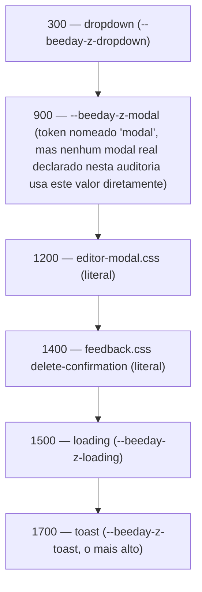

# Foundations

**Fonte da verdade:** verificado diretamente em `src/BeeDay.Web/wwwroot/css/variables.css`,
`theme.css`, `typography.css`, `typography-policy.css`, `utilities.css`, `polish.css`, e um
levantamento completo de todas as ocorrências de `@media` em `src/BeeDay.Web/wwwroot/css/*.css`
(19 arquivos) e `src/BeeDay.Web/Components/**/*.razor.css` (30 arquivos de CSS isolado por
componente).

**Última verificação:** 2026-08-07.

## 1. Objetivo

Documentar todo token de design (`--beeday-*`) que existe no repositório: cores, tipografia,
espaçamento, raio, elevação, movimento, z-index — e os valores de breakpoint realmente usados,
já que não existem como token.

## 2. Cores

Todos os tokens de cor vivem em `:root` de `variables.css`, em 3 blocos (linha 1: paleta de
produto; linha 253: paleta "game"/pixel-console; linha 271: tokens de motion pixel-UI).

### 2.1 Paleta de produto

```mermaid
graph TD
    Brand["Marca<br/>primary #673ab7, primary-hover, primary-active,<br/>primary-light, primary-soft, accent #f29b24"]
    Surface["Superfícies<br/>background, surface, surface-muted,<br/>surface-subtle, overlay"]
    Content["Conteúdo<br/>text-primary, text-secondary, text-muted,<br/>text-inverse, border, border-strong"]
    Status["Status<br/>success, warning, danger, info<br/>(cada um com variante -soft)"]
    Activity["Acentos de atividade<br/>task, todo, project (+ -dark)"]
    Attribute["Atributos de atividade<br/>strength, dexterity, intelligence, vitality"]
    Habit["Cores de Hábito (7)<br/>white, yellow, green, sky,<br/>red-light, red-medium, red-strong (+ -dark)"]
    Button["Paletas de botão (8 variantes)<br/>bg, bg-hover, fg, outline, depth, shadow[, focus]"]
    Comic["Paletas 'comic' (7)<br/>blue, yellow, back, danger, neutral, success, orange, magenta"]
    Card["Cores de card<br/>title, description, star, meta-text, meta-bg"]
    Chrome["Chrome do dashboard<br/>icon, icon-surface, filter-surface-tint, board-surface"]
```



Nenhuma cor é definida duas vezes com valores diferentes sob o mesmo nome — cada família (Brand,
Status, Activity, Attribute, Habit, Button, Comic, Card, Chrome) tem seu próprio namespace de
token, então uma alteração em uma família nunca risca colidir com outra.

### 2.2 Paleta "game" (pixel-console)

Bloco `:root` separado (linha 253): `--beeday-game-ink`, `-ink-soft`, `-paper`, `-panel`, `-blue`,
`-blue-dark`, `-yellow`, `-yellow-dark`, `-red`, `-green`, mais 3 tokens de borda/sombra
pixel-style (`-border`, `-shadow-sm/md/lg`). Consumida pelos botões "comic"/"skew-press"/
"comic-press" (`design-system.css`) e pelo adapter NES (`pixel-nes.css`).

### 2.3 Cores hardcoded fora do sistema de tokens

Vários arquivos declaram cores literais em vez de referenciar um token — não é um erro (muitas são
estados pontuais como `#dff5df`/`#761919` em `identity.css` para feedback de sucesso/erro), mas
significa que uma paleta única e auditável não cobre 100% das cores do repositório. Exemplos:
`identity.css` (feedback success/error, cores literais distintas de `--beeday-color-success`/
`-danger`), `feedback.css` (`#e2f5e9`/`#fde8e8` para ícones de toast), `cards.css`
(`#b9b1c2`, `#756c7d`).

## 3. Tipografia

`typography.css` define os tokens; `typography-policy.css` (132 linhas) é o único arquivo do
repositório inteiro que documenta, por comentário e por seletor, **quando** cada fonte deve ser
usada — funciona como uma política de tipografia executável, não apenas uma referência de tokens.

| Papel | Fonte | Uso documentado em `typography-policy.css` |
|---|---|---|
| `--beeday-font-body` | `"Inter", "Segoe UI", sans-serif` | Todo texto de UI regular: parágrafos, descrições, formulários, inputs, tabelas, dialogs, navegação, menus, valores, contadores, estatísticas, saldos |
| `--beeday-font-ui` (= `--beeday-font-family`) | `"Jersey 25", "Segoe UI", sans-serif` | Reservada a títulos de página/card, botões estilizados (`BeeDayButton`) e marca (`BeeDayBrand`) |

Escala de tamanho (8 degraus, `xs` .75rem → `3xl` 2.2rem), peso (5: regular 400 → extrabold 700 —
`extrabold` e `bold` compartilham o mesmo valor 700, não há um peso 800 real), altura de linha (3:
tight 1.2, normal 1.5, relaxed 1.65), `letter-spacing-label` (.04em) e 7 tokens compostos
`--beeday-type-*` (`display`, `title`, `subtitle`, `label`, `body`, `small`, `button`) que combinam
peso/tamanho/altura de linha/família num único valor `font` shorthand.

`typography-policy.css` reforça a política com `!important` em dois pontos deliberados: a família
de `.beeday-button` (linha 19) e seu `font-weight` (linha 52) — comentário no próprio arquivo
explica que isso existe para que nenhuma variante/modificador/classe legada consiga renderizar o
botão em negrito por acidente.

## 4. Espaçamento

Escala linear de 9 degraus em `variables.css`, todos em `rem`:

```text
2xs .125rem  xs .25rem  sm .5rem  smd .75rem  md 1rem  lg 1.5rem  xl 2rem  2xl 3rem  3xl 4rem
```

`polish.css` acrescenta uma segunda escala paralela e mais grossa, com nome próprio, usada para
ritmo de página em vez de espaçamento interno de componente: `--beeday-grid` (.5rem — mesmo valor
de `--beeday-spacing-sm`, mas token separado), `--beeday-control-height-{sm,md,lg}` (2.5/3/3.5rem),
`--beeday-page-gutter` (`clamp(1rem, 2.5vw, 2rem)`), `--beeday-section-gap` (`clamp(1.5rem, 3vw,
2.5rem)`), `--beeday-reading-width` (72rem, mas sobrescrita para `100%` abaixo de 60rem — ver §9).

`activity-design-system.css` define uma **terceira** escala de espaçamento, com seu próprio prefixo
(`--activity-space-{xs,sm,md,lg}` = .25/.5/.75/1rem), escopada aos cards de atividade — os valores
coincidem numericamente com o início da escala principal, mas são tokens distintos, não aliases.

## 5. Border radius

6 degraus em `variables.css`: `xs` .2rem, `sm` .375rem, `md` .625rem, `lg` .875rem, `xl` 1.25rem,
`pill` 999px. `activity-design-system.css` define mais dois, próprios (`--activity-radius-sm` .25rem,
`--activity-radius-md` .4rem) — mesmo padrão de escala paralela do §4.

## 6. Elevação (sombra)

4 degraus em `variables.css` (`--beeday-shadow-xs/sm/md/lg`), todos `box-shadow` compostos (2
camadas para `sm`/`md`). `activity-design-system.css` acrescenta `--activity-shadow-rest`/
`-hover`, valores próprios não derivados dos 4 degraus principais. A paleta "game" acrescenta 3
sombras "pixel" (`--beeday-game-shadow-sm/md/lg`) — offset sólido sem blur (`0 3px 0 var(--beeday-game-ink)`),
usadas pelos botões "comic"/"comic-press" em vez das sombras com blur do sistema principal.

## 7. Movimento

| Token | Valor | Uso |
|---|---|---|
| `--beeday-duration-fast/normal/slow` | 120/180/260ms | Transições padrão |
| `--beeday-easing-standard` | `cubic-bezier(.2,0,0,1)` | Padrão |
| `--beeday-easing-emphasized` | `cubic-bezier(.2,.8,.2,1)` | Entradas/hovers com mais destaque |
| `--beeday-transition-fast/normal/emphasized` | duração + easing compostos | Atalho de `transition` |
| `--beeday-duration-instant/interaction/panel` | 70/140/220ms | Segunda escala, "Sprint 3.5 Pixel UI" — usada por `pixel-ui.css` |
| `--beeday-easing-pixel` | `steps(2, end)` | Easing "passo a passo", estética pixel, usado só por `pixel-ui.css` |

Todo `@keyframes`/transição do repositório respeita `prefers-reduced-motion: reduce` — confirmado
por 12+ blocos `@media (prefers-reduced-motion: reduce)` distintos, um por arquivo de CSS que
declara animação (ver [`docs/ux/02-accessibility.md`](../ux/02-accessibility.md) §5).

## 8. Z-index

4 tokens em `variables.css`: `--beeday-z-dropdown` 300, `--beeday-z-modal` 900, `--beeday-z-loading`
1500, `--beeday-z-toast` 1700. **Nem todo elemento sobreposto usa esses tokens** — `feedback.css`
declara `z-index: 1400` (backdrop de `delete-confirmation`) e `editor-modal.css` declara
`z-index: 1200` (backdrop do editor) como números literais, não `var(--beeday-z-modal)`, apesar de
estarem na mesma faixa conceitual de "modal". A ordem relativa resultante (dropdown 300 < editor
1200 < confirmação de exclusão 1400 < modal genérico 900 [sic — abaixo dos dois anteriores] <
loading 1500 < toast 1700) tem uma inversão: `--beeday-z-modal` (900) é *menor* que os dois
z-index literais de modal real (1200, 1400) usados na prática — o token nomeado "modal" não é o
maior valor da pilha de modais.



## 9. Duas camadas de CSS: global e isolado por componente

Além das 19 folhas globais em `wwwroot/css/` (3.939 linhas, carregadas por `<link>` em `App.razor`
— ver [`docs/web/05-design-system-integration.md`](../web/05-design-system-integration.md) §3),
o repositório tem **30 arquivos de CSS isolado por componente** (`*.razor.css`, 3.886 linhas —
quase o mesmo volume que as folhas globais), compilados pelo SDK Blazor em
`BeeDay.Web.styles.css` — o bundle que `App.razor` carrega por último (ver
[`docs/web/05-design-system-integration.md`](../web/05-design-system-integration.md) §3). A Sprint
16.7 registrou a existência desse bundle mas não enumerou os 30 arquivos-fonte que o compõem — essa
lacuna é preenchida aqui. Distribuição por área: 8 em `Components/DesignSystem/` (inclui as 2
páginas de catálogo), 5 em `Components/Layout/`, 17 em `Components/Features/*`. Cada arquivo
estiliza exclusivamente o componente do mesmo nome —
CSS isolation do Blazor gera seletores com escopo automático (`b-xxxxxxxxxx`), então essas regras
nunca vazam para outros componentes nem são sobrescritas por eles, ao contrário do padrão de
"múltiplas declarações do mesmo seletor" observado nas folhas globais (`cards.css`/`wallet.css`,
ver [`README.md`](README.md#achados-relevantes-reportados-não-corrigidos)).

**Consequência para tokens:** nem todo componente com CSS isolado usa exclusivamente tokens
`--beeday-*`. Exemplo confirmado: `Layout/TopNavigation.razor.css` declara `background: #5b1095`
como cor literal — próxima de, mas diferente de, `--beeday-color-primary` (`#673ab7`) — então a
barra de navegação superior tem uma cor de marca que não é a mesma variável usada pelo resto do
produto. `Layout/MainLayout.razor.css` repete o mesmo literal `#5b1095` para os trilhos laterais
colapsados, mantendo consistência *entre si*, mas não com o token central.

## 10. Breakpoints e grid

**Não existe um token de breakpoint.** Toda `@media (max-width: ...)`/`(min-width: ...)` do
repositório usa um valor literal, por arquivo, sem referência a uma variável compartilhada —
verdade tanto para as 19 folhas globais quanto para os 30 arquivos de CSS isolado do §9. A lista
completa (29 breakpoints distintos: 26 em `max-width`, 2 em `min-width`, 1 em `max-height`) está em
[`docs/ux/03-responsive.md`](../ux/03-responsive.md) §2, junto com os casos em que o mesmo
propósito visual usa cortes diferentes (ex.: `650px` em `cards.css` vs. `640px` em `wallet.css`;
`760px` em 4 arquivos de Layout distintos vs. `720px`/`700px` em Features próximas ao mesmo
propósito).

Grid/largura de conteúdo: `--beeday-content-width: 100%` (`variables.css`, sem uso aparente além da
própria declaração), `.beeday-container` (`utilities.css`, `width: min(100% - 2rem, 1440px)`),
`--beeday-reading-width: 72rem` (`polish.css`, aplicado a `.beeday-main > :where(section, article,
.beeday-page, .page-content)`, reduzido a `100%` abaixo de 60rem). Não há um sistema de colunas
(12-col grid, `grid-template-columns` compartilhado) — cada componente declara seu próprio
`grid-template-columns` ad hoc (`.dashboard-skeleton__grid`: `repeat(4, minmax(0,1fr))`, reduzido
a 2 e depois 1 coluna via `@media`; `.wallet-summary`: `1.4fr 1fr 1fr`, etc.).

## 11. Fontes consultadas

- `src/BeeDay.Web/wwwroot/css/variables.css`, `theme.css`, `typography.css`,
  `typography-policy.css`, `utilities.css`, `polish.css`, `activity-design-system.css`.
- Todas as ocorrências de `@media` em `src/BeeDay.Web/wwwroot/css/*.css` (19 arquivos) e em todo
  `src/BeeDay.Web/Components/**/*.razor.css` (30 arquivos) — levantamento completo de ambas as
  camadas de CSS.
- `src/BeeDay.Web/Components/Layout/TopNavigation.razor.css`, `MainLayout.razor.css` (cores
  literais fora do sistema de tokens, §9).
- Documentação relacionada: [`docs/ux/03-responsive.md`](../ux/03-responsive.md),
  [`docs/ux/02-accessibility.md`](../ux/02-accessibility.md),
  [`docs/web/05-design-system-integration.md`](../web/05-design-system-integration.md).
