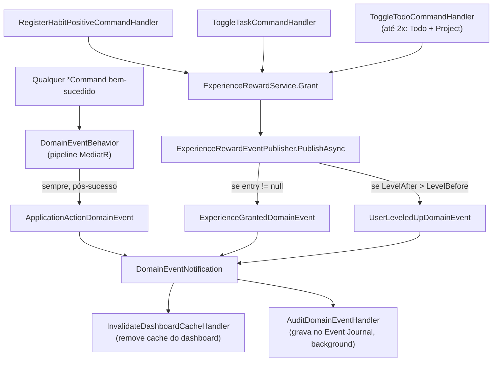

# Domain Events

**Fonte da verdade:** verificado diretamente em `src/BeeDay.Domain/Events/`,
`src/BeeDay.Application/Common/Behaviors/DomainEventBehavior.cs`,
`src/BeeDay.Application/Common/Experience/ExperienceRewardEventPublisher.cs`,
`src/BeeDay.Application/Common/Events/DomainEventNotification.cs`,
`InvalidateDashboardCacheHandler.cs`, `AuditDomainEventHandler.cs`.

## Achado estrutural importante

Nenhuma entidade de `src/BeeDay.Domain` constrói um Domain Event. Diferente do padrão clássico
"Aggregate acumula eventos, Infrastructure os despacha ao salvar", neste código os 3 tipos de
evento são construídos inteiramente pela camada `Application`, depois que uma operação já foi
bem-sucedida — confirmado por busca de `new ApplicationActionDomainEvent`/
`new ExperienceGrantedDomainEvent`/`new UserLeveledUpDomainEvent` em todo `src/`: as três únicas
ocorrências estão em `DomainEventBehavior.cs` e `ExperienceRewardEventPublisher.cs`, ambos em
`BeeDay.Application`.

## Os 3 Domain Events

| Evento | Arquivo | Campos |
|---|---|---|
| `ApplicationActionDomainEvent` | `Events/ApplicationActionDomainEvent.cs` | `Action`, `Category`, `EntityId?` |
| `ExperienceGrantedDomainEvent` | `Events/ExperienceGrantedDomainEvent.cs` | `UserId`, `TransactionId`, `Amount`, `SourceType`, `SourceId`, `RewardType`, `GrantedAtUtc` |
| `UserLeveledUpDomainEvent` | `Events/UserLeveledUpDomainEvent.cs` | `UserId`, `ExperienceEntryId`, `PreviousLevel`, `NewLevel`, `LevelsGained`, `ExperienceAmount`, `ExperienceSource`, `OccurredAtUtc` |

Todos `sealed record`, herdam de `DomainEvent` (`Events/DomainEvent.cs`, `abstract record` com
`EventId`/`OccurredOnUtc` gerados automaticamente), que implementa `IDomainEvent`
(`Events/IDomainEvent.cs`).

## Quem publica, quando, por quê

### `ApplicationActionDomainEvent` — genérico, todo Command

Publicado por `DomainEventBehavior<TRequest,TResponse>`
(`src/BeeDay.Application/Common/Behaviors/DomainEventBehavior.cs`), um `IPipelineBehavior` do
MediatR aplicado a **toda** requisição, mas que só age se `typeof(TRequest).Name` terminar em
`"Command"` (Queries são ignoradas). Publicado **depois** que `next(cancellationToken)` (o Handler)
já executou com sucesso — nunca antes, nunca em caso de exceção.

- `Action` = nome completo do Command (ex. `"CreateHabitCommand"`).
- `Category` = nome do Command sem o sufixo `"Command"` (ex. `"CreateHabit"`).
- `EntityId` = valor de uma propriedade chamada literalmente `Id` no Request, via reflexão, se
  existir (`null` caso contrário).

Ou seja: **toda** operação de escrita bem-sucedida no sistema gera este evento — é um log de
auditoria de "algo aconteceu", não um evento de negócio específico.

### `ExperienceGrantedDomainEvent` — toda concessão de XP

Publicado por `ExperienceRewardEventPublisher.PublishAsync`
(`src/BeeDay.Application/Common/Experience/ExperienceRewardEventPublisher.cs`), chamado
explicitamente pelos Handlers que concedem XP (não é automático via pipeline). Só é publicado se
uma `ExperienceEntry` foi de fato criada (`entry?.Source.ReferenceId is Guid sourceId` — se
`TryAdd` recusou por duplicidade, `entry` é `null` e nada é publicado).

**Pontos de concessão de XP confirmados** (todos chamam `ExperienceRewardService.Grant` seguido de
`ExperienceRewardEventPublisher.PublishAsync`):

| Ação do usuário | Handler | `ExperienceSourceType` | Recompensa (`ExperienceRewardPolicy`) |
|---|---|---|---|
| Registrar reforço positivo de um Habit | `RegisterHabitPositiveCommandHandler` | `Habit` | 1 XP |
| Marcar RecurringTask como concluída | `ToggleTaskCommandHandler` | `Task` | 5 XP |
| Marcar Todo como concluído | `ToggleTodoCommandHandler` | `Todo` | 7 XP |
| Todo concluído completa o Project pai | `ToggleTodoCommandHandler` (segunda concessão, condicional) | `Project` | 20 XP |

Reforço negativo de Habit (`RegisterHabitNegativeCommandHandler`) **nunca** concede XP.

### `UserLeveledUpDomainEvent` — só quando a concessão cruza um nível

Publicado pela mesma `ExperienceRewardEventPublisher.PublishAsync`, **depois** de
`ExperienceGrantedDomainEvent`, e só se `entry.LevelAfter > entry.LevelBefore`. A comparação de
nível acontece dentro do Domain (`User.TryAddExperience` → `UserExperience.Add` → calcula
`levelBefore`/`levelAfter` via `ExperienceCurve.GetLevel`), não recalculada em Application — a
Application apenas lê os dois valores já computados pelo Domain para decidir se publica.

## Quem consome

Exatamente 2 `INotificationHandler<DomainEventNotification>` existem em todo o repositório —
ambos genéricos, nenhum discrimina por tipo concreto de evento:

| Handler | Arquivo | Ação |
|---|---|---|
| `InvalidateDashboardCacheHandler` | `Common/Events/InvalidateDashboardCacheHandler.cs` | `cache.Remove(CacheKeys.Dashboard)` — para **qualquer** evento recebido |
| `AuditDomainEventHandler` | `Common/Events/AuditDomainEventHandler.cs` | Enfileira `IEventJournal.AppendAsync(notification.DomainEvent, ...)` via `IBackgroundTaskQueue` (fire-and-forget), registrando em log se falhar |

`DomainEventNotification` (`Common/Events/DomainEventNotification.cs`) é o envelope único:
`public sealed record DomainEventNotification(IDomainEvent DomainEvent) : INotification;` — todos
os 3 tipos de evento passam por este mesmo envelope não-genérico.

## Diagrama de fluxo

## Fontes de verdade

**Arquivos consultados:** `src/BeeDay.Domain/Events/DomainEvent.cs`, `IDomainEvent.cs`,
`ApplicationActionDomainEvent.cs`, `ExperienceGrantedDomainEvent.cs`, `UserLeveledUpDomainEvent.cs`;
`src/BeeDay.Application/Common/Behaviors/DomainEventBehavior.cs`,
`Common/Experience/ExperienceRewardEventPublisher.cs`, `ExperienceRewardService.cs`,
`ExperienceRewardPolicy.cs`, `Common/Events/DomainEventNotification.cs`,
`InvalidateDashboardCacheHandler.cs`, `AuditDomainEventHandler.cs`,
`Features/Habits/Handlers/HabitCommandHandlers.cs`, `Features/Tasks/Handlers/TaskCommandHandlers.cs`,
`Features/Todos/Handlers/TodoCommandHandlers.cs`.
**Testes consultados:** `tests/BeeDay.Application.Tests/DomainEventTests.cs`,
`ExperienceRewardPipelineTests.cs`, `UserLeveledUpDomainEventTests.cs` (renomeado de
`LevelUpEventTests.cs` na Sprint 18.2 para bater com o tipo testado, `UserLeveledUpDomainEvent`).
**Entidades relacionadas:** [`user.md`](user.md) §Experience, [`habit.md`](habit.md),
[`recurring-task.md`](recurring-task.md), [`project.md`](project.md).
**Documentação relacionada:** `docs/architecture/08-deployment-architecture.md` (Event Journal não
detalhado ali — pendente de documentação de Infrastructure em Sprint futura).
