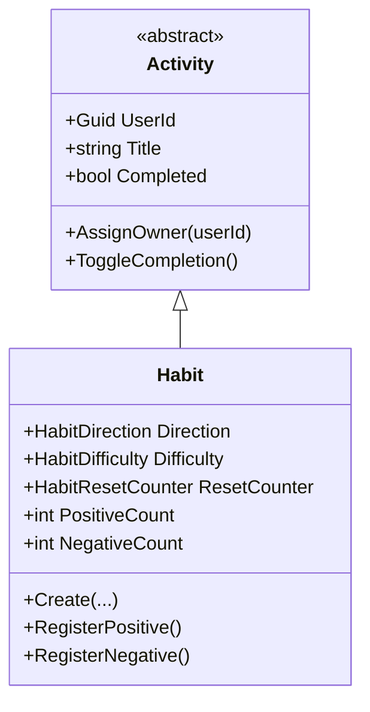

# Habit (Aggregate Root)

**Fonte da verdade:** verificado diretamente em `src/BeeDay.Domain/Entities/Habit.cs`,
`src/BeeDay.Domain/Entities/Activity.cs`,
`src/BeeDay.Application/Common/Contracts/IHabitRepository.cs`, e
`src/BeeDay.Application/Features/Habits/Handlers/HabitCommandHandlers.cs`.

## Responsabilidade

Rastreia um hábito recorrente com contagem independente de reforço positivo e negativo (inspirado
em apps de hábito estilo Loop/HabitBull, não em RPG). Herda de `Activity` (título, descrição,
`Featured`, `Attribute`, `Completed`, timestamps).

## Estado

| Propriedade | Tipo | Notas |
|---|---|---|
| (herdado de `Activity`) `UserId`, `Title`, `Description`, `Featured`, `Attribute`, `Completed`, `CreatedAtUtc`, `UpdatedAtUtc` | — | Ver [`entities.md`](entities.md) §Activity |
| `Direction` | `HabitDirection` | `Positive`, `Negative`, ou `Both` — padrão `Both` |
| `Difficulty` | `HabitDifficulty` | `Trivial`/`Easy`/`Medium`/`Hard` — padrão `Easy` |
| `ResetCounter` | `HabitResetCounter` | `Daily`/`Weekly`/`Monthly` — padrão `Daily` |
| `PositiveCount` | `int` | Incrementado por `RegisterPositive()` |
| `NegativeCount` | `int` | Incrementado por `RegisterNegative()` |

## Entidades filhas

Nenhuma. `Habit` é uma folha da hierarquia `Activity`.

## Operações públicas

| Método | Efeito |
|---|---|
| `static Create(title, description, direction, difficulty, resetCounter, attribute?)` | Fábrica; delega a `Update` |
| `Update(title, description, direction, difficulty, resetCounter, attribute?)` | Reaproveitada tanto na criação quanto na edição |
| `RegisterPositive()` | Incrementa `PositiveCount`, exceto se `Direction == Negative` (no-op silencioso) |
| `RegisterNegative()` | Incrementa `NegativeCount`, exceto se `Direction == Positive` (no-op silencioso) |
| (herdado) `AssignOwner(userId)`, `SetFeatured`, `SetAttribute`, `ToggleCompletion` | Ver [`entities.md`](entities.md) §Activity |

## Invariantes

1. **Direção restringe qual contador pode avançar**: `RegisterPositive()` é um no-op se
   `Direction == HabitDirection.Negative`; `RegisterNegative()` é um no-op se
   `Direction == HabitDirection.Positive`. Nenhuma exceção é lançada — a chamada simplesmente não
   tem efeito.
2. **Contadores protegidos contra overflow**: `PositiveCount = checked(PositiveCount + 1)` e o
   equivalente para `NegativeCount` — um overflow de `int` lança `OverflowException` em vez de dar
   a volta silenciosamente.
3. **Enums validados**: `Direction`, `Difficulty`, `ResetCounter` passam por
   `EnumValidation.Defined` em todo `Update` — um valor de enum fora do intervalo definido lança
   `DomainValidationException`.
4. Invariantes herdadas de `Activity` — ver [`entities.md`](entities.md) §Activity §Invariantes.

## Ownership

Pertence a exatamente um `User` (`UserId`, herdado de `Activity`, atribuído via `AssignOwner`).

## Quem cria / quem muta

| Operação | Handler |
|---|---|
| Criação | `CreateHabitCommandHandler.Handle` — `Habit.Create(...)` seguido de `habit.AssignOwner(userId)` |
| `Update` | `UpdateHabitCommandHandler` |
| `RegisterPositive` | `RegisterHabitPositiveCommandHandler` — também dispara concessão de XP (ver abaixo) |
| `RegisterNegative` | `RegisterHabitNegativeCommandHandler` — **não** concede XP |

Todos em `src/BeeDay.Application/Features/Habits/Handlers/HabitCommandHandlers.cs`.

## Eventos publicados

Nenhum evento específico de `Habit`. Quando `RegisterHabitPositiveCommandHandler` resulta em
mudança de contagem, ele concede XP via `ExperienceRewardService.Grant(..., ExperienceSourceType.Habit)`
(recompensa fixa: 1 XP, `ExperienceRewardPolicy`), o que pode publicar
`ExperienceGrantedDomainEvent` e, se cruzar um nível, `UserLeveledUpDomainEvent` — ver
[`domain-events.md`](domain-events.md). `RegisterNegative` nunca concede XP. Todo Command
bem-sucedido também gera um `ApplicationActionDomainEvent` genérico.

## Relacionamentos

Referencia `User` via `UserId` (herdado). Não é referenciado por nenhum outro Aggregate Root.

## Diagrama

## Fontes de verdade

**Arquivos consultados:** `src/BeeDay.Domain/Entities/Habit.cs`, `Entities/Activity.cs`,
`Enums/HabitDirection.cs`, `Enums/HabitDifficulty.cs`, `Enums/HabitResetCounter.cs`,
`src/BeeDay.Application/Common/Contracts/IHabitRepository.cs`,
`Features/Habits/Handlers/HabitCommandHandlers.cs`,
`Common/Experience/ExperienceRewardPolicy.cs`.
**Testes consultados:** `tests/BeeDay.Domain.Tests/HabitTests.cs`.
**Entidades relacionadas:** [`entities.md`](entities.md) §Activity, [`user.md`](user.md).
**Eventos relacionados:** [`domain-events.md`](domain-events.md).
**Documentação relacionada:** [`business-rules.md`](business-rules.md).
