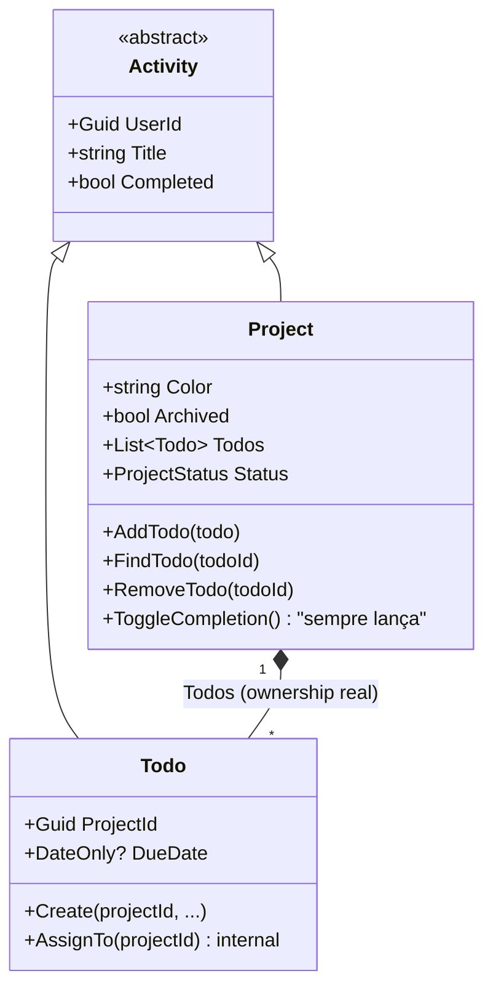

# Project (Aggregate Root, com Todo como entidade filha)

**Fonte da verdade:** verificado diretamente em `src/BeeDay.Domain/Entities/Project.cs`,
`src/BeeDay.Domain/Entities/Todo.cs`, `src/BeeDay.Domain/Entities/Activity.cs`,
`src/BeeDay.Application/Common/Contracts/IProjectRepository.cs`, e
`src/BeeDay.Application/Features/Projects/Handlers/ProjectCommandHandlers.cs` +
`src/BeeDay.Application/Features/Todos/Handlers/TodoCommandHandlers.cs`.

## Responsabilidade

Agrupa uma lista de `Todo` sob um projeto nomeado e colorido. É o único Aggregate Root deste
Domain com uma coleção de entidade filha real (`List<Todo>`) — todas as outras "relações" do
Domain são apenas referências por `Guid`.

## Estado

| Propriedade | Tipo | Notas |
|---|---|---|
| (herdado de `Activity`) `UserId`, `Title` (exposto também como `Name`), `Description`, `Featured`, `Attribute`, `CreatedAtUtc`, `UpdatedAtUtc` | — | Ver [`entities.md`](entities.md) §Activity |
| `Color` | `string` | Validado por `ProjectColor` VO |
| `ExpectedDate` | `DateOnly?` | |
| `Archived` | `bool` | |
| `Todos` | `List<Todo>` | Coleção real, mutável só através dos métodos de `Project` |
| `Completed` (override) | `bool` | Computada — ver invariante 1 |
| `TotalTodos`/`PendingTodos`/`CompletedTodos`/`ProgressPercentage`/`Progress`/`LastUpdatedAtUtc`/`NextTodo`/`Status` (computadas) | — | Todas derivadas de `Todos`, nenhuma persistida (todas `Ignore()` no EF Core, confirmado na Sprint 16.3) |

## Entidade filha: `Todo`

Ver [`entities.md`](entities.md) §Todo para o detalhamento completo. Resumo: `Todo` **não tem
existência fora de um `Project`** — o único ponto do código que chama `Todo.Create(...)`
(`CreateTodoCommandHandler`) entrega o resultado imediatamente a `IProjectRepository.AddTodoAsync`,
nunca a um repositório próprio (não existe `ITodoRepository`).

## Operações públicas

| Método | Efeito |
|---|---|
| `static Create(name, description, color?, expectedDate?, attribute?)` | Fábrica; delega a `Update` |
| `Update(name, description, color, expectedDate, attribute?)` | |
| `SetArchived(archived)` | |
| `AddTodo(todo)` | Chama `todo.AssignTo(Id)` internamente — é o único caminho que estabelece a fronteira de ownership |
| `FindTodo(todoId)` | Lança `InvalidDomainStateException` se não encontrado |
| `RemoveTodo(todoId)` | Usa `FindTodo` internamente |
| `override ToggleCompletion()` | **Sempre lança** `InvalidDomainStateException` — ver invariante 2 |

## Invariantes

1. **`Completed` de um Project é sempre computado, nunca definido diretamente**: `Completed` tem
   getter `Status == ProjectStatus.Completed` e um setter vazio (`protected set { }` — aceita a
   atribuição sintaticamente, mas não faz nada). Um projeto está "completo" se e somente se tiver
   pelo menos um Todo e todos estiverem concluídos (`Status`: `Planned` se `TotalTodos == 0`,
   `Completed` se `PendingTodos == 0`, senão `InProgress`).
2. **Um Project não pode ser marcado como concluído diretamente**: `ToggleCompletion()` sobrescreve
   o comportamento herdado de `Activity` e sempre lança
   `InvalidDomainStateException("A Project cannot be completed manually. Complete its To-Dos instead.")`.
   Conclusão só acontece indiretamente, completando todos os Todos.
3. **Todo é sempre adicionado através de `AddTodo`, nunca inserido diretamente na lista**:
   `AddTodo` é o único método que chama `todo.AssignTo(Id)` — garante que nenhum `Todo` na
   coleção tenha um `ProjectId` diferente do `Project` que o contém.
4. Invariantes herdadas de `Activity` — ver [`entities.md`](entities.md) §Activity §Invariantes
   (exceto a invariante de `ToggleCompletion`, sobrescrita conforme item 2 acima).

## Ownership

`Project` pertence a um `User` (`UserId`, herdado). `Todo` pertence a um `Project` (`ProjectId`) —
nunca diretamente a um `User`, ainda que `Todo` também herde `UserId` de `Activity` (atribuído
separadamente por `AssignOwner`, verificado por `CreateTodoCommandHandler` chamando
`todo.AssignOwner(userId)`).

## Quem cria / quem muta

| Operação | Handler |
|---|---|
| Criação do Project | `CreateProjectCommandHandler.Handle` — `Project.Create(...)`, `SetArchived(...)`, `AssignOwner(userId)` |
| `Update`/`SetArchived` | `UpdateProjectCommandHandler` |
| Criação de Todo | `CreateTodoCommandHandler.Handle` — `Todo.Create(...)` + `AssignOwner` + `repository.AddTodoAsync` |
| `Update`/movimentação de Todo entre Projects | `UpdateTodoCommandHandler` — movimentação cross-Project via `unitOfWork.Projects.MoveTodoAsync` |
| `ToggleCompletion` do Todo | `ToggleTodoCommandHandler` — concede XP para o Todo e, se a conclusão do Todo também completar o Project pai, concede XP adicional para o Project |
| Reordenação | `ReorderActivitiesCommandHandler` (`Features/Ordering/`) — via `ReorderAsync`/`ReorderTodosAsync` no repositório, não via método de entidade |

## Eventos publicados

Nenhum evento específico de `Project`/`Todo`. `ToggleTodoCommandHandler` concede XP duas vezes
potencialmente: uma para `ExperienceSourceType.Todo` (7 XP, se o Todo acabou de ser concluído) e
uma para `ExperienceSourceType.Project` (20 XP, se essa conclusão também fez o Project pai
transicionar para `Status.Completed`) — ambas podem publicar
`ExperienceGrantedDomainEvent`/`UserLeveledUpDomainEvent`. Todo Command bem-sucedido também gera
um `ApplicationActionDomainEvent` genérico.

## Relacionamentos

`Project` referencia `User` via `UserId`. `Todo` referencia `Project` via `ProjectId` e também
carrega `UserId` (redundante com o `Project` pai, mas atribuído independentemente). Nenhum outro
agregado referencia `Project` ou `Todo`.

## Diagrama

## Fontes de verdade

**Arquivos consultados:** `src/BeeDay.Domain/Entities/Project.cs`, `Entities/Todo.cs`,
`Entities/Activity.cs`, `Enums/ProjectStatus.cs`,
`src/BeeDay.Application/Common/Contracts/IProjectRepository.cs`,
`Features/Projects/Handlers/ProjectCommandHandlers.cs`,
`Features/Todos/Handlers/TodoCommandHandlers.cs`, `Features/Ordering/Handlers/ReorderActivitiesCommandHandler.cs`,
`Common/Experience/ExperienceRewardPolicy.cs`.
**Testes consultados:** `tests/BeeDay.Domain.Tests/ProjectTests.cs`. Nenhum arquivo de teste de
Domain com "Todo" isoladamente no nome foi encontrado — cobertura de Todo, se existir fora de
`ProjectTests.cs`, está em arquivo não identificável só pelo nome.
**Entidades relacionadas:** [`entities.md`](entities.md) §Activity §Todo, [`user.md`](user.md).
**Eventos relacionados:** [`domain-events.md`](domain-events.md).
