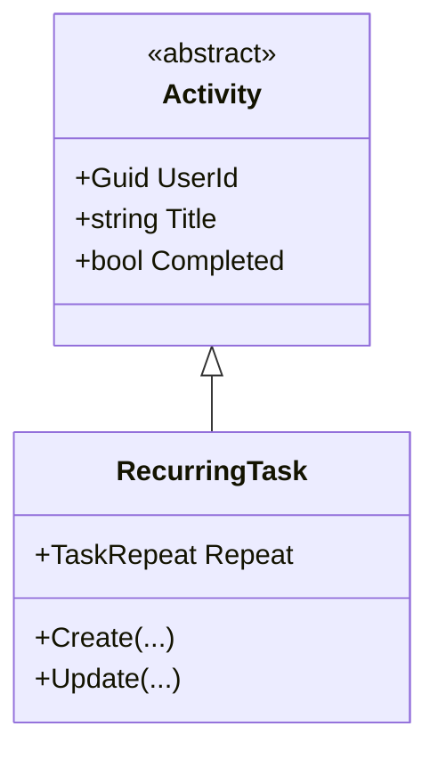

# RecurringTask (Aggregate Root)

**Fonte da verdade:** verificado diretamente em `src/BeeDay.Domain/Entities/RecurringTask.cs`,
`src/BeeDay.Domain/Entities/Activity.cs`,
`src/BeeDay.Application/Common/Contracts/IRecurringTaskRepository.cs`, e
`src/BeeDay.Application/Features/Tasks/Handlers/TaskCommandHandlers.cs`.

## Responsabilidade

Uma tarefa que se repete em uma cadência fixa (diária, semanal, mensal, ou nenhuma). É a entidade
`Activity` mais simples — não adiciona nenhum estado além da cadência de repetição.

## Estado

| Propriedade | Tipo | Notas |
|---|---|---|
| (herdado de `Activity`) `UserId`, `Title`, `Description`, `Featured`, `Attribute`, `Completed`, `CreatedAtUtc`, `UpdatedAtUtc` | — | Ver [`entities.md`](entities.md) §Activity |
| `Repeat` | `TaskRepeat` | `None`/`Daily`/`Weekly`/`Monthly` — padrão `Daily` |

## Entidades filhas

Nenhuma.

## Operações públicas

| Método | Efeito |
|---|---|
| `static Create(title, description, repeat, attribute?)` | Fábrica; delega a `Update` |
| `Update(title, description, repeat, attribute?)` | |
| (herdado) `AssignOwner`, `SetFeatured`, `SetAttribute`, `ToggleCompletion` | `ToggleCompletion` usa a implementação padrão de `Activity` (sem override) |

## Invariantes

1. **`Repeat` deve ser um valor de enum válido**: `EnumValidation.Defined` em `Update`.
2. Invariantes herdadas de `Activity` — ver [`entities.md`](entities.md) §Activity §Invariantes.

## Ownership

Pertence a exatamente um `User` (`UserId`, herdado, via `AssignOwner`).

## Quem cria / quem muta

| Operação | Handler |
|---|---|
| Criação | `CreateTaskCommandHandler.Handle` — `RecurringTask.Create(...)` + `AssignOwner(userId)` |
| `Update` | `UpdateTaskCommandHandler` |
| `ToggleCompletion` | `ToggleTaskCommandHandler` — também concede XP se a chamada resultar em conclusão (`justCompleted`) |

Todos em `src/BeeDay.Application/Features/Tasks/Handlers/TaskCommandHandlers.cs`.

## Eventos publicados

Nenhum evento específico. `ToggleTaskCommandHandler`, quando a tarefa é marcada como concluída
(`justCompleted`), chama `ExperienceRewardService.Grant(..., ExperienceSourceType.Task)`
(recompensa fixa: 5 XP), podendo publicar `ExperienceGrantedDomainEvent`/`UserLeveledUpDomainEvent`
— ver [`domain-events.md`](domain-events.md). Marcar como *não* concluída não concede nem revoga
XP (a implementação não reverte recompensas já concedidas). Todo Command bem-sucedido também gera
um `ApplicationActionDomainEvent` genérico.

## Relacionamentos

Referencia `User` via `UserId` (herdado). Não é referenciado por nenhum outro Aggregate Root.

## Diagrama

## Fontes de verdade

**Arquivos consultados:** `src/BeeDay.Domain/Entities/RecurringTask.cs`, `Entities/Activity.cs`,
`Enums/TaskRepeat.cs`, `src/BeeDay.Application/Common/Contracts/IRecurringTaskRepository.cs`,
`Features/Tasks/Handlers/TaskCommandHandlers.cs`, `Common/Experience/ExperienceRewardPolicy.cs`.
**Testes consultados:** nenhum arquivo de teste de Domain com "RecurringTask"/"Task" no nome foi
encontrado isoladamente (`tests/BeeDay.Domain.Tests/`) — cobertura, se existir, está distribuída em
arquivos não identificáveis só pelo nome; não afirmado além do que foi confirmado.
**Entidades relacionadas:** [`entities.md`](entities.md) §Activity, [`user.md`](user.md).
**Eventos relacionados:** [`domain-events.md`](domain-events.md).
