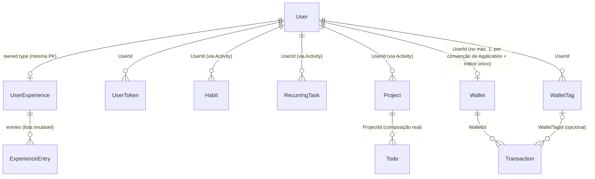
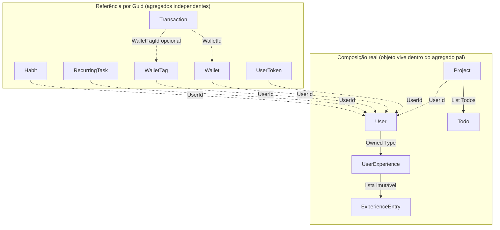
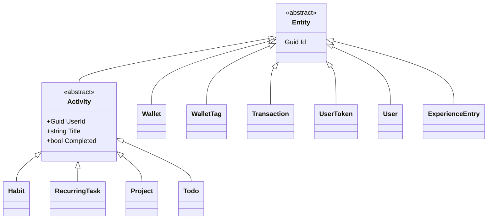
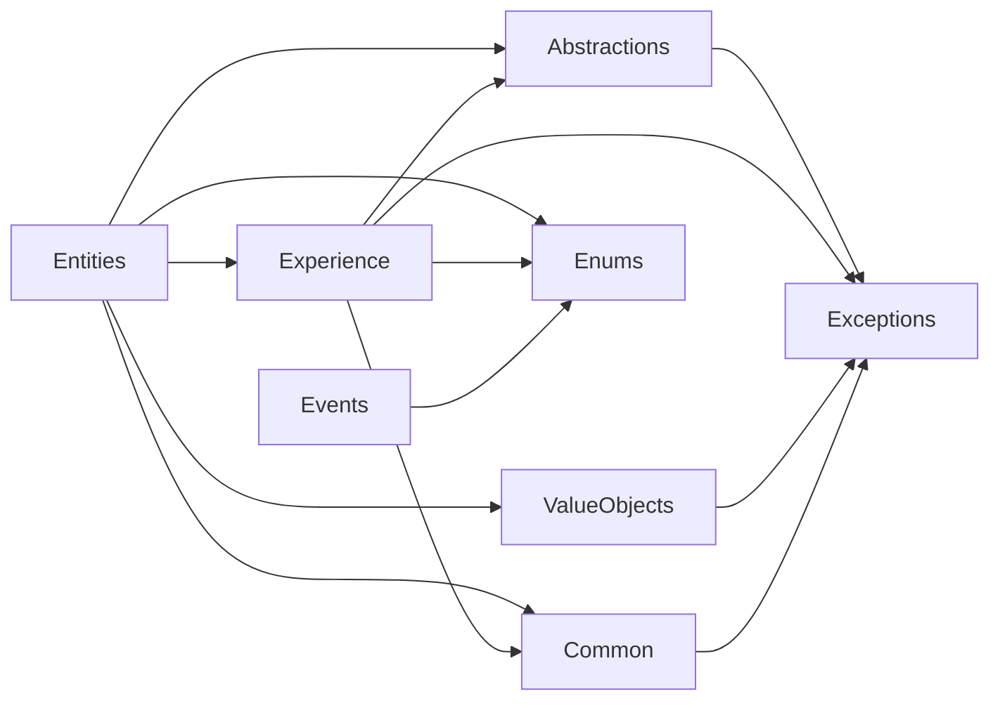

# Relationships

**Fonte da verdade:** derivado diretamente das propriedades de cada entidade em
`src/BeeDay.Domain/Entities/` e `src/BeeDay.Domain/Experience/`, e dos 8 arquivos
`I*Repository.cs` em `src/BeeDay.Application/Common/Contracts/`.

## Mapa de Aggregate Roots

## Ownership (quem é "dono" de quem)

| Entidade | Dono | Como |
|---|---|---|
| `UserToken` | `User` | `UserId` |
| `Habit` | `User` | `UserId` (herdado de `Activity`, via `AssignOwner`) |
| `RecurringTask` | `User` | idem |
| `Project` | `User` | idem |
| `Todo` | `Project` (não diretamente `User`, apesar de também ter `UserId`) | `ProjectId`, atribuído exclusivamente por `Project.AddTodo` → `Todo.AssignTo` |
| `Wallet` | `User` | `UserId` |
| `WalletTag` | `User` | `UserId` |
| `Transaction` | `Wallet` (não diretamente `User` — `Transaction` não tem campo `UserId`) | `WalletId` |
| `UserExperience` | `User` | Owned Type, mesma PK |
| `ExperienceEntry` | `User` (via `UserExperience.Entries`) | Lista, sem FK própria exposta no Domain |

**Observação:** `Transaction` é o único Aggregate Root sem `UserId` direto — sua propriedade de
usuário é sempre alcançada indiretamente via `Wallet.UserId`. Isso é reforçado em
`ITransactionRepository`, cujos métodos recebem `userId` como parâmetro para autorização, mas o
Domain em si não guarda esse dado na entidade `Transaction`.

## Composição real vs. referência por Guid

Este Domain tem exatamente **uma** relação de composição real (coleção de objetos filhos vivendo
dentro do agregado pai em memória): `Project.Todos` (`List<Todo>`). Toda outra "relação" entre
Aggregate Roots é uma referência por `Guid`, resolvida por consulta separada via repositório —
nunca uma referência de objeto a objeto entre dois Aggregate Roots.

## Hierarquia de herança (`Activity`)

Apenas 4 das 10 classes que herdam de `Entity` passam por `Activity`; as outras 6 (`Wallet`,
`WalletTag`, `Transaction`, `UserToken`, `User`, `ExperienceEntry`) herdam diretamente de `Entity`.

## Dependências do Domain

Confirmado (Sprint 16.3, reconfirmado nesta Sprint): `src/BeeDay.Domain` não tem nenhuma
`ProjectReference` e nenhum `using` para `Microsoft.EntityFrameworkCore`/`Microsoft.AspNetCore`.
As únicas dependências internas são entre os próprios namespaces do Domain:

`Events` é o único namespace que não depende de `Entities`/`Experience` — os registros de evento
são independentes de qualquer entidade concreta (recebem os dados já extraídos via construtor).

## Fronteiras de transação (verificado em `EfUnitOfWork`, Infrastructure)

Não é uma regra de Domain, mas relevante para entender até onde uma mudança em um agregado pode
ser atômica com outro: `docs/architecture/06-persistence-architecture.md` §8 documenta que
`IUnitOfWork` coordena os 8 repositórios contra um único `DbContext`. O próprio Domain não impõe
nenhuma regra de atomicidade entre agregados — isso é inteiramente uma decisão de Application/
Infrastructure.

## Fontes de verdade

**Arquivos consultados:** todas as entidades em `src/BeeDay.Domain/Entities/` e
`src/BeeDay.Domain/Experience/`, os 8 arquivos `I*Repository.cs` em
`src/BeeDay.Application/Common/Contracts/`.
**Entidades relacionadas:** todos os documentos individuais de agregado em `docs/domain/`.
**Documentação relacionada:** `docs/architecture/04-dependency-rules.md` (dependências entre
camadas, diferente das dependências internas ao Domain documentadas aqui),
`docs/architecture/06-persistence-architecture.md` §8 (`IUnitOfWork`).
