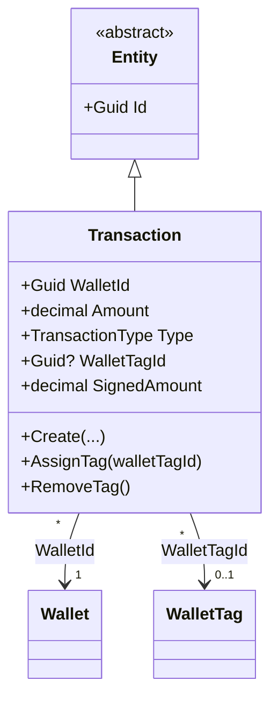

# Transaction (Aggregate Root)

**Fonte da verdade:** verificado diretamente em `src/BeeDay.Domain/Entities/Transaction.cs`,
`src/BeeDay.Application/Common/Contracts/ITransactionRepository.cs`, e
`src/BeeDay.Application/Features/Wallets/Handlers/WalletCommandHandlers.cs`.

## Responsabilidade

Um lançamento financeiro (receita ou despesa) dentro de uma `Wallet`, opcionalmente categorizado
por uma `WalletTag`.

## Estado

| Propriedade | Tipo | Notas |
|---|---|---|
| `WalletId` | `Guid` | |
| `Description` | `string` | Normalizada, máx. `MaximumDescriptionLength = 120` |
| `Amount` | `decimal` | Sempre positivo — sinal vem de `Type`, não de `Amount` |
| `Type` | `TransactionType` | `Income` ou `Expense` |
| `TransactionDate` | `DateOnly` | |
| `WalletTagId` | `Guid?` | Opcional |
| `Notes` | `string` | Opcional, máx. `MaximumNotesLength = 500` |
| `CreatedAtUtc` / `UpdatedAtUtc` | `DateTimeOffset` | |
| `SignedAmount` (computada) | `decimal` | `+Amount` se `Income`, `-Amount` se `Expense` |

Herda diretamente de `Entity`.

## Operações públicas

| Método | Efeito |
|---|---|
| `static Create(walletId, description, amount, type, transactionDate, walletTagId?, notes?)` | Fábrica; valida `walletId`, delega ao `Update` |
| `Update(description, amount, type, transactionDate, walletTagId, notes)` | Reaplica todas as validações |
| `AssignTag(walletTagId)` | |
| `RemoveTag()` | Define `WalletTagId = null` |

## Invariantes

1. **`WalletId` obrigatório**: `Create` lança se `Guid.Empty`.
2. **Descrição obrigatória, normalizada (colapso de espaços), máx. 120 caracteres.**
3. **`Amount` deve ser positivo** (`> 0`) — o sinal da transação vem exclusivamente de `Type`,
   nunca de `Amount` negativo.
4. **`Amount` não pode ter mais de 2 casas decimais**: verificado comparando
   `decimal.Round(amount, 2, MidpointRounding.AwayFromZero)` contra o valor original.
5. **`Type` deve ser um enum válido** (`EnumValidation.Defined`).
6. **`TransactionDate` obrigatória**: `default` (i.e. `DateOnly` não inicializado) lança.
7. **`WalletTagId`, se fornecido, não pode ser `Guid.Empty`** — `null` é aceito (sem tag), mas
   `Guid.Empty` explicitamente lança (distinção entre "nenhuma tag" e "tag inválida").
8. **`Notes` limitada a 500 caracteres**, sem outra validação de conteúdo.

## Ownership

Pertence a exatamente uma `Wallet` (`WalletId`), e transitivamente ao `User` dono dessa Wallet —
`Transaction` não guarda `UserId` diretamente.

## Quem cria / quem muta

| Operação | Handler |
|---|---|
| Criação | `CreateTransactionCommandHandler.Handle` — inclui o padrão lazy-create de `Wallet` se ainda não existir |
| `Update` | `UpdateTransactionCommandHandler.Handle` |
| Remoção | `DeleteTransactionCommandHandler.Handle` |
| `RemoveTag` em lote (via repositório, não via este método diretamente) | `DeleteWalletTagCommandHandler.Handle`, chamando `ITransactionRepository.ClearTagReferencesAsync` |

Todos em `src/BeeDay.Application/Features/Wallets/Handlers/WalletCommandHandlers.cs`.

## Eventos publicados

Nenhum evento específico. `Transaction` não participa do subsistema de XP. Apenas o
`ApplicationActionDomainEvent` genérico do pipeline MediatR para cada Command.

## Relacionamentos

Referencia `Wallet` via `WalletId` (obrigatório) e `WalletTag` via `WalletTagId` (opcional). Não é
referenciado por nenhum outro Aggregate Root.

## Diagrama

## Fontes de verdade

**Arquivos consultados:** `src/BeeDay.Domain/Entities/Transaction.cs`,
`src/BeeDay.Domain/Enums/TransactionType.cs`,
`src/BeeDay.Application/Common/Contracts/ITransactionRepository.cs`,
`Features/Wallets/Handlers/WalletCommandHandlers.cs`.
**Testes consultados:** `tests/BeeDay.Domain.Tests/TransactionTests.cs`;
`tests/BeeDay.Application.Tests/WalletHandlersTests.cs`, `WalletValidatorTests.cs`.
**Entidades relacionadas:** [`wallet.md`](wallet.md), [`wallet-tag.md`](wallet-tag.md).
