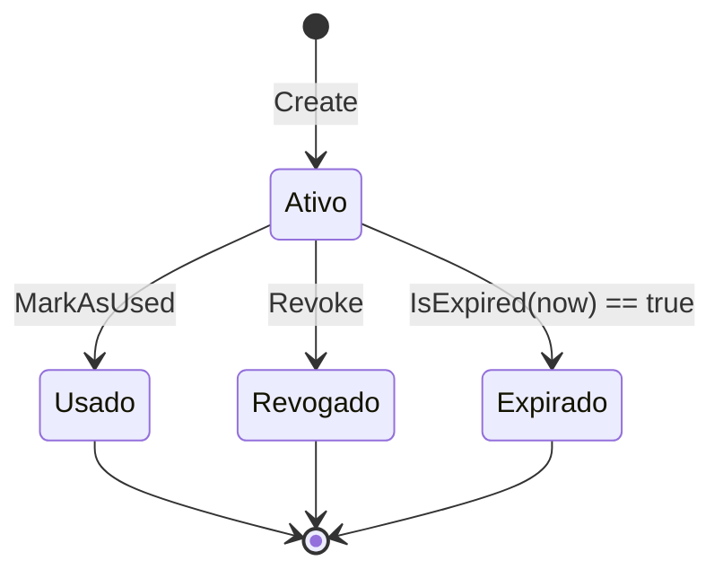

# UserToken (Aggregate Root)

**Fonte da verdade:** verificado diretamente em `src/BeeDay.Domain/Entities/UserToken.cs`,
`src/BeeDay.Application/Common/Contracts/IUserTokenRepository.cs`,
`src/BeeDay.Application/Common/Identity/IEmailConfirmationIssuer.cs`, e
`src/BeeDay.Application/Features/Identity/Handlers/IdentityHandlers.cs`.

## Responsabilidade

Representa um token de uso único para confirmação de e-mail ou reset de senha. Não guarda o token
em texto puro — apenas seu hash (`TokenHash`), gerado e verificado em Infrastructure
(`SecureUserTokenService`, fora do escopo deste documento).

## Estado

| Propriedade | Tipo | Notas |
|---|---|---|
| `UserId` | `Guid` | Dono do token |
| `Type` | `UserTokenType` | `EmailConfirmation` ou `PasswordReset` |
| `TokenHash` | `string` | Opaco para o Domain |
| `CreatedAtUtc` / `ExpiresAtUtc` | `DateTimeOffset` | `ExpiresAtUtc` deve ser posterior a `CreatedAtUtc` |
| `UsedAtUtc` | `DateTimeOffset?` | `IsUsed` computado a partir deste campo |
| `RevokedAtUtc` | `DateTimeOffset?` | `IsRevoked` computado a partir deste campo |

## Operações públicas

| Método | Efeito |
|---|---|
| `static Create(userId, type, tokenHash, createdAtUtc, expiresAtUtc)` | Fábrica |
| `IsExpired(nowUtc)` | `nowUtc >= ExpiresAtUtc` |
| `EnsureCanBeUsed(expectedType, nowUtc)` | Lança se tipo errado, já usado, revogado, ou expirado |
| `MarkAsUsed(expectedType, usedAtUtc)` | Chama `EnsureCanBeUsed` internamente, depois define `UsedAtUtc` |
| `Revoke(revokedAtUtc)` | No-op se já usado/revogado; valida `revokedAtUtc >= CreatedAtUtc` |

## Invariantes

1. **`UserId` obrigatório**: `Create` lança `DomainValidationException` se `Guid.Empty`.
2. **Tipo deve ser um `UserTokenType` válido**: checado via `Enum.IsDefined` diretamente em `Create`
   (não usa `EnumValidation.Defined` como o resto do Domain — inconsistência menor, não corrigida
   nesta Sprint por ser código, não documentação).
3. **Expiração deve ser posterior à criação**: `expiresAtUtc <= createdAtUtc` lança
   `DomainValidationException`.
4. **Um token só pode ser usado uma vez, do tipo certo, e dentro da validade** — `EnsureCanBeUsed`
   é o único portão de uso, checado nesta ordem: tipo → usado → revogado → expirado.
5. **Revogação é idempotente e não retroativa**: `Revoke` não faz nada se já usado/revogado; lança
   se `revokedAtUtc < CreatedAtUtc`.

## Ownership

Pertence a exatamente um `User` (`UserId`). Não é referenciado por nenhum outro Aggregate Root.

## Quem cria / quem muta

| Operação | Handler/Serviço |
|---|---|
| Criação (confirmação de e-mail) | `EmailConfirmationIssuer.Issue` (`Common/Identity/IEmailConfirmationIssuer.cs`), chamado por `CreateUserCommandHandler`/`CreateAccountCommandHandler` |
| Criação (reenvio de confirmação) | `ResendEmailConfirmationCommandHandler` (`Features/Identity/Handlers/IdentityHandlers.cs`) |
| Criação (reset de senha) | `RequestPasswordResetCommandHandler` (mesmo arquivo) |
| `EnsureCanBeUsed` + `MarkAsUsed` | `ConfirmEmailCommandHandler`, `ResetPasswordCommandHandler` |
| `Revoke` | Chamado ao emitir um novo token do mesmo tipo, para revogar tokens ativos anteriores (`ResendEmailConfirmationCommandHandler`, `RequestPasswordResetCommandHandler`, `ResetPasswordCommandHandler`) |

## Eventos publicados

Nenhum evento de domínio específico de `UserToken` — apenas o `ApplicationActionDomainEvent`
genérico emitido pelo pipeline MediatR para todo Command bem-sucedido.

## Relacionamentos

Referencia `User` via `UserId`. Não é referenciado por nenhum outro agregado.

## Diagrama

## Fontes de verdade

**Arquivos consultados:** `src/BeeDay.Domain/Entities/UserToken.cs`,
`src/BeeDay.Domain/Enums/UserTokenType.cs`,
`src/BeeDay.Application/Common/Contracts/IUserTokenRepository.cs`,
`src/BeeDay.Application/Common/Identity/IEmailConfirmationIssuer.cs`,
`src/BeeDay.Application/Features/Identity/Handlers/IdentityHandlers.cs`.
**Testes consultados:** `tests/BeeDay.Domain.Tests/UserIdentityTokenTests.cs`;
`tests/BeeDay.Application.Tests/IdentityHandlersTests.cs`.
**Entidades relacionadas:** [`user.md`](user.md).
**Documentação relacionada:** `docs/architecture/07-security-architecture.md` §7 (fluxo completo
de confirmação de e-mail e reset de senha, incluindo a geração/hash do token em Infrastructure).
