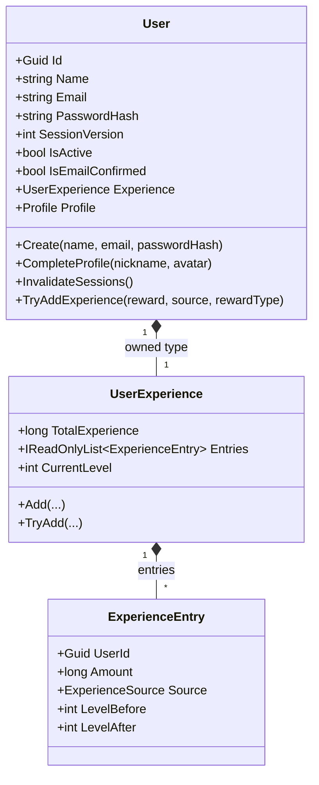

# User (Aggregate Root)

**Fonte da verdade:** verificado diretamente em `src/BeeDay.Domain/Entities/User.cs`,
`src/BeeDay.Domain/Entities/Profile.cs`, `src/BeeDay.Domain/Experience/UserExperience.cs`,
`src/BeeDay.Domain/Experience/ExperienceEntry.cs`, `src/BeeDay.Application/Common/Contracts/IUserRepository.cs`,
e os Handlers citados abaixo.

## Responsabilidade

Identidade, credenciais, preferências, estado de sessão e progressão de experiência (XP/Nível) de
um usuário do BeeDay. É o único Aggregate Root com um subsistema de progressão embutido
(`UserExperience`).

## Estado (`src/BeeDay.Domain/Entities/User.cs`)

| Propriedade | Tipo | Notas |
|---|---|---|
| `Id` | `Guid` | Herdado de `Entity` |
| `Name` | `string` | Validado por `UserName` |
| `Email` | `string` | Validado por `EmailAddress`, normalizado para minúsculas |
| `PasswordHash` | `string` | Opaco para o Domain — formato definido em Infrastructure (`Pbkdf2PasswordService`) |
| `Language` | `UserLanguage` | Enum, validado por `EnumValidation.Defined` |
| `Theme` | `UserTheme` | Enum, validado por `EnumValidation.Defined` |
| `CreatedAtUtc` / `UpdatedAtUtc` | `DateTimeOffset` | `UpdatedAtUtc` avançado por `Touch()` a cada mutação |
| `LastLoginAtUtc` | `DateTimeOffset?` | Definido só por `RegisterLogin()` |
| `IsActive` | `bool` | `true` por padrão; `false` dispara `InvalidateSessions()` |
| `HasCompletedOnboarding` | `bool` | |
| `IsEmailConfirmed` / `EmailConfirmedAtUtc` | `bool` / `DateTimeOffset?` | |
| `Nickname` / `Avatar` | `string` | Nickname validado por `Nickname` VO; vazio até `CompleteProfile` |
| `Experience` | `UserExperience` | Owned Type (EF Core) — ver §Experience abaixo |
| `SessionVersion` | `int` | Inicia em `1`; incrementado por `InvalidateSessions()` |
| `HasProfile` (computada) | `bool` | `!string.IsNullOrEmpty(Nickname)` |
| `Profile` (computada) | `Profile` | Nova instância a cada leitura — ver [`entities.md`](entities.md) §Profile |

## Operações públicas

| Método | Efeito |
|---|---|
| `static Create(name, email, passwordHash?)` / `Create(name, email, passwordHash, createdAtUtc)` | Fábrica; valida `createdAtUtc != default` |
| `UpdateName(name)` | Via `UserName` VO |
| `UpdateAccount(name, email)` | Via `UserName` + `EmailAddress` VOs |
| `UpdatePreferences(language, theme)` | Via `EnumValidation` |
| `SetPasswordHash(passwordHash)` | Não invalida sessões por si só (ver invariante abaixo) |
| `ConfirmEmail(confirmedAtUtc)` | Idempotente — no-op se já confirmado; valida `confirmedAtUtc >= CreatedAtUtc` |
| `RegisterLogin()` | Define `LastLoginAtUtc = UtcNow` |
| `SetActive(active)` | `active=false` chama `InvalidateSessions()` internamente |
| `CompleteOnboarding()` | |
| `InvalidateSessions()` | Incrementa `SessionVersion` |
| `CompleteProfile(nickname, avatar?)` | Só pode ser chamado uma vez (`HasProfile` deve ser `false`) |
| `UpdateAvatar(avatar?)` | |
| `AddExperience(reward, source, occurredAtUtc?)` / `AddExperience(reward, source, rewardType, occurredAtUtc?)` | Delega a `Experience.Add` |
| `TryAddExperience(reward, source, rewardType, grantedAtUtc?)` | Delega a `Experience.TryAdd` — idempotente (ver invariante) |
| `internal EnsureExperienceState()` | Reinvariante `Experience` após materialização (não chamável fora do assembly) |

## Invariantes

1. **Data de criação obrigatória**: `Create` lança `DomainValidationException` se `createdAtUtc == default`.
2. **Perfil completável uma única vez**: `CompleteProfile` lança `InvalidDomainStateException` se `HasProfile` já for `true`.
3. **Confirmação de e-mail não pode retroceder**: `ConfirmEmail` lança `DomainValidationException` se `confirmedAtUtc < CreatedAtUtc`; é idempotente (segunda chamada é no-op).
4. **`SetPasswordHash` nunca invalida sessão por si só** — documentado explicitamente no XML doc de `InvalidateSessions()`: `SetPasswordHash` também é usado para re-hash transparente no login (`AuthenticateUserCommandHandler`), que não deve encerrar a sessão que está sendo criada. Só os *chamadores* que representam uma mudança de segurança real (troca de senha pelo usuário, reset de senha, desativação) chamam `InvalidateSessions()` explicitamente depois.
5. **Desativação sempre invalida sessões**: `SetActive(false)` chama `InvalidateSessions()` internamente — não há caminho para desativar uma conta sem revogar suas sessões.

## Ownership

`User` não tem "dono" — é a raiz de identidade do sistema. Todo outro Aggregate Root (`Habit`,
`RecurringTask`, `Project`, `Wallet`, `WalletTag`, `Transaction` via `Wallet`, `UserToken`)
referencia `UserId` apontando para este agregado.

## Quem cria / quem muta (verificado em `src/BeeDay.Application`)

| Operação | Handler |
|---|---|
| Criação | `CreateUserCommandHandler.Handle` e `CreateAccountCommandHandler.Handle` — `Features/Users/Handlers/UserHandlers.cs` |
| `CompleteProfile`/`UpdateName` | `CompleteUserProfileCommandHandler` |
| `UpdateAvatar` | `UpdateCurrentUserAvatarCommandHandler` |
| `UpdatePreferences` | `UpdateCurrentUserPreferencesCommandHandler` |
| `UpdateAccount` | `UpdateCurrentUserAccountCommandHandler` |
| `SetPasswordHash` + `InvalidateSessions` | `ChangeCurrentUserPasswordCommandHandler`; também `ResetPasswordCommandHandler` (`Features/Identity/Handlers/IdentityHandlers.cs`) |
| `CompleteOnboarding` | `CompleteCurrentUserOnboardingCommandHandler` |
| `SetPasswordHash` (rehash) + `RegisterLogin` | `AuthenticateUserCommandHandler` (`Features/Authentication/Handlers/AuthenticationHandlers.cs`) |
| `ConfirmEmail` | `ConfirmEmailCommandHandler` (`Features/Identity/Handlers/IdentityHandlers.cs`) |
| `TryAddExperience` (via `ExperienceRewardService.Grant`) | Chamado por `RegisterHabitPositiveCommandHandler`, `ToggleTaskCommandHandler`, `ToggleTodoCommandHandler` (duas vezes — conclusão do Todo e conclusão do Project pai) |

## Experience (subsistema embutido)

`UserExperience` (`src/BeeDay.Domain/Experience/UserExperience.cs`) — Owned Type, sem repositório
próprio, sem identidade própria (compartilha a PK de `User`).

- `TotalExperience` (`long`), `Entries` (`IReadOnlyList<ExperienceEntry>`), e propriedades
  computadas (`CurrentLevel`, `CurrentLevelExperience`, `ExperienceRequiredForCurrentLevel`,
  `ExperienceForNextLevel`) derivadas via `ExperienceCurve` (fórmula em
  `LinearExperienceCurve`: 100 XP por nível, custo total até o nível N = `100 * (N-1) * N / 2`).
- `Add(...)`: incondicional — cria um novo `ExperienceEntry`, soma a `TotalExperience`, lança
  `InvalidDomainStateException` se ultrapassar `long.MaxValue`.
- `TryAdd(...)`: idempotente — recusa (retorna `null`) se já existir uma entrada com a mesma
  combinação `UserId`+`Source.Type`+`Source.ReferenceId`+`RewardType` (deduplicação de recompensa
  automática); exige `Source.ReferenceId` não nulo.
- `EnsureValidState()` (interno): garante `TotalExperience >= 0`, nenhuma entrada com `Amount <= 0`,
  e nenhuma chave de recompensa duplicada (exceto para `ExperienceSourceType.Habit`, que é
  deliberadamente excluída dessa checagem de duplicidade — hábitos podem gerar múltiplas entradas
  legítimas com o mesmo `ReferenceId` ao longo do tempo).

## Eventos publicados

`User` em si não publica eventos (nenhum tipo em `Entities/` ou `Experience/` constrói um Domain
Event — ver [`domain-events.md`](domain-events.md)). Após uma chamada bem-sucedida a
`TryAddExperience`/`AddExperience` via `ExperienceRewardService`, a camada de Application
(`ExperienceRewardEventPublisher`) publica `ExperienceGrantedDomainEvent` e, se a chamada cruzou
uma fronteira de nível (`ExperienceEntry.LevelAfter > LevelBefore`), também
`UserLeveledUpDomainEvent`. Toda operação de escrita em `User` via um Command também gera um
`ApplicationActionDomainEvent` genérico (comportamento do pipeline MediatR, não específico de
`User`).

## Relacionamentos

Ver [`relationships.md`](relationships.md). Resumo: `User` é referenciado por `UserId` em
`Habit`, `RecurringTask`, `Project`, `Todo` (via `Activity.UserId`), `Wallet`, `WalletTag`,
`UserToken`. Não referencia nenhum outro Aggregate Root diretamente.

## Diagrama

## Fontes de verdade

**Arquivos consultados:** `src/BeeDay.Domain/Entities/User.cs`, `Entities/Profile.cs`,
`Experience/UserExperience.cs`, `Experience/ExperienceEntry.cs`, `Experience/ExperienceCurve.cs`,
`Experience/LinearExperienceCurve.cs`, `src/BeeDay.Application/Common/Contracts/IUserRepository.cs`,
`Features/Users/Handlers/UserHandlers.cs`, `Features/Authentication/Handlers/AuthenticationHandlers.cs`,
`Features/Identity/Handlers/IdentityHandlers.cs`, `Common/Experience/ExperienceRewardService.cs`,
`Common/Experience/ExperienceRewardEventPublisher.cs`.
**Testes consultados (por nome de arquivo):** `tests/BeeDay.Domain.Tests/UserIdentityTokenTests.cs`,
`UserProfileRulesTests.cs`, `UserSessionHardeningTests.cs`, `ExperienceDomainTests.cs`;
`tests/BeeDay.Application.Tests/UserAccountHandlersTests.cs`, `ExperienceRewardPipelineTests.cs`.
**Entidades relacionadas:** [`entities.md`](entities.md) §Profile, §ExperienceEntry.
**Eventos relacionados:** [`domain-events.md`](domain-events.md).
**Documentação relacionada:** [`value-objects.md`](value-objects.md) (`UserName`, `EmailAddress`,
`Nickname`), [`business-rules.md`](business-rules.md), `docs/architecture/07-security-architecture.md`
(uso de `SessionVersion` fora do Domain).
