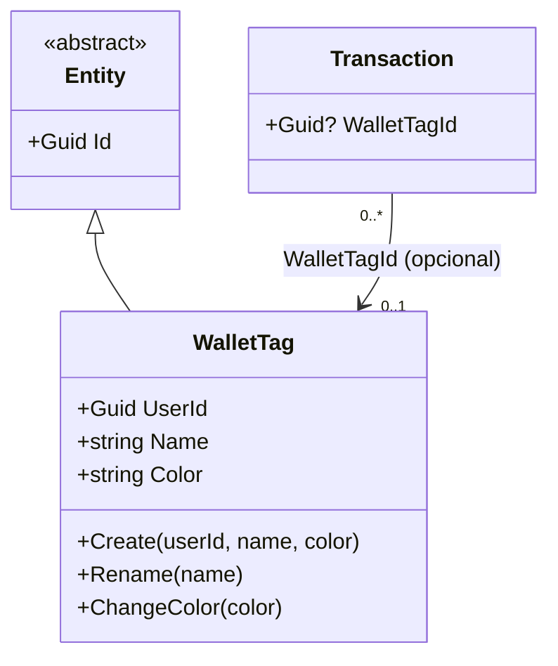

# WalletTag (Aggregate Root)

**Fonte da verdade:** verificado diretamente em `src/BeeDay.Domain/Entities/WalletTag.cs`,
`src/BeeDay.Application/Common/Contracts/IWalletTagRepository.cs`, e
`src/BeeDay.Application/Features/Wallets/Handlers/WalletCommandHandlers.cs`.

## Responsabilidade

Uma etiqueta nomeada e colorida que o usuário pode aplicar a transações da Wallet, para
categorização/filtro.

## Estado

| Propriedade | Tipo | Notas |
|---|---|---|
| `UserId` | `Guid` | |
| `Name` | `string` | Normalizado (trim + colapso de espaços internos), máx. `MaximumNameLength = 40` |
| `Color` | `string` | Formato `#RRGGBB`, maiúsculas; padrão `DefaultColor = "#7A4FCB"` |
| `CreatedAtUtc` / `UpdatedAtUtc` | `DateTimeOffset` | |

Herda diretamente de `Entity` (não de `Activity`).

## Operações públicas

| Método | Efeito |
|---|---|
| `static Create(userId, name, color?)` | Fábrica; valida `userId`, delega normalização a `Update` |
| `Rename(name)` | |
| `ChangeColor(color?)` | |
| `Update(name, color)` | Chama `Rename` + `ChangeColor` internamente (via `NormalizeName`/`NormalizeColor`) |

## Invariantes

1. **`UserId` obrigatório**: `Create` lança `DomainValidationException` se `Guid.Empty`.
2. **Nome obrigatório e normalizado**: vazio/espaços-somente lança; espaços internos múltiplos são
   colapsados para um único espaço (`string.Join(' ', name.Trim().Split(' ', RemoveEmptyEntries))`).
3. **Nome limitado a 40 caracteres** (`MaximumNameLength`), após normalização.
4. **Cor deve casar com `^#[0-9A-F]{6}$`** (case-insensitive na entrada, normalizada para
   maiúsculas) — cor ausente/vazia usa `DefaultColor`, mas uma cor fornecida que não bate com o
   padrão lança `DomainValidationException`.

## Ownership

Pertence a exatamente um `User` (`UserId`).

## Quem cria / quem muta

| Operação | Handler |
|---|---|
| Criação | `CreateWalletTagCommandHandler.Handle` — `WalletTag.Create(userId, request.Name, request.Color)` |
| `Update` | `UpdateWalletTagCommandHandler.Handle` — `tag.Update(request.Name, request.Color)` |

Ambos em `src/BeeDay.Application/Features/Wallets/Handlers/WalletCommandHandlers.cs`.

## Eventos publicados

Nenhum evento específico. Apenas o `ApplicationActionDomainEvent` genérico do pipeline MediatR.

## Relacionamentos

Referenciado opcionalmente por `Transaction` (`WalletTagId`, nulável). Referencia `User` via
`UserId`. Ao remover uma `WalletTag`, `DeleteWalletTagCommandHandler` chama
`unitOfWork.Transactions.ClearTagReferencesAsync` para desvincular transações associadas antes da
remoção (confirmado pela FK `Transactions.WalletTagId` ter `DeleteBehavior.SetNull` no banco — ver
`docs/architecture/06-persistence-architecture.md` §6 — mas a limpeza explícita no handler sugere
que a Application não confia exclusivamente no `SetNull` do banco).

## Diagrama

## Fontes de verdade

**Arquivos consultados:** `src/BeeDay.Domain/Entities/WalletTag.cs`,
`src/BeeDay.Application/Common/Contracts/IWalletTagRepository.cs`,
`Features/Wallets/Handlers/WalletCommandHandlers.cs`.
**Testes consultados:** `tests/BeeDay.Domain.Tests/WalletTagTests.cs`;
`tests/BeeDay.Application.Tests/WalletHandlersTests.cs`, `WalletValidatorTests.cs`.
**Entidades relacionadas:** [`wallet.md`](wallet.md), [`transaction.md`](transaction.md).
