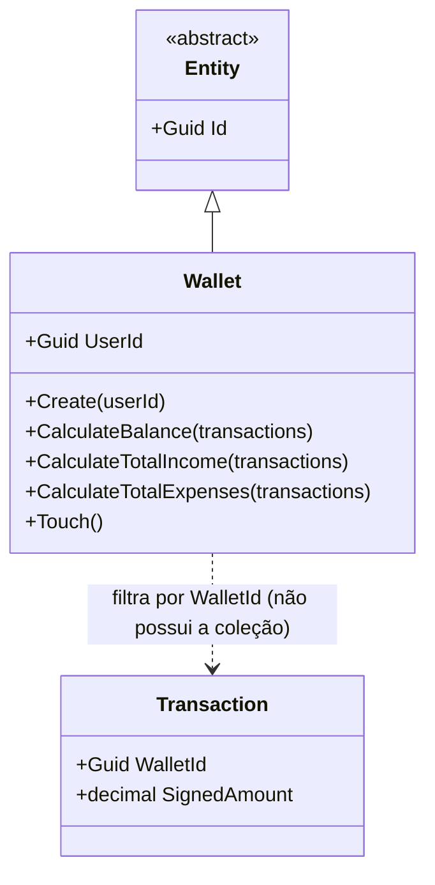

# Wallet (Aggregate Root)

**Fonte da verdade:** verificado diretamente em `src/BeeDay.Domain/Entities/Wallet.cs`,
`src/BeeDay.Application/Common/Contracts/IWalletRepository.cs`, e
`src/BeeDay.Application/Features/Wallets/Handlers/WalletCommandHandlers.cs`.

## Responsabilidade

Representa a carteira financeira pessoal de um usuário. É o Aggregate Root mais simples do Domain
(3 métodos de cálculo além de `Create`/`Touch` — ver tabela de Operações públicas abaixo), com uma
particularidade: ele **não guarda a lista de `Transaction`** — calcula
saldo/totais recebendo uma coleção de transações como parâmetro, filtrando por `WalletId`.

## Estado

| Propriedade | Tipo | Notas |
|---|---|---|
| `UserId` | `Guid` | Um usuário tem no máximo uma Wallet (`UX_Wallets_User`, constraint de banco — ver `docs/architecture/06-persistence-architecture.md`) |
| `CreatedAtUtc` / `UpdatedAtUtc` | `DateTimeOffset` | |

Nota: `Wallet` **não** herda de `Activity` — herda diretamente de `Entity`. Não tem título,
descrição, nem conceito de "conclusão".

## Operações públicas

| Método | Efeito |
|---|---|
| `static Create(userId)` | Fábrica; valida `userId != Guid.Empty` |
| `CalculateBalance(transactions)` | Soma `SignedAmount` das transações filtradas por `WalletId == Id` |
| `CalculateTotalIncome(transactions)` | Soma `Amount` das transações do tipo `Income` |
| `CalculateTotalExpenses(transactions)` | Soma `Amount` das transações do tipo `Expense` |
| `Touch()` | Público (diferente de todo outro Aggregate, onde `Touch` é privado) — permite à Application marcar a Wallet como atualizada sem uma mutação de campo real |

## Invariantes

1. **`UserId` obrigatório**: `Create` lança `DomainValidationException` se `Guid.Empty`.
2. **Cálculos sempre filtram por `WalletId`**: `FilterTransactions` (privado) garante que
   `CalculateBalance`/`CalculateTotalIncome`/`CalculateTotalExpenses` nunca somem transações de
   outra Wallet, mesmo que a coleção passada contenha transações de múltiplas wallets.
3. **Uma Wallet por usuário** — não é uma invariante de Domain (nenhum código em `Wallet.cs` impede
   criar duas), mas é imposta em duas camadas fora do Domain: `EnsureCurrentWalletCommandHandler`/
   `CreateTransactionCommandHandler` só criam uma Wallet se `GetByUserAsync` retornar nulo
   (lazy-create), e o índice único `UX_Wallets_User` no banco (ver
   `docs/architecture/06-persistence-architecture.md` §6) — reportado aqui para deixar claro que
   a garantia final é de Infrastructure, não de Domain.

## Ownership

Pertence a exatamente um `User` (`UserId`).

## Quem cria / quem muta

| Operação | Handler |
|---|---|
| Criação (lazy, sob demanda) | `EnsureCurrentWalletCommandHandler.Handle`; também `CreateTransactionCommandHandler.Handle` (mesmo padrão: cria se não existir) |
| `Touch()` | `CreateTransactionCommandHandler`, `UpdateTransactionCommandHandler`, `DeleteTransactionCommandHandler`, `DeleteWalletTagCommandHandler` — todos em `WalletCommandHandlers.cs`, chamando `Touch()` para refletir que a Wallet "mudou" quando na verdade é uma `Transaction`/`WalletTag` relacionada que mudou |

## Eventos publicados

Nenhum evento específico de `Wallet`. Toda mutação via Command gera o
`ApplicationActionDomainEvent` genérico do pipeline MediatR. `Wallet` não participa do subsistema
de XP.

## Relacionamentos

Referenciado por `Transaction` (`WalletId`). Referencia `User` via `UserId`. Não referencia
`WalletTag` ou `Transaction` diretamente — a relação é sempre da entidade filha/relacionada em
direção à `Wallet`, nunca o contrário.

## Diagrama

## Fontes de verdade

**Arquivos consultados:** `src/BeeDay.Domain/Entities/Wallet.cs`,
`src/BeeDay.Application/Common/Contracts/IWalletRepository.cs`,
`Features/Wallets/Handlers/WalletCommandHandlers.cs`,
`docs/architecture/06-persistence-architecture.md` (para a constraint `UX_Wallets_User`, citada
apenas como referência de Infrastructure, não como fonte de regra de Domain).
**Testes consultados:** `tests/BeeDay.Domain.Tests/WalletTests.cs`;
`tests/BeeDay.Application.Tests/WalletHandlersTests.cs`.
**Entidades relacionadas:** [`transaction.md`](transaction.md), [`wallet-tag.md`](wallet-tag.md),
[`user.md`](user.md).
