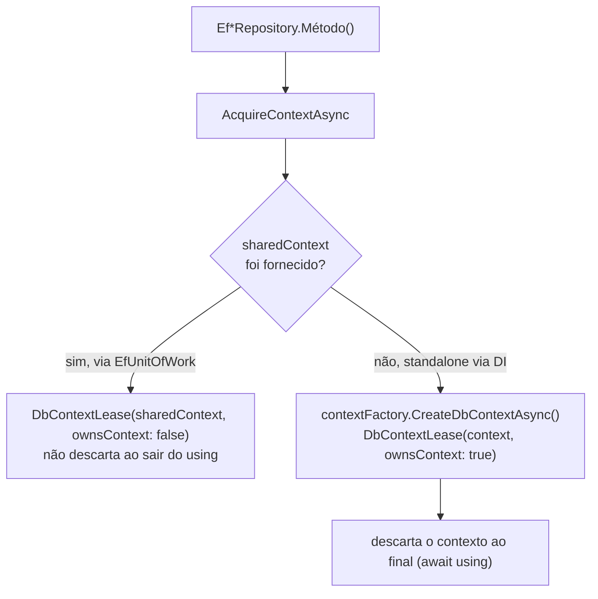
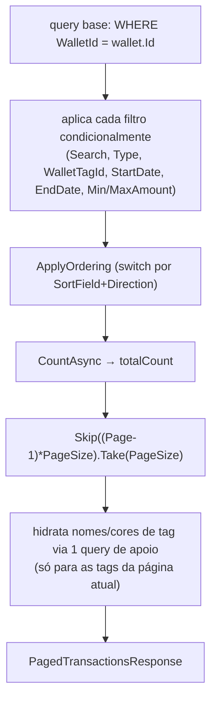

# Repositories, Unit of Work & Read Services

**Fonte da verdade:** verificado diretamente nos 8 arquivos `Ef*Repository.cs`,
`EfRepositoryBase.cs`, `EfUnitOfWork.cs`, `EfDashboardReadService.cs`, `EfWalletReadService.cs`,
todos em `src/BeeDay.Infrastructure/Persistence/SqlServer/`.

## Quem implementa, quem consome

Ver `docs/application/04-contracts.md` para a lista completa das 8 interfaces + `IUnitOfWork` + 2
read services e seus consumidores em Application. Este documento cobre exclusivamente **como** cada
implementação funciona por dentro.

## `EfRepositoryBase` — infraestrutura compartilhada pelos 8 repositórios

Cada `Ef*Repository` tem dois construtores:

```csharp
protected EfRepositoryBase(IDbContextFactory<BeeDayDbContext> contextFactory)  // uso standalone/DI
protected EfRepositoryBase(BeeDayDbContext sharedContext)                      // uso exclusivo de EfUnitOfWork
```

`AcquireContextAsync` decide qual usar: se `sharedContext` foi passado, devolve uma
`DbContextLease` que **não** possui o contexto (`ownsContext: false` — não descarta ao final,
`EfUnitOfWork` é dono do ciclo de vida). Caso contrário, cria um contexto novo via
`contextFactory.CreateDbContextAsync(...)` com `ownsContext: true` — descartado ao final de cada
chamada. `DbContextLease` é um `readonly struct` implementando `IAsyncDisposable`.



## Padrão comum de cada operação

| Operação | Mecânica |
|---|---|
| `GetAsync`/`ListAsync` | Sempre `AsNoTracking()` |
| `AddAsync` | `context.Set.Add(entity)` **+ chamada de `SaveChanges` sempre incluída** — nunca fica só "Add sem salvar" |
| `UpdateAsync(userId, id, mutation)` | Carrega a entidade **rastreada** via `SingleAsync`, invoca `mutation(entity)` (lambda de Domain puro), depois salva — tudo dentro da mesma chamada/contexto |
| `RemoveAsync` | **Rebusca** a entidade rastreada pelo `Id` (nunca usa a instância recebida por parâmetro diretamente) antes de remover — garante que o `RowVersion` usado no `DELETE` seja o mais recente do banco, não o de um contexto já descartado |
| `ReorderAsync` | Carrega todas as entidades do escopo em um `Dictionary<Guid,T>`, itera a lista de ids na ordem recebida atribuindo `Position = índice (0..N-1)` diretamente na shadow property via `context.Entry(x).Property("Position").CurrentValue = i`, um único `SaveChangesAsync` ao final |

Todo `SaveChangesAsync` passa por `EfConcurrencySaveChanges.ExecuteAsync` — nunca chamado
diretamente (ver `docs/infrastructure/03-concurrency.md`).

**Por que `UpdateAsync` não aceita uma entidade já mutada e desconectada:** o XML doc de
`EfUserRepository.UpdateAsync` explica a razão de fundo, citada pelos demais repositórios: o
Domain nunca carrega `RowVersion` (é puramente shadow, invisível fora de Infrastructure). Um
método "Save(entidade já mutada)" reconectaria um token de concorrência obsoleto ou exigiria
reler o token logo antes de salvar — o que anularia o próprio propósito do RowVersion. Carregar,
mutar e salvar na mesma chamada garante que o token capturado é sempre o vigente no banco.

## Particularidades por repositório

| Repositório | Tem `Position`/`ReorderAsync`? | Tem `RemoveAsync` (hard delete)? | Particularidade |
|---|---|---|---|
| `EfHabitRepository` | Sim (escopo `UserId`) | Sim | Padrão de referência |
| `EfRecurringTaskRepository` | Sim (escopo `UserId`) | Sim | Estruturalmente idêntico ao de Habit |
| `EfProjectRepository` | Sim (`ReorderAsync` por `UserId`; `ReorderTodosAsync` por `ProjectId`) | Sim (Todos removidos por cascade de banco, não por código) | O maior — 13 métodos; `AddTodoAsync` tem uma pegadinha documentada (ver abaixo) |
| `EfTransactionRepository` | Não | Sim | `ClearTagReferencesAsync` desvincula (não deleta) transações de uma tag removida |
| `EfUserRepository` | Não (Users não são ordenados) | **Não existe** | `UpdateAsync` é a implementação de referência citada por todas as demais |
| `EfUserTokenRepository` | Não | **Não existe** — só `RevokeActiveAsync` (mudança de estado suave, via `token.Revoke(...)` do Domain) | Revogação é sempre soft-state, nunca hard delete |
| `EfWalletRepository` | Não (1 Wallet por usuário) | **Não existe** | O mais simples — 3 métodos |
| `EfWalletTagRepository` | Não | Sim | `ListAsync` não ordena por Position (WalletTags não têm essa shadow property) |

### `AddTodoAsync` — bug real evitado, documentado no código

`EfProjectRepository.AddTodoAsync` carrega o Project com `.Include(p => p.Todos)`, chama o método
de Domain `project.AddTodo(todo)`, e **só depois** chama `context.Todos.Add(todo)` explicitamente
— nessa ordem exata. O comentário no código documenta que inverter a ordem (chamar
`context.Entry(todo)` antes do `Add()` explícito, quando `todo` só chegou ao contexto via
`project.Todos`) faz o EF Core anexá-lo como `Unchanged` em vez de `Added`, transformando o INSERT
pretendido em um UPDATE inofensivo (nada é persistido) — "confirmado por essa falha exata ao
escrever o teste deste método", segundo o comentário.

### `MoveTodoAsync` — única operação que toca 2 Aggregate Roots numa chamada

Carrega Project de origem e Project de destino separadamente (ambos com `.Include(Todos)`),
remove o Todo do Project de origem e adiciona ao de destino — via os métodos públicos de Domain
`RemoveTodo`/`AddTodo`, nunca manipulando `Todo.ProjectId` diretamente — recalcula a `Position` do
Todo movido como a próxima posição livre no Project de destino, um único `SaveChangesAsync`.

## `EfUnitOfWork`

```csharp
internal sealed class EfUnitOfWork : IUnitOfWork
{
    // construtor: context = contextFactory.CreateDbContext();  (SÍNCRONO — não abre conexão)
    public IUserRepository Users => users ??= new EfUserRepository(context);
    // ... mais 7 propriedades idênticas, todas usando o MESMO context compartilhado
}
```

- Cria **um único** `BeeDayDbContext` no construtor (`CreateDbContext()`, síncrono — comentário
  explica que construir o contexto não abre conexão, então não precisa ser assíncrono).
- As 8 propriedades de repositório são lazily inicializadas (`??=`), cada uma usando o construtor
  de contexto compartilhado — todas as 8 operam sobre o **mesmo** `DbContext` durante a vida do
  `EfUnitOfWork`.
- `SaveChangesAsync` delega diretamente a `EfConcurrencySaveChanges.ExecuteAsync(context, ct)`.
- `BeginTransactionAsync`/`CommitTransactionAsync`/`RollbackTransactionAsync`: os dois últimos
  lançam `InvalidOperationException` ("No active transaction to commit/roll back — call
  BeginTransactionAsync first.") se não houver transação ativa.
- `DisposeAsync`: se uma transação ainda estiver aberta (nunca commitada), só chama
  `transaction.DisposeAsync()` — o próprio EF Core faz rollback automático ao descartar uma
  transação sem commit (comportamento nativo, não implementado manualmente aqui). Depois descarta
  o `context` incondicionalmente.
- Registrado `AddTransient` (não `AddScoped`) — cada resolução recebe um `EfUnitOfWork` novo, com
  seu próprio `DbContext` próprio, nunca compartilhado entre requisições/circuitos.

## Read Services

### `EfDashboardReadService`

Único método `GetAsync(userId, ct)`. Cria seu próprio contexto por chamada (`await using`). Toda
consulta é `AsNoTracking()`: `Users` (lança `InvalidDomainStateException` se usuário não existe —
único read service que lança em vez de retornar nulo/vazio), `Habits`/`RecurringTasks` (ordenadas
por `EF.Property<int>(x, "Position")`), `Projects` (com `.Include(p => p.Todos.OrderBy(...Position))`
aninhado), `Wallets`+`Transactions` (resumo calculado via os métodos de Domain
`Wallet.CalculateBalance`/`CalculateTotalIncome`/`CalculateTotalExpenses` — nunca recalculado
manualmente em Infrastructure). Retorna `WalletSummary = null` se o usuário não tiver Wallet
(diferente do comportamento de "usuário não encontrado", que lança).

### `EfWalletReadService`

4 métodos. `GetSummaryAsync`/`GetTransactionAsync`/`ListTagsAsync` seguem o mesmo padrão
AsNoTracking + retorno `null`/lista vazia quando não há dado (nunca lançam por "não encontrado").

`ListTransactionsAsync(filter)` é o mais complexo — filtro/ordenação/paginação compostos:



`ApplyOrdering` é um `switch` de expressão sobre `(campo, direção)`; os campos `Description`/
`Amount`/`CreatedAt` ordenam só por si mesmos, mas o caso padrão (ordenar por data — quando o
campo não é nenhum dos três acima) adiciona `.ThenBy(x => x.CreatedAtUtc)` como critério de
desempate, único caso com dois níveis de ordenação. `totalPages` é calculado como `0` explicitamente
quando `totalCount == 0` (não deixado para `Math.Ceiling(0/x)`, embora o resultado seria o mesmo).
Hidratação de tag: coleta os `WalletTagId` distintos só da página atual (não de todo o resultado
filtrado) antes de fazer a consulta de apoio — evita carregar tags de transações que não serão
exibidas.

## Fontes de verdade

**Arquivos consultados:** os 8 `Ef*Repository.cs`, `EfRepositoryBase.cs`, `EfUnitOfWork.cs`,
`EfDashboardReadService.cs`, `EfWalletReadService.cs` — todos lidos integralmente.
**Testes consultados:** `tests/BeeDay.Infrastructure.Tests/Persistence/SqlServer/Repositories/Ef*RepositoryTests.cs`
(8 arquivos — cobrindo especificamente `ReorderAsync_ChangesTheOrderReturnedByListAsync`,
`AddTodoAsync_AddsATodoToAnExistingProject`, `MoveTodoAsync_MovesTheTodoToTheDestinationProject`,
`ClearTagReferencesAsync_ClearsOnlyTransactionsWithThatTag`, `RevokeActiveAsync_RevokesEveryActiveTokenOfThatType`);
`EfUnitOfWorkTests.cs` (`CommitTransactionAsync_PersistsChangesFromMultipleRepositories`,
`RollbackOnException_DiscardsTheEarlierSuccessfulWriteToo`, `DisposeWithoutCommit_RollsBackAutomatically`);
`EfDashboardReadServiceTests.cs`, `EfWalletReadServiceTests.cs`
(`ListTransactionsAsync_FiltersSortsAndPaginates`).
**Contratos relacionados:** `docs/application/04-contracts.md` (as interfaces implementadas aqui).
**Documentação relacionada:** `docs/persistence/01-relational-model.md` (shadow property
`Position`), [`03-concurrency.md`](03-concurrency.md) (`EfConcurrencySaveChanges`, RowVersion na
prática).
