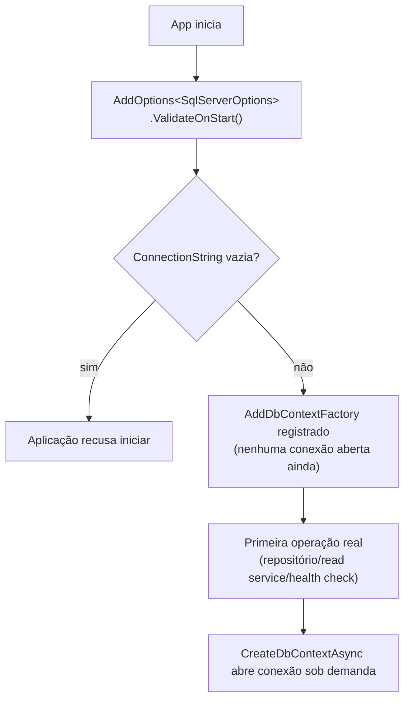
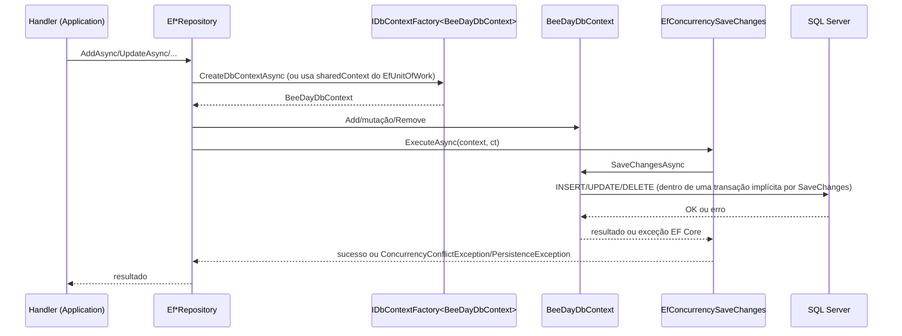

# SQL Server

**Fonte da verdade:** verificado diretamente em
`src/BeeDay.Infrastructure/Configuration/SqlServerOptions.cs`,
`src/BeeDay.Infrastructure/DependencyInjection/InfrastructureServiceCollectionExtensions.cs`,
`src/BeeDay.Infrastructure/Persistence/SqlServer/BeeDayDbContextFactory.cs`, e
`tests/BeeDay.Infrastructure.Tests/Persistence/SqlServer/Repositories/EfLocalDbTestBase.cs`.

## `SqlServerOptions`

```csharp
public const string SectionName = "BeeDay:Persistence:SqlServer";
public string ConnectionString { get; set; } = string.Empty;
public bool HealthCheckEnabled { get; set; } = false;  // não utilizado hoje — ver achado abaixo
```

Vinculada via `AddOptions<SqlServerOptions>().Bind(...).Validate(...).ValidateOnStart()` em
`InfrastructureServiceCollectionExtensions.cs` — a única validação é `ConnectionString` não pode
ser vazia/branco. `ValidateOnStart()` significa que a aplicação **recusa iniciar** sem uma
connection string configurada — não há fallback nem degradação silenciosa.

## Registro do `DbContext` — `IDbContextFactory`, não `AddDbContext`

```csharp
services.AddDbContextFactory<BeeDayDbContext>((serviceProvider, options) =>
{
    var sqlServerOptions = serviceProvider.GetRequiredService<IOptions<SqlServerOptions>>().Value;
    options.UseSqlServer(sqlServerOptions.ConnectionString);
});
```

Decisão deliberada, documentada no comentário do código: circuitos Blazor Server são de longa
duração, e `DbContext` não é thread-safe nem seguro para viver pela duração de um circuito inteiro.
`IDbContextFactory<BeeDayDbContext>` permite que cada operação crie/descarte seu próprio contexto
de vida curta — usado por todos os 8 repositórios (via `EfRepositoryBase`), os 2 read services, e
`SqlServerHealthCheck`.

## Ciclo de vida do banco — só uma migration, aplicada manualmente

Não existe nenhuma lógica de `Database.Migrate()`/`EnsureCreated()` automática no startup de
`BeeDay.Web` (confirmado: não encontrado em `Program.cs` nem em `InfrastructureServiceCollectionExtensions.cs`)
— aplicar a migration `InitialCreate` ao banco é uma etapa manual/operacional
(`dotnet ef database update`), fora do escopo desta Sprint documentar o procedimento exato (não
verificado em nenhum script nesta Sprint).

**Em testes**, o ciclo de vida é gerenciado explicitamente por `EfLocalDbTestBase`
(`tests/BeeDay.Infrastructure.Tests/Persistence/SqlServer/Repositories/`): cada classe de teste de
repositório cria um banco LocalDB com nome único (`BeeDay_EfTests_{Guid:N}`), aplica a migration
real via `context.Database.MigrateAsync()` (deliberadamente **não** `EnsureCreated()` — o
comentário explica que `EnsureCreated` pularia a migration inteira, inclusive o índice de SQL bruto
`UX_ExperienceEntries_Dedup`), e descarta o banco via `EnsureDeletedAsync()` ao final
(`IAsyncLifetime.DisposeAsync`). Testes de repositório rodam em uma coleção xUnit com
`DisableParallelization = true` (`EfLocalDbCollection`) para não sobrecarregar a mesma instância
`mssqllocaldb` com `CREATE DATABASE`/`DROP DATABASE` concorrentes — `BeeDayDbContextTests.cs`
(que não toca banco real) continua rodando em paralelo normalmente.

## `BeeDayDbContextFactory` — design-time apenas

Ver `docs/persistence/02-ef-core-strategy.md` §`BeeDayDbContextFactory` para o detalhamento
completo. Resumo: usada só por `dotnet ef` (CLI de migrations), nunca pela aplicação em execução;
lê `BEEDAY_DESIGNTIME_CONNECTION` (variável de ambiente) ou
cai para uma connection string hardcoded apontando para
`(localdb)\mssqllocaldb;Database=BeeDayDev`.

## Startup — validação fail-fast



Nenhuma conexão é aberta no startup — `AddDbContextFactory` apenas registra a fábrica;
a primeira conexão real só acontece quando algum código chama `CreateDbContextAsync` (ou o
síncrono `CreateDbContext`, usado por `EfUnitOfWork`).

## Fluxo de persistência (visão de ponta a ponta)



## Achados relevantes

- **`SqlServerOptions.HealthCheckEnabled` não utilizado**: `SqlServerHealthCheck` roda
  incondicionalmente desde que SQL Server é o único provider — a propriedade não é lida em nenhum
  lugar além de sua própria classe.
- **Nenhuma migração automática no startup do host**: aplicar `InitialCreate` a um ambiente novo é
  uma etapa manual/operacional não documentada em código de aplicação — só em testes o processo é
  automatizado (`EfLocalDbTestBase`).

## Fontes de verdade

**Arquivos consultados:** `SqlServerOptions.cs`,
`InfrastructureServiceCollectionExtensions.cs` (registro de `AddDbContextFactory` e validação de
options), `BeeDayDbContextFactory.cs`, `EfConcurrencySaveChanges.cs`.
**Testes consultados:** `tests/BeeDay.Infrastructure.Tests/BeeDayDbContextTests.cs`
(`SqlServerOptions_BindsConnectionStringFromConfiguration`,
`AddBeeDayInfrastructure_ResolvesDbContextFactoryWithoutThrowing`),
`Persistence/SqlServer/Repositories/EfLocalDbTestBase.cs`, `EfLocalDbCollection.cs`.
**Contratos relacionados:** nenhum (esta é puramente a camada de configuração/lifecycle, sem
interface própria).
**Documentação relacionada:** `docs/persistence/02-ef-core-strategy.md`,
[`03-concurrency.md`](03-concurrency.md), [`05-dependency-injection.md`](05-dependency-injection.md).
