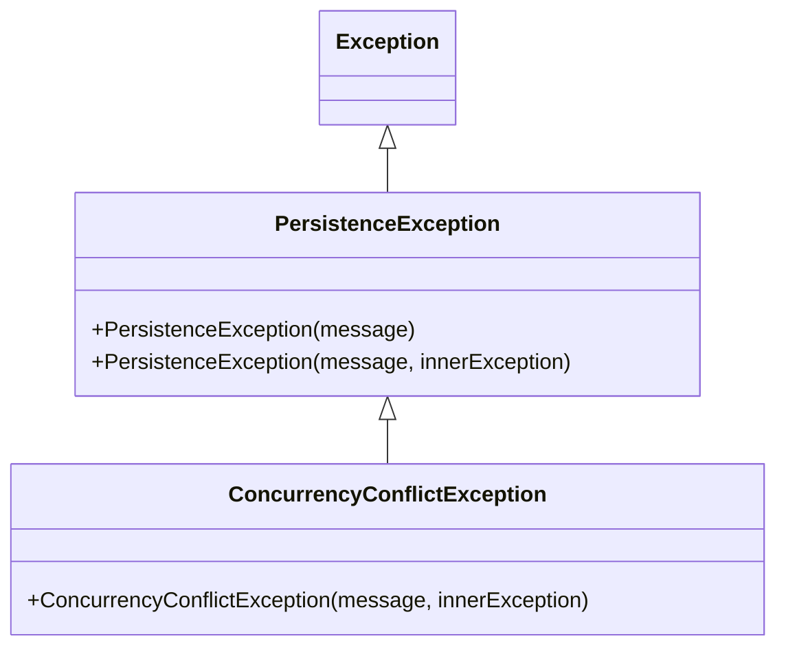
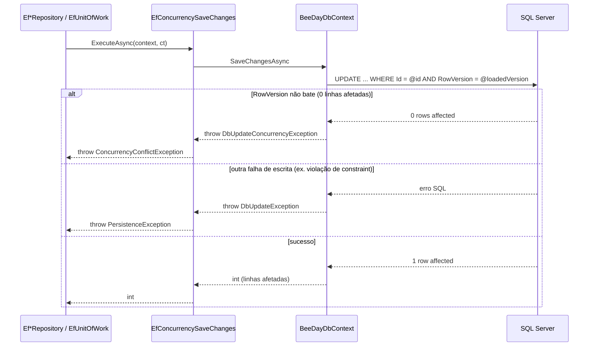

# Concurrency

**Fonte da verdade:** verificado diretamente em
`src/BeeDay.Infrastructure/Persistence/SqlServer/EfConcurrencySaveChanges.cs`,
`src/BeeDay.Infrastructure/Persistence/Exceptions/PersistenceException.cs`,
`ConcurrencyConflictException.cs`, `BeeDayDbContext.cs`, e grep de uso em todo `src/`.

## Mecanismo: RowVersion (concorrência otimista)

Toda entidade concreta (exceto `ExperienceEntry`, append-only por design — ver
`docs/persistence/02-ef-core-strategy.md` §RowVersion) tem uma propriedade shadow `byte[] RowVersion`
marcada `.IsRowVersion()`. SQL Server mapeia isso para uma coluna `rowversion`/`timestamp`,
incrementada automaticamente pelo próprio banco a cada `UPDATE` na linha — o EF Core inclui essa
coluna na cláusula `WHERE` de todo `UPDATE`/`DELETE` que gera. Se o valor não bater (a linha mudou
desde que foi lida), zero linhas são afetadas e o EF Core interpreta isso como conflito.

## `EfConcurrencySaveChanges` — o único ponto de chamada de `SaveChangesAsync`

```csharp
internal static class EfConcurrencySaveChanges
{
    public static async Task<int> ExecuteAsync(BeeDayDbContext context, CancellationToken cancellationToken)
    {
        try
        {
            return await context.SaveChangesAsync(cancellationToken);
        }
        catch (DbUpdateConcurrencyException ex)
        {
            throw new ConcurrencyConflictException(
                "The record was modified or deleted by another operation since it was loaded.", ex);
        }
        catch (DbUpdateException ex)
        {
            throw new PersistenceException("The change could not be saved to SQL Server.", ex);
        }
    }
}
```

Confirmado por grep: **nenhum** dos 8 repositórios nem `EfUnitOfWork` chama
`context.SaveChangesAsync(...)` diretamente — todos passam por este método. Isso garante que
`DbUpdateConcurrencyException`/`DbUpdateException` (tipos do EF Core) nunca vazam para fora de
Infrastructure — quem chama um repositório só precisa conhecer `ConcurrencyConflictException`/
`PersistenceException`, dois tipos que não mencionam EF Core.

**Sem retry automático**: um único `try`/`catch`, sem loop, sem nova tentativa de leitura+escrita.
Um conflito de concorrência sempre se torna uma exceção lançada ao chamador — nunca é resolvido
silenciosamente por Infrastructure.

## Hierarquia de exceção



`ConcurrencyConflictException` é `sealed`, deriva de `PersistenceException` (também usada
diretamente, não só como base) — ambas em `BeeDay.Infrastructure.Persistence.Exceptions`.

A pasta `Persistence/Exceptions/` continha 3 outros subtipos (`BackupRestoreException`,
`DataFileCorruptedException`, `PersistenceAccessException`) — resíduos do pipeline JSON removido
(ADR-005), sem nenhuma referência além da própria declaração. Removidos na Sprint 18.3. Só
`PersistenceException` (base) e `ConcurrencyConflictException` existem hoje nesta pasta, ambas
efetivamente usadas.

## Fluxo completo



`ConcurrencyConflictException`/`PersistenceException` então se propagam sem tradução adicional
através de Application (ver `docs/application/05-exceptions.md` §"Exceções de Infrastructure que
cruzam Application sem tradução") até `BeeDay.Web` (`GlobalExceptionHandler`, mapeamento HTTP não
detalhado aqui — fora do escopo desta Sprint).

## Onde o padrão "carregar → mutar → salvar" importa para RowVersion

Todo `UpdateAsync` (ver `01-repositories.md`) carrega a entidade **dentro da mesma chamada** que
vai salvá-la — nunca aceita uma entidade já mutada e desconectada de uma chamada anterior. Isso é
o que garante que o `RowVersion` usado na checagem seja sempre o mais recente do banco. Da mesma
forma, todo `RemoveAsync` rebusca a entidade pelo `Id` (ignorando a instância passada como
parâmetro) antes de deletar — pelo mesmo motivo.

## Cobertura de teste

Todos os 7 repositórios com `UpdateAsync` (todos exceto operações somente-Add) têm um teste
`UpdateAsync_ConcurrentModification_ThrowsConcurrencyConflictException` — confirmado em
`EfHabitRepositoryTests`, `EfProjectRepositoryTests`, `EfRecurringTaskRepositoryTests`,
`EfTransactionRepositoryTests`, `EfUserRepositoryTests`, `EfWalletRepositoryTests`,
`EfWalletTagRepositoryTests`. `EfUnitOfWorkTests.SaveChangesAsync_ConcurrentModification_ThrowsConcurrencyConflictException`
cobre o mesmo cenário através de `IUnitOfWork.SaveChangesAsync` diretamente.

## Fontes de verdade

**Arquivos consultados:** `EfConcurrencySaveChanges.cs`, `PersistenceException.cs`,
`ConcurrencyConflictException.cs`, `BeeDayDbContext.cs` (para a configuração de `RowVersion`).
`BackupRestoreException.cs`, `DataFileCorruptedException.cs`, `PersistenceAccessException.cs`
foram consultados antes de sua remoção (Sprint 18.3) e não existem mais no repositório — ver
achado acima.
**Testes consultados:** os 7 testes `UpdateAsync_ConcurrentModification_ThrowsConcurrencyConflictException`
citados acima + `EfUnitOfWorkTests.SaveChangesAsync_ConcurrentModification_ThrowsConcurrencyConflictException`.
**Contratos relacionados:** nenhuma interface própria — mecanismo interno de Infrastructure.
**Documentação relacionada:** `docs/persistence/02-ef-core-strategy.md` §RowVersion,
[`01-repositories.md`](01-repositories.md), `docs/application/05-exceptions.md`.
