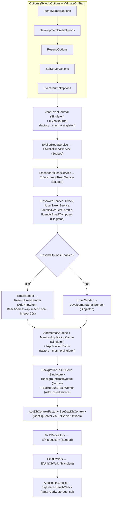
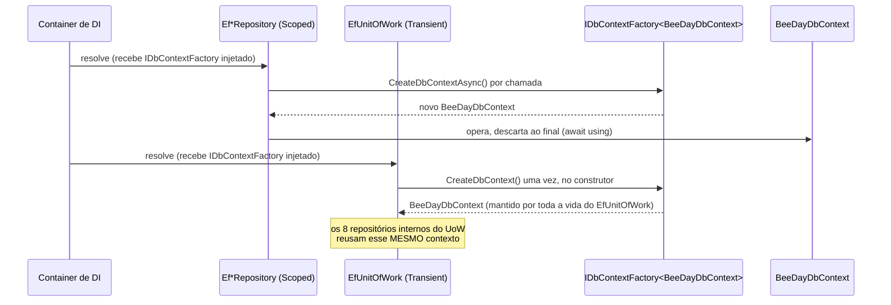

# Dependency Injection

**Fonte da verdade:** verificado diretamente, linha a linha, em
`src/BeeDay.Infrastructure/DependencyInjection/InfrastructureServiceCollectionExtensions.cs`
(149 linhas, lido integralmente).

## `AddBeeDayInfrastructure(IServiceCollection, IConfiguration)`

Único método de extensão desta camada, chamado uma vez em `BeeDay.Web/Program.cs`. 32 registros
distintos, em uma sequência não ramificada exceto por um `if`/`else` (e-mail).

## 1. Options (5), todas `AddOptions<T>().Bind(...).Validate(...).ValidateOnStart()`

| Options | Seção | Validação |
|---|---|---|
| `IdentityEmailOptions` | `BeeDay:IdentityEmail` | `PublicBaseUrl` absoluta; `ConfirmationPath`/`PasswordResetPath` enraizados |
| `DevelopmentEmailOptions` | `BeeDay:Email:Development` | `Directory` obrigatório se `Enabled` |
| `ResendOptions` | `BeeDay:Email:Resend` | `ApiKey`/`FromAddress` obrigatórios (com `@`) se `Enabled` |
| `SqlServerOptions` | `BeeDay:Persistence:SqlServer` | `ConnectionString` sempre obrigatória |
| `EventJournalOptions` | `BeeDay:Auditing:EventJournal` | `Directory` obrigatório; `FileName` deve ser nome simples de arquivo |

`ValidateOnStart()` em todas as 5 — a aplicação recusa iniciar se qualquer uma falhar sua
validação.

## 2. Serviços, na ordem exata de registro

**Lista completa, com lifetime exato:**

| # | Serviço | Interface | Lifetime |
|---|---|---|---|
| 1 | `JsonEventJournal` | (concreto) | Singleton |
| 2 | `JsonEventJournal` | `IEventJournal` | Singleton (factory devolvendo #1) |
| 3 | `EfWalletReadService` | `IWalletReadService` | Scoped |
| 4 | `EfDashboardReadService` | `IDashboardReadService` | Scoped |
| 5 | `Pbkdf2PasswordService` | `IPasswordService` | Singleton |
| 6 | `SystemClock` | `IClock` | Singleton |
| 7 | `SecureUserTokenService` | `IUserTokenService` | Singleton |
| 8 | `MemoryIdentityRequestThrottle` | `IIdentityRequestThrottle` | Singleton |
| 9 | `IdentityEmailComposer` | `IIdentityEmailComposer` | Singleton |
| 10a | `ResendEmailSender` (se `Resend:Enabled=true`) | `IEmailSender` | Typed `HttpClient` (efetivamente Transient/gerenciado pelo `IHttpClientFactory`) |
| 10b | `DevelopmentEmailSender` (senão) | `IEmailSender` | Singleton |
| 11 | (infra) `AddMemoryCache()` | `IMemoryCache` | — (registro nativo do ASP.NET Core) |
| 12 | `MemoryApplicationCache` | (concreto) | Singleton |
| 13 | `MemoryApplicationCache` | `IApplicationCache` | Singleton (factory devolvendo #12) |
| 14 | `BackgroundTaskQueue` | (concreto) | Singleton |
| 15 | `BackgroundTaskQueue` | `IBackgroundTaskQueue` | Singleton (factory devolvendo #14) |
| 16 | `BackgroundTaskWorker` | `IHostedService` | `AddHostedService` |
| 17 | `BeeDayDbContext` | `IDbContextFactory<BeeDayDbContext>` | `AddDbContextFactory` (conexão via `SqlServerOptions`) |
| 18–25 | 8x `Ef*Repository` | 8x `I*Repository` | Scoped |
| 26 | `EfUnitOfWork` | `IUnitOfWork` | **Transient** |
| 27 | `SqlServerHealthCheck` | `IHealthCheck` ("sql-server") | registrado via `AddHealthChecks().AddCheck<T>` |

**Padrão "concreto singleton + interface via factory apontando pro mesmo singleton"**: usado 3
vezes (`JsonEventJournal`/`IEventJournal`, `MemoryApplicationCache`/`IApplicationCache`,
`BackgroundTaskQueue`/`IBackgroundTaskQueue`) — permite que uma classe interna
(`BackgroundTaskWorker`) dependa do tipo concreto para acessar um membro `internal`
(`DequeueAsync`) não exposto pela interface pública, enquanto o resto do sistema só vê a interface.

## Por que `IUnitOfWork` é Transient e não Scoped

Comentário no código: `EfUnitOfWork` cria e possui seu próprio `BeeDayDbContext` no construtor —
se fosse `Scoped`, viveria pela duração de todo o escopo de DI (o circuito Blazor Server inteiro),
mantendo uma conexão de banco aberta desnecessariamente. `Transient` garante que cada injeção
recebe uma instância nova, com seu próprio contexto de vida curta, descartado quando o consumidor
o descarta (`await using`).

## `IDbContextFactory<BeeDayDbContext>` — o pipeline de resolução

Repositórios resolvidos diretamente via DI (fora de um `EfUnitOfWork`) criam um `DbContext` novo
por chamada de método. Repositórios criados **por dentro** de um `EfUnitOfWork` (via seu construtor
de contexto compartilhado, não expostos à DI diretamente) reusam o único contexto do UoW — ver
`docs/infrastructure/01-repositories.md` §`EfRepositoryBase`.

## Fontes de verdade

**Arquivos consultados:** `InfrastructureServiceCollectionExtensions.cs` (arquivo completo, 149
linhas), `EfUnitOfWork.cs`, `EfRepositoryBase.cs`, `BeeDayDbContext.cs`.
**Testes consultados:**
`tests/BeeDay.Infrastructure.Tests/BeeDayDbContextTests.cs.AddBeeDayInfrastructure_ResolvesDbContextFactoryWithoutThrowing`.
**Contratos relacionados:** todas as 18 interfaces listadas na tabela acima —
`docs/application/04-contracts.md`.
**Documentação relacionada:** [`01-repositories.md`](01-repositories.md) (uso do
`IDbContextFactory` pelos repositórios), [`02-sql-server.md`](02-sql-server.md) (`SqlServerOptions`
em detalhe), [`04-services.md`](04-services.md) (cada serviço listado aqui, em profundidade).
