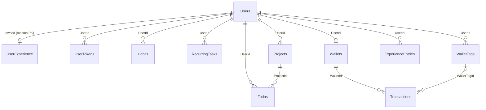

# Relational Model

**Fonte da verdade:** verificado diretamente nos 11 arquivos de configuração em
`src/BeeDay.Infrastructure/Persistence/SqlServer/Configurations/` e na migration
`Migrations/20260803111144_InitialCreate.cs` (`Up()`/`Down()` lidos integralmente).

## Diagrama de entidades



## As 11 tabelas

| Tabela | Configuração | Chave |
|---|---|---|
| `Users` | `UserConfiguration.cs` | `Id` |
| `UserExperience` | `UserConfiguration.cs` (Owned Type, dentro de `OwnsOne`) | `UserId` (compartilhada com `Users`) |
| `UserTokens` | `UserTokenConfiguration.cs` | `Id` |
| `Habits` | `HabitConfiguration.cs` | `Id` (herdada, TPC) |
| `RecurringTasks` | `RecurringTaskConfiguration.cs` | `Id` (herdada, TPC) |
| `Projects` | `ProjectConfiguration.cs` | `Id` (herdada, TPC) |
| `Todos` | `TodoConfiguration.cs` | `Id` (herdada, TPC) |
| `Wallets` | `WalletConfiguration.cs` | `Id` |
| `WalletTags` | `WalletTagConfiguration.cs` | `Id` |
| `Transactions` | `TransactionConfiguration.cs` | `Id` |
| `ExperienceEntries` | `ExperienceEntryConfiguration.cs` | `Id` |

## `Users`

| Coluna | Tipo/Regra |
|---|---|
| `Name` | `HasMaxLength(100)`, obrigatório |
| `Email` | `HasMaxLength(254)`, obrigatório |
| `PasswordHash` | `HasMaxLength(200)`, obrigatório |
| `IsActive` | padrão `true` |
| `IsEmailConfirmed` | padrão `false` |
| `HasCompletedOnboarding` | padrão `false` |
| `Nickname` | `HasMaxLength(20)`, obrigatório (string vazia até `CompleteProfile`) |
| `Avatar` | `HasMaxLength(200)`, obrigatório (string vazia por padrão) |
| `Language` | conversão para `byte`, padrão `English` (0) |
| `Theme` | conversão para `byte`, padrão `System` (0) |
| `SessionVersion` | padrão `1` |

**Checks:** `CK_Users_Language` (`[Language] IN (0, 1)`), `CK_Users_Theme` (`[Theme] IN (0, 1, 2)`).
**Índices:** `UX_Users_Email` (único); `UX_Users_Nickname` (único, **filtrado**:
`WHERE [Nickname] <> N''` — permite múltiplos usuários sem nickname ainda, mas nunca dois com o
mesmo nickname preenchido).
**Ignorado (não mapeado):** `HasProfile`, `Profile` (propriedades computadas do Domain).

## `UserExperience` (Owned Type de `Users`)

Tabela própria, mas compartilha a PK de `Users` (`WithOwner().HasForeignKey("UserId")`,
`HasKey("UserId")`) — deleta em cascata junto com o `User` dono (implícito no relacionamento owned).

| Coluna | Tipo/Regra |
|---|---|
| `TotalExperience` | `long`, padrão `0` |
| `RowVersion` | shadow, configurada manualmente (não pela varredura global — ver `02-ef-core-strategy.md` §RowVersion) |

**Ignorado:** `CurrentLevel`, `CurrentLevelExperience`, `ExperienceRequiredForCurrentLevel`,
`ExperienceForNextLevel`, `Entries` (todas computadas ou relacionadas por consulta separada, não
FK).

## `UserTokens`

| Coluna | Tipo/Regra |
|---|---|
| `Type` | conversão para `byte` |
| `TokenHash` | `HasMaxLength(200)`, obrigatório |

**Check:** `CK_UserTokens_Type` (`[Type] IN (1, 2)`).
**Índices:** `UX_UserTokens_Hash` (único, em `TokenHash`+`Type`); `IX_UserTokens_User` (não único,
em `UserId`+`Type`+`ExpiresAtUtc`).
**FK:** `FK_UserTokens_Users_UserId` — `DeleteBehavior.Cascade`.
**Ignorado:** `IsUsed`, `IsRevoked` (computadas a partir de `UsedAtUtc`/`RevokedAtUtc`).

## `Habits`, `RecurringTasks`, `Projects`, `Todos` — TPC de `Activity`

Colunas comuns, configuradas uma única vez por `ActivityConfigurationExtensions.ConfigureActivityProperties<T>`:
`Title` (`HasMaxLength(100)`, obrigatório), `Description` (`HasMaxLength(500)`, obrigatório),
`Featured` (padrão `false`), `Attribute` (conversão para `byte?`), `Completed` (padrão `false`,
`PropertyAccessMode.Field`), `CreatedAtUtc`, `UpdatedAtUtc`.

Cada tabela concreta é totalmente independente (TPC — Table-Per-Concrete-Type), sem coluna
discriminadora nem tabela-base.

### `Habits`

Colunas próprias: `Direction` (byte, padrão `Both`), `Difficulty` (byte, padrão `Easy`),
`ResetCounter` (byte, padrão `Daily`), `PositiveCount`/`NegativeCount` (padrão `0`), shadow
`Position` (int, escopada por `UserId`).
**Checks:** `CK_Habits_Attribute`, `CK_Habits_Direction` (`IN (0,1,2)`), `CK_Habits_Difficulty`
(`IN (0,1,2,3)`), `CK_Habits_ResetCounter` (`IN (0,1,2)`).
**Índice:** `IX_Habits_User_Position` (não único, `UserId`+`Position`).
**FK:** `FK_Habits_Users_UserId` — `Cascade`.

### `RecurringTasks`

Coluna própria: `Repeat` (byte, padrão `Daily`), shadow `Position` (escopada por `UserId`).
**Checks:** `CK_RecurringTasks_Attribute`, `CK_RecurringTasks_Repeat` (`IN (0,1,2,3)`).
**Índice:** `IX_RecurringTasks_User_Position`.
**FK:** `FK_RecurringTasks_Users_UserId` — `Cascade`.

### `Projects`

Colunas próprias: `Color` (`HasMaxLength(7)`, `IsFixedLength`, padrão `#7A4FCB`), `ExpectedDate`
(`DateOnly?`), `Archived` (padrão `false`), shadow `Position` (escopada por `UserId`).
**Checks:** `CK_Projects_Attribute`, `CK_Projects_Color`
(`[Color] LIKE '#[0-9A-F][0-9A-F][0-9A-F][0-9A-F][0-9A-F][0-9A-F]'`).
**Índice:** `IX_Projects_User_Position`.
**FK:** `FK_Projects_Users_UserId` — `Cascade`.
**Relacionamento com Todos:** `FK_Todos_Projects_ProjectId` — `Cascade`, configurado do lado de
`Project` (`HasMany(p => p.Todos)`), não de `Todo`.
**Ignorado:** `Name`, `TotalTodos`, `PendingTodos`, `CompletedTodos`, `ProgressPercentage`,
`Progress`, `LastUpdatedAtUtc`, `NextTodo`, `Status` — todas computadas a partir de `Todos`.

### `Todos`

Colunas próprias: `ProjectId` (obrigatório), `DueDate` (`DateOnly?`), shadow `Position` (**escopada
por `ProjectId`**, não `UserId` — única entre as 3 outras).
**Check:** `CK_Todos_Attribute`.
**Índices:** `IX_Todos_Project_Position` (não único); `IX_Todos_User` (não único, `UserId`+`Id`).
**FK para `Users`:** `FK_Todos_Users_UserId` — `DeleteBehavior.NoAction` (evita um segundo caminho
de cascade convergindo com `Users → Projects (Cascade) → Todos (Cascade)`, que causaria o erro SQL
Server 1785).

## `Wallets`

Sem colunas próprias além de `UserId`/timestamps, sem check constraints.
**Índice:** `UX_Wallets_User` (único — impõe uma Wallet por usuário no nível de banco).
**FK:** `FK_Wallets_Users_UserId` — `DeleteBehavior.NoAction` (mesmo motivo do erro 1785: evita
convergência com `Users → WalletTags (Cascade) → Transactions (SetNull)`).

## `WalletTags`

Colunas: `Name` (`HasMaxLength(40)`, obrigatório), `Color` (`HasMaxLength(7)`, `IsFixedLength`,
padrão `#7A4FCB`).
**Check:** `CK_WalletTags_Color`.
**Índice:** `UX_WalletTags_User_Name` (único, `UserId`+`Name`).
**FK:** `FK_WalletTags_Users_UserId` — `Cascade`.

## `Transactions`

Colunas: `WalletId` (obrigatório), `Description` (`HasMaxLength(120)`, obrigatório), `Amount`
(`decimal`), `Type` (byte), `TransactionDate` (`DateOnly`), `WalletTagId` (`Guid?`), `Notes`
(`HasMaxLength(500)`, obrigatório — string vazia por padrão).
**Checks:** `CK_Transactions_Type` (`IN (1,2)`), `CK_Transactions_Amount` (`> 0`).
**Índices:** `IX_Transactions_Wallet_Date` (`WalletId`+`TransactionDate`); `IX_Transactions_Tag`
(`WalletTagId`).
**FKs:** `FK_Transactions_Wallets_WalletId` — `Cascade`; `FK_Transactions_WalletTags_WalletTagId`
— `DeleteBehavior.SetNull` (a Transaction sobrevive à remoção da tag).
**Ignorado:** `SignedAmount` (computada a partir de `Amount`+`Type`).
**Nota (comentário no código):** o invariante "a `WalletTag` referenciada deve pertencer ao mesmo
`User` dono da `Wallet`" não é imposto no nível de banco — depende de validação em Application.

## `ExperienceEntries`

Colunas: `UserId`, `Amount` (`long`), `RewardType` (byte), `ExperienceBefore`/`ExperienceAfter`
(`long`), `LevelBefore`/`LevelAfter` (`int`), `GrantedAtUtc`, mais 3 colunas do Complex Type
`Source` mapeadas inline: `SourceType` (byte), `SourceId` (`Guid?`), `SourceDescription`
(`HasMaxLength(160)`, obrigatório).
**Checks:** `CK_ExperienceEntries_SourceType` (`BETWEEN 0 AND 6`), `CK_ExperienceEntries_RewardType`
(`= 0`).
**Índice:** `IX_ExperienceEntries_User_Time` (`UserId`+`GrantedAtUtc`, não único).
**Índice único adicional, via SQL bruto** (não expressável em Fluent API — ver
`02-ef-core-strategy.md` §Complex Type):
```sql
CREATE UNIQUE INDEX [UX_ExperienceEntries_Dedup] ON [ExperienceEntries]
    ([UserId], [SourceType], [SourceId], [RewardType])
    WHERE [SourceId] IS NOT NULL AND [SourceType] <> 0;
```
**FK:** `FK_ExperienceEntries_Users_UserId` — `Cascade`. Nenhuma FK em `SourceId` (referência
polimórfica deliberada — pode apontar para um `Habit`, `RecurringTask`, `Todo` ou `Project`).
**Ignorado:** `SourceType`, `SourceId`, `OccurredAtUtc` (propriedades de passagem/computadas). Sem
`RowVersion` (única tabela de entidade concreta sem o token de concorrência — ver
`02-ef-core-strategy.md` §RowVersion).

## Resumo de `DeleteBehavior` por FK

| FK | Comportamento | Motivo documentado no código |
|---|---|---|
| `Habits/RecurringTasks/Projects/WalletTags/UserTokens/ExperienceEntries → Users` | `Cascade` | Padrão — dados do usuário somem com o usuário |
| `Todos → Projects` | `Cascade` | Todo não existe sem o Project pai |
| `Todos → Users` | **`NoAction`** | Evita 2º caminho de cascade (erro SQL Server 1785) — já cascade via Projects |
| `Wallets → Users` | **`NoAction`** | Evita 2º caminho de cascade via WalletTags→Transactions |
| `Transactions → Wallets` | `Cascade` | Transaction não existe sem a Wallet |
| `Transactions → WalletTags` | **`SetNull`** | Transaction sobrevive à remoção da tag |

## Fontes de verdade

**Arquivos consultados:** todos os 11 arquivos em
`src/BeeDay.Infrastructure/Persistence/SqlServer/Configurations/`,
`Migrations/20260803111144_InitialCreate.cs` (`Up()`/`Down()` completos),
`Migrations/BeeDayDbContextModelSnapshot.cs` (verificação pontual).
**Testes consultados:** `tests/BeeDay.Infrastructure.Tests/BeeDayDbContextTests.cs`
(`EachEntity_MapsToItsOwnTableWithTheExpectedName`, `ForeignKeys_HaveTheApprovedDeleteBehavior`,
`Users_HaveFilteredUniqueIndexOnNickname`, `ExperienceEntry_HasNoRowVersion`).
**Contratos relacionados:** `docs/domain/README.md` (Aggregate Roots), 8 `I*Repository` em
`docs/application/04-contracts.md`.
**Documentação relacionada:** [`02-ef-core-strategy.md`](02-ef-core-strategy.md),
[`docs/infrastructure/03-concurrency.md`](../infrastructure/03-concurrency.md).
