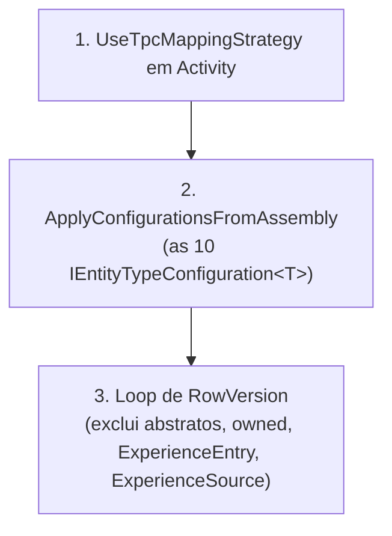

# EF Core Strategy

**Fonte da verdade:** verificado diretamente em
`src/BeeDay.Infrastructure/Persistence/SqlServer/BeeDayDbContext.cs`,
`BeeDayDbContextFactory.cs`, os 11 arquivos de `Configurations/`, e a migration
`InitialCreate.cs`.

## `BeeDayDbContext`

`internal sealed class BeeDayDbContext(DbContextOptions<BeeDayDbContext> options) : DbContext(options)`
— `internal`, nunca acessível fora do assembly `BeeDay.Infrastructure` exceto pelos 3 assemblies de
teste com `InternalsVisibleTo`. 10 `DbSet<T>` (`Users`, `UserTokens`, `Habits`, `RecurringTasks`,
`Projects`, `Todos`, `Wallets`, `WalletTags`, `Transactions`, `ExperienceEntries`).

## `ConfigureConventions` (global, antes de qualquer configuração por entidade)

```csharp
configurationBuilder.Properties<decimal>().HavePrecision(19, 2);
configurationBuilder.Properties<DateTimeOffset>().HavePrecision(7);
```

Toda propriedade `decimal` do modelo (ex. `Transaction.Amount`) recebe `HasPrecision(19,2)`; toda
`DateTimeOffset` recebe `HasPrecision(7)` — aplicado uma única vez, não repetido em cada
`Configuration`.

## `OnModelCreating` — ordem estritamente necessária



1. **`modelBuilder.Entity<Activity>().UseTpcMappingStrategy();`** — precisa rodar antes das
   configurações individuais aplicarem qualquer coisa a `Habit`/`RecurringTask`/`Project`/`Todo`.
2. **`modelBuilder.ApplyConfigurationsFromAssembly(typeof(BeeDayDbContext).Assembly);`** — aplica
   as 10 `IEntityTypeConfiguration<T>`. **Deve rodar antes do passo 3**: o comentário no código
   explica que chamar `modelBuilder.Entity(clrType)` (o que o loop de RowVersion faz) tranca
   permanentemente esse tipo como "não owned" — se isso acontecesse antes de um `OwnsOne()`
   configurar `UserExperience`, o EF Core lançaria "already configured as non-owned" (confirmado
   por teste real, segundo o comentário).
3. **Loop de RowVersion** — ver §RowVersion abaixo.

## TPC (Table-Per-Concrete-Type), escopado a `Activity`

`Activity` (abstrata, Domain) é a base de `Habit`, `RecurringTask`, `Project`, `Todo`. TPC — não
TPH nem TPT — significa: cada tipo concreto tem sua própria tabela completa, sem tabela
compartilhada nem coluna discriminadora. Confirmado: `UseTpcMappingStrategy()` é chamado apenas em
`Activity`, não na raiz `Entity` — os outros 6 tipos que herdam de `Entity` diretamente (`User`,
`UserToken`, `Wallet`, `WalletTag`, `Transaction`, `ExperienceEntry`) não usam nenhuma estratégia
de herança porque não têm hierarquia entre si.

Colunas comuns de `Activity` (`Title`, `Description`, `Featured`, `Attribute`, `Completed`,
`CreatedAtUtc`, `UpdatedAtUtc`) são configuradas uma única vez pelo método de extensão
`ConfigureActivityProperties<TActivity>()` (`ActivityConfigurationExtensions.cs`), chamado pelos 4
configurations concretos — evita repetir a mesma configuração 4 vezes.

**Detalhe de mapeamento notável:** `Completed` é forçado a `PropertyAccessMode.Field` porque, sob
TPC, uma propriedade herdada da raiz só pode ser configurada uma vez — mas `Project` sobrescreve
`Completed` como somente-computada (sem campo de apoio próprio). O modo de acesso por campo
contorna isso uniformemente para as 4 entidades — efeito colateral: a tabela `Projects` ganha uma
coluna `Completed` que o getter `Project.Completed` do Domain nunca lê (é sempre recalculado a
partir de `Todos`).

## Owned Type: `UserExperience`

```csharp
builder.OwnsOne(user => user.Experience, experience =>
{
    experience.ToTable("UserExperience");
    experience.WithOwner().HasForeignKey("UserId");
    experience.HasKey("UserId");
    // ...
    experience.Property<byte[]>("RowVersion").IsRowVersion();
});
```

Owned Type = tabela própria (`UserExperience`), mas compartilhando a PK do dono (`User`) — não tem
identidade própria. Diferente de um Complex Type (ver abaixo), um Owned Type pode ter sua própria
`RowVersion` — e tem, configurada manualmente aqui porque o loop global (que trancaria o tipo como
não-owned) não pode tocá-lo.

## Complex Type: `ExperienceSource` (dentro de `ExperienceEntry`)

```csharp
builder.ComplexProperty(entry => entry.Source, source =>
{
    source.Property(s => s.Type).HasColumnName("SourceType").HasConversion<byte>();
    source.Property(s => s.ReferenceId).HasColumnName("SourceId");
    source.Property(s => s.Description).HasColumnName("SourceDescription").HasMaxLength(160).IsRequired();
});
```

Diferente de Owned Type: um Complex Type **não tem tabela própria nem identidade** — suas
propriedades são apenas colunas adicionais na tabela do dono (`ExperienceEntries`). Escolhido
especificamente (não `OwnsOne`) porque um índice único que precisa cruzar colunas próprias de
`ExperienceEntry` (`UserId`, `RewardType`) com colunas do tipo aninhado (`SourceType`, `SourceId`)
**não pode ser expresso por nenhuma superfície do Fluent API** — nem `HasIndex` com lambda, nem
`HasIndex` com array de strings, nem `IMutableEntityType.AddIndex` diretamente (as três tentativas
falhadas estão documentadas no comentário do código). Solução: SQL bruto na migration (ver
`01-relational-model.md` §ExperienceEntries).

## Value Converters (`HasConversion`)

Todo enum do Domain mapeado como `byte`/`byte?` em vez do nome da string — aplicado
individualmente por propriedade em cada `Configuration`: `Attribute` (`byte?`, via
`ActivityConfigurationExtensions`), `Direction`/`Difficulty`/`ResetCounter` (Habit), `Repeat`
(RecurringTask), `Type` (Transaction e UserToken), `Language`/`Theme` (User), `RewardType`/
`Type` do Complex Type (ExperienceEntry/ExperienceSource). Nenhum `ValueConverter` customizado além
de `HasConversion<byte>()`/`HasConversion<byte?>()` — não há necessidade de um converter
customizado nesta base de código.

## Shadow Properties

| Shadow property | Onde | Escopo | Propósito |
|---|---|---|---|
| `"Position"` (`int`) | `Habits`, `RecurringTasks`, `Projects`, `Todos` | `UserId` (Todos: `ProjectId`) | Ordem de exibição definida pelo usuário (drag-to-reorder); SQL Server não garante ordem implícita de linhas |
| `"RowVersion"` (`byte[]`) | Toda entidade concreta exceto `ExperienceEntry` (e a própria complex-type `ExperienceSource`, que não tem linha própria) | — | Token de concorrência otimista — ver §RowVersion |

Nenhuma dessas duas propriedades existe como campo no Domain — são inteiramente inventadas pelo
mapeamento EF Core, invisíveis para `BeeDay.Domain`/`BeeDay.Application`.

## RowVersion (visão de mapeamento — fluxo completo em `docs/infrastructure/03-concurrency.md`)

Adicionada via loop no passo 3 do `OnModelCreating`, a **todas** as entidades concretas, exceto:

- Tipos abstratos (`Entity`, `Activity`) — evitaria propagação indevida.
- Tipos owned (`IsOwned()`) — `modelBuilder.Entity(Type)` lançaria erro; `UserExperience`
  configura a sua manualmente dentro do próprio `OwnsOne`.
- `ExperienceEntry` — exclusão deliberada e documentada: entradas de XP são **append-only, nunca
  atualizadas** depois de criadas, então não há cenário de conflito de concorrência a proteger.
- `ExperienceSource` — é um Complex Type sem linha própria; não faria sentido ter RowVersion.

## Migration Strategy

Exatamente **uma** migration existe: `20260803111144_InitialCreate.cs` — o schema nasceu completo
em um único arquivo, consistente com a política de banco vazio (ver `docs/domain/` e ADRs, fora do
escopo desta Sprint). `Up()` cria as 11 tabelas; `Down()` reverte em ordem segura de dependência.

**Única linha de SQL bruto em toda a migration** (`Up()`, citada verbatim):
```sql
CREATE UNIQUE INDEX [UX_ExperienceEntries_Dedup] ON [ExperienceEntries]
    ([UserId], [SourceType], [SourceId], [RewardType])
    WHERE [SourceId] IS NOT NULL AND [SourceType] <> 0;
```
E em `Down()`: `DROP INDEX [UX_ExperienceEntries_Dedup] ON [ExperienceEntries];` — a primeira linha
executada no rollback, antes de qualquer `DropTable`.

Tudo o mais na migration usa `migrationBuilder.CreateTable`/`CreateIndex`/`DropTable` do Fluent
API — nenhuma outra customização manual.

## `BeeDayDbContextFactory` (só para ferramentas de design-time)

`internal sealed class BeeDayDbContextFactory : IDesignTimeDbContextFactory<BeeDayDbContext>` —
usada exclusivamente por `dotnet ef migrations`/`dotnet ef database update`, nunca pela aplicação
em execução. Propósito documentado: permitir que a ferramenta construa o `DbContext` sem subir o
host `BeeDay.Web` inteiro (guard clauses de produção, rate limiter, email sender, health checks).

Resolução da connection string: `Environment.GetEnvironmentVariable("BEEDAY_DESIGNTIME_CONNECTION")`
tem prioridade se definida; senão usa um valor hardcoded
(`"Server=(localdb)\\mssqllocaldb;Database=BeeDayDev;Trusted_Connection=True;TrustServerCertificate=True;"`).
**Não lê `appsettings.json`.**

## Fontes de verdade

**Arquivos consultados:** `BeeDayDbContext.cs`, `BeeDayDbContextFactory.cs`, os 11 arquivos de
`Configurations/`, `Migrations/20260803111144_InitialCreate.cs`,
`Migrations/BeeDayDbContextModelSnapshot.cs`.
**Testes consultados:** `tests/BeeDay.Infrastructure.Tests/BeeDayDbContextTests.cs` (todos os 11
testes, especialmente `Model_BuildsWithoutThrowing`, `MutableEntities_HaveARowVersionConcurrencyToken`,
`ExperienceEntry_HasNoRowVersion`, `UserExperience_MapsToOwnTableSharingUsersPrimaryKey`,
`ExperienceSource_MapsAsInlineColumnsOnExperienceEntries`).
**Contratos relacionados:** `docs/domain/user.md` §Experience (para o significado de negócio de
`UserExperience`/`ExperienceEntry`/`ExperienceSource`).
**Documentação relacionada:** [`01-relational-model.md`](01-relational-model.md),
[`docs/infrastructure/03-concurrency.md`](../infrastructure/03-concurrency.md),
[`docs/infrastructure/02-sql-server.md`](../infrastructure/02-sql-server.md) (ciclo de vida do
banco/migrations em runtime).
